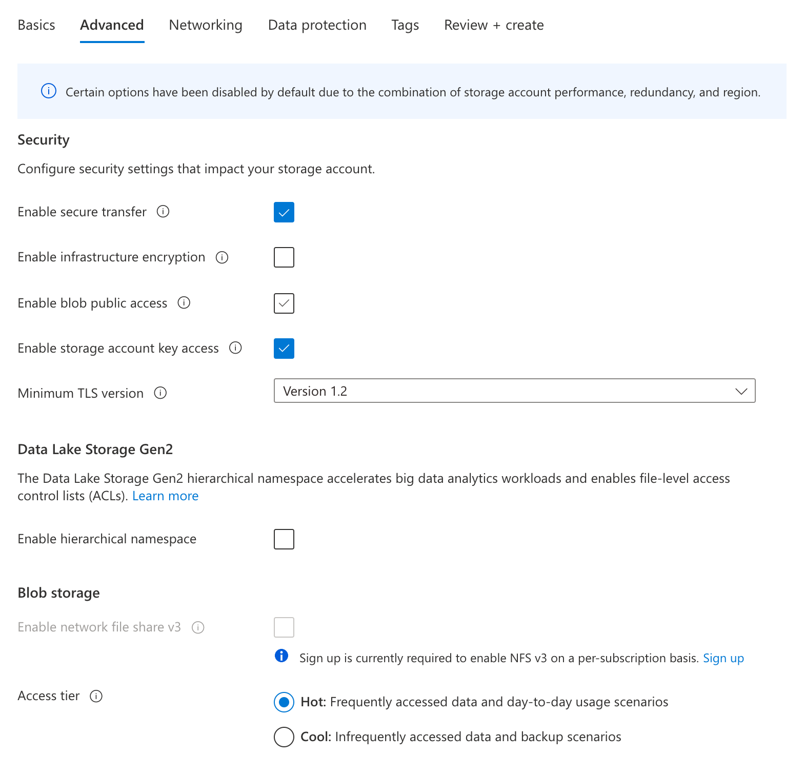
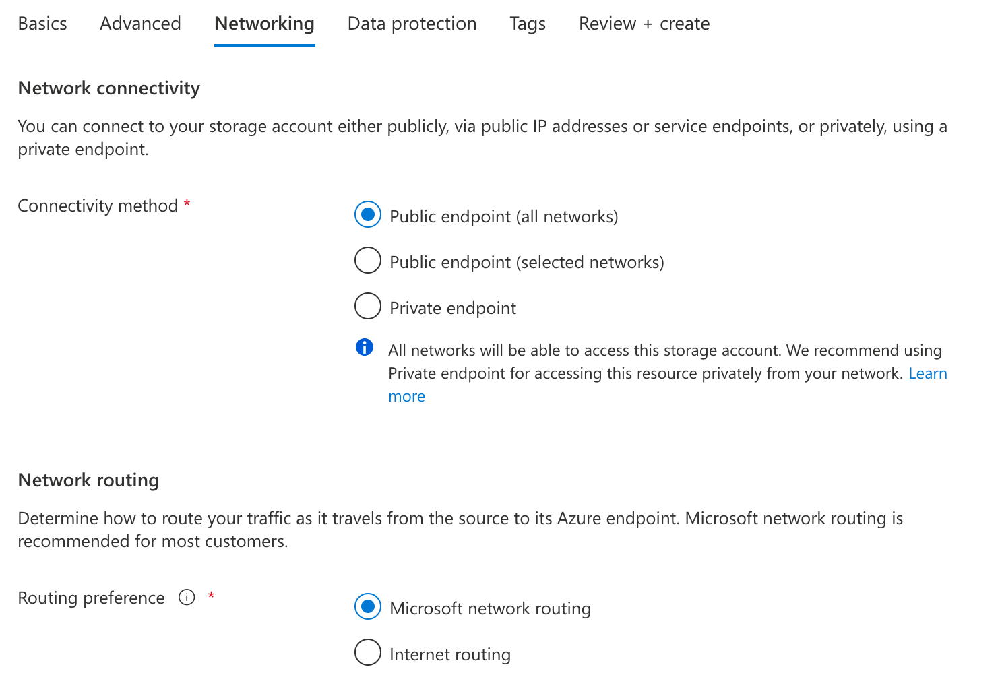
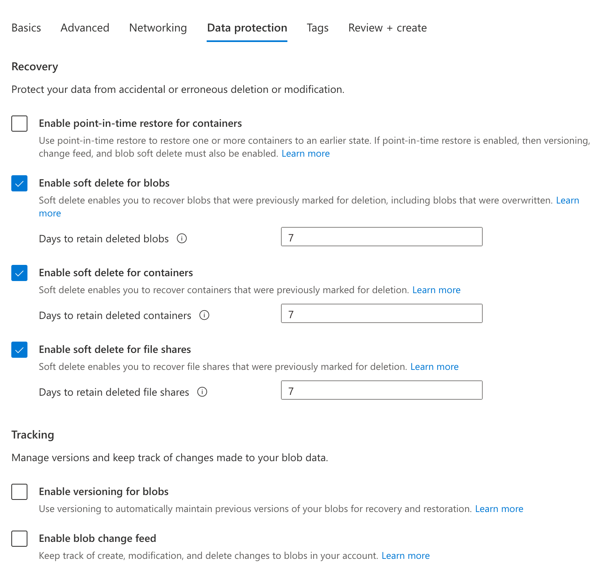
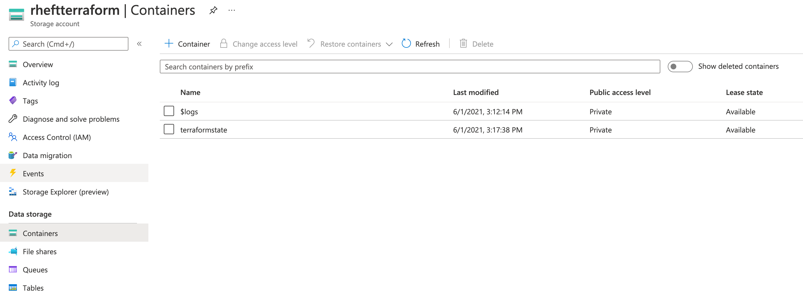

# PRIME ReportStream Operations

PRIME ReportStream uses Terraform to manage our Azure development environment.
All Azure configuration should be done through Terraform to ensure consistency
between environments.

To ensure our Terraform state is managed with consistent Terraform versions, we
are running Terraform through a Docker image. Terraform should not be used
outside of this Docker image to ensure the Terraform core, plugins, and other
versions all remain identical.

---
## Prerequisites
### Needed software
> Terraform >= [1.0.5](https://www.terraform.io/downloads)

> [Azure cli](https://docs.microsoft.com/en-us/cli/azure/install-azure-cli)

All infrastructure operations must be done behind the environment-specific VPN.
You can find [directions for configuring your VPN client in prime-router/docs/VPN.md](https://github.com/CDCgov/prime-data-hub/blob/master/prime-router/docs/vpn.md).

### Resource Group and KeyVault
In order to deploy, we will need to define our resource group and keyvault. There are some specific keys we need to be pre-populated before we run our terraform as well. 

### secrets.tf
```

data "azurerm_key_vault" "tf-secrets" {
  name                = var.tf_secrets_vault
  resource_group_name = var.resource_group
}

data "azurerm_key_vault_secret" "postgres_user" {
  name      = "postgres-user"
  key_vault_id = data.azurerm_key_vault.tf-secrets.id
}

data "azurerm_key_vault_secret" "postgres_pass" {
  name      = "postgres-pass"
  key_vault_id = data.azurerm_key_vault.tf-secrets.id
}

data "azurerm_key_vault_secret" "pagerduty_url" {
  name      = "pagerduty-url"
  key_vault_id = data.azurerm_key_vault.tf-secrets.id
}
```

## Terraform

For production deploys, always deploy from the `master` branch.

Our Terraform code is broken down into two main folders, vars and modules. The vars direcory will contain all the variables needed for the stage you want to deploy to. All variables required to deploy that specific stage should be contained in it's respective folder. This makes it easy to determine where variables need to be changed.

## Common commands
Below are the following most common terraform commands:
- `terraform output` - This will give you the current output of the terraform deploy if there is any.
- `terraform plan` - This will tell you what will be added/removed during a deploy
- `terraform apply` - This will actually deploy and changes you have made.


### Directory Structure
The structure of the terraform code is as follows. We have separate stage variables in the ./vars directory, and all modules are contained in the moudles dir. This allows for a very clear area to add/troubleshoot code.
```
terraform
│   README.md
│       
└─── vars
│   │
│   └─── dev
│       │   azure.tf
│       │   main.tf
│       │   ...
│   
└─── modules
│   └─── app_service_plan
│   └─── application_insights
│   └─── ...
```

# Modules

We utilize several custom modules which are brokendown below. 

`Common Used Inputs`

- environment - The environment you are deploying to
- resource_group - The resource group name you want to deploy into
- resource_prefix - A prefix used to create unique names throughout the code
- location - The location you are deploying to in Azure
## app_service_plan
_Description_: This module adds an app service plan that will be used to run our various function aps.

_Inputs_: 
- app_size
- app_tier

_Outputs_:
- service_plan_id

## application_insights
_Description_: This module adds the application insights.

_Inputs_: 
- pagerduty_url
- postgres_server_id
- service_plan_id

_Outputs:_:
- instrumentation_key
- app_id
- connection_string
- metabase_instrumentation_key
- metabase_app_id
- metabase_connection_string

fdas

* common  
  * private_endpoint - 
  * vnet_dns_zones - 
  
## container_registry
_Description_: This registry will be used for any docker images created for the appliction

_Inputs_: 
- public_subnets

_Outputs:_:
- container_registry_login_server
- container_registry_admin_username
- container_registry_admin_password


## database
_Description_: Database for the project.

_Inputs_: 
- postgres_user
- postgres_pass
- db_sku_name
- db_version
- db_storage_mb
- db_auto_grow
- db_prevent_destroy
- db_threat_detection
- endpoint_subnet
- db_replica
- application_key_vault_id

_Outputs:_:
- postgres_server_id
## front-door
_Description_: Optional Azure WAF

_Inputs_: 
- environment
- resource_group
- resource_prefix
- location
- https_cert_names
- is_metabase_env
- public_primary_web_endpoint
- application_key_vault_id

_Outputs:_:

## function_app
_Description_: The function app that will run the application

_Inputs_: 
- environment
- resource_group
- resource_prefix
- location
- ai_instrumentation_key
- ai_connection_string
- okta_redirect_url
- terraform_caller_ip_address
- use_cdc_managed_vnet
- public_subnet
- pagerduty_url
- app_service_plan
- primary_access_key
- container_registry_login_server
- container_registry_admin_username
- container_registry_admin_password
- primary_connection_string
- postgres_user
- postgres_pass
- application_key_vault_id

_Outputs:_:

## key_vault
_Description_: The vaults that the application/database will store secrets

_Inputs_: 
- environment
- resource_group
- resource_prefix
- location
- aad_object_keyvault_admin
- terraform_caller_ip_address
- use_cdc_managed_vnet
- public_subnet
- container_subnet
- endpoint_subnet
- cyberark_ip_ingress
- terraform_object_id

_Outputs:_:

## metabase
_Description_: Metabase DB for the project.

_Inputs_: 
- environment
- resource_group
- resource_prefix
- location
- ai_instrumentation_key
- ai_connection_string
- use_cdc_managed_vnet

_Outputs:_:

## nat_gateway
_Description_: The NAT gatway used by the project.

_Inputs_: 
- environment
- resource_group
- resource_prefix
- location
- public_subnet_id

_Outputs:_:

## sftp_container
_Description_: (Optional) A container used for STFP testing

_Inputs_: 
- environment
- resource_group
- resource_prefix
- location
- use_cdc_managed_vnet

_Outputs:_:

## storage
_Description_:

_Inputs_: 
- environment
- resource_group
- resource_prefix
- location
- rsa_key_4096
- terraform_caller_ip_address
- use_cdc_managed_vnet
- endpoint_subnet
- public_subnet
- container_subnet
- application_key_vault_id

_Outputs:_:
- sa_primary_access_key
- sa_primary_connection_string
- sa_public_primary_web_endpoint

## vnet
_Description_: (Optional) Creates the VNET for the project

_Inputs_: 
- resource_group
- environment
- resource_prefix

_Outputs:_:
- ids
- names
- vnet_address_spaces
- vnets


### Important vars files
This is a list of the important files that are necessary in each stage vars directory.  
```
azure.tf - Terraform specific requirements including backend.
main.tf - Main terraform code page that cals individual modules.
secrets.tf - Defines where secrets are to be pulled from in azure keyvault
variables.tf - Has all necessary variables to run main.tf
```

## Azure Cli
You will need to run the following the first time, or when your token expires.
```
az login
```

- Navigate to the provided login URL and input the provided token

## Using Terraform

The vars directory is meant to contain all you need in order to run the deployment for the specific environment you wish to deploy. 
For example, if you wish to deploy to staging you would do the following steps

- Navigate to the `vars/staging` directory
- Verify all variables in each .tf file are correct.
- The first time, run `terraform init`
- Ensure you're running the VPN for the environment, or add your IP address to:
    - main storage account (e.g., pdhteststorageaccount)
    - partner storage account (e.g., pdhtestpartner) and partner candidate storage account (e.g., pdhtestcandpartner)
    - main key vault (e.g., pdhtest-keyvault)


# Deploying a new CDC environment

* Environments must have a unique resource group.
* Resources groups are managed by the CDC.
* Contact the IAM team at <adhelpdsk@cdc.gov> to get your resource group created.

## Create the Terraform storage account

1. Login to your Azure console.
2. In the intended resource group, create a storage account named: `{prefix}terraform`
    * Note: Storage account names do not allow punctuation
3. Follow the screenshots and replicate the settings








## Create the Terraform storage container

In your newly created storage account, create a container named: `terraformstate`




# Tear down a environment
To delete all terraform created resources run the following.
```
terraform destroy
```

**WARNING:** Data is preserved by Azure retention policies, but public IP addresses and other static resources may be released.

Any resource that is not ephemeral is marked with a `lifecycle { prevent_destroy = true }` annotation, requiring manual intervention to tear down the resource.

# Known issues

1. There is a race condition currently happening when deploying from scratch. For now, simply run the `terraform apply` again and it should proceed.