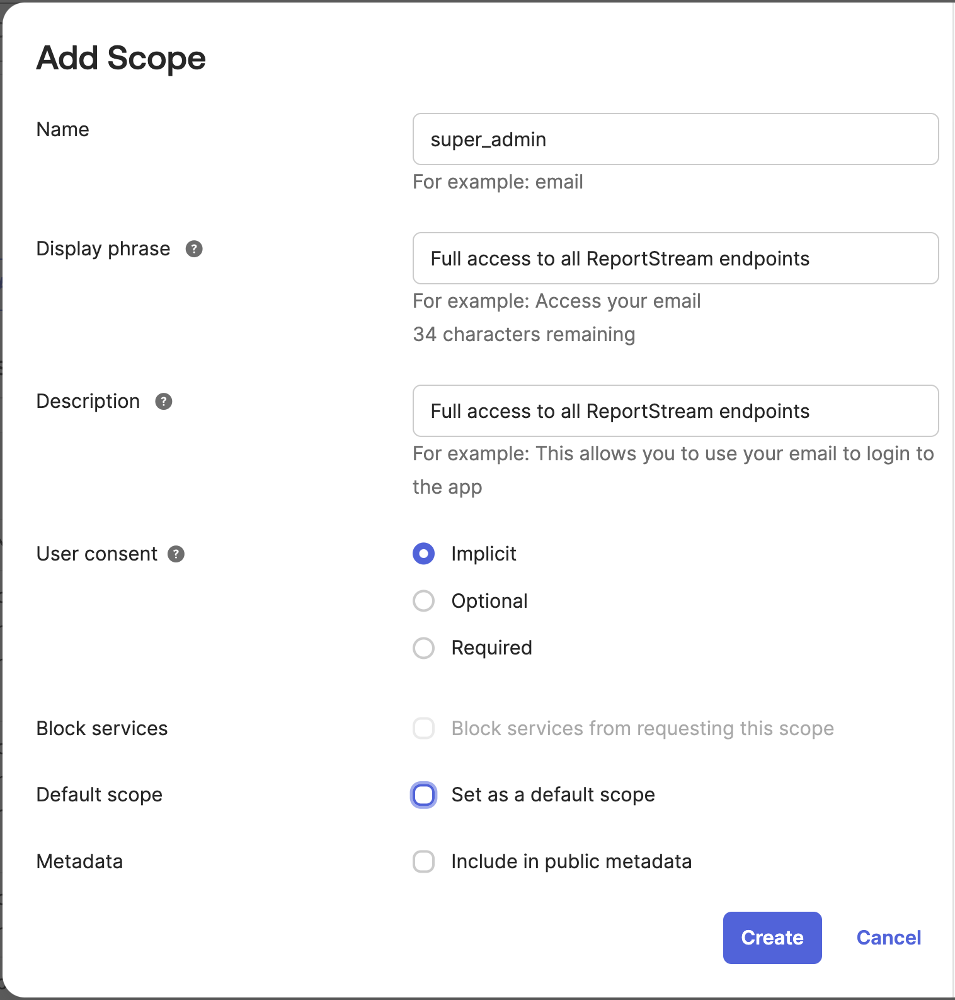
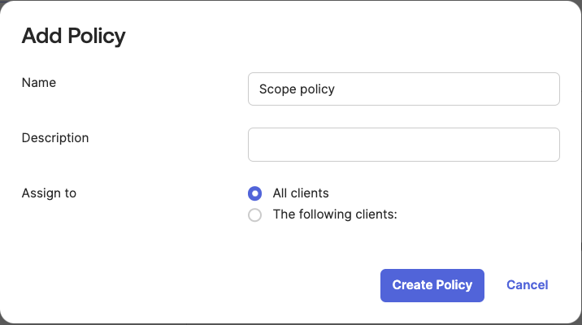
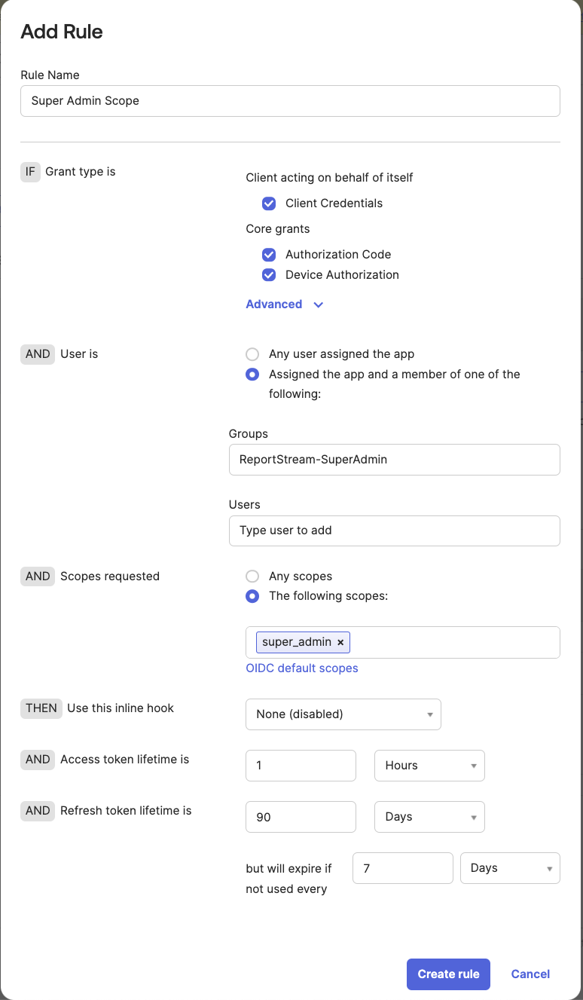
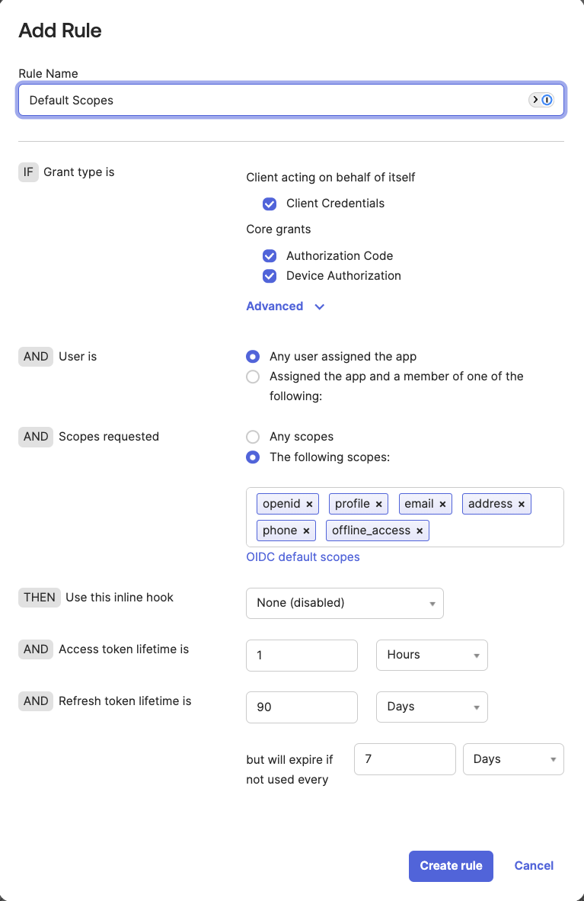
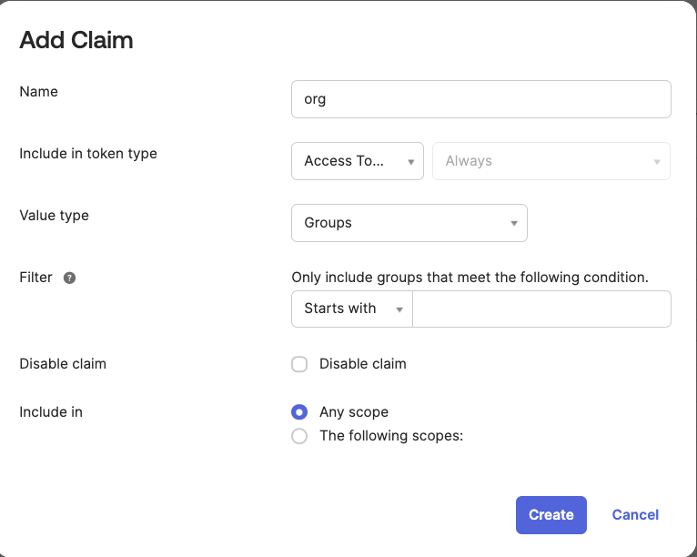
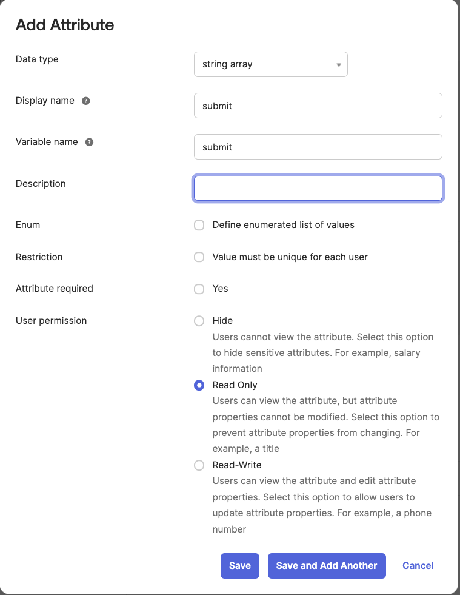
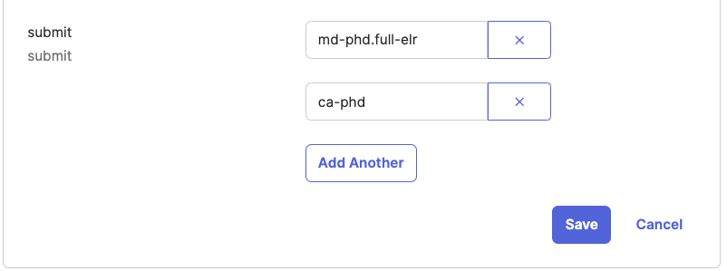
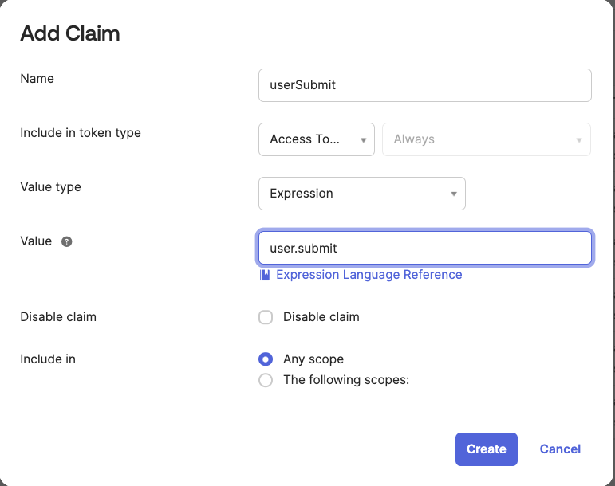
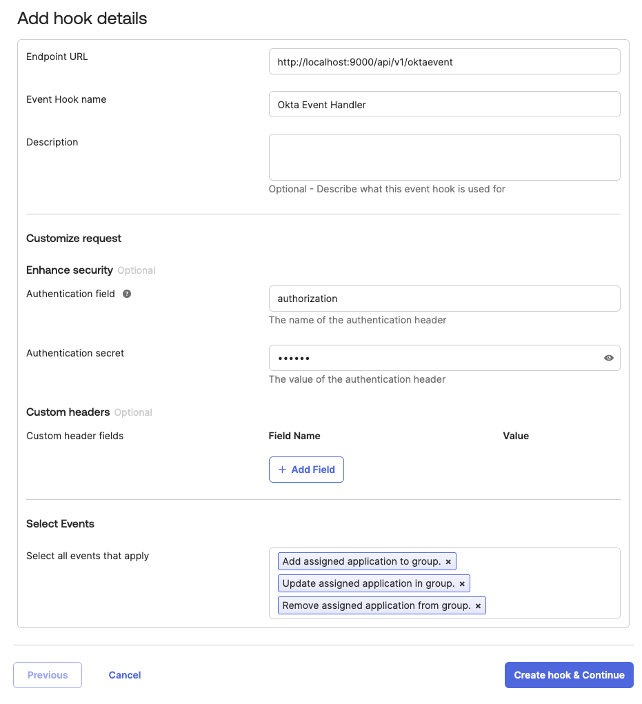
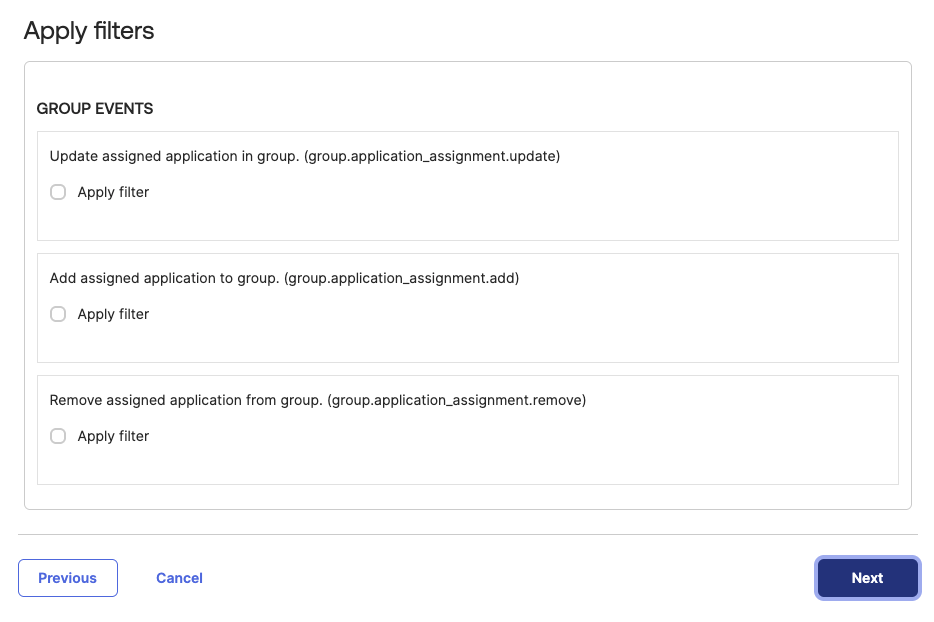

# Authorization Design

## Requirements
- Okta used to manage access for all users and machines
- Ability to easily add, modify, and remove user permissions
- Data are only accessible by those we trust
- Feature parity with [deprecated design](authz-deprecated-implementation.md)

## Access Token Design

### Scopes
Scopes refer to actions that can be done on certain endpoints. Scopes are requested during the login process. We 
will set up rules in Okta that allow scopes to be requested based on organization membership. A requested scope will 
only be returned given you have the correct group membership.

| Scope       | Actions                                                               | Okta Group               |
|-------------|-----------------------------------------------------------------------|--------------------------|
| super_admin | Anything! (org membership does not matter)                            | ReportStream-SuperAdmin  |
| org:write   | Able to update organizations                                          | ReportStream-OrgAdmin    |
| org:read    | Able to access read-only information related to organizations         | ReportStream-User        |
| submit      | Able to submit reports                                                | ReportStream-Submit      |

#### How to set up in Okta

1. Create a scope

<br><br>
2. Create an Access Policy

<br><br>
3. Add a Rule to the Policy. Ensure you have limited the scope to the group membership.

<br><br>
4. Add an additional rule to deny Access to users not in the group. Ensure the default scopes rule is first in priority.

<br><br>

### Organizations
Organizations are set up as groups within Okta and will be included in the token. The combination of the scopes and 
groups will allow us to make authorization decisions on most endpoints. Organizations are easily added to the token 
for users via the UI. I will delve into how to set it up for senders later in the document.



### Submit claim

There will also be an optional `userSubmit` or `appSubmit` claim containing specific organizations AND optional sender. 
These values will be dot separated. If a sender is not included, it will be assumed to be a wildcard and allow all 
senders under that organization. Unfortunately, we cannot define duplicate claims nor can we have multiple expressions 
within a single claim. This is why there are multiple claims as defined below:

| Claim      | Okta expression    |
|------------|--------------------|
| userSubmit | user.submit        |
| appSubmit  | app.profile.submit |

Unfortunately the claim names have to separated due to different expressions required to access user profile and
application user profiles.

Claim value examples:
```
"md-phd.full-elr": Only allow to send from md-phd as full-elr
"ca-phd": Allow submitting from any sender under ca-phd
```

1. Update the default user to add an additional profile attribute

<br><br>
2. Add specific values to the user's profile that you want in the access token

<br><br>
3. Add a claim referencing the user profile attribute

<br><br>


### User claims example

Given the following token claims scenario:
```json
{
  "scp": [
    "openid",
    "email",
    "org:read",
    "submit"
  ],
  "org": [
    "md-phd",
    "ca-phd"
  ],
  "userSubmit": [
    "md-phd.full-elr",
    "ca-phd"  
  ]  
}
```

This particular user would be able to read information about `md-phd` and `ca-phd`. They would also be able to submit 
reports only as `md-phd.full-elr` or for any sender under `ca-phd`. Note that the current implementation uses an 
`organization` claim. This will continue to be present during the transition but will eventually be phased out.

### Daily Data page special considerations

For specific users within specific organizations, we want to allow them to access another organization's daily data 
page. Since these are organizational level settings that are tightly coupled to ReportStream, we would store these 
settings within the RS Postgres DB.

Example: User within the `elims` organization wants to see the `md-phd` daily data page to check that reports have 
been properly routed.

Organizational settings:
```yml
md-phd:
  allow-daily-data-access: [elims] # references another organization name
```

User token:
```json
{
  "scp": [
    "openid",
    "email",
    "org:write"
  ],
  "org": [
    "elims"
  ]
}
```
When a user tries to access an organization's daily data page, we would need to compare that user's `org` claim against 
the values configured for that organization. In the example above, the user would have access to the `md-phd` daily data 
page because it was configured to allow it for `elims` users.

This will allow organizations to have control over whether their data is shown within the daily data page as an opt-in 
feature rather than exposing their data without their knowledge.

In the future, we may be able to store this data within the organization group in Okta. Each organization has a profile
(much like users) that can be queried. This would require exposing that information in endpoints in the auth service 
but may be a cleaner way to keep all that data in the same place.

## Setting up a new user

In this system, setting up a new user would be quite easy. Create the user in Okta and then add it to the required 
groups. If this particular user must also manually submit reports you will need to directly modify their profile to add 
the specific senders. For users this can be done in the Okta UI.

### Difficulty with sender setup
Senders are set up as application users within Okta to allow the machine-to-machine client credentials OAuth 2.0 flow. The 
difficulty arises because while Okta allows you to add application users to groups, it does not allow you to easily add 
those groups to the generated access token JWT. The workaround there is adding the necessary information to the Okta 
application user's profile. This can only be done via Okta's APIs at the moment though.

My suggestion is having a sender setup API and CLI that when given the appropriate values, will set them in the profile.

Here is some pseudocode on what that might look like using the Okta admin SDK. Given this would happen in the `auth` 
project we could easily authorize that the user kicking off this job only be a superadmin.
```kotlin
fun setApplicationProfile(
    clientId: String,
    submit: List<String>
) {
    val application = applicationApi.getApplication(clientId, null)
    val groups = getApplicationGroups(clientId)
    application.putprofileItem("groups", groups)
    application.putprofileItem("appSubmit", submit)
    applicationApi.replaceApplication(arnejAppId, application)
}
```

We have several viable approaches to handling updates to senders:
* Build a process within the auth project to retrieve an application user's group memberships and update their profile
  accordingly. 
  * This allows group management to occur within the Okta Admin Console, but a trigger to perform this step is needed.
    * We can build a API call (triggerable via frontend and/or CLI) that takes a client ID of a sender as input and does
      the needed profile updates on demand.
    * We can configure a schedule trigger to scan all application users and update their profiles based on their Okta
      group memberships periodically. This removes the potential for group memberships and sender profiles to fall out
      of sync, but the refresh will happen on a delay and this would require the microservice to perform more work on an
      ongoing basis.
    * Using Okta event hooks to send a POST request to the auth microservice whenever an application's group membership
      changes. The relevant events:
      * Add assigned application to group.
      * Update assigned application in group.
      * Remove assigned application from group.
      
      Whenever group membership is changed, a notification will be sent via an API on the auth microservice, which will
      make profile updates accordingly. The request will identify the application being updated (`data.events[0].target[1].id`)
      as well as the group (`data.events[0].target[0].displayName`). We can either define separate event hooks for each of 
      the event types, or have all three configured for the same endpoint and parse `data.events[0].eventType` to
      determine which event occurred. We should also plan to have one of the other methods available in case of dropped
      events due to network or application issues. Event hooks are documented [here](https://developer.okta.com/docs/guides/event-hook-implementation/nodejs/main/).
* Build out APIs within the auth project to manage application users within the RS frontend, forgoing the Okta Admin
  Console.
  * This would require adding CLI calls or frontend development work to be a viable solution.
  * This has the advantage of sender setup not requiring use of both the Okta Admin Console and RS functions. 
  * We could also reuse our existing authentication and authorization within the project to ensure only specific people 
    are able to hit these endpoints.

It is possible for both solutions to be done in tandem, either as part of the permanent design or as a stopgap if a 
partial cutover to microservices is desired and additional development time for the frontend/CLI is needed.

Building the API endpoints to process Okta event hooks would be the simplest and fastest path forward. An RS specific
API to create senders can follow if desired, but all the necessary configuration is possible via the Okta admin console.
The API needed to process event hooks:

| Method | Path              | Description                 |
|--------|-------------------|-----------------------------|
| GET    | /api/v1/oktaevent | Okta verification challenge |
| POST   | /api/v1/oktaevent | Okta event endpoint         |

It is only strictly necessary to retrieve the ID of the application user from the Okta event payload. We could then
read that application user's group memberships and store them to the profile. While the Okta event contains the group
that was modified, retrieving the groups directly from the Okta API would reduce the possibility of desync and increases
the security of the process.

The Okta event hook will only attempt a single retry for specific error codes or a timeout. It is possible for an event
to be missed if for some reason the API to receive the event was not available. For this reason, we would want to have
a secondary process to initiate an update of an application user's profile (discussed above).

#### How to set up event hooks ####
In the Okta Admin console, go to Workflow > Event Hooks. Select the button to create a new event hook.

Enter the details for the new event hook - endpoint URL, authorization, and events.


Add filters to event hook (only applicable if we intend to have multiple uses for Okta groups)


Check the preview of the API; select an event type and see the body of the POST request.

Perform verification - Okta does a one time verification of each event hook endpoint before the event hook is active.

The event hook is created after the first step, and any of these options can be revisited at any time.


### Sample endpoints for a proposed sender setup API: ###

If we intend to set up creating new senders from within the RS frontend, we could have it backed by the following API
endpoints:

| Method | Path                              | Description                     |
|--------|-----------------------------------|---------------------------------|
| POST   | /api/v1/sender                    | Create a new sender             |
| GET    | /api/v1/sender/${clientId}        | Get a sender by id              |
| PUT    | /api/v1/sender/${clientId}        | Update a sender                 |
| DELETE | /api/v1/sender/${clientId}        | Delete (or deactivate) a sender |
| PUT    | /api/v1/sender/${clientId}/groups | Update sender group affiliation |

An admin UI could be designed that is powered by the endpoints above as well. This could simplify the workflow even 
further by being able to visualize the changes needed to be made.

Okta application API documentation can be found [here](https://developer.okta.com/docs/api/openapi/okta-management/management/tag/Application/#tag/Application/operation/createApplication).

### Sender claims example

Given the following token claims scenario:
```json
{
  "scp": [
    "sender"
  ],
  "appSubmit": [
    "DHSender_md-phd",
    "DHSender_ca-phd"  
  ]  
}
```

This particular sender would be able to submit reports as `md-phd` or `ca-phd`. Other IDs would be rejected, unless the
sender is a member of an Admin group within Okta.


## Authorization check

There will have to be multiple approaches to doing the actual authorization check given it will work differently across 
different application frameworks.

### Spring

In Spring we can leverage method security. This allows us to write custom predicates in SpEL (Spring expression language) 
that will check our access token *before* our application logic runs which will dramatically simplify our code. If this 
predicate fails then the framework will throw an `AuthorizationDeniedException` which can be caught, logged, and a 
ReportStream specific 403 response can be returned.

```kotlin
@PreAuthorize("hasAuthority('SCOPE_org:read') and #oauth2.claim('org').contains(#org)")
@GetMapping("/api/v1/hello")
fun hello(org: String): String {
    return "Hello $org!"
}
```

### Azure Functions

Azure functions code will contain a bit more boilerplate code and will have to be done in controller logic. Please note 
that the below is pseudocode and can be missing important pieces.

```kotlin
@FunctionName("hello")
fun hello(
    @HttpTrigger(
        name = "hello",
        methods = [HttpMethod.GET],
        authLevel = AuthorizationLevel.ANONYMOUS
    ) request: HttpRequestMessage<String?>,
    @BindingName("org") org: String,
): String {
    if (!authorize(request, "org:read", org)) {
        return "403"    
    }
    
    return "Hello $org" 
}

// this would live in some authorization class
fun authorize(
    request: HttpRequestMessage,
    requiredScope: String,
    maybeRequiredOrg: String?
): Boolean {
    val claims = getClaims(request) // pseudocode to grab the claims
    val containsRequiredScope = claims["scp"].contains(requiredScope)
    val containsRequiredOrg = maybeRequiredOrg?.let { requiredOrg ->
        claims["org"].contains(requiredOrg)
    } ?: true
    
    return containsRequiredScope && containsRequiredOrg
}

/**
 * Report submission function check
 * 
 * Check that a user contains the submit claim
 * Check that the client header is contained within the appSubmit/userSubmit claim or starts with it (wildcard scenario)
 *
 * examples:
 * submit: [md-phd]
 * client: md-phd.default
 * outcome: true
 * 
 * submit: [md-phd.default]
 * client: md-phd.default
 * outcome: true
 * 
 * submit: [md-phd.default]
 * client: md-phd
 * outcome: false
 */
fun authorizeSubmit(
    request: HttpRequestMessage,
): Boolean {
    val claims = getClaims(request) // pseudocode to grab the claims
    val containsSubmitScope = claims["scp"].contains("submit")
    val submitClaim = claims["appSubmit"] ?: claims["userSubmit"] ?: emptyList<String>()
    val clientHeader = request.headers["client"]
    
    val canSubmit = submitClaim.any { sender ->
        clientHeader.startsWith(sender) || clientHeader == sender
    }
    
    return containsSubmitScope && canSubmit
}

```

## Deprecated approach to passing groups downstream

At the time of writing this section (2/5/25), code still exists which is doing the following:

- Call out to Okta via the Okta Admin SDK to grab an application user's group memberships
- Create a JWT with that information and set it in the `Okta-Groups` header
- Pass it along downstream as a part of the request
- Downstream endpoint reads the JWT found in the header, validates it, and checks the group membership against the `client` header

This entire flow will be deprecated by this design document as groups should be a part of the token at all times. 
You should be able to delete code related to it.

Code to look at:

| Location                                                                                                                                             | Notes                                                               |
|------------------------------------------------------------------------------------------------------------------------------------------------------|---------------------------------------------------------------------|
| [AppendOktaGroupsGatewayFilterFactory](../../../auth/src/main/kotlin/gov/cdc/prime/reportstream/auth/filter/AppendOktaGroupsGatewayFilterFactory.kt) | Defines how Okta group headers are created and added to the request |
| [OktaGroupsClient](../../../auth/src/main/kotlin/gov/cdc/prime/reportstream/auth/client/OktaGroupsClient.kt)                                         | Client to grab Okta groups                                          |
| [OktaGroupsJWTWriter](../../../auth/src/main/kotlin/gov/cdc/prime/reportstream/auth/service/OktaGroupsJWTWriter.kt)                                  | Writes the Okta groups JWT and signs it                             |
| [OktaGroupsService](../../../auth/src/main/kotlin/gov/cdc/prime/reportstream/auth/service/OktaGroupsService.kt)                                      | Ties together client and JWT writing                                |
| [application.yml](../../../auth/src/main/resources/application.yml)                                                                                  | look at okta.jwt.* configurations and appending header filter       |
| [OktaGroupsJWT](../../../shared/src/main/kotlin/gov/cdc/prime/reportstream/shared/auth/jwt/OktaGroupsJWT.kt)                                         | Model for Okta groups JWT to parse into                             |
| [OktaGroupsJWTConstants](../../../shared/src/main/kotlin/gov/cdc/prime/reportstream/shared/auth/jwt/OktaGroupsJWTConstants.kt)                       | Collection of constants                                             |
| [OktaGroupsJWTReader](../../../shared/src/main/kotlin/gov/cdc/prime/reportstream/shared/auth/jwt/OktaGroupsJWTReader.kt)                             | Reads and validates Okta Groups JWT                                 |
| [AuthZService](../../../shared/src/main/kotlin/gov/cdc/prime/reportstream/shared/auth/AuthZService.kt)                                               | Uses JWT to check group memebership and authorization               |