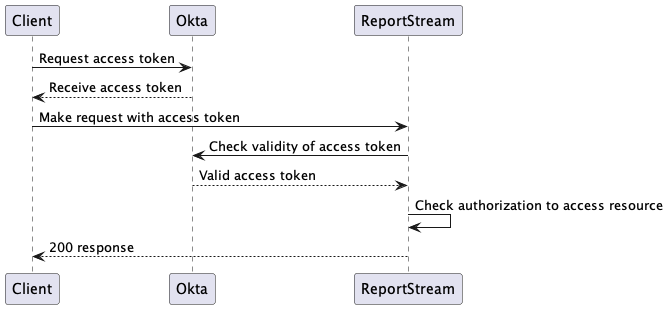
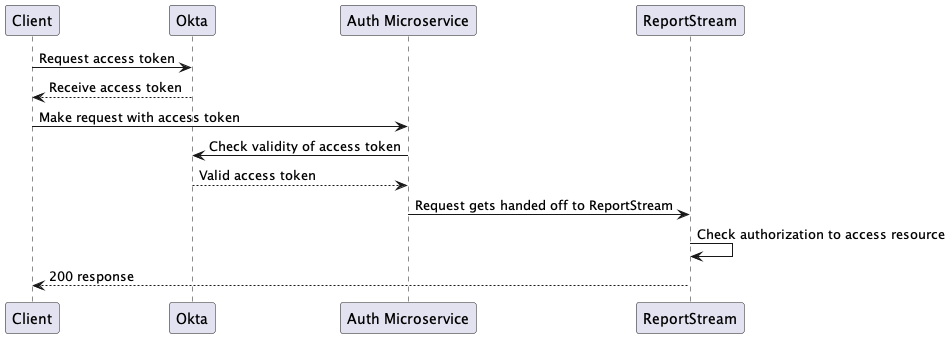

# Authentication and Authorization design

## Current design

We currently use a variety of methods to authenticate users and authorize actions in our system. 
We use a mix/match of the following for different endpoints:

- Okta
  - A cloud-hosted identity and access management service
- Server2Server
  - ReportStream's implementation of client credentials OIDC flow
- Azure Function Keys
  - Azure configured shared secrets for authorization
  - Does not handle authentication at all! (Any user can use any key and the system will work)

## Reasons for updating

- Unify authn/authz to one consistent method as having multiple methods makes it difficult to determine who is using which method
- Reduce attack surface area since currently we have to maintain the codebase for each method
- Minimize authn/authz issues being the cause for missing sent reports
- Make life easier for Engagement team by having a single choice when onboarding a new sender/receiver
- Share authn/authz multiple other microservices

## Requirements

- Protect certain endpoints from only being accessed by identified trusted entities
  - Reports/Waters report submission endpoint
  - History endpoints
  - Delivery endpoints
  - Message endpoints
  - Admin endpoints for CRUD operations on orgs, senders, and receivers
  - Lookup table CRUD operation endpoints
- Centralize user management
- Revoke access if a secret is compromised
- Easily audit which clients are accessing which resources
- Fine-tune access control for specific clients
- Unify authn/authz approach for all microservices
- Allow clients the ability to self-service to ease client onboarding
  - [Okta documentation for this workflow](https://help.okta.com/en-us/content/topics/apps/apps-selfservice-configureorg.htm)

## Options discussed in 14765

- Azure Application Gateway
  - This is Azure's load balancer and does not handle authn/authz
- Azure Front Door
  - This is Azure's CDN technology and does not handle authn/authz
- Azure Identity Management
  - This is Azure's own implementation of handling authn/authz for Microsoft products and is not available for implementation in our application

## Identity Provider Options

### Azure AD

Pros
- Integrated into the Microsoft ecosystem that we currently reside
- Scales well

Cons
- Complex setup
- Requires coordination with the CDC
 
### Okta

Pros
- A trusted industry standard
- Highly scalable
- Offers self-service to ease Engagement teams workload
- We already have many of our clients set up here!

Cons
- Single point of failure if there is an outage

### ReportStream implementation

Pros
- As flexible as we need it to be
- Cheap

Cons
- Custom authn/authz code is often vulnerable to attacks we may not have considered
- Additional work for us to write and maintain

## Protocol

We will be using OAuth 2.0 with OIDC. OAuth 2.0 is an industry-standard authorization protocol and OIDC is
another open standard on top of OAuth that adds an identity layer (authentication).

We will be using the **client credentials** flow which was designed with machine-to-machine communication in 
mind. See the image below for how the flow works generally.


Users with emails and passwords will use the Interaction Code flow. Most of the interaction occurs by browser redirects between
the frontend and authorization server. From the platform perspective it will be handled similarly once the access token
is retrieved.

## Definitions

- **authn**: Authenticate/authentication
- **authz**: Authorize/authorization
- **IAM**: Identity and access management
- **IdP**: Identity Provider
- **Okta**: A cloud-hosted identity and access management service
- **Server2Server**: ReportStream's implementation JWT authn/authz
- **VPC**: Virtual Private Cloud
- **Resource Server**: A server that will require authn/authz to access. In our case ResportStream
- **Authorization Server**: A server that handles authn/authz and issuing/revoking credentials
- **JWT Claim**: A key/value pair in the json body of the JWT
- **JWT Scopes**: A reserved claim in the [OAuth 2.0 spec](https://datatracker.ietf.org/doc/html/rfc8693#name-scope-scopes-claim)  containing a space-separated list of scopes associated with the token.

## Architecture options

### Spring reverse proxy microservice

This approach would create a new microservice whose sole responsibility is authn/authz. It would sit in front of
all requests to protected endpoints.

### Prerequisites
- Designate protected endpoints and put them behind a VPC.
  - Traffic must flow through our authn/authz service  
  - Protected endpoints should not be accessible to the public internet

A typical report request would look like this
- Client makes request to authorization server (or us in the ReportStream implementation solution) to retrieve token with their own credentials
- Client uses retrieved token with request to ResportStream
- Request comes in and hits our auth microservice instead of ResportStream directly
- Depending on our implementation, we decide if that request is legitimate and allowed to access the designated endpoint
  - In cloud-based solutions, we would make calls out to an external authz server
    - We could also introspect the token locally if speed is a factor but its more code to write/maintain
  - In a ReportStream implementation solution, we would introspect certain cookies and headers and compare them to what we have in a datastore
- If the request is unauthenticated or unauthorized, short-circuit the request to a 401
- If the request is authenticated and authorized for the resource, pass it along to the internal protected endpoint

Pros
- Extremely scalable
- All authn/authz code is in one place
- Security concerns can be centralized as all requests go through a single public endpoint
- Simplifies business logic as it no longer has to worry about authn/authz
- Extensible outside of core RS services if required

Cons
- Highly complex setup from both an engineering and devops perspective
- New service needs to be written and maintained
- A single point of failure if the service goes down
- Can lack customization options for very specific use-cases

Code example:
```kotlin

// handles all incoming requests
@RequestMapping("/**")
fun protectedReadEndpoint(
    @RequestBody(required = false) body: String,
    method: HttpMethod, 
    request: HttpServletRequest,
    response: HttpServletResponse
) {
    // this is all psudeocode!
    
    // check if we need to auth at all
    val authRequired = condigService.isAuthRequired(request.path, method)
    
    return if (authRequired) {
        // call out to authn/authz service
        val authnResult = authService.checkToken(request)
        val authzResult = authzService.checkAuthorization()
        
        // possible results
        when {
            authnResult == Authenticated && authzResult == Authorized -> httpClient.request(method, protectedEndpoint, body)
            else -> UnauthorizedResponse
        }
    } else {
        // pass through if no auth needed
        httpClient.request(method, protectedEndpoint, body)
    }
}
```

Authz configuration file example:
```json
{
    "endpoints": [
        {
            "endpoint": "/api/waters",
            "methods": {
                "POST": {
                    "scopes": ["report"]
                }
            }
        },
        {
            "endpoint": "api/history/{orgName}/submissions",
            "methods": {
                "GET": {
                    "scopes": ["user"]
                }
            }
        }
    ]
}
```


### Use libraries with limited code in shared project

This approach would attempt to use existing libraries to annotate request mappings in our Spring app.

We would have to write custom code in the shared project to handle configuration and authn/authz for ResportStream
endpoints that still live in our Azure Functions app.

Pros
- Simple implementation for a small project like ours
- Authn/authz annotations would be directly adjacent to the endpoint mappings they protect
- Can handle complex authorization requirements for specific endpoints with more ease
- Simplifies project structure without new deployments
- No additional devops support

Cons
- Less scalable solution
- Would have to deal with handling authn/authz with 2 different web frameworks
  -  Easy for Spring but could require some custom work for Azure Functions

A typical report request would look like this
- Client makes request to authorization server (or us in the ReportStream implementation solution) to retrieve token with their own credentials
- Client uses retrieved token with request to ResportStream
- Request hits ReportStream resource directly
- Depending on our implementation, we decide if that request is legitimate and allowed to access the designated endpoint
    - In cloud-based solutions, we would make calls out to an external authz server
      - We could also introspect the token locally if speed is a factor but its more code to write/maintain
    - In a ReportStream implementation solution, we would introspect certain cookies and headers and compare them to what we have in a datastore
- If the request is unauthenticated or unauthorized, short-circuit the request to a 401
- If the request is authenticated and authorized for the resource, continue to the business logic

Code example:
```kotlin
// Spring project
// has read scope
@GetMapping("/api/v1/protected/endpoint")
@PreAuthorize("hasAuthority('SCOPE_read')") // scope 
fun protectedReadEndpoint() {
    // read that anyone with the read scope can see
}

// Spring project
// has admin authority
@PostMapping("/api/v1/protected/endpoint")
@PreAuthorize("hasAuthority('Admin')") // role
fun protectedWriteEndpoint() {
    // write that only admins can do
}

// Azure functions project
// for an Azure HTTP endpoint we could write a function to handle the authn/authz check
fun reportsEndpoint() {
    checkAuthn(request) { accessToken: JWT ->
        requiredAuthzScope(accessToken, listOf("requiredScope")) {
            // business logic
        }
    }
}
```



### Hybrid solution

This approach would create a microservice that focused only on authentication and validation of the access token.

We would leave the authorization checks in the ReportStream code close to the code it's actually authorizing.

Pros
- Microservice able to handle parts of authentication that ReportStream will not have to worry about
- Authz annotations would be directly adjacent to the endpoint mappings they protect
- Can handle complex authorization requirements for specific endpoints with more ease

Cons
- requires devops support
- Authorization code still present within ReportStream

A typical report request would look like this
- Client makes request to authorization server (or us in the ReportStream implementation solution) to retrieve token with their own credentials
- Client uses retrieved token with request to ResportStream
- Request hits authentication microservice
  - Microservice calls out to Okta (or other provider) to check the validity of the access token and passes request along to ReportStream
  - If the request is unauthenticated, short-circuit the request to a 401
- Request hits ReportStream resource and we check the access token for authorization (now knowing that we can trust authentication)
- If the request is unauthorized, short-circuit the request to a 401
- If the request is authorized for the resource, continue to the business logic

```kotlin
// Microservice code

// handles all incoming requests
@RequestMapping("/**")
fun protectedReadEndpoint(
    @RequestBody(required = false) body: String,
    method: HttpMethod, 
    request: HttpServletRequest,
    response: HttpServletResponse
) {
    // this is all psudeocode!
    
    // check if we need to auth at all
    val authRequired = condigService.isAuthRequired(request.path, method)
    
    return if (authRequired) {
        // call out to authn service
        val authnResult = authService.checkToken(request)
        
        // possible results
        when {
            authnResult == Authenticated -> httpClient.request(method, protectedEndpoint, body)
            else -> UnauthorizedResponse
        }
    } else {
        // pass through if no auth needed
        httpClient.request(method, protectedEndpoint, body)
    }
}

// ReportStream code

// Spring project
// has read scope
@GetMapping("/api/v1/protected/endpoint")
@PreAuthorize("hasAuthority('SCOPE_read')") // scope 
fun protectedReadEndpoint() {
    // read that anyone with the read scope can see
}

// Azure functions project
// for an Azure HTTP endpoint we could write a function to handle the authn/authz check
fun reportsEndpoint() {
    val accessToken = request.headers("Authorization")
    requiredAuthzScope(accessToken, listOf("requiredScope")) {
        // business logic
    }
}
```



###  Traditional Microservice

This approach would create a more traditional microservice that ReportStream would call out to when it required authn/authz functionality.

Pros
- Microservice able to handle parts of authentication that ReportStream will not have to worry about
- Authz code would be directly adjacent to the endpoint mappings they protect
- Can handle complex authorization requirements for specific endpoints with ease
- Less devops support as ReportStream would still handle incoming requests
- Easily Scalable to other services

Cons
- Authentication code must be called directly in ReportStream
- Unable to take advantage of annotations

Code example:
```kotlin

// has read scope
@GetMapping("/api/v1/protected/endpoint")
fun protectedReadEndpoint(request: HttpRequest) {
    val accessToken = request.accessToken
    val authResult = authClient.checkAuth(accessToken) // http call out to new microservice
    if (authResult == Authenticated) {
        requiredAuthzScope(accessToken, listOf("requiredScope")) {
            // business logic
        }
    }
}

// handles all incoming requests
@RequestMapping("/api/v1/authenticate")
fun protectedReadEndpoint(
    @RequestBody(required = false) body: String,
    method: HttpMethod, 
    request: HttpServletRequest,
    response: HttpServletResponse
) {
    // this is all psudeocode!
    
    val authnResult = authService.checkToken(request)
    
    when (authnResult) {
        is Authenticated -> SuccessfulAuthenticationResponse // 200
        else -> FailureAuthenticationResponse // 401
    } 
}
```


## Additional Decisions

### Scopes and claims

We should heavily simplify scopes. Our current implementation has organization and sender name as a part of the scope which is overkill.

We have the data available on the request/JWT to know who the client/user is, so we do not need that duplicated as a part of the scope.

Here are the simplified scopes I recommend:
```
report // able to submit reports as their org
user // able to access their org
admin // able to administer their org
superadmin // able to do anything
```

The scope should let them in the door, and we can further limit them based on their identity (org, sender, etc).

### Integrity of submitted reports

We want to ensure that reports submitted to ReportStream are being submitted by allowed senders. For instance, we want to avoid
a sender submitting a report as another sender. This can be done by configuring a custom claim on the JWT with the org name. We can
then compare that value to the value we get in the header/query param.

### Access token retrival options

Okta allows multiple methods for retrieving your access token through the client credentials flow.
- Username/password
- JWT Auth

The only benefit I see for JWT auth is that a nefarious actor must be more technically savvy. I'm ok with either of these methods being used.

### Smoke tests

We will want to set up a test client and organization to be able to automate retrieving an access token via the client credentials flow.
Currently, we have to have a human authenticated locally through a browser which drastically slows down deployment, so this would be a big win.