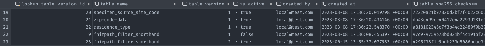
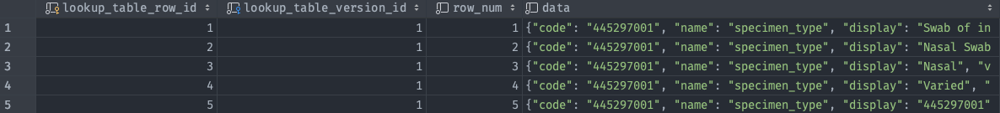

# ReportStream Data Model and Metadata

## Overview

Data is captured and stored in a relational database (Postgres) as [Reports](../../universal-pipeline/README.md#report-and-item) flow through ReportStream. This data can generally be referred to as "metadata". The captured metadata aims to track and explain the ReportStream-related history of a Report so questions like the following can be answered (non-exhaustive list):

1. Did a particular Report get delivered? To whom did it get delivered?
2. What Reports were not delivered anywhere? Were they supposed to be delivered somewhere?
3. When there is an issue, what were the error or warnings associated with the processing of a particular Report?
4. What data did a Report contain?

> The data that is contained within a Report or Item (like ordering provider) is often referred to as "metadata", and should not be confused with the more encompassing and general "ReportStream metadata" discussed hitherto. This document shall discuss both, and will use the terms "Report/Item metadata" and "ReportStream (RS) metadata" to distinguish between the two concepts.

This document shall cover the data and its organization that allows for answering the questions about Reports and Items like those outlined above, hereafter referred to as the **ReportStream data model**.

## ReportStream Postgres Data Model

All ReportStream metadata is stored in ReportStream's internal Postgres database. The data is split up into various tables and relationships between the tables, allowing for some complex queries. The following sections are organized based on the real world data ReportStream models, and each section may discuss one or more database tables.

### Actions and Tasks

Anytime something recordable happens in ReportStream, an action is inserted into the database `action` table. There are many types of actions in ReportStream, and the generated list can be found here:
```
prime-router/build/generated-src/jooq/src/main/java/gov/cdc/prime/router/azure/db/enums/TaskAction.java`.
```
For example, an action is created anytime a step in the Universal Pipeline succeeds or fails. An action can also have one or more warning or error log entries associated with it, which can be very useful for troubleshooting issues.

Actions are mainly used by the [history API](../../universal-pipeline/README.md#history-endpoint), but can be used with custom queries as needed.

#### Associated Tables

- action
- action_log
- task

#### `action` table

Each entry in the `action` table contains data that helps give context around the action. This data is represented by columns such as `action_result`, `created_at`, `sending_org`, et. al. The various columns in this table are not always possible to populate, depending on the action, and so they may be left null. This table is referenced by the `action_log` and `report_file` tables via its `action_id`.

#### `action_log` table
Every action can have one or more `action_log` entries associated with them. To this end, the `action_log` table has `action_log_id` as the primary key and foreign keys into `action` and `report_file` tables via `action_id` and `report_id` foreign keys, respectively. 

The main column in `action_log` is `detail`, a json type which contains the contents of the message being logged.

#### `task` table

A Task is created anytime a pipeline step runs. The metadata related to that step, like the id of the associated report, the name of the next pipeline step to run, the receiver_name (if known), the data type of the report (HL7v2 vs FHIR), and other useful information is recorded to the `task` table. The complete list of columns can be found below.

Since the task table contains the associated report_id, it can be linked to other tables that track the report_id - such as `report_file` and `action_log`.

The table also includes many columns that are nullable, and often will be, depending on the associated pipeline step. For example, if the associated pipeline step is convert (`next_action` = route), then the `receiver_name` is one of the columns that will be empty since this is not known until later in the pipeline.

- report_id
- next_action
- next_action_at
- schema_name
- receiver_name
- item_count
- body_format
- body_url
- created_at
- translated_at
- batched_at
- sent_at
- wiped_at
- errored_at
- retry_token
- processed_at
- routed_at

### Report and Item Lineage

As a Report flows through ReportStream's Universal Pipeline, it can be split up into multiple reports, referred to as child reports. See the relevant Universal Pipeline section for a [brief overview](../../universal-pipeline/README.md#universal-pipeline-metadata-and-report-and-item-lineage) of this functionality.

#### Associated Tables

- report_file
- report_lineage
- item_lineage

#### `report_file` table
Each time a Report is created, an entry is created in the `report_file` table where a unique ID identifies the Report. Each Report entry in this table also ties in to the action table and contains data about the report, such as who the sending or receiving org was, what the next action to be performed on the report is, what the URL to the associated blob in azure is, et. al.

> It's important to note that the actual Report, which may contain personally identifiable information (PII), is stored in the internal ReportStream Azure Storage Container and NOT in the database. The database (report_file table) does NOT directly store any PII, only protected links to the blob in Azure!

#### `report_lineage` table
As child reports are created, the `report_lineage` table is also updated to link the child report to the parent. In this way, the Report's lineage is tracked as a graph structure and can be queried with Postgres' recursive [Common Table Expressions](https://www.postgresql.org/docs/current/queries-with.html) feature. The `report_lineage` table is fairly simple and stores the associated parent and child report IDs, along with the time it was created and the associated `action_id`.

#### `item_lineage` table

The `item_lineage` table helps keep track of individual Report [Items](../../universal-pipeline/README.md#report-and-item) as they flow through the Universal Pipeline and get split into different, and potentially multiple, Reports. Similar to the `report_lineage` table, the `item_lineage` table contains the id of the parent and child Report, and in addition, the parent and child index. The index indicates what Item in a Report the `item_lineage` refers to. For example, if `parent_index` is 2 and `child_index` is 3, that means the second item in the parent Report file is the third item in the child Report file. There is no `item` table, a decision that was made during the initial design, so items only show up in the database via the `item_lineage` table for subsequent child Reports. Also like `report_lineage`, `item_lineage` is stored as a graph and can be queried with Postgres' recursive [Common Table Expressions](https://www.postgresql.org/docs/current/queries-with.html) feature.

#### Examples

A good set of examples on how to query report and item lineage was created for the CDC ELIMS Pilot effort. These queries can be found in the repository [here](../../../examples/cdc-elims-metabase-queries).

### Lookup Tables

The Lookup Tables feature allows ReportStream to store and version datasets. Lookup Tables are generic and can be used for anything, but are mainly used for storing [LIVD tables](https://www.cdc.gov/csels/dls/livd-codes.html), so they can be referenced when validating or translating Reports.

> Instructions for the most common use case of Lookup Tables, updating LIVD tables, can be found [here](../../getting-started/standard-operating-procedures/update-livd-table.md).

#### Associated Tables

- lookup_table_version
- lookup_table_row

#### `lookup_table_version` table

`lookup_table_version` is the database table where the various Lookup Tables are _defined_. Each row in this table represents a particular version of a particular Lookup Table. For example, the report below shows 5 tables where the table named `fhirpath_filter_shorthand` has two versions. The old version, 1, is set to inactive and the newest version, 2, is active.



#### `lookup_table_row` table

The `lookup_table_row` table is responsible for storing the individual rows of a Lookup Table. The Lookup Table itself is defined in `lookup_table_version` and each `lookup_table_row` points to the table in `lookup_table_version` it is a part of. In this way, the two tables work together to implement the ReportStream Lookup Table.



`lookup_table_row_id` is the internal unique identifier of the row, whereas `lookup_table_version_id` links to the `lookup_table_version_id` in the `lookup-table-version` table -- that is to say this column identifies which specific Lookup Table and version of that Lookup Table the row belongs to. 

`row_num` indicates the index of the row in the Lookup Table. This is used when the Lookup Table is loaded into the LookupTable object defined in `LookupTable.kt`.

`data` is a JSON object representing the data of a Lookup Table and can be any valid JSON. See `LookupTable.kt` for more details on how the potentially varied data gets loaded into an object.

### Organizations

In ReportStream, Reports flow from a "sender" to one or more "receivers", both of which belong to exactly one ReportStream "Organization". An Organization can have one or more ReportStream Receivers and one or more ReportStream Senders under it. Due to the nature of the use case mostly commonly supported by ReportStream (ELR), usually, but not always, an Organization either has only senders or only receivers. If an Organization contains only senders, the Organization itself is colloquially referred to as a "Sender." If an Organization contains only receivers, the Organization itself is colloquially referred to as a "Receiver."

For example, in the case of California, there is an Organization called _ca-dph_, with the following Receivers (some omitted for brevity) and no Senders.

- elr-saphirestage
- elr-test

The ReportStream team conversationally refers to this organization as "California Department of Public Health, one of our receivers" but technically speaking it is more accurate and descriptive to say "California Department of Public Health, a ReportStream Organization with multiple Receivers and no Senders."

#### Associated Tables

- setting 

#### `setting` table

The `setting` table contains three types of settings, indicated by the `type` column: `ORGANIZATION`, `SENDER`, `RECEIVER`. Each row represents one of these objects, with the `values` json column containing the settings for that object. 

Each row also has an `organization_id`, which is always null for an `ORGANIZATION` type but, in the case of `SENDER` and `RECEIVER` types, links to the particular `ORGANIZATION` type that Sender or Receiver belongs to. This is how the relationship between Organizations and Senders/Receivers is modeled in the database.

Furthermore, the `setting` table also supports versioning. When a change is made to a setting, the `values` column does not get overriden, instead, a new row is created and the `version` column is incremented for the new row, as well as the `is_active` column being updated accordingly for both the new and old row.

**Example Table** (`created_at` and `created_by` columns redacted for brevity).

| setting_id | type         | name                | organization_id | values  | is_deleted | is_active | version |
|------------|--------------|---------------------|-----------------|---------|------------|-----------|---------|
| 229        | ORGANIZATION | flexion             | <null>          | { ... } | false      | true      | 3       |
| 62         | RECEIVER     | simulated-lab       | 229             | { ... } | false      | true      | 8       |

#### Organization Settings

Organizations serve as containers for Senders and Receivers, but have their own settings as well. The purpose of most Organization settings can be deduced from their name. In the case of the `keys` parameter, more information regarding its purpose and usage can be found in [SMART on FHIR oauth implementation](../features/0002-authentication.md#via-smart-on-fhir-oauth-implementation-details).

```json
{
  "keys": [
    {
      "keys": [],
      "scope": "flexion.*.report"
    },
    {
      "keys": [
        {
          "e": "AQAB",
          "n": "nUBC3WokRK6O3avr91nZjxmif-AegNsFrN7a0p9V38W_Zy5zxTmqRNy9NXcVlQwc3g4p7xuiw2qtIgUBPIcFgRoDe4B7abnIw198oqT4VjeRf5C1n1vlJKKBwxdHsU9yZv4mdSDW8P7TtnIoO_U8RwGmux_AeOjMZESbFP3192swWdjVzsS6pkEhE1U65rhc3psCYseXQ7qMkQyEy9JzMRNNKKg9z1E3YhmJXHfk2yB-LE6c_j1UV9tZtDSLhJnowySVwagLUdfIylBQa87h1hq-Ob3ltbjjSG3GZlifhgnmKGg_Fn2dLfni7tL0brh5Fq6HXU-llvHUZcUoKrJB1Q",
          "kid": "local-umn2-flexion",
          "kty": "RSA"
        }
      ],
      "scope": "flexion.*.user"
    }
  ],
  "name": "flexion",
  "description": "Flexion, Inc.",
  "jurisdiction": "FEDERAL"
}
```

#### Sender Settings

Sender settings allow the Sender to indicate what [topic](./topic.md) they would like to use as well as the format of their message. `allowDuplicates` allows Senders to indicate if duplicate Items in a Report should be filtered out prior to processing. For more information regarding `allowDuplicates`, see documentation on the [Receive step](../../universal-pipeline/receive.md) of the Universal Pipeline.

Example Sender settings configuration. Deprecated options have been omitted.
```json
{
  "name": "etor-service-sender",
  "topic": "full-elr",
  "format": "FHIR",
  "allowDuplicates": true
}
```

#### Receiver Settings

Receiver settings primarily allow the Receiver to configure:
1. [Transport protocol](../../universal-pipeline/send.md#configuration)
2. [Batching](../../universal-pipeline/batch.md#Configuration)
3. [Routing Filters](../../universal-pipeline/route.md#filters)
4. [Translations](../../universal-pipeline/translate.md)
5. [Topic](./topic.md)

Example Receiver settings configuration. Deprecated options have been omitted.
```json
{
    "name": "simulated-lab",
    "topic": "full-elr",
    "timing": {
        "timeZone": "EASTERN",
        "operation": "MERGE",
        "whenEmpty": {
            "action": "NONE",
            "onlyOncePerDay": false
        },
        "initialTime": "00:00",
        "numberPerDay": 1440,
        "maxReportCount": 100
    },
    "transport": {
        "host": "sftp",
        "port": "22",
        "type": "SFTP",
        "filePath": "./upload",
        "credentialName": "DEFAULT-SFTP"
    },
    "deidentify": false,
    "description": "",
    "translation": {
        "type": "HL7",
        "nameFormat": "standard",
        "schemaName": "metadata/hl7_mapping/OML_O21/OML_O21-base",
    },
    "externalName": "Simulated State Public Health Lab ETOR Receiver",
    "qualityFilter": [],
    "routingFilter": [],
    "customerStatus": "active",
    "dateTimeFormat": "OFFSET",
    "conditionFilter": [],
    "organizationName": "flexion",
    "deidentifiedValue": "",
    "jurisdictionalFilter": [
        "%hl7MessageType = 'O21'"
    ],
    "processingModeFilter": [],
    "reverseTheQualityFilter": false
}
```

### Report/Item Metadata

Presently, some data that is stored within the Reports/Items themselves that flow through ReportStream is stored in the `covid_result_metadata` table. This table was originally designed to capture fields deemed important or useful by receivers of COVID ELR messages. It enables ReportStream to create receiver-facing dashboards that answer questions like "What _facilities_ are sending data to me" and "How many positive COVID results did I receive last week?"

In an effort to expand the Report/Item metadata functionality beyond COVID and support any ELR message, the `elr_result_metadata` table was created, but was only briefly used for MPox data.

The legacy pipeline uses the `covid_result_metadata` table and powers the STLT Dashboard on the ReportStream website. Neither metadata table is used by the Universal Pipeline. At the moment, the UP does not track or record Report/Item metadata at all.

#### Associated Tables

- covid_result_metadata
- elr_result_metadata

#### `covid_result_metadata` table

See the example below for the data points that are recorded in the `covid_result_metadata` table.

The following fields can be considered "tracking" fields and are used to understand which Report/Item the metadata belongs to.

- covid_results_metadata_id - uniquely identifies a row of data belonging to a Report
- report_id - the id of the report_file the metadata belongs to
- report_index - the index of the item in the linked report_file the metadata belongs to
- message_id - unique message ID set by the sender in the item itself
- previous_message_id - pointer/link to the unique id of a previously submitted item.  Usually blank. Or, if an item modifies/corrects a prior item, this field holds the message_id of the prior item.

The following fields are the actual values contained within an item that a receiver may find useful and each field's purpose can be deduced by its name.

- equipment_model
- test_result
- test_result_code
- ordering_facility_name
- ordering_facility_city
- ordering_facility_county
- ordering_facility_state
- ordering_facility_postal_code
- ordering_provider_name
- ordering_provider_id
- ordering_provider_county
- ordering_provider_state
- ordering_provider_postal_code
- patient_state
- patient_county
- patient_postal_code
- patient_age
- patient_gender
- patient_gender_code
- patient_ethnicity
- patient_ethnicity_code
- patient_race
- patient_race_code
- patient_tribal_citizenship
- patient_tribal_citizenship_code
- specimen_collection_date_time
- testing_lab_city
- testing_lab_county
- testing_lab_postal_code
- testing_lab_state
- testing_lab_name
- testing_lab_clia
- created_at
- site_of_care
- sender_id
- test_kit_name_id
- test_performed_loinc_code
- organization_name
- patient_country
- processing_mode_code

#### `elr_result_metadata` table

There are currently no plans to start using the `elr_result_metadta` table. Metadata tracking in the Universal Pipeline is likely to take an all-together different approach to the metadata question, and may not store metadata in the Postgres database at all, but rather somewhere else where maintainability, extensibility, and searching performance may be improved.

### ReportStream Support Features

This section shall discuss the rest of the database tables that power backend or non-user facing functionality of ReportStream. These tables round out the rest of the features and functionality of ReportStream that the database enables.

#### Associated Tables

- flyway_schema_history
- jti_cache
- email_schedule

#### `flyway_schema_history` table

This table is used to record ReportStream's Flyway migrations and is managed by Flyway. See [Exploring the Flyway Schema History Table](https://www.red-gate.com/hub/product-learning/flyway/exploring-the-flyway-schema-history-table) for more information.

#### `jti_cache` table

The `jti_cache` table is a simple table that keeps track of JWT IDs (JTI) for ReportStream's [server-server authentication implementation](../features/0002-authentication.md#via-smart-on-fhir-oauth-implementation).

The table contains the following columns:

- jti_cache_id
- jti
- expires_at
- created_at

#### `email_schedule` table

The `email_schedule` table is fairly simple and powers the implementation of ReportStream's Email Engine, implemented in `EmailEngineFunction.kt`. More information regarding this feature can be found in the [proposal document](../proposals/0007-email-notification/0007-email-notification.md).

`email_schedule` follows a similar approach to versioning as the [lookup_table_version](#lookuptableversion-table) table. `email_schedule` uses the following columns to indicate the version of a schedule and whether it is active: `is_deleted`, `is_active`, and `version`. 

The `values` column is a JSON object that contains the configuration of the email schedule. See below for an example values object. Refer to implementation and [proposal document](../proposals/0007-email-notification/0007-email-notification.md) for more information on how the values are used.

```json
{
    "template": "d-415aa983fe064c02989bc7465d0c9ed8",
    "type": "daily",
    "cronSchedule": "01 11 * * *",
    "organizations": [
        "pima-az-phd"
    ],
    "emails": [
        "qtv1@cdc.gov",
        "qpu0@cdc.gov",
        "qva8@cdc.gov",
        "qop4@cdc.gov"
    ]
}
```


