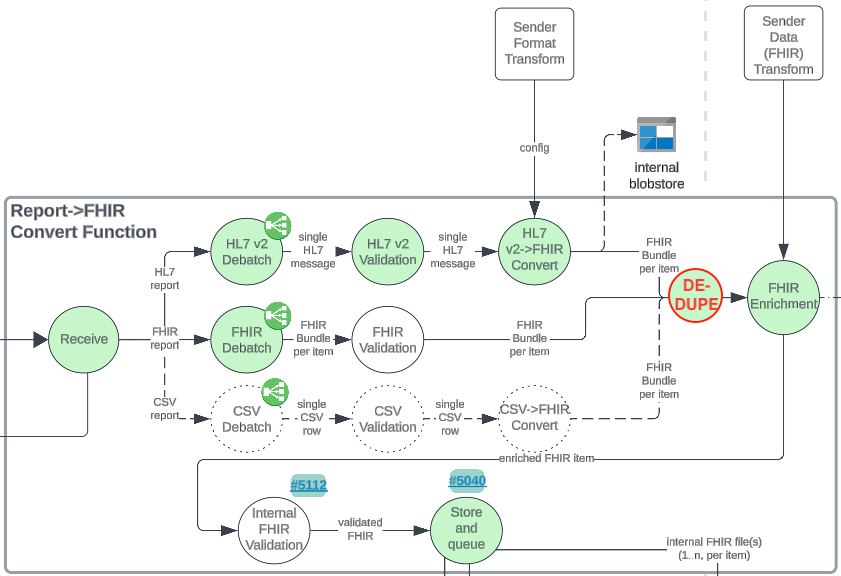

# ReportStream Deduplication (Universal Pipeline)

TODO:
- Database processing stuff
  - Indexes
  - Saving sender info to item_lineage

## Introduction

#### Technical Overview
- Deduplication shall be performed at the item level (a FHIR Bundle) after conversion to FHIR happens. Each bundle will have key elements (see [Key FHIR Elements table](#key-fhir-elements)) converted to a string which is then hashed deterministically and stored for a year in the database (item_lineage.item_hash). The hash for the current item will be compared with all Valid hashes stored over the past year for that specific sender.

#### Scope for Initial Design
- Deduplication MVP will only be activated for ORU_R01 messages for FULL_ELR topic senders. Other message types, such as test orders, shall be considered out of scope for this effort since deduplication requirements may be different.

#### History of Deduplication on the Covid Pipeline
- Refer to the [UP Deduplication epic](https://app.zenhub.com/workspaces/platform-6182b02547c1130010f459db/issues/gh/cdcgov/prime-reportstream/14103) for full background information.
- Differences between deduplication in Covid Pipeline and Universal Pipeline:
  - Deduplication will now happen during the Convert Step instead of the Receive Step
  - Deduplication will only consider a hash of key fields instead of the entire submitted item.
  - Deduplication will only consider hashes from the same sender.

## Design

### Convert Step Deduplication Workflow

- Item Hash generation.
  - The first part of the Deduplication Workflow will take in the item’s bundle and use only the specified fields ([Key FHIR Elements table](#key-fhir-elements)) to generate a string which is then hashed. 
    - The [current hashing implementation](https://github.com/CDCgov/prime-reportstream/blob/15648395efc2b60322d931bf88e0c2c5b6cc0371/prime-router/src/main/kotlin/Report.kt#L1287-L1289) uses Java’s [MessageDigest](https://docs.oracle.com/javase/8/docs/api/java/security/MessageDigest.html) to create a secure one-way hash of the string with SHA-256. TODO: Is this still the best choice for our purposes.
    - [Report.getItemHashForRow()](https://github.com/CDCgov/prime-reportstream/blob/15648395efc2b60322d931bf88e0c2c5b6cc0371/prime-router/src/main/kotlin/Report.kt#L1279) is where this happens for the Covid Pipeline deduplication. 
  - **Important note**: The ordering of fields within a bundle are **not** guaranteed. The method responsible for the Item Hash will have to force specific ordering when generating the hash.
  - TODO: Need to verify that hash storage does not break db column constraints.
  - TODO: Investigate the SQL query efficiency of adding sender id column to item_lineage table (and using this to narrow the SQL query) vs adding sender id (or name) into hash and allowing the column index to be the main SQL query parameter vs not adding the sender id to the hash and instead performing a SQL join to a table with the sender id to narrow the query. (Date range would also be applied to the SQL query in all scenarios). (Comment from Arnej: "Evaluate the performance, quality, and security trade-off of including the sender name in the hash vs querying it.")  
- Item Hash comparison.
  - If sender has deduplication disabled, then skip hash comparison.
  - The generated Item Hash will first be compared with items in the same report.
    - Note: At this part of the Convert Step, parallelization is not a concern and all the original items are [still within scope](https://github.com/CDCgov/prime-reportstream/blob/15648395efc2b60322d931bf88e0c2c5b6cc0371/prime-router/src/main/kotlin/fhirengine/engine/FHIRConverter.kt#L510).
  - The Item Hash will then be compared to existing hashes.
    - This will happen with a SQL select query which will look for a match on item_lineage.item_hash within all results that are:
      - Stored within the last year
      - Were sent by the same sender
- If item is a duplicate,
  - Item should be “nulled” out so that FHIRConverter can treat it as an “empty” item (see [FHIRConverter.kt#L284-L322](https://github.com/CDCgov/prime-reportstream/blob/3f0b47d3b1526659b76049792a0412a3f01ed74e/prime-router/src/main/kotlin/fhirengine/engine/FHIRConverter.kt#L284-L322)). This will cause the FHIRConverter to treat this item as an unprocessible report and will not create any routing or item lineage.
  - Create action log warning
    - TODO: How to format/label item duplication in History Endpoint API?
      - Feedback Notes:  "Think of the data that would be helpful to see: item's message ID, index in the submitted report, the date and report ID of the report that contains the duplicate item and its index in that report?" 
  - Set flag to check if entire report is duplicate (separate logging/treatment if this is the case).
    - Note: This is out of scope for the MVP. This also may not be trivial. Would require searching parent lineage for related items.
- If item is not a duplicate,
    - Save Item Hash to item_linease.item_hash
      - TODO: No clue where or how this happens at the moment. May need to add item_hash to several classes to allow for the hash to be tracked.
                - Might be happening automatically as part of FHIREngine.kt or Report.kt hooks?
    - Continue processing as normal.

#### Deduplication Timing in Context of the Convert Step:
- The deduplication workflow will happen at the very end of the [convert step processing (FHIRConverter.kt#L541)](https://github.com/CDCgov/prime-reportstream/blob/c942a9a6f6be347d82196939e1cf677512af4a06/prime-router/src/main/kotlin/fhirengine/engine/FHIRConverter.kt#L541).
    - Before the Deduplication Workflow the Convert Step will:
        - Convert to FHIR if necessary
        - De-batched items from the report
        - Parsed these items into bundles
        - Validate the items
        - Stamped Observations with condition codes.
    - After the Deduplication Workflow occurs, the Convert Step will perform necessary pipeline functions:
        - Apply sender schema transform
        - Make a report object with item lineage
        - Create a route event
        - Upload to blobstore
        - Update the database
        - Add the report to the route destination filter step queue

 

#### Considerations:
- Currently, there are two instances where report data is altered in the Convert step. These instances must be taken into consideration because they have the ability to alter the data which forms the basis of the item hash.
    - Condition stamping happens in this step. ([FHIRConverter.kt#L520](https://github.com/CDCgov/prime-reportstream/blob/fbede22be1805e34a7aaf28ba5ab259663dea38e/prime-router/src/main/kotlin/fhirengine/engine/FHIRConverter.kt#L520))
        - Note: This may be moved to the Receiver Enrichment Step in the future.
    - Sender schema transformations application happen in this step. ([FHIRConverter.kt#L326](https://github.com/CDCgov/prime-reportstream/blob/fbede22be1805e34a7aaf28ba5ab259663dea38e/prime-router/src/main/kotlin/fhirengine/engine/FHIRConverter.kt#L326))

#### Receiver Step Updates
- Code to be removed: There is commented out code in the SumissionReceiver referring to the once theorized area where UP deduplication would be invoked. ([SubmissionReceiver.kt#L284-L292](https://github.com/CDCgov/prime-reportstream/blob/0c5e0b058e35e09786942f2c8b41c1d67a5b1d16/prime-router/src/main/kotlin/SubmissionReceiver.kt#L284-L292))

#### Convert Step Updates
- The Convert step is where the core of the UP’s deduplication workflow will live. ([FHIRConverter.kt](https://github.com/CDCgov/prime-reportstream/blob/main/prime-router/src/main/kotlin/fhirengine/engine/FHIRConverter.kt))
- During this step the pipeline will need to generate a hash. (See [Hash Generation Requirements](#hash-generation-requirements))
  - The Covid Pipeline uses [Java’s MessageDigest](https://docs.oracle.com/javase/8/docs/api/java/security/MessageDigest.html) for hashing. This class satisfies the requirements for UP Deduplication.
  - Before converting to a string to be hashed, the [populated key fields](#key-fhir-elements) should be extracted from the bundle and put in a static order (alphabetical etc.). 
- During this step the pipeline will compare the generated hash against others. (See [Hash Comparison Requirements](#hash-comparison-requirements))
  - Sender settings should be checked at this point to see if deduplication is turned on.
  - This will include comparison against other potential items that were submitted in the same batch. 
    - The convert step contains some parallelized code but [the original batch objects will still be in scope](https://github.com/CDCgov/prime-reportstream/blob/0c5e0b058e35e09786942f2c8b41c1d67a5b1d16/prime-router/src/main/kotlin/fhirengine/engine/FHIRConverter.kt#L262) of the deduplication workflow.
  - There is an [existing SQL Query](https://github.com/CDCgov/prime-reportstream/blob/9ec0a59c73d7dad9a319cd321baf9efd71ceab46/prime-router/src/main/kotlin/azure/DatabaseAccess.kt#L166-L183) which performs the hash comparison through SQL Select. 
    - Because this solution uses SQL to do filtering and matching, we’re able to pawn off some questions of efficiency onto SQL’s performance, instead of loading everything into memory and creating our own algorithms. 
    - Still some research TODOs for determining best implementation efficiency.
    - Another research TODO: Is it faster to include sender in the hashing, or to join with the table for sender information.
    - This query could be reused with minimal updating. 
- [Report.ParentItemLineageData()](https://github.com/CDCgov/prime-reportstream/blob/cadc9fae10ff5f83e9cbf0b0c0fbda384889901d/prime-router/src/main/kotlin/Report.kt#L373) will need to be enhanced so that it can accept the generated hash string. The contents will then take the place of [the random UUID which is currently stored](https://github.com/CDCgov/prime-reportstream/blob/cadc9fae10ff5f83e9cbf0b0c0fbda384889901d/prime-router/src/main/kotlin/Report.kt#L412) in the column for UP items.
- Duplicate logging:
  - Duplicates will be logged using the existing action logger pattern ([Ex 1](https://github.com/CDCgov/prime-reportstream/blob/0c5e0b058e35e09786942f2c8b41c1d67a5b1d16/prime-router/src/main/kotlin/fhirengine/engine/FHIRConverter.kt#L526-L533), [Ex 2](https://github.com/CDCgov/prime-reportstream/blob/cadc9fae10ff5f83e9cbf0b0c0fbda384889901d/prime-router/src/main/kotlin/fhirengine/engine/FHIRReceiverFilter.kt#L307-L315). These will be visible in the Submission History API.  
  - If individual item duplicates are found this will be logged as a warning.
    - TODO: Propose new warning structure
  - If the entire report is found to be duplicate, this will be logged as an error.
    - "Duplicate report was detected and removed." +  metadata (the date and report ID)
    - TODO
  - TODO: Azure logs? 
  - TODO: Application Logs. Yes should have them, how to do?

#### Database Updates
- No updates will be made to the schema of the database itself. 

#### Hash Generation Requirements
- Must work regardless of key field ordering in bundle.
  - Ordering of fields must remain static. (Order of FHIR elements is not guaranteed).
- Hash created with key fields must be deterministic.
- Only key fields which are present should be considered.  
- The sender name should be added to the hash so they are unique per sender. (TODO: Sender name collision?)

#### Hash Comparison Requirements
- If sender has deduplication enabled, only compare to a) individual items from b) the same sender c) within the past year. 

#### Sender Setting Requirements
- Should have a binary setting for the sender. **By default, the deduplication workflow is enabled.**
  - TRUE – Deduplication detection is active.
  - FALSE – Deduplication detection is not active. Item hashes will still be stored in the item_lineage table.

## Key FHIR Elements

These fields represent the criteria for an item (ORU-0R1 message) to be considered a duplicate.

|Data Element|HL7|FHIR|
|---|---|---|
|Specimen ID|SPM.2|Specimen.Identifier|
|Accession number|SPM.30 (not in v2.5.1)|Specimen.accessionIdentifier|
|Specimen Collection Date/Time (if different from other date/time)|SPM.17|Specimen.collection.collectedDateTime|
|Patient ID|PID.3|Patient.identifier|
|Patient name|PID.5|Patient.name|
|Patient DOB|PID.7|Patient.birthDate birthDate.extension[1].valueDateTime|
|Results Rpt/Status Chng – Date/Time|OBR.22|DiagnosticReport.issued|
|Result Status|OBR.25|DiagnosticReport.status|
|Performing Organization/ Testing facility CLIA|OBX.23|Observation.Performer -> Organization.Identifier.value|
|Performing Organization/ Testing facility name|OBX.23|Observation.Performer -> Organization.name|
|Test performed code|OBX.3.1|Observation.resource.code.system|
|Test performed code system|OBX.3.3|Observation.resource.code.coding|
|Date/Time of the Observation (this appears in multiple HL7 locations)|OBX.14, OBR.7, SPM.17|Observation.resource.issued DiagnosticReport.effectiveDateTime DiagnosticReport.effectivePeriod.start|
|Observation Value/ Test result code|OBX.5|Observation.resource.valueCodeableConcept.coding.code|
|Observation Value/ Test result code system|OBX.3.3|Observation.resource.valueCodeableConcept.coding.system|