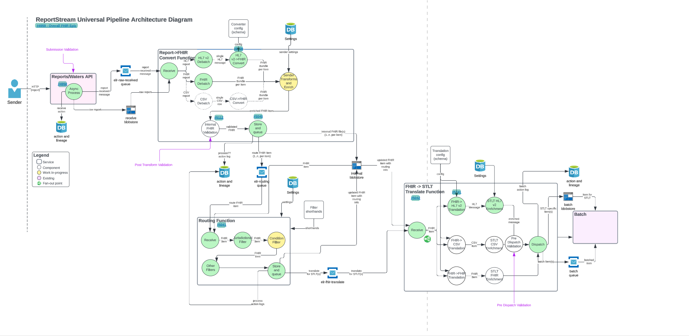
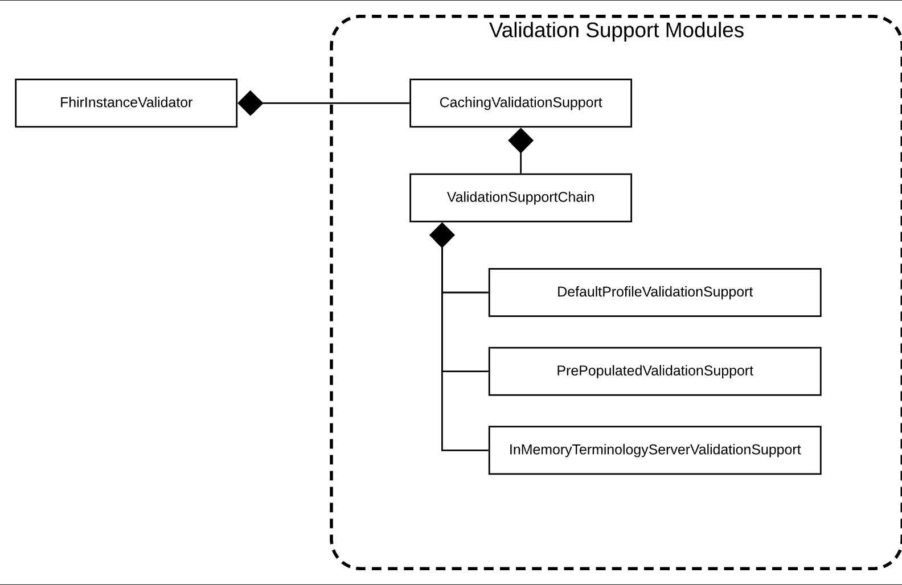

# Problem Statement
As a sender I want submitted data to be validated to ensure data integrity and quality. As a receiver I want received
data to be validated to ensure data integrity and quality. For this to happen, there needs to exist a validation 
setting as well as reusable validation components to perform the sending and receiving validation. 

## Validation Design
The diagram below proposes three validation "checkpoints":

| Name           | Description + Location                                              | Purpose                                                                                                        |
|----------------|---------------------------------------------------------------------|----------------------------------------------------------------------------------------------------------------|
| Submission     | Upon receipt of a submission in the SenderReceiver                  | Ensure data is parseable (i.e. not a png or other garbage data)                                                |
| Post-transform | After sender transforms and enrichment in the convert function      | Ensure data is valid after transformation (i.e. satisfies the validation profile configured for this sender)   | 
| Pre-dispatch   | After receiver translation and enrichment in the translate function | Ensure data is valid after transformation (i.e. satisfies the validation profile configured for this receiver) | 

This is where they are located in the overall system:  


### Validation Checkpoints

#### Submission
For FHIR, we currently use an `IParser` instance to parse and read some metadata. By default, the IParser performs some
validation and raises warnings or errors (depending on how its configured). We need to investigate how the instance is
currently configured and ensure it is performing validation. Ideally this configuration will be universal or binary
(validation on/off vs different types) for all senders. For HL7 V2, we will use the HAPI library as it is currently 
being used in the Covid pipeline

#### Post transform
Will occur after transformation so that we can massage the data to meet any IG that may be requested and do content 
validation for free via the HAPI library authentication as opposed to just structural. We again need to 
ensure that all necessary data exists and is sane. This will happen for both HL7 and FHIR data. One final validation will
be needed (per receiver) after applying receiver transforms and enrichment.

#### Pre dispatch
Will occur in the translate function, after reception, translation, and enrichment but just before dispatch.

Verify that the final dataset meets configured receiver expectations prior to dispatch.

### Shared Components
To facilitate reuse and extensibility, a new setting type `validationProfile` shall be created representing a type of
validation, the validations to perform, and any applicable configuration parameters. This setting is reusable because
senders and receivers can only be set up to receive one format at a time, so there should not be confusion over which
validationProfile pertains to which format.

#### Prototype Objects
A factory/builder shall consume the validationProfile setting and produce reusable, cached validation objects
(i.e. instance of configured FhirValidator in a wrapper/interface) that can be used to validate FHIR data.

#### Actions Upon Validation Failure
When a message fails validation, validation errors should show up in:
- The submission history API - this is going to be a bit of a challenge in presenting these errors in a useful way for 
HL7 V2 and CSV messages
- The Action Log in the database in such a way that the engagement team can easily query for it
  - Submission validation failures should show up in Submission History UI
    - Sender is responsible for issue triage escalating to ReportStream as necessary
  - Send failures should show up in last-mile failures
    - ReportStream is responsible for issue triage
- Notify the sender immediately in API response if parse validation fails

#### Ticketed Work
See the validation epic (#8973) for related tickets

### FHIR Validation

The FHIR validator implementation will utilize the [HAPI FHIR library](https://hapifhir.io) for validation. The two
validation objects `IParser` and `FhirInstanceValidator` provided by HAPI should both be supported. The validator will
be responsible for consuming settings from the factory/builder and instantiating the appropriate HAPI objects.

Other objects of interest include: `ValueSet` and `CodeSystem`; see the `Background Information` for further info.

#### Validation Tool
There is an existing and well-maintained project that meets the requirements for a validation tool. We intend to deploy
that tool as an azure function for an HL7 validation web app.

See the `FHIR Validator Wrapper` section under the `Background Information` heading below for more information.

#### Background Information
The HAPI FHIR library represents an implementation guide using:
- [Structure Definitions](http://hl7.org/fhir/structuredefinition.html) - Valid fields, data types, cardinalities, valid values, and further rules.
- [Code Systems](http://hl7.org/fhir/codesystem.html) - Code and vocabulary definitions
- [Value Sets](http://hl7.org/fhir/valueset.html) - Lists of codes (from above) for use in field values

The HAPI FHIR library supports two types of validation:
- [Parser](https://hapifhir.io/hapi-fhir/docs/validation/parser_error_handler.html)
  - Lightweight but not comprehensive
  - An IParser instance can be configured with StrictErrorHandler or LenientErrorHandler resulting in exceptions or log messages upon parsing an invalid FHIR bundle.
- [Instance](https://hapifhir.io/hapi-fhir/docs/validation/instance_validator.html)
  - Heavy and comprehensive
  - Great user-facing error messages
  - Flexible and easy to write/configure
  - Built-in support for core FHIR spec and many derivatives

There is an existing project maintained by the HL7 FHIR foundation that serves as great sample code for initializing
the validation components with specific FHIR versions and specific implementation guides.  **Consult the `FHIR Validator`
section later under this same heading **

<b>Validators can and should be chained and cached</b>  


##### LOINC validation will require loading an external code system.

<details>
<summary>Example recipe with caching and custom external value sets / code systems</summary>

```java
FhirContext ctx = FhirContext.forR4();

// Create a chain that will hold our modules
ValidationSupportChain supportChain = new ValidationSupportChain();

// DefaultProfileValidationSupport supplies base FHIR definitions. This is generally required
// even if you are using custom profiles, since those profiles will derive from the base
// definitions.
DefaultProfileValidationSupport defaultSupport = new DefaultProfileValidationSupport(ctx);
supportChain.addValidationSupport(defaultSupport);

// This module supplies several code systems that are commonly used in validation
supportChain.addValidationSupport(new CommonCodeSystemsTerminologyService(ctx));

// This module implements terminology services for in-memory code validation
supportChain.addValidationSupport(new InMemoryTerminologyServerValidationSupport(ctx));

// Create a PrePopulatedValidationSupport which can be used to load custom definitions.
// In this example we're loading two things, but in a real scenario we might
// load many StructureDefinitions, ValueSets, CodeSystems, etc.
PrePopulatedValidationSupport prePopulatedSupport = new PrePopulatedValidationSupport(ctx);
prePopulatedSupport.addStructureDefinition(someStructureDefnition);
prePopulatedSupport.addValueSet(someValueSet);

// Add the custom definitions to the chain
supportChain.addValidationSupport(prePopulatedSupport);

// Wrap the chain in a cache to improve performance
CachingValidationSupport cache = new CachingValidationSupport(supportChain);

// Create a validator using the FhirInstanceValidator module. We can use this
// validator to perform validation
FhirInstanceValidator validatorModule = new FhirInstanceValidator(cache);
FhirValidator validator = ctx.newValidator().registerValidatorModule(validatorModule);
ValidationResult result = validator.validateWithResult(input);
```
</details>

##### Lots more information [here](https://hapifhir.io/hapi-fhir/docs/validation/introduction.html)

##### FHIR Validator Wrapper
This external project is maintained by the HL7 FHIR Foundation and is an easy to use web tool for uploading data
for validation against a user-selectable FHIR spec. Implementation guides can be supplied or picked from a pre-
populated list providing a powerful starting point for our validation tool.

Check out the tool online [here](https://validator.fhir.org). And on [github](https://github.com/hapifhir/org.hl7.fhir.validator-wrapper)!
This tool can be deployed as is and meet all requirements for our validation tool. Ideally we will provide saved
configurations equivalent to any validation profiles we have internal to ReportStream to better serve our users' needs.

This tool also serves as amazing sample code for initializing the various classes and interfaces needed to run a 
validation. To include loading an implementation guide from a URL or using a specific FHIR version. Also of significant
value is the pre-populated list of implementation guides from various health facilities.

#### Resulting Tickets

See the validation epic (#8973) for related tickets

### HL7 Validation
We will be using the NIST library for validation since the HAPI library requires Windows tools and we are a MAC shop. 
Also, DEX chose to use it and is currently using it, which means it is a tested and proven tool. Lastly, there is a GUI
available to use to create profiles with which will make the process, while still tedious, at least somewhat easier. 

#### Background Information
##### RADx MARS

It is important that we also take into consideration what MARS expects of us when it comes to validation:
<details>
<summary>MARS Product Requirements for Hubs</summary>
 
The purpose of this document is to outline requirements for how ReportStream (and
other hubs) should handle HL7v2 files received by senders who conform to the
MARS specification.
Upon receiving an HL7v2 file from a MARS sender, ReportStream should:
1. Perform in-line validation of the message
2. Route the HL7v2 file to the appropriate state/local jurisdiction, based on predefined state preferences for 
receiving OTC data
3. Strip PII from the HL7v2 file and route it to HHS Protect  
     
Each step is described in more detail below:
1. Perform in-line validation of the message
   The validator we create using NIST's library will issue an error or a
   warning, depending on the severity of the issue that is detected.  
   ReportStream should run this validator on every message it receives.  If there
   is an error, the message should be considered invalid and should not be
   transmitted downstream.  If there is a warning, the message can still be
   transmitted.  In the case of an error or warning, the sender should be notified
   in order to correct the issue.
2. Route the HL7v2 file to the appropriate state/local jurisdiction, based on predefined state preferences for 
receiving OTC data. The 
   CDC is surveying each state about their preferences for receiving OTC data.  
   Each state will indicate whether it would like to receive OTC data.  Those who
   opt to receive OTC data will be allowed to specify a minimum set of metadata
   for receiving messages.  For example, a state may indicate that it only wants
   to receive messages that contain at least Last Name and DOB.  Based on
   these individual state preferences, ReportStream should route the HL7v2
   messages to the states accordingly.  We have already confirmed that MARS
   HL7v2 messages are natively compatible with state health systems.  (Note
   that this same routing logic should be applied to all messages that
   ReportStream routes to states, not just MARS data.)
3. Strip PII from the HL7v2 file and route it to HHS Protect
   All PII in the message should be replaced with a “<deidentified>” string or
   removed, according to the rules in this link.  The HL7v2 message should then
   be routed to HHS Protect.
   Resources:
   Data Hub descriptions and Test Results Workflow Diagram
</details>

##### The HAPI HL7 library
The HAPI library offers 3 "levels" of message validation:
1. Basic Message Validation - very basic validation on message length and some segments, this is built in and will not 
provide enough validation to meet our needs.
2. Custom Message Validation - Extends basic and enabled through the extensibility offered by the message validation 
framework itself. Allows you to override default behaviour.
3. Validation by the use of Conformance Profiles - Unfortunately this boils down to essentially requiring 
MicroSoft Workbench (for download: https://sourceforge.net/projects/mwbench/) which since we use Macs and a Google 
search does not yield any alternatives, it seems like it rules this out as an option. If we can obtain access to a 
Windows machine, it may be worth it. This tool appears to essentially be a plug and play tool that allows you to 
specify a format and then will generate XML that can be used as a means to validate a message. Basically, it looks like 
it provides a GUI to creating the specification.

The HAPI HL7 library provides flexibility regarding the following:
- Whether the message validation should be activated or not (it is turned on by default)
- How to deal with unrecognized message versions, segments, fields, etc. during the parsing process
- Behavior around how the parser should encode segments and fields even if no data content is present

The HAPI HL7 library provides the following classes to validate HL7 messages:
- `ValidationContext` - manages a collection of codified rules for handling messages, fields, and primitive types
- `ValidationRuleBuilder` - what you use to create the validation rules
- `MessageVisitor` - the interface the classes implement when they are in charge of doing the actual comparison
- `ValidationException` - thrown when validation fails
- `ValidationExceptionHandlerFactory` - interface that you can implement in order to control the exception handling

Code Examples:

A code example for custom message validation: 
https://hapifhir.github.io/hapi-hl7v2/xref/ca/uhn/hl7v2/examples/CustomMessageValidation.html  
If you want to start with something more basic for a POC, here is an example that uses a default validation context
rather than building one from scratch: https://hapifhir.github.io/hapi-hl7v2/xref/ca/uhn/hl7v2/examples/MessageValidation.html   
Here is an example of using the ValidationRuleBuilder: 
https://hapifhir.github.io/hapi-hl7v2/xref/ca/uhn/hl7v2/examples/CustomMessageValidationWithValidatingVisitor.html   
An example for using conformance: 
https://hapifhir.github.io/hapi-hl7v2/xref/ca/uhn/hl7v2/examples/MessageValidationUsingConformanceProfile.html   

##### NIST Validator
The NIST HL7 Validation Library can be found here: https://github.com/usnistgov/v2-validation  
Unfortunately, they do not seem to have documentation on how to actually use this library. I found this page
https://hl7v2-ws.nist.gov/hl7v2ws/documentation.htm, but the buttons leading to the documentation do not work. The 
project only has one README which does not discuss how to actually use the library. https://hl7v2-gvt.nist.gov/gvt/#/doc 
appears to have information on the validation tool and within that there is a swagger spec
(https://hl7v2-gvt.nist.gov/gvt/apidocs/swagger-ui.html#/), but none of that appears to be for actually validating an
HL7 Message. 

DEX uses this library but has a light wrapper around it. They do recommend using the library, but not their wrapper.
Part of using the library is creating profiles. This can be done by going to https://hl7v2-igamt-2.nist.gov/ and signing
up. Once you register, go to IG Documents, Create new IG document. Select the HL7 version as well as the message structure and 
it will create a base for you. Then you have to manually adjust each field to meet the spec. There is only one profile 
currently that is shared. Otherwise, you have to know someone. Marcia Schulman has offered to give us whatever she has 
so that she can be contacted once we know what profiles we need, but she only had a few and it is unlikely they will 
meet our needs. We may also be able to share profiles with AIMS and DEX. NIST hosts a validation API based on the NIST 
library, but it cannot be used for production data due to concerns over PII.

From reading the code in the DEX project, it looks like they have some profiles created, but we would likely need to 
set up any further profiles that we want. These are done in xml, then we deserialize them, pass then into the 
HL7Validator class, along with the ValueSetLibrary, and ConformanceContext and call the validate method on the message.

#### Resulting Tickets

See the validation epic (#8973) for related tickets
