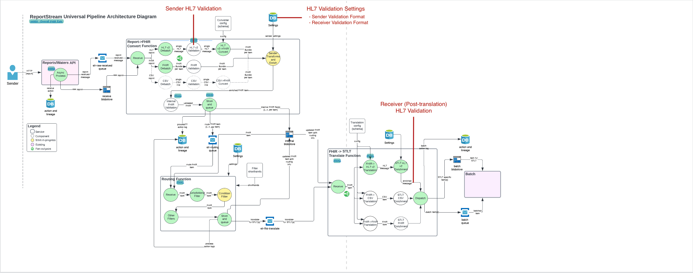

# Problem Statement
As a sender/receiver I want submitted/received data to be validated to ensure data integrity and quality.

There needs to exist a collection of settings and reusable components to perform varying types of validation at various points in the HL7 message's lifecycle.

## Proposed Design

We propose two validation "checkpoints":
1. Sender validation
2. Receiver Validation

This will use the setting proposed in the FHIR validation design doc called `validationProfile`. This is reusable because
senders and receivers can only be set up to receive one format at a time, so there should not be confusion over which 
validationProfile pertains to which format. 

Each validation checkpoint shall run its configured validation and in the event of a failure: 
- actionLog the result and error information
- notify the sender

## Background Information/Dev Notes
### The HAPI HL7 library
The HAPI library offers 3 "levels" of message validation:
1. Basic Message Validation - very basic validation on message length and some segments, but the article
(https://saravanansubramanian.com/hl72xhapivalidation/) said this will not be enough
2. Custom Message Validation - Extends basic and enabled through the extensibility offered by the message validation 
framework itself. Allows you to override default behaviour.
3. Validation by the use of Conformance Profiles - enable the sharing of any stringent message specifications involving 
specific workflows to an open registry that everyone can use. They push this one. We may be able to download something
that others have created to use as a basis for our custom message validation. This is worth looking into. We need to 
determine if it would be appropriate for us to contribute to this community.

Behavior that can be controlled:
- Whether the message validation should be activated or not (it is turned on by default)
- How to deal with unrecognized message versions, segments, fields, etc. during the parsing process
- Behavior around how the parser should encode segments and fields even if no data content is present

Key Classes:
- `ValidationContext` - manages a collection of codified rules for handling messages, fields, and primitive types
- `ValidationRuleBuilder` - what you use to create the validation rules
- `MessageVisitor` - the interface the classes implement when they are in charge of doing the actual comparison
- `ValidationException` - thrown when validation fails
- `ValidationExceptionHandlerFactory` - interface that you can implement in order to control the exception handling
 

    
Code Example:

        package com.saravanansubramanian.hapihl7tutorial.validation;

    import ca.uhn.hl7v2.DefaultHapiContext;
    import ca.uhn.hl7v2.HL7Exception;
    import ca.uhn.hl7v2.HapiContext;
    import ca.uhn.hl7v2.Version;
    import ca.uhn.hl7v2.parser.PipeParser;
    import ca.uhn.hl7v2.validation.builder.support.DefaultValidationBuilder;

    public class HapiParserCustomMessageValidationDemo {

        private static HapiContext context = new DefaultHapiContext();

        public static void main(String[] args) {

            String adtMessage
            = "MSH|^~\\&|SENDING_APPLICATION|SENDING_FACILITY|"
                + "RECEIVING_APPLICATION|RECEIVING_FACILITY|20110613083617|"
                + "|ADT^A04|934576120110613083617|P|2.3||||\r\n" +
                "EVN|A04|20110613083617|||\r\n" +
                "PID|1||135769||MOUSE^MICKEY^||19281118|M|||"
                + "123 Main St.^^Lake Buena Vista^FL^32830||"
                + "(407)939-1289|||||1719|99999999||||||||||||||||||||\r\n" +
                "PV1|1|O|||||7^Disney^Walt^^MD^^^^|";

            //specify an override for our default validation behavior by injecting our own extension
            context.setValidationRuleBuilder(new OurSpecialMessageValidationBuilderClass());

            try {
                PipeParser parser = context.getPipeParser();
                parser.parse(adtMessage);
                System.out.println("Code should not get here");
            } catch (HL7Exception e) {
                System.out.println("Validation failed as expected during parsing since PV1-3 is now mandatory");
                System.out.println("Validation Message: " + e.getMessage());
            }
        }

    }

    @SuppressWarnings("serial")
    class OurSpecialMessageValidationBuilderClass extends DefaultValidationBuilder{

        @Override
        protected void configure() {
            super.configure();
            forVersion(Version.V23)
                .message("ADT", "A04")
                .terser("PV1-3", not(empty()));
        }
    }

### NIST Validator
This is a web tool that can be used for manual validation. However, as of the writing of this document, it is currently
broken. We reached out to the makers of the tool previously and they said that they were aware of the issue and a fix 
was in the works.

## Resulting Tickets
Epic: https://github.com/CDCgov/prime-reportstream/issues/9160  
Create the validation profile setting: https://github.com/CDCgov/prime-reportstream/issues/9161  
Create a reusable validator: https://github.com/CDCgov/prime-reportstream/issues/9164  
Create the validation context: https://github.com/CDCgov/prime-reportstream/issues/9159  
Create the sender validation: https://github.com/CDCgov/prime-reportstream/issues/9162  
Create the receiver validation: https://github.com/CDCgov/prime-reportstream/issues/9163  

