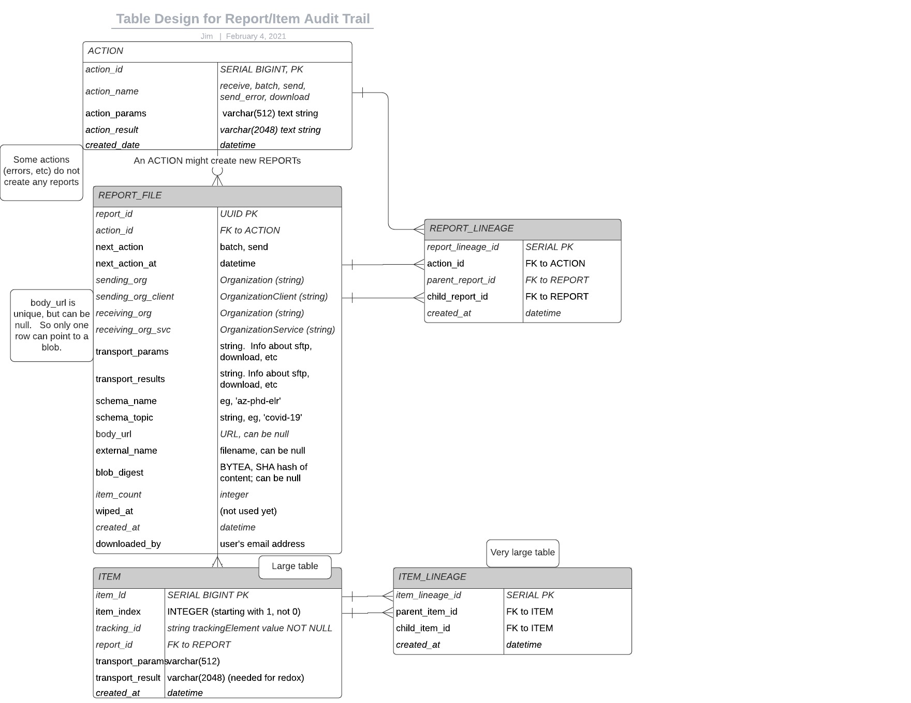

## Background and Goals for Lineage and History Tracking Schema
[Zenhub Ticket](https://app.zenhub.com/workspaces/prime-data-hub-5ff4833beb3e08001a4cacae/issues/cdcgov/prime-data-hub/147)

This design covers improvements to the underlying postgres database schema to meet the goals and use cases here.

#### Implementation

[OK, here are notes added later, about the actual implementation](./additional-notes.md)

Now on to the design proposal:

## Goals

### Support these primary Use Cases:

- As a receiver of Hub reports, I want to know where my data came from, when it was created, who created it, and who else received it.
- As a sender of Hub reports, I want to know where my data went, when, and to whom.
- A receiver can review basic summary information:  Number of Reports received, number of items received, list of senders from whom reports have been received, over some time period (eg "in the last week").
- Similar for senders:  summary info on numbers of reports sent, number of items sent, and a list of senders to whom reports have been sent.
- Find data that has "dead-ended" in the system, either because of a failure, or because it simply doesn't pass any of our jurisdictional filters, so it is never sent.

### General Goals

- Build trust in the Hub - the schema should enable features that give both receivers and senders a sense of trust in the system.  The hub should be able to reassure our users that their data has transferred safely and securely.
- Secure data at all steps, both in-transit and at rest, while still making it available to those who are authorized access.

### Future Use Cases

For the first rounds of work, I'm avoiding tracking any specific data *internal* to a report, other than the `tracking_elements`.   However, the schema is designed to be expanded in future sprints, to potentially accomodate these use cases:

- Tracking Positivity rates, sharp increases/drops for specific senders, geographic spikes, etc.

## Definitions

In the Hub, an **Item** is a single record of data.  A typical **Item** might be a Covid test result for one patient.   If the data is in CSV format, an **Item** is a single row in the CSV file.

A **Report** in the hub is simply a set of **Item**, with additional metadata.   For example, if the data is in CSV format, the Hub expects a single row of Column Header strings, followed by one or more rows of **Item** data.    It is acceptable for a Report to have just a single Item.  A Report with no Items is not processed.

The Hub implements a simple workflow engine.   Each step in the engine is a **Task**.  Most (but not all) tasks create one or more Reports. Current **Task** in the system include: 

| Task      |     Description
| ---       | ---
| Receive   | Receive a new Report into the Hub
| Transform | Validate a received report, and transform into desired output formats, according to configured data filter business rules
| Batch     |  Merge one or more reports together.   Typically done to consolidate data per receiver requirements.
| Send      | Reliably deliver data to an external receiver, eg, an API, sftp site, or provide for upload (and notify with an email)
| Wipe      | Remove data, per business rules

An **Organization** can recieve and/or send data to the hub.  A typical Organization is a state or local Public Health Department.   Strac, and SimpleReport are all also Organizations in the hub.

An **OrganizationService** is an endpoint to which the Hub can send a specific kind of data to a specific place, so that the Organiation can use the data.  For example, an OrganizationService might be an sftp site where a local health department wants hl7 files uploaded every 4 hours.

Likewise, an **OrganizationClient** is an endpoint that sends data to the Hub API.   For example, SimpleReport has an OrganizationClient that can send .csv data to the hub, as often as they like.


## Assumptions

- TASKs create zero or more REPORTs which have one or more ITEMs
- ITEMs are like quarks.They only exist inside of a REPORT.  Its fine and quite common to have a report with one item.
- We must track lineage per-item, however, people think in terms of REPORTs.  Hence we need to track both.
- Tracking of sending- and receiving- Organizations is crucial, to know who gets permissions to see the data.
- Many:many -- A given ACTION could take in many reports, and produce many reports.  Need to allow for both splitting and merging.
- Many:many -- An ITEM can be the result of multiple parent items, and can result in multiple child ITEMs.
- A few schema best practices:  Every table must have a single col PK (either a serial or a UUID), and a created_date, Normalize independent data.   Use singular nouns.
-- Receipt of a dataset implies the right to see the lineage of that dataset.
-- Sending a dataset implies the right to see the lineage of that dataset. 

## Proposed Design



(Note: [Original lucid chart diagram is here](https://lucid.app/lucidchart/7b81cccb-91a0-44b3-b17f-90b9b0c8304e/edit?beaconFlowId=332110D5160D6847&page=0_0#))

### Notes on the Proposed Schema

- The separation of Task from Report allows us to have Tasks that don't necessarily create Reports.
- Addition of the `TASK.task_result` fills a gap where we're not tracking the error messages sent back to users.
- Apparently I can't name the REPORT table 'REPORT', due to a limitation in Flyway/jooq.  Hence the weird name `REPORT_FILE`.   I also thought about `REPORT_IN`, `REPORT_DATA`, `REPORT_REC`.  Haven't sunk as low as `REPURT`, but I'm on my way there...
- Many values in REPORT_FILE will be empty depending on the task creating the report.  For example, all the sending_* fields are only filled in for an initially received report.   All the receiving_* fields are only filled in for reports sent externally.
- might need a report_status in the future.  For example, `wiped` or `archived`, to explain why a blob might have disappeared.
- The primary key to use for ITEM is tricky.  The sender gives us the `tracking_element`, but we have little control over how robust that is.  Because of this, all queries on `tracking_element` must also filter on report_id.
- So there's an open question:  should we require global uniqueness of `tracking_elements`?   It would be wonderfully convenient to use `tracking_elements` as primary keys in our database.    However, they would have to be globally unique, because report data can get merged together in arbitrary ways in steps downstream from Receive.
- There's subtlety with Report parent/child relationships.   Because any given task might take in a bunch of reports, and produce a bunch of reports, there's no guarantee that any of the data in output Report Y came from input Report X.  However we're tracking it in the REPORT_LINEAGE table as if every input report fed every output report.  In practice, its very hard to tell if that's true, in general.

### How this design helps build trust

- Fine-grained lineage tracking at the ITEM level, with ability to query both "backward" and "forward"
- Improved tracking of sender and receiver ownership
- Tracking versions of the functions that created the data, and SHA hash of every report.
- Next steps: Have an easy-to-use API that delivers history
- Next steps: Have an easy-to-use API that can retrieve the data in an individual ITEM. (?)

### Rollout plan:

1.  Build out the new schema in parallel with the existing TASK, TASK_SOURCE tables.  Keep the old table alive and feed data to both old and new for a period of time.
2.  Wire the REPORT_FILE and REPORT_LINEAGE tables first, then the ITEM and ITEM_LINEAGE.
3.  Code into the validation step a requirement for uniqueness of tracking Ids within each Received report. 
4.  Migrate existing data to the new tables, and retire or modify the old ones.   Migrate all at once, as a one-off, with a brief downtime.  (Note:  I believe some of the data in the TASK_SOURCE table is not correct, so may only wwant to migrate correct data.)   Right now there are only a few hundred rows of data to move.


#### Queries

To validate that we can design recursive parent/child queries, I experimented with a much simplified schema found here:
[recursive-parent-child-test.sql](recursive-parent-child-test.sql)

You can run this locally to try it out:
```
psql prime_data_hub -f recursive-parent-child-test.sql 
```

I'm not testing for loops in the parent/child relationships, but [loops are very highly discouraged, for obvious reasons](https://www.youtube.com/watch?v=qu_Y1wQ923g).


Based on the experiment, I believe we can write quries that execute the following use cases:

#### Looking "forward":
- Find **all** the reports or items that are descended from my report or item, including intermediate internal steps.
- Find the **sent** reports or items that are desendants of my report or item.
- Find all the reports or items that were never sent.  (possible error situations)

#### Looking "backward":
- Find **all** the reports or items that are ancestors of my report or item, including intermiediate internal steps.
- Find the **submitted** reports or items that are ancestors of my report or item.

#### Who else got this data besides me?
- Given an item, look backward to find all its ancestors.  Then look forward, to find all the other **sent** items descended from any of those ancestors.

#### Did any of my data 'wither on the vine' without getting delivered?
- Given any item, find all its descendants.   Then find the subset of those nodes that don't have children and are not 'sent'.  These represent data that as 'withered'.
