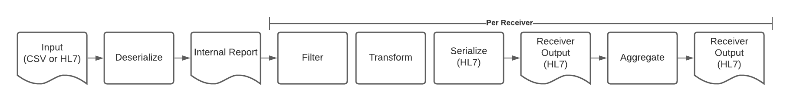

# Considering New Internal Formats 

This proposal is part of a series of recommendations that try to solve multiple problems together in one suggestion. These proposals consider the learnings and the experience from operating ReportStream for the past six months and the current production directions for the service for the next six months. 

## Going beyond COVID-19
USDS created ReportStream in response to the COVID-19 public health emergency, but with the thought that it would last beyond this emergency. Although the public health emergency is not over, several product requests indicate that it is time to consider how to take ReportStream beyond the public health emergency. Among these are: 

1. Full ELR support, followed by VXU and ADT support in the future.  

2. Simple Report's lead testing: SimpleReport, the first sender to ReportStream, is adding lead testing to its capabilities. 

3. Multiple disease support: Through contacts by the sender automation team, many senders are indicating that they would like ReportStream to support other test results besides COVID

4. The EIP program: The CDC has asked to ReportStream to consider how it can support the Emerging Infections Program program by developing a FHIR capability in ReportStream.  

In addition to these concrete initiatives, the CDC and PRIME are considering other projects which involve FHIR resources. These initiatives follow the new directives coming out of the ONC as it specifies rules for recent legislation. 

## High-level observations

At a high level, the current ReportStream pipeline has three basic operations: filtering, transforming, and aggregating. These operations are general enough to support many use-cases. On at least an initial examination, these operations will cover the listed future use-cases. 

The primary mismatch in our pipeline comes at the internal report level. Here, the current ReportStream report structure is a table with the columns as the data elements. This structure works fine for the existing COVID-19 reports. However, the use-cases in the future will originate in HL7 and FHIR messages that contain trees of data elements. Therefore, ReportStream will either have to map these messages to tables or replace the table with a hierarchical data structure. Since the new use-cases are hierarchical in how the data is received and sent, this proposal's main thrust is that ReportStream needs to change its internal report structure from a table row to an internal object tree.

## Possible future internal formats

This proposal looks at three alternatives for the internal ReportStream format. 
- HL7 Message based
- FHIR Bundle based
- Custom Objects based 

### HL7 Message
In this alternative, the ReportStream report structure becomes a list of HL7 messages. Most likely, ReportStream will use the HAPI HL7 message as the container for these messages. Serializers would translate incoming and outgoing formats to and from HL7 messages. The filtering and transforming operations will need to refer to HL7 message components, but their basic algorithms will remain the same. 

This alternative will have to invent an extensibility mechanism for data elements that do not map directly to the HL7 specification, such as the `site_of_care` element. Many systems use the HL7 Note field for this purpose. Perhaps, the Note field can work in this alternative. 

### FHIR Resource Bundle 
This alternative is essentially the same as the previous, except using FHIR Bundles instead of HL7 messages. The ReportStream report structure becomes a list of FHIR bundles. This alternative will take advantage of well-known and vetted HL7 to FHIR mappings. Unlike HL7 messages, all FHIR resources have extensibility built-in.  

### Custom Structures
The final alternative uses custom objects that ReportStream defines. 
One can think of the current tabular approach as a version of a custom structure. 
In all likelihood, the custom objects would be a simplified version of the FHIR resources of the FHIR proposal. 
However, these object classes would not be restricted to only defined FHIR resources. The custom classes may, for example, adopt an HL7 model for ELR and FHIR model for other types. 

## Analysis
The proposal considers four criteria to evaluate each choice.  
- How does the option support the new scenarios listed in the introduction? 
- What choice will allow new people to come up to speed quickly? 
- What constraints and guardrails do each option have to prevent future issues and bugs?
- How much effort will it take to convert the existing pipeline to this option? 

### New Use-Cases
Since FHIR is a successor to HL7, it covers the scenarios that HL7 covers. Consequently, an FHIR-based implementation will support both the HL7 and FHIR use-cases, while an HL7-based implementation will not. 

### New People
FHIR resources are more familiar to a typical engineer since they use widely adopted mechanisms like REST and JSON. In addition, FHIR has better documentation and a wider open-source community. Finally, new engineers are more likely to have already invested time to learn FHIR. 

### Guardrails
FHIR has far more regular implementation for concepts such as organization and people, essential for public health information. In addition, FHIR discourages common but harmful HL7 practices like coding with exceptions and placing multiple values into a single field. 

### Initial Effort
The initial effort will be high for all options, essentially causing rewrites to all serializers, transforms, and filters. However, ReportStream will have more HL7 use-cases in the short term, so either a custom class or HL7 approach will be the easiest to get started. 

### Summary
The table below grades each option on a 1-5 scale, where five is best. 

|            | New Use-Cases | New People | Guardrails  | Initial Effort  |
|:----       |:----------:   |:----------:|:-----------:|:---------------:|
| HL7        | 3             | 3          | 2           | 4               |
| FHIR       | 5             | 4          | 5           | 2               |
| Custom     | 4             | 2          | 1           | 5               |

## Recommendation
Although an HL7 internal format would be the quickest path to support full ELR, since ELR is an HL7-based standard, this path would not support the future FHIR scenarios. HL7 also has problems representing new data elements like those that SimpleReport uses to capture new testing sites. Although it may take more initial work, ReportStream should use FHIR as its internal structure because it supports more future scenarios and benefits engineers.  

## Details

### Topics
In this proposal, the concept of a topic becomes something like parts of a FHIR implementation guide which defines what FHIR resources are in a particular bundle. Further investigation should be done to see if they are the same concept. 

### Data elements

Similar to the XPath concept for XML, FHIR defines a path syntax for its data elements. The FHIR path replaces the data element name in most cases in the current engine. The following table shows how some of the current data elements will translate into FHIR paths. 

| Current Name          | FHIR Path   | Comments | 
|:---------|:----------|:-----|
| patient_last_name     | Patient.name.family   | FHIR follows USCDI naming conventions  | 
| patient_first_name    | Patient.name.given[0] | FHIR supports multiple given names |
| specimen_source_site  | Specimen.collection.bodySite | SNOMED-CT value |
| ordering_provider_npi | ServiceRequest.requester.identifier | NPI value with CMS as the assigner |
| site_of_care | ServiceRequest.location.extension.siteOfCare | Site of care is an extension on the location of the request |

### Proposal 10 - Translations and Schemas
This proposal can be thought of as an extension to proposal 10, which reduces the role of a schema. This proposal says the internal format is the FHIR standard implementation guide for a particular topic, thus eliminating the schema altogether. 

### Mappers and transforms

In combination with proposal #10, the Mappers types can be replaced by whole message transforms. 

