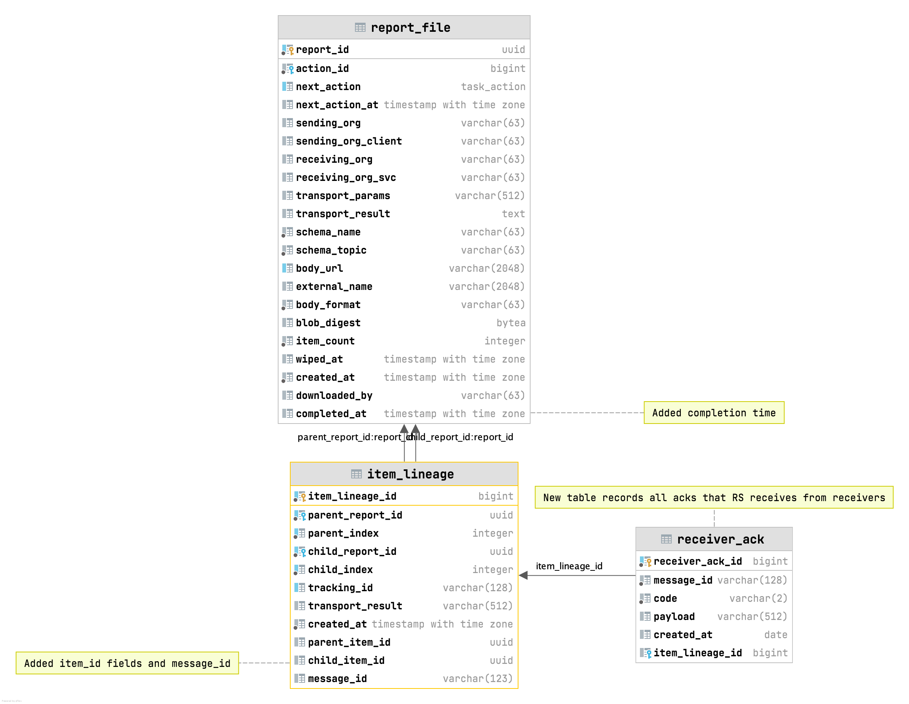
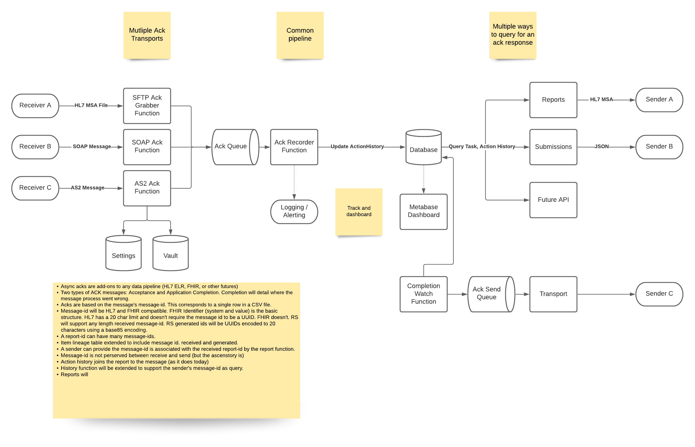

# Ack Message Support
Rick Hawes

## Background

This proposal is continuation and generalization of [HL7 ACK Messages](../0012-hl7-ack-endpoint.md) proposal.
It outlines steps needed to create an end-to-end flow to process acknowledgment messages.

The HL7 standard addresses the tracking of asynchronous data processing across multiple systems.
Two concepts are involved: acceptance and processing completion of the message.
The HL7 standard uses the Message Acknowledgment Segment (MSA) messages in both cases.
ReportStream will support both acceptance and completion acknowledgments.

The HL7 FHIR standard has similar capabilities, including the acceptance and completion concepts.

## Goals

- Expand and establish the concept of processing completion for reports and messages.
- Add information to ReportStream to track async processing of HL7 messages sent to receivers.
- Get Ack/Nack messages from different transports, including CA and WA
- Allow a sender, like HCA, to retrieve ACKs for their submissions
- Create Metabase dashboards that track processing duration and completion for the system overall, each receiver, and each sender. 

## Design

### Identifiers

ReportStream and HL7 define many identifiers. 
A new internal identifier the `ItemId` is generated by the core `Report` functions to aid tracking the report through processing. 
The `item_id` element will be defined in the main `covid-19` schema. 
The depreciated `Source` concept will be removed. 

| Name            | Type   | Description                                                                                                         |
|-----------------|--------|---------------------------------------------------------------------------------------------------------------------|
| ReportId        | RS     | UUID associated with each report which is a list of items. In COVID-19 topic, this an ELR result.                   |
| ItemIndex       | RS     | The index of an item in a report.                                                                                   |
| ItemId          | RS New | The UUID associated with the item of a particular report. Unique per report and item.                               |
| TrackingId      | HL7    | The field in an item used to track the item over time. Specimen Id is used in ELR.                                  |
| SenderMessageId | HL7    | The id of an HL7 message that is from a sender. Used in the MSH segment of an ELR message and MSA segment of an Ack |

### Data Base

A new `receiver_ack` table will track the ack messages that ReportStream receives. 
`ItemId` and `MessageId` are tracked in the existing `item_lineage`. 
Completion of reports processing is tracked in the new `completed_at` in the `report_file` table. 

### Data Flow

The processing of acknowledgments follows ReportStream's pattern of using Azure functions and queues.
Acknowledge messages from receivers can arrive in many ways, but a common queue and function process all acknowledgments.
Likewise, a sender can retrieve acknowledgment messages in multiple ways.
The data flow is similar to ELR messages data flow except that the flow is in the reverse direction.

### Functions

A new set of functions will be created to drive the processing of acknowledgement messages. 

| Name               | Trigger | Phase  | Purpose                                                                                                       |
|--------------------|---------|--------|---------------------------------------------------------------------------------------------------------------|
| Poller             | Timer   | 2      | Using a transport (SFTP, Blob, others) fetch an ack from a receiver and place it in the ack processing queue. |
| AS2 Ack Receiver   | Http    | 3      | Receive the AS2 ack placing it the ack processing queue.                                                      |
| Http Ack Receiver  | Http    | Future | Future protocols (HTTP, FHIR) and other transports                                                            |
| Ack Processor      | Queue   | 2      | Process an ack by recording it in the main database.                                                          |
| Completion Watcher | Timer   | 1      | Watch for full completion of a received reports processing                                                    |                                                                                                 |

### APIs

The `reports` and `submission` end-point payloads will be enhanced to return completion status of an item.
The query parameters will be enhanced to include querying on the sender's `message-id`.

### Transport Interface 
The transport will be extended to be used by the `poller` function. 

| Method      | Description                                                                                                 |
|-------------|-------------------------------------------------------------------------------------------------------------|
| fetchAck    | Fetch ack messages in the specified folder that are newer than the passed `since` parameter                 |
| fetchReport | (Possible future) The poller could be extended to fetch reports as well                                     |
| canConnect  | (Possible future) Can the transport reach the destination server. Abstracts the SFTP ping being done today. |

## Execution Plan

The full execution of the outlined design will be broken up into multiple pull requests. 
Of the multiple goals for this design, 
the aim of the execution plan is to set up a dashboard of data flow completion 
and then to gather acknowledgement from CA.  

| PR          | Description                                       | Functions                      | Database           |
|-------------|---------------------------------------------------|--------------------------------|--------------------|
| Proposal    | This proposal                                     |                                |                    |
| ItemId      | ItemId and associated tracking                    | Those that create item_lineage | Schema changes     |
| Completion  | Create a completion dashboard                     | New Completion Watcher         |                    |
| CA SFTP     | Start processing acks from CA                     | New Poller, New Ack Processor  | Receiver_ack table |
| Sender JSON | Return in APIs the ack status of individual items | Reports, Submission            |                    |
| Sender Ack  | Offer MSA payloads to senders                     | Reports, Submission            |                    |
| WA AS2      | Start the processing of acks from WA              | New AS2 Ack receiver           |                    |
