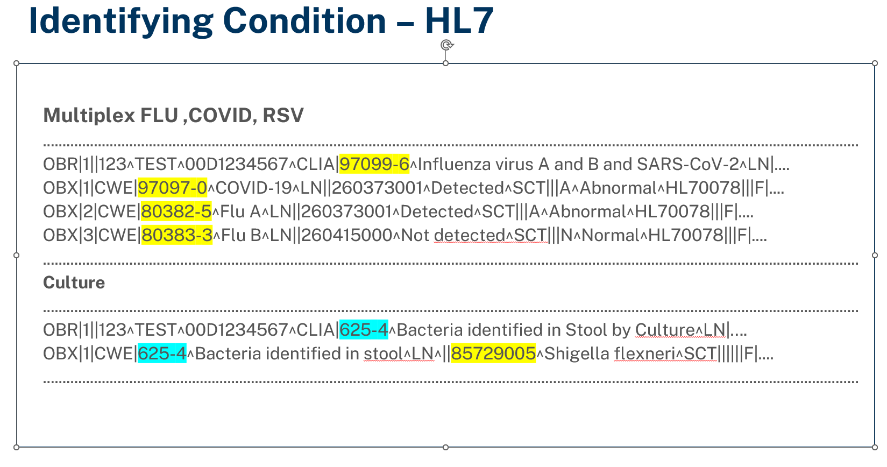
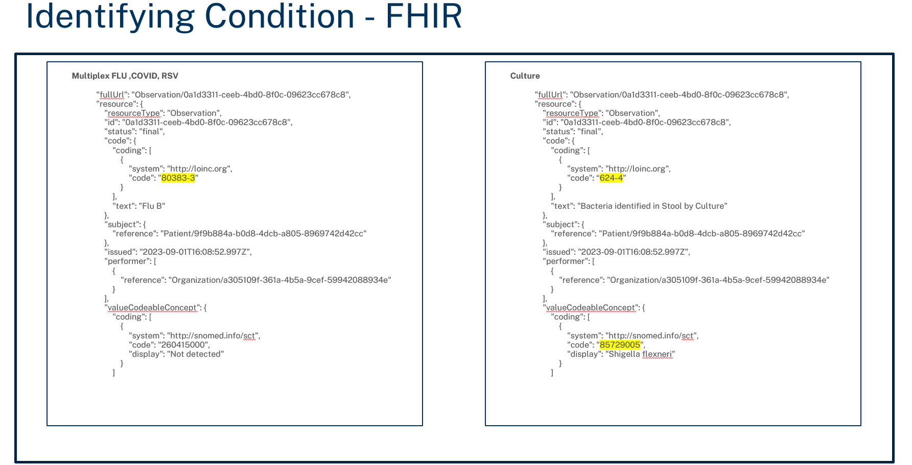

# Proposal for Code-to-Condition Mapping

## Background

Public Health reporting in the United States is not uniform in nature with each public health agency (PHA) setting their
own criteria for what conditions need to be reported to that jurisdiction. In the context of electronic lab reporting (ELR), the onus is typically on the reporting entity (lab, hospital, clinic etc.) to determine which result messages qualify for each PHA the entity reports to.

Since ReportStream takes on the burden of identifying the appropriate destination for sender’s messages, it will be necessary to implement a feature to ensure only messages for the appropriate conditions/diseases are allowed to route to each connected receiver. This feature will be similar to the COVID-19 LIVD table in that it will be a table of LOINC codes and their associated conditions that is used to reference received LOINC/SNOMED codes and return their associated condition.

## Assumptions
1.) The Council of State and Territorial Epidemiologist (CSTE) ValueSets that make up the Reportable Conditions Trigger Codes (RCTC) will be sufficient to capture a majority of codes sent to ReportStream. If this turns out to be false, we can modify the design to include additional data sources.

## Out of Scope
The below items are not covered in this proposal.

1.) Mechanism to automate which conditions each state considers reportable.

## Design

Overview Diagram


### Creating Observation Mapping Table

Criteria:

1.) Must be able to map LOINC and SNOMED codes from observations to a SNOMED code representing a reportable condition.<br>
2.) Table must have the ability to be updated without a PR <br>
3.) Mapping must account for all 160 conditions available in the CSTE [Report Content Knowledge Management System](https://www.rckms.org/conditions-available-in-rckms/) that relate to ELR.<br>
4.) Must be able to add ad-hoc mappings as needed for local codes/LDTs or other non-standard codes including LOINC codes for AOE questions

The observation mapping table will be used to map LOINC/SNOMED codes to their relevant reportable conditions in the UP. The initial table is made up of values that are contained in valuesets maintained by the Council of State and Territorial Epidemiologists (CSTE) on the National Library of Medicines' [Value Set Authority Center (VSAC)](https://vsac.nlm.nih.gov/). The valuesets are compiled and mapped to conditions by CSTE and published in the Reportable Conditions Trigger Codes (RCTC) documents used by the CSTE/AIMS product Reportable Condition Knowledge Management System (RCKMS) project.
The RCTC is available to be downloaded from AIMS at https://ersd.aimsplatform.org/#/home. A login is required (registration is free).

The Observation Mapping table will be made up of CSTE ValueSets and contain the following columns:

| Column Name                   | Description                                   | Example                                                                        |
|-------------------------------|-----------------------------------------------|--------------------------------------------------------------------------------|
| Member OID                    | ValueSet Identifier                           | 2.16.840.1.113762.1.4.1146.239                                                 |
| Name                          | ValueSet Name                                 | Chlamydia trachomatis Infection (Tests for Chlamydia trachomatis Nucleic Acid) |
| Code                          | LOINC or SNOMED coded value                   | 16601-7                                                                        |
| Descriptor                    | LOINC or SNOMED term descriptio               | Chlamydia trachomatis rRNA [Presence] in Urine by Probe                        |
| Code System                   | Indicates whether code is LOINC or SNOMED     | LOINC                                                                          |
| Version                       | LOINC or SNOMED release version               | 2.74                                                                           |
| Status                        | Indicates if code is active or deprecated     | Active                                                                         |
| Condition Name                | Name of associated reportable condition       | Chlamydia trachomatis infection (disorder)                                     |
| Condition Code                | SNOMED value associated with condition        | 240589008                                                                      | 
| Condition Code System         | System used for condition code                | SNOMEDCT                                                                       |
| Condition Code System Version | SNOMED version associated with condition code | 2023-03                                                                        |
| Value Source                  | Source of value (e.g. RCTC vs manual mapping) | RCTC                                                                           |   
| Created At                    | Date that table entry updated                 | 20231020                                                                       |

The column names are taken directly from the [RCTC spreadsheet](https://docs.google.com/spreadsheets/d/1rO_p145xXO1AD76vx8vBqXgoQUnLqfc8/edit#gid=739612351) with the exception of "Value Source" and "Created At" which are additional columns added for administrative purposes that will be used when updating the table. Both LOINC and SNOMED codes are combined in this table and can be identified by column "Code System".
The RCTC does a fairly good job of keeping up to date with LOINC and SNOMED codes and is regularly updated. It is anticipated that despite this there will be a requirement to map codes that are not present in the condition mapping table. These will have to be mapped manually after review by RS personnel in order to ensure that the proper condition code is mapped to the LOINC or SNOMED code. These codes can be submitted to CSTE valueset reviewers to be included in future releases. If a column is not applicable it can be left blank unless it is the "Code", "Code System", "Condition Name", "Condition Code"  "Value Source" columns.
It is possible that an observation may not contain information intended to convey the results of a diagnostic test but instead represent additional important information regarding the testing sample of patient. Information of this type is referred to as "Ask at Order Entry" (AOE) questions commonly referred to by the abbreviation AOE only. The specific information being asked is identified in the observation with a LOINC code in OBX-3 (HL7-V2) or Observation.Code.Coding.Code (FHIR). We need to be able to identify these observations as AOEs in the same manner as we would identify which reportable condition the observation represents so that they can be filtered out if requested by STLTs and also to eliminate them as being unmapped observations. The LOINC codes for the base table come from two lists on LOINC.org.
1.) [LOINC terms for SARS-CoV-2 AOE questions](https://loinc.org/sars-cov-2-and-covid-19/)<br>
2.) [Public health laboratory ask at order entry panel](https://loinc.org/81959-9)<br>

The Condition Code System for any mappings added ad-hoc (included the AOEs) should be labled as "ReportStream" since they do not come from any standardized ValueSet.

Example Table:

| Member OID                     | Name                                                                             | Code    | Descriptor                                              | Code System| Version  | Status | Condition Name                            | Condition Code | Condition Code System | Condition Code System Version | Value Source | Created At |    
|--------------------------------|----------------------------------------------------------------------------------|---------|---------------------------------------------------------|------------|----------|--------|-------------------------------------------|----------------|-----------------------|-------------------------------|--------------|------------|
| 2.16.840.1.113762.1.4.1146.239 | Chlamydia trachomatis Infection (Tests for Chlamydia trachomatis Nucleic Acid)   | 16601-7 | Chlamydia trachomatis rRNA [Presence] in Urine by Probe | LOINC      | 2.74     | Active | Chlamydia trachomatis infection (disorder)| 240589008      | SNOMEDCT              | 2023-03                       | RCTC         | 20231020   | 
|                                | SARS-CoV-2 AOE questions                                                         | 97155-6 | SARS coronavirus 2 (COVID-19) immunization status       | LOINC      | 2.70     | Active | Ask at order entry question               | AOE            | ReportStream          | 1.0                           | LOINC.org    | 20231020   |


Uploading the table to remote environments can utilize the lookuptables CLI command (./prime lookuptables create). Creating a new table with the same name will automatically create a new version of that table with that name and activate it if the -a parameter is used.

Example

```
./prime lookuptables create -i 'file-path-location' -s -a -n observation-mapping -e staging
```
options:
```
-e, --env <name>       Connect to <name> environment. Choose between [local|test|staging|prod]
-i, --input-file PATH  Input CSV file with the table data
-s, --silent           Do not generate diff or ask for confirmation
-a, --activate         Activate the table upon creation
-n, --name TEXT        The name of the table to perform the operation on
--show-table           Always show the table to be created
-f, --force            Force the creation of new table(s) even if it is already exist
-h, --help             Show this message and exit
```

### Sender Compendium Comparison Utility

In order to greatly reduce the number of unmapped errors that we will have to deal with. It is recommended that we build a utility where senders can submit their test compendiums during the onboarding process to allow engagement to pre-emptively map any missing codes. This will be a utility that takes in a csv file prepared by the sender and compares the codes against the observation mapping table. The utility should then return which codes are not found in the table so that the engagement team can map them prior to the sender moving to production.

Criteria:

1.) Utility must be able to be invoked via a CLI</br>
2.) Utility must be able to use a CSV file as input<br>
3.) Utility must be able to output a CSV file with an additional column indicating whether or not a row containing the same code and code system exists on both the input CSV file and the observation mapping table.


Example parameters: <br>
```
env - environment to run command against <br>

tableName - name of table to compare input to <br>

input -file location of input CSV <br>

output -location to output post comparison csv
```
Example CLI command:

./prime mapping-table-comparison -tableName observation-mapping -input <input-file-location> output <output-file-location> -env staging


Example input compendium CSV:
```csv
test code,test description,coding system
97099-6,Influenza virus A and B and SARS-CoV-2 (COVID-19) Ag panel - Upper respiratory specimen by Rapid immunoassay, LOINC
47457-7,Influenza virus A H8 Ab [Titer] in Serum, LOINC
123456, LDT Flu Test, ABC TESTING LABS
```
Example Observation Mapping Table:

| Member OID                     | Name                                                 | Code    | Descriptor                                                                          | Code System      | Version | Status | Condition Name                                                 | Condition Code  |
|--------------------------------|------------------------------------------------------|---------|-------------------------------------------------------------------------------------|------------------|---------|--------|----------------------------------------------------------------|-----------------|
| 2.16.840.1.113762.1.4.1146.798 | Influenza (Tests for influenza A virus Nucleic Acid) | 80382-5 | Influenza virus A Ag [Presence] in Upper respiratory specimen by Rapid immunoassay  | LOINC            | 2.74    | Active | Infection caused by novel Influenza A virus variant (disorder) | 541000000000000 |
| 2.16.840.1.113762.1.4.1146.799 | Influenza (Tests for influenza A virus Antigen)      | 80382-5 | Influenza virus A Ag [Presence] in Upper respiratory specimen by Rapid immunoassay  | LOINC            | 2.74    | Active | Influenza (disorder)                                           | 6142004         |
| ABC TESTING LABS               | Influenza - (ABC TESTING LABS)                       | 123456  | Influenza virus A                                                                   | ABC TESTING LABS |         | Active | Infection caused by novel Influenza A virus variant (disorder) | 541000000000000 |

Example output CSV:

```csv
test code,test description,coding system, mapped?
97099-6,Influenza virus A and B and SARS-CoV-2 (COVID-19) Ag panel - Upper respiratory specimen by Rapid immunoassay, LOINC., Y
47457-7,Influenza virus A H8 Ab [Titer] in Serum, LOINC, Y
123456, LDT Flu Test, ACME LABS, N
```

### Manually Updating Observation Tables
There may occur situations where we have to update the table manually such as when adding ad-hoc values that do not belong to a published value set. This can be accomplished with the same lookuptables CLI command used to create the tables above. (./prime lookuptables get). This will allow Engagement to extract the current table and add values as needed.

Example:

```
./prime lookuptables get -o 'file-path-location' -n observation-mapping -v 2 -e staging
```
options:
```
-e, --env <name>        Connect to <name> environment. Choose between [local|test|staging|prod]
-o, --output-file PATH  Output CSV file with the table data to specified file location
-n, --name TEXT         The name of the table to perform the operation on
-v, --version           The version of the table to get
-h, --help              Show this message and exit
```

The output CSV file can then have the necessary values added and the new table uploaded following the steps from Creating Observation Mapping Table section above. 

### Mapping LOINC/SNOMED codes and Member OID in received message/bundle to condition code

Criteria

1.) Mapping solution must work whether the input data is an HL7 V2 message or a FHIR bundle. <br>
2.) Must be able to compare LOINC or SNOMED codes from both OBX-3-1/Observation.code.coding.code (LOINC) and OBX-5-1/Observation.ValueCodeableConcept.coding.code (SNOMED) as values in "code" column of the Observation Mapping table stored as JSON in the "data" column of the  "lookup_table_row" table in the Database.  and return value(s) from "condition code" column.<br>
3.) Values from "Condition Code" and "Member OID" columns must be appended to FHIR bundle as an element that can be used in FHIRpath condition filter logic. <br>
4.) Must be able to return multiple values from observation-mapping table if LOINC/SNOMED code maps to multiple condition codes <br>
5.) If there are multiple condition codes or member OIDs returned from the table each must be able to be independently evaluated by the condition filter. <br>
6.) If no condition code or member OID is returned from the observation mapping table, no element should be added to the observation resource and an entry should be added to the action log indicating no match was found with the code(s) that were unable to find a match.


Information regarding which reportable condition(s) an HL7 V2 message or FHIR Diagnostic Report is representing is not stored in a single element but instead can be extrapolated from either a LOINC code identifying what test was performed (OBX-3 HL7 V2 or Observation.Code.Coding.Code) or in the case of microbacterial cultures a SNOMED code identifying what organism was found (OBX-5 HL7 V2 or Observation.ValueCodeableConcept.Coding.Code).


Reportable condition information is needed to determine whether a particular diagnostic report will qualify to route to a particular receiver. This can be accomplished using the condition filter if condition information is stored in a defined element in a FHIR resource that can be accessed via a FHIRPath expression. The FHIR US Core Implementation guide does not currently define an element on the observation resource that stores reportable condition information so ReportStream will have to create our own extension for the Observation resource that can store the coded value from the Observation-Mapping table representing the condition information. The extension will need to repeat for every matching value found in the table for the LOINC/SNOMED code in the observation resource. The extension needs to contain a URL, a coding element and a code.

Example Input Observation Resource:
```json
{
    "resourceType": "Observation",
    "id": "fedec87f-2b1b-4e89-8255-518476ca2996",
    "status": "final",
    "code": {
        "coding": [
            {
                "system": "http://loinc.org",
                "code": "85477-8"
            }
        ],
        "text": "Flu A"
    },
    "subject": {
        "reference": "Patient/05615a49-80ab-4b24-b6c6-a0906e832aa5"
    },
    "issued": "2025-04-03T19:02:04.101Z",
    "performer": [
        {
            "reference": "Organization/719ec8ad-cf59-405a-9832-c4065945c130"
        }
    ],
    "valueCodeableConcept": {
        "coding": [
            {
                "system": "http://snomed.info/sct",
                "code": "260373001",
                "display": "Detected"
            }
        ]
    },
    "interpretation": [
        {
            "coding": [
                {
                    "system": "http://terminology.hl7.org/CodeSystem/v2-0078",
                    "code": "A",
                    "display": "Abnormal"
                }
            ]
        }
    ],
    "method": {
        "coding": [
            {
                "display": "SC2 Flu Real Time PCR Detection Kit"
            }
        ]
    },
    "specimen": {
        "reference": "Specimen/dc7af370-fc07-4b00-abc7-9b5dd87cf4d2"
    },
    "device": {
        "reference": "Device/5e307b25-eda1-43c2-af59-453b5a49f7cb"
    }
}
```
Example Output Resource with single condition code:
```json
{
    "resourceType": "Observation",
    "id": "fedec87f-2b1b-4e89-8255-518476ca2996",
    "extension": [
        {
            "url": "https://reportstream.cdc.gov/fhir/StructureDefinition/obx-observation",
            "extension": [
                {
                    "url": "OBX.2",
                    "valueString": "CWE"
                },
                {
                    "url": "OBX.11",
                    "valueString": "F"
                },
                {
                    "url": "OBX.17",
                    "valueCodeableConcept": {
                        "coding": [
                            {
                                "display": "SC2 Flu Real Time PCR Detection Kit"
                            }
                        ]
                    }
                }
            ]
        },
        {
            "url": "https://reportstream.cdc.gov/fhir/StructureDefinition/analysis-date-time",
            "valueInstant": "2025-04-03T19:02:04.101Z",
            "_valueInstant": {
                "extension": [
                    {
                        "url": "https://reportstream.cdc.gov/fhir/StructureDefinition/hl7v2-date-time",
                        "valueInstant": "2025-04-03T19:02:04.101Z"
                    }
                ]
            }
        }
    ],
    "status": "final",
    "code": {
        "coding": [
            {
                "extension": [
                    {
                        "url": "https://reportstream.cdc.gov/fhir/StructureDefinition/condition-code",
                        "valueCoding": {
                            "extension": [
                                {
                                    "url": "https://reportstream.cdc.gov/fhir/StructureDefinition/test-performed-member-oid",
                                    "valueString": "2.16.840.1.113762.1.4.1146.798"
                                }
                            ],
                            "system": "SNOMEDCT",
                            "code": "541131000124102",
                            "display": "Infection caused by novel Influenza A virus variant (disorder)"
                        }
                    },
                    {
                        "url": "https://reportstream.cdc.gov/fhir/StructureDefinition/condition-code",
                        "valueCoding": {
                            "extension": [
                                {
                                    "url": "https://reportstream.cdc.gov/fhir/StructureDefinition/test-performed-member-oid",
                                    "valueString": "2.16.840.1.113762.1.4.1146.798"
                                }
                            ],
                            "system": "SNOMEDCT",
                            "code": "541131000124102",
                            "display": "Infection caused by novel Influenza A virus variant (disorder)"
                        }
                    },
                    {
                        "url": "https://reportstream.cdc.gov/fhir/StructureDefinition/condition-code",
                        "valueCoding": {
                            "extension": [
                                {
                                    "url": "https://reportstream.cdc.gov/fhir/StructureDefinition/test-performed-member-oid",
                                    "valueString": "2.16.840.1.113762.1.4.1146.1565"
                                }
                            ],
                            "system": "SNOMEDCT",
                            "code": "7180009",
                            "display": "Meningitis (disorder)"
                        }
                    },
                    {
                        "url": "https://reportstream.cdc.gov/fhir/StructureDefinition/cwe-coding",
                        "valueString": "coding"
                    },
                    {
                        "url": "https://reportstream.cdc.gov/fhir/StructureDefinition/cwe-coding-system",
                        "valueString": "LN"
                    }
                ],
                "system": "http://loinc.org",
                "code": "85477-8",
                "display": "Influenza virus A RNA [Presence] in Upper respiratory specimen by NAA with probe detection"
            }
        ],
        "text": "Flu A"
    },
    "subject": {
        "reference": "Patient/05615a49-80ab-4b24-b6c6-a0906e832aa5"
    },
    "effectiveDateTime": "2025-04-03T18:47:04+00:00",
    "_effectiveDateTime": {
        "extension": [
            {
                "url": "https://reportstream.cdc.gov/fhir/StructureDefinition/hl7v2-date-time",
                "valueDateTime": "2025-04-03T18:47:04+00:00"
            }
        ]
    },
    "issued": "2025-04-03T19:02:04.101Z",
    "performer": [
        {
            "reference": "Organization/719ec8ad-cf59-405a-9832-c4065945c130"
        }
    ],
    "valueCodeableConcept": {
        "coding": [
            {
                "extension": [
                    {
                        "url": "https://reportstream.cdc.gov/fhir/StructureDefinition/cwe-coding",
                        "valueString": "coding"
                    },
                    {
                        "url": "https://reportstream.cdc.gov/fhir/StructureDefinition/cwe-coding-system",
                        "valueString": "SCT"
                    }
                ],
                "system": "http://snomed.info/sct",
                "code": "260373001",
                "display": "Detected"
            }
        ]
    },
    "interpretation": [
        {
            "coding": [
                {
                    "extension": [
                        {
                            "url": "https://reportstream.cdc.gov/fhir/StructureDefinition/cwe-coding",
                            "valueString": "coding"
                        },
                        {
                            "url": "https://reportstream.cdc.gov/fhir/StructureDefinition/cwe-coding-system",
                            "valueString": "HL70078"
                        }
                    ],
                    "system": "http://terminology.hl7.org/CodeSystem/v2-0078",
                    "version": "2.7",
                    "code": "A",
                    "display": "Abnormal"
                }
            ]
        }
    ],
    "method": {
        "coding": [
            {
                "extension": [
                    {
                        "url": "https://reportstream.cdc.gov/fhir/StructureDefinition/cwe-coding",
                        "valueString": "coding"
                    }
                ],
                "display": "SC2 Flu Real Time PCR Detection Kit"
            }
        ]
    },
    "specimen": {
        "reference": "Specimen/dc7af370-fc07-4b00-abc7-9b5dd87cf4d2"
    },
    "device": {
        "reference": "Device/5e307b25-eda1-43c2-af59-453b5a49f7cb"
    }
}
```
Example Output Resource with multiple condition codes (i.e Flu A, COVID-19, Flu B):
```json
{
    "resourceType": "Observation",
    "id": "4d7df7f5-e307-46d0-b5d5-db797bfdd233",
    "extension": [
        {
            "url": "https://reportstream.cdc.gov/fhir/StructureDefinition/obx-observation",
            "extension": [
                {
                    "url": "OBX.2",
                    "valueString": "CWE"
                },
                {
                    "url": "OBX.11",
                    "valueString": "F"
                },
                {
                    "url": "OBX.17",
                    "valueCodeableConcept": {
                        "coding": [
                            {
                                "display": "BD Veritor System for Rapid Detection of SARS-CoV-2 & Flu A+B"
                            }
                        ]
                    }
                }
            ]
        },
        {
            "url": "https://reportstream.cdc.gov/fhir/StructureDefinition/analysis-date-time",
            "valueInstant": "2025-04-08T09:12:49.779Z",
            "_valueInstant": {
                "extension": [
                    {
                        "url": "https://reportstream.cdc.gov/fhir/StructureDefinition/hl7v2-date-time",
                        "valueDateTime": "2025-04-08T05:12:49.779-04:00"
                    }
                ]
            }
        }
    ],
    "status": "final",
    "code": {
        "coding": [
            {
                "extension": [
                    {
                        "url": "https://reportstream.cdc.gov/fhir/StructureDefinition/condition-code",
                        "valueCoding": {
                            "extension": [
                                {
                                    "url": "https://reportstream.cdc.gov/fhir/StructureDefinition/test-performed-member-oid",
                                    "valueString": "2.16.840.1.113762.1.4.1146.337"
                                }
                            ],
                            "system": "SNOMEDCT",
                            "code": "6142004",
                            "display": "Influenza (disorder)"
                        }
                    },
                    {
                        "url": "https://reportstream.cdc.gov/fhir/StructureDefinition/cwe-coding",
                        "valueString": "coding"
                    },
                    {
                        "url": "https://reportstream.cdc.gov/fhir/StructureDefinition/cwe-coding-system",
                        "valueString": "LN"
                    }
                ],
                "system": "http://loinc.org",
                "code": "80383-3",
                "display": "Influenza virus B Ag [Presence] in Upper respiratory specimen by Rapid immunoassay"
            }
        ],
        "text": "Flu B"
    },
    "subject": {
        "reference": "Patient/31382731-88cc-4ad6-8295-749b640576db"
    },
    "effectiveDateTime": "2025-04-08T08:57:49+00:00",
    "_effectiveDateTime": {
        "extension": [
            {
                "url": "https://reportstream.cdc.gov/fhir/StructureDefinition/hl7v2-date-time",
                "valueDateTime": "2025-04-08T04:57:49-04:00"
            }
        ]
    },
    "issued": "2025-04-08T09:12:49.779Z",
    "performer": [
        {
            "reference": "Organization/719ec8ad-cf59-405a-9832-c4065945c130"
        }
    ],
    "valueCodeableConcept": {
        "coding": [
            {
                "extension": [
                    {
                        "url": "https://reportstream.cdc.gov/fhir/StructureDefinition/cwe-coding",
                        "valueString": "coding"
                    },
                    {
                        "url": "https://reportstream.cdc.gov/fhir/StructureDefinition/cwe-coding-system",
                        "valueString": "SCT"
                    }
                ],
                "system": "http://snomed.info/sct",
                "code": "260373001",
                "display": "Detected"
            }
        ]
    },
    "interpretation": [
        {
            "coding": [
                {
                    "extension": [
                        {
                            "url": "https://reportstream.cdc.gov/fhir/StructureDefinition/cwe-coding",
                            "valueString": "coding"
                        },
                        {
                            "url": "https://reportstream.cdc.gov/fhir/StructureDefinition/cwe-coding-system",
                            "valueString": "HL70078"
                        }
                    ],
                    "system": "http://terminology.hl7.org/CodeSystem/v2-0078",
                    "version": "2.7",
                    "code": "A",
                    "display": "Abnormal"
                }
            ]
        }
    ],
    "method": {
        "extension": [
            {
                "url": "https://reportstream.cdc.gov/fhir/StructureDefinition/testkit-name-id",
                "valueCoding": {
                    "code": "BD Veritor System for Rapid Detection of SARS-CoV-2 & Flu A+B_Becton, Dickinson and Company (BD)"
                }
            }
        ],
        "coding": [
            {
                "extension": [
                    {
                        "url": "https://reportstream.cdc.gov/fhir/StructureDefinition/cwe-coding",
                        "valueString": "coding"
                    }
                ],
                "code": "BD Veritor System for Rapid Detection of SARS-CoV-2 & Flu A+B_Becton, Dickinson and Company (BD)",
                "display": "BD Veritor System for Rapid Detection of SARS-CoV-2 & Flu A+B"
            }
        ],
        "text": "BD Veritor System for Rapid Detection of SARS-CoV-2 & Flu A+B_Becton, Dickinson and Company (BD)"
    },
    "specimen": {
        "reference": "Specimen/dc7af370-fc07-4b00-abc7-9b5dd87cf4d2"
    },
    "device": {
        "reference": "Device/157d550a-a12a-4367-b80e-53d75ca29053"
    }
}
```
```json
{
    "resourceType": "Observation",
    "id": "ef58d851-5963-414b-89d1-8c41ccd6c622",
    "extension": [
        {
            "url": "https://reportstream.cdc.gov/fhir/StructureDefinition/obx-observation",
            "extension": [
                {
                    "url": "OBX.2",
                    "valueString": "CWE"
                },
                {
                    "url": "OBX.11",
                    "valueString": "F"
                },
                {
                    "url": "OBX.17",
                    "valueCodeableConcept": {
                        "coding": [
                            {
                                "display": "BD Veritor System for Rapid Detection of SARS-CoV-2 & Flu A+B"
                            }
                        ]
                    }
                }
            ]
        },
        {
            "url": "https://reportstream.cdc.gov/fhir/StructureDefinition/analysis-date-time",
            "valueInstant": "2025-04-08T09:12:49.779Z",
            "_valueInstant": {
                "extension": [
                    {
                        "url": "https://reportstream.cdc.gov/fhir/StructureDefinition/hl7v2-date-time",
                        "valueDateTime": "2025-04-08T05:12:49.779-04:00"
                    }
                ]
            }
        }
    ],
    "status": "final",
    "code": {
        "coding": [
            {
                "extension": [
                    {
                        "url": "https://reportstream.cdc.gov/fhir/StructureDefinition/condition-code",
                        "valueCoding": {
                            "extension": [
                                {
                                    "url": "https://reportstream.cdc.gov/fhir/StructureDefinition/test-performed-member-oid",
                                    "valueString": "2.16.840.1.113762.1.4.1146.1158"
                                }
                            ],
                            "system": "SNOMEDCT",
                            "code": "840539006",
                            "display": "Disease caused by severe acute respiratory syndrome coronavirus 2 (disorder)"
                        }
                    },
                    {
                        "url": "https://reportstream.cdc.gov/fhir/StructureDefinition/cwe-coding",
                        "valueString": "coding"
                    },
                    {
                        "url": "https://reportstream.cdc.gov/fhir/StructureDefinition/cwe-coding-system",
                        "valueString": "LN"
                    }
                ],
                "system": "http://loinc.org",
                "code": "97097-0",
                "display": "SARS-CoV-2 (COVID-19) Ag [Presence] in Upper respiratory specimen by Rapid immunoassay"
            }
        ],
        "text": "COVID-19"
    },
    "subject": {
        "reference": "Patient/31382731-88cc-4ad6-8295-749b640576db"
    },
    "effectiveDateTime": "2025-04-08T08:57:49+00:00",
    "_effectiveDateTime": {
        "extension": [
            {
                "url": "https://reportstream.cdc.gov/fhir/StructureDefinition/hl7v2-date-time",
                "valueDateTime": "2025-04-08T04:57:49-04:00"
            }
        ]
    },
    "issued": "2025-04-08T09:12:49.779Z",
    "performer": [
        {
            "reference": "Organization/719ec8ad-cf59-405a-9832-c4065945c130"
        }
    ],
    "valueCodeableConcept": {
        "coding": [
            {
                "extension": [
                    {
                        "url": "https://reportstream.cdc.gov/fhir/StructureDefinition/cwe-coding",
                        "valueString": "coding"
                    },
                    {
                        "url": "https://reportstream.cdc.gov/fhir/StructureDefinition/cwe-coding-system",
                        "valueString": "SCT"
                    }
                ],
                "system": "http://snomed.info/sct",
                "code": "260373001",
                "display": "Detected"
            }
        ]
    },
    "interpretation": [
        {
            "coding": [
                {
                    "extension": [
                        {
                            "url": "https://reportstream.cdc.gov/fhir/StructureDefinition/cwe-coding",
                            "valueString": "coding"
                        },
                        {
                            "url": "https://reportstream.cdc.gov/fhir/StructureDefinition/cwe-coding-system",
                            "valueString": "HL70078"
                        }
                    ],
                    "system": "http://terminology.hl7.org/CodeSystem/v2-0078",
                    "version": "2.7",
                    "code": "A",
                    "display": "Abnormal"
                }
            ]
        }
    ],
    "method": {
        "extension": [
            {
                "url": "https://reportstream.cdc.gov/fhir/StructureDefinition/testkit-name-id",
                "valueCoding": {
                    "code": "BD Veritor System for Rapid Detection of SARS-CoV-2 & Flu A+B_Becton, Dickinson and Company (BD)"
                }
            }
        ],
        "coding": [
            {
                "extension": [
                    {
                        "url": "https://reportstream.cdc.gov/fhir/StructureDefinition/cwe-coding",
                        "valueString": "coding"
                    }
                ],
                "code": "BD Veritor System for Rapid Detection of SARS-CoV-2 & Flu A+B_Becton, Dickinson and Company (BD)",
                "display": "BD Veritor System for Rapid Detection of SARS-CoV-2 & Flu A+B"
            }
        ],
        "text": "BD Veritor System for Rapid Detection of SARS-CoV-2 & Flu A+B_Becton, Dickinson and Company (BD)"
    },
    "specimen": {
        "reference": "Specimen/dc7af370-fc07-4b00-abc7-9b5dd87cf4d2"
    },
    "device": {
        "reference": "Device/157d550a-a12a-4367-b80e-53d75ca29053"
    }
}
```
```json
{
  "resourceType": "Observation",
  "id": "08326bc3-b108-4303-9871-aaf7b7b95ee0",
  "extension": [
    {
      "url": "https://reportstream.cdc.gov/fhir/StructureDefinition/obx-observation",
      "extension": [
        {
          "url": "OBX.2",
          "valueString": "CWE"
        },
        {
          "url": "OBX.11",
          "valueString": "F"
        },
        {
          "url": "OBX.17",
          "valueCodeableConcept": {
            "coding": [
              {
                "display": "BD Veritor System for Rapid Detection of SARS-CoV-2 & Flu A+B"
              }
            ]
          }
        }
      ]
    },
    {
      "url": "https://reportstream.cdc.gov/fhir/StructureDefinition/analysis-date-time",
      "valueInstant": "2025-04-08T09:12:49.779Z",
      "_valueInstant": {
        "extension": [
          {
            "url": "https://reportstream.cdc.gov/fhir/StructureDefinition/hl7v2-date-time",
            "valueDateTime": "2025-04-08T05:12:49.779-04:00"
          }
        ]
      }
    }
  ],
  "status": "final",
  "code": {
    "coding": [
      {
        "extension": [
          {
            "url": "https://reportstream.cdc.gov/fhir/StructureDefinition/condition-code",
            "valueCoding": {
              "extension": [
                {
                  "url": "https://reportstream.cdc.gov/fhir/StructureDefinition/test-performed-member-oid",
                  "valueString": "2.16.840.1.113762.1.4.1146.337"
                }
              ],
              "system": "SNOMEDCT",
              "code": "6142004",
              "display": "Influenza (disorder)"
            }
          },
          {
            "url": "https://reportstream.cdc.gov/fhir/StructureDefinition/condition-code",
            "valueCoding": {
              "extension": [
                {
                  "url": "https://reportstream.cdc.gov/fhir/StructureDefinition/test-performed-member-oid",
                  "valueString": "2.16.840.1.113762.1.4.1146.799"
                }
              ],
              "system": "SNOMEDCT",
              "code": "541131000124102",
              "display": "Infection caused by novel Influenza A virus variant (disorder)"
            }
          },
          {
            "url": "https://reportstream.cdc.gov/fhir/StructureDefinition/cwe-coding",
            "valueString": "coding"
          },
          {
            "url": "https://reportstream.cdc.gov/fhir/StructureDefinition/cwe-coding-system",
            "valueString": "LN"
          }
        ],
        "system": "http://loinc.org",
        "code": "80382-5",
        "display": "Influenza virus A Ag [Presence] in Upper respiratory specimen by Rapid immunoassay"
      }
    ],
    "text": "Flu A"
  },
  "subject": {
    "reference": "Patient/31382731-88cc-4ad6-8295-749b640576db"
  },
  "effectiveDateTime": "2025-04-08T08:57:49+00:00",
  "_effectiveDateTime": {
    "extension": [
      {
        "url": "https://reportstream.cdc.gov/fhir/StructureDefinition/hl7v2-date-time",
        "valueDateTime": "2025-04-08T04:57:49-04:00"
      }
    ]
  },
  "issued": "2025-04-08T09:12:49.779Z",
  "performer": [
    {
      "reference": "Organization/719ec8ad-cf59-405a-9832-c4065945c130"
    }
  ],
  "valueCodeableConcept": {
    "coding": [
      {
        "extension": [
          {
            "url": "https://reportstream.cdc.gov/fhir/StructureDefinition/cwe-coding",
            "valueString": "coding"
          },
          {
            "url": "https://reportstream.cdc.gov/fhir/StructureDefinition/cwe-coding-system",
            "valueString": "SCT"
          }
        ],
        "system": "http://snomed.info/sct",
        "code": "260373001",
        "display": "Detected"
      }
    ]
  },
  "interpretation": [
    {
      "coding": [
        {
          "extension": [
            {
              "url": "https://reportstream.cdc.gov/fhir/StructureDefinition/cwe-coding",
              "valueString": "coding"
            },
            {
              "url": "https://reportstream.cdc.gov/fhir/StructureDefinition/cwe-coding-system",
              "valueString": "HL70078"
            }
          ],
          "system": "http://terminology.hl7.org/CodeSystem/v2-0078",
          "version": "2.7",
          "code": "A",
          "display": "Abnormal"
        }
      ]
    }
  ],
  "method": {
    "extension": [
      {
        "url": "https://reportstream.cdc.gov/fhir/StructureDefinition/testkit-name-id",
        "valueCoding": {
          "code": "BD Veritor System for Rapid Detection of SARS-CoV-2 & Flu A+B_Becton, Dickinson and Company (BD)"
        }
      }
    ],
    "coding": [
      {
        "extension": [
          {
            "url": "https://reportstream.cdc.gov/fhir/StructureDefinition/cwe-coding",
            "valueString": "coding"
          }
        ],
        "code": "BD Veritor System for Rapid Detection of SARS-CoV-2 & Flu A+B_Becton, Dickinson and Company (BD)",
        "display": "BD Veritor System for Rapid Detection of SARS-CoV-2 & Flu A+B"
      }
    ],
    "text": "BD Veritor System for Rapid Detection of SARS-CoV-2 & Flu A+B_Becton, Dickinson and Company (BD)"
  },
  "specimen": {
    "reference": "Specimen/dc7af370-fc07-4b00-abc7-9b5dd87cf4d2"
  },
  "device": {
    "reference": "Device/157d550a-a12a-4367-b80e-53d75ca29053"
  }
}
```
Example Output Resource with no match found in observation mapping table:
```json
{
    "fullUrl": "Observation/d683b42a-bf50-45e8-9fce-6c0531994f09",
    "resource": {
        "resourceType": "Observation",
        "id": "d683b42a-bf50-45e8-9fce-6c0531994f09",
        "status": "final",
        "code": {
            "coding": [
                {
                    "system": "http://loinc.org",
                    "code": "80382-5"
                }
            ],
            "text": "Flu A"
        },
        "subject": {
            "reference": "Patient/9473889b-b2b9-45ac-a8d8-191f27132912"
        },
        "performer": [
            {
                "reference": "Organization/1a0139b9-fc23-450b-9b6c-cd081e5cea9d"
            }
        ],
        "valueCodeableConcept": {
            "coding": [
                {
                    "system": "http://snomed.info/sct",
                    "code": "260373001",
                    "display": "Detected"
                }
            ]
        },
        "interpretation": [
            {
                "coding": [
                    {
                        "system": "http://terminology.hl7.org/CodeSystem/v2-0078",
                        "code": "A",
                        "display": "Abnormal"
                    }
                ]
            }
        ],
        "method": {
            "extension": [
                {
                    "url": "https://reportstream.cdc.gov/fhir/StructureDefinition/testkit-name-id",
                    "valueCoding": {
                        "code": "BD Veritor System for Rapid Detection of SARS-CoV-2 & Flu A+B_Becton, Dickinson and Company (BD)"
                    }
                },
                {
                    "url": "https://reportstream.cdc.gov/fhir/StructureDefinition/equipment-uid",
                    "valueCoding": {
                        "code": "BD Veritor System for Rapid Detection of SARS-CoV-2 & Flu A+B_Becton, Dickinson and Company (BD)"
                    }
                }
            ],
            "coding": [
                {
                    "display": "BD Veritor System for Rapid Detection of SARS-CoV-2 & Flu A+B*"
                }
            ]
        },
        "specimen": {
            "reference": "Specimen/52a582e4-d389-42d0-b738-bee51cf5244d"
        },
        "device": {
            "reference": "Device/78dc4d98-2958-43a3-a445-76ceef8c0698"
        }
    }
}
```
The condition and member OID information will need to be appended to the FHIR bundle prior to the Universal Pipeline's Route step as the condition or member OID information will be used to determine whether a particular diagnostic report will qualify to route to a particular receiver. In the universal pipeline we currently utilize functions called FHIR Bundle Helpers to modify existing FHIR bundles. In order to map the incoming LOINC/SNOMED code to condition or member OID during the convert step we will need to add a new FHIRBundleHelper function. This function needs to add the condition and member OID code values found in the observation-mapping table to a condition code extension on the internal standardized FHIR bundle created from a translated and transformed HL7 v2 message or a transformed FHIR message received from a sender.


New FHIR Bundle Helper function logic requirements:

The new FHIR bundle helper function needs to follow certain logic requirements in order to find correct condition and member OID codes mappings and avoid unnecessary false action log entries for missing mappings. As mentioned above, the values used to map to reportable condition information can be represented in multiple possible places in the observation resource. These values need to be compared against rows in the observation-mapping table using the "code" column and the value(s) from the "condition code" or "member OID" column of that table returned. The first and most likely place that will return a match is the value in Observation.code.coding.code. The value in this location will either be a LOINC or local code representing a performed test or a LOINC or local code representing a specific Ask-at-Order-Entry Question. If a match is not found from this value, it is possible the condition is represented by a SNOMED code in Observation.ValueCodeableConcept.Coding.Code. If a match is still not found we need to log an event in the action log that identifies the fhir bundle and which values a match was not found for.


### Action Log Event
Criteria: <br>
1.) Must be a unique action log type/level to easily differentiate mapping errors from other errors in the log. <br>
2.) Action Log detail must contain values from both observation.code.coding.code and observation.valueCodeableConcept.coding.code <br>
3.) Action Log event must include the tracking id to allow individual messages/bundles to be tracked. <br>

We want to log an event in the action log when we are unable to find a match for values in both Observation.code.coding.code and Observation.valueCodeableConcept.Coding.code so that queries can be run against the action log to get all unmapped codes. The action log has multiple different levels which are used in the "type" column of the action log table to differentiate between the type and severity of events logged. In order to easily identify mapping errors the event logged when mappings are not found should have its own type of "mapping".   

Example:
```kotlin
enum class ActionLogLevel {
    info,
    warning,
    error,
    filter,
    mapping
}
```

The event logged should contain the report id, the tracking id, a type of "mapping", a scope of "item" and in message should list the values from observation.code.coding.code and observation.valueCodeableConcept.coding.code which did not find a match in the observation table.

Example:

For the below resource:

```json
 {
  "fullUrl": "Observation/d683b42a-bf50-45e8-9fce-6c0531994f09",
  "resource": {
    "resourceType": "Observation",
    "id": "d683b42a-bf50-45e8-9fce-6c0531994f09",
    "status": "final",
    "code": {
      "coding": [
        {
          "system": "http://loinc.org",
          "code": "80382-5"
        }
      ],
      "text": "Flu A"
    },
    "subject": {
      "reference": "Patient/9473889b-b2b9-45ac-a8d8-191f27132912"
    },
    "performer": [
      {
        "reference": "Organization/1a0139b9-fc23-450b-9b6c-cd081e5cea9d"
      }
    ],
    "valueCodeableConcept": {
      "coding": [
        {
          "system": "http://snomed.info/sct",
          "code": "260373001",
          "display": "Detected"
        }
      ]
    }
  }
}
```

In the example table below we can see that there is no match found for observation.code.coding.code of "80382-5" and observation.valueCodeableConcept.coding.code of "260373001"

Example Observation Mapping Table:

| Member OID                     | Name                                                 | Code    | Descriptor                                                                          | Code System | Version | Status | Condition Name                                                 | Condition Code   | Condition Code System | Condition Code System Version | Value Source |
|--------------------------------|------------------------------------------------------|---------|-------------------------------------------------------------------------------------|-------------|---------|--------|----------------------------------------------------------------|------------------|-----------------------|-------------------------------|--------------|
| 2.16.840.1.113762.1.4.1146.798 | Influenza (Tests for influenza A virus Nucleic Acid) | 80588-7 | Influenza virus A M gene [Presence] in Nasopharynx by NAA with probe detection      | LOINC       | 2.74    | Active | Infection caused by novel Influenza A virus variant (disorder) | 541000000000000  | SNOMEDCT              | 2023-03                       | RCTC         |
| 2.16.840.1.113762.1.4.1146.799 | Influenza (Tests for influenza A virus Antigen)      | 88904-8 | Influenza virus A Ag [Presence] in Lower respiratory specimen by Immunofluorescence | LOINC       | 2.74    | Active | Infection caused by novel Influenza A virus variant (disorder) | 541000000000000  | SNOMEDCT              | 2023-03                       | RCTC         |
|                                | Influenza - (ABC TESTING LABS)                       | 123456  | Influenza virus A                                                                   | LOCAL       |         | Active | Infection caused by novel Influenza A virus variant (disorder) | 541000000000000  | SNOMEDCT              | 2023-03                       | LOCAL        |   

Example Action Log Detail:

```json
 {
    "class": "gov.cdc.prime.router.ReportStreamMapping",
    "scope": "item",
    "message": "Missing mapping for "observation.code.coding.code": "80382-5" and" observation.valueCodeableConcept.coding.code: "260373001",
    "filteredTrackingElement": "<tracking id>"
}
```
With this approach we will be logging both the value of observation.code.coding.code and observation.valueCodeableConcept.coding.code for every time a mapping is not found. This is necessary as the value representing a reportable condition could always be in either location.

### Filtering for condition
Criteria: <br>
1.) Must be able to filter out observations that represent reportable conditions or information that is unwanted by STLTs. <br>
2.) Must be able to be expressed with fhirpath in condition filter. <br>

We only want to send observations to STLTs that match reportable conditions for their jurisdiction. These reportable conditions are usually published on the jurisdiction's website and can be represented with condition codes or member OID values found in the observation-mapping table. These condition codes and member OID values will exist on the fhir bundles in the new condition code extension created as part of this work. These condition codes will get added to the bundles prior by the new fhir bundle helper function created as part of this work.
In order to eliminate unwanted observations we can utilize fhirpath in the condition filter to list out which condition codes or member OID values present in the new condition code extension should qualify to send to the jurisdiction.

Example condition logic of filtering using condition codes:
```yaml
    - name: TEST-RECEIVER
      externalName: TEST
      organizationName: TEST
      topic: full-elr
      customerStatus: active
      jurisdictionalFilter:
        - "(Bundle.entry.resource.ofType(ServiceRequest)[0].requester.resolve().organization.resolve().address.state.exists() and Bundle.entry.resource.ofType(ServiceRequest)[0].requester.resolve().organization.resolve().address.state = 'TEST') or (Bundle.entry.resource.ofType(Patient).address.state.exists() and Bundle.entry.resource.ofType(Patient).address.state = 'TEST')"
      qualityFilter: []
      conditionFilter:
          - "%resource.where(newRSextension.coding.code in (398102009' |'13906002' |'409498004' |'40610006' |'21061004' |'75702008' |'359761005' |'414015000' |'840539006' |'416925005' |'83436008')).exists()"
      timing:
        operation: MERGE
        numberPerDay: 1440 # Every minute
        initialTime: 00:00
```
Some STLTs only want to receive test results as specific test type such as Antigen, Culture, Nucleic acid, and/or Genomic substance.  Or, they want to exclude specific test type such as Antigen.  We can manually search the observation-mapping table to filter out the unwanted test type.  In this case, we can't use the condition code for condition filter setting since there are some overlapping codes.  Therefore, we must use the member OID values to include in the condition filter.  To manually filtering out the unwanted test type, we can use the Microsoft Excel as example given below: <br><br>
Example of using Microsoft Excel to filter out COVID-19 Antigen test type: <br>
1. Open the observation-mapping.csv with Microsoft Excel
2. Filter the unwanted COVID-19 Antigen test type follow steps/clicks given.<br><br>
   <br><br>
   <br><br>
   <br><br>
3. Select member OIDs (in Column G) to include into the setting condition filter.<br><br>
   <br>

Example condition logic of filtering using member OID: <br>
```yaml
    - name: TEST-RECEIVER
      externalName: TEST
      organizationName: TEST
      topic: full-elr
      customerStatus: active
      jurisdictionalFilter:
        - "(Bundle.entry.resource.ofType(ServiceRequest)[0].requester.resolve().organization.resolve().address.state.exists() and Bundle.entry.resource.ofType(ServiceRequest)[0].requester.resolve().organization.resolve().address.state = 'TEST') or (Bundle.entry.resource.ofType(Patient).address.state.exists() and Bundle.entry.resource.ofType(Patient).address.state = 'TEST')"
      qualityFilter: []
      conditionFilter:
        - "%resource.code.coding.extension('https://reportstream.cdc.gov/fhir/StructureDefinition/condition-code').value.extension('https://reportstream.cdc.gov/fhir/StructureDefinition/test-performed-member-oid').where(value in ('2.16.840.1.113762.1.4.1146.828'|'2.16.840.1.113762.1.4.1146.495'|'2.16.840.1.113762.1.4.1146.482'|'2.16.840.1.113762.1.4.1146.580'|'2.16.840.1.113762.1.4.1146.477'|'2.16.840.1.113762.1.4.1146.516'|'2.16.840.1.113762.1.4.1146.905'|'2.16.840.1.113762.1.4.1146.1386'|'2.16.840.1.113762.1.4.1146.1143'|'2.16.840.1.113762.1.4.1146.1191'|'2.16.840.1.113762.1.4.1146.1247')).exists()"
      timing:
        operation: MERGE
        numberPerDay: 1440 # Every minute
        initialTime: 00:00
```

Example input (abbreviated to only show observations - full example can be found at prime-reportstream/prime-router/docs/design/proposals/0023-condition-to-code-mapping/exampleinput.fhir): 
```json
{
    "resourceType": "Bundle",
    "identifier": {
        "value": "1519ae86-98f4-40d8-9780-d5211186e5b5"
    },
    "type": "message",
    "timestamp": "2023-03-30T12:32:36.643+00:00",
    "entry": [
        {
            "fullUrl": "Observation/e9fe98d9-0d40-469a-ab2b-e2232cb2ba1f",
            "resource": {
                "resourceType": "Observation",
                "id": "e9fe98d9-0d40-469a-ab2b-e2232cb2ba1f",
                "status": "final",
                "code": {
                    "coding": [
                        {
                            "system": "http://loinc.org",
                            "code": "99999-9"
                        }
                    ],
                    "text": "Flu B"
                },
                "subject": {
                    "reference": "Patient/9473889b-b2b9-45ac-a8d8-191f27132912"
                },
                "performer": [
                    {
                        "reference": "Organization/1a0139b9-fc23-450b-9b6c-cd081e5cea9d"
                    }
                ],
                "valueCodeableConcept": {
                    "coding": [
                        {
                            "system": "http://snomed.info/sct",
                            "code": "260415000",
                            "display": "Not detected"
                        }
                    ]
                },
                "interpretation": [
                    {
                        "coding": [
                            {
                                "system": "http://terminology.hl7.org/CodeSystem/v2-0078",
                                "code": "N",
                                "display": "Normal"
                            }
                        ]
                    }
                ],
                "method": {
                    "extension": [
                        {
                            "url": "https://reportstream.cdc.gov/fhir/StructureDefinition/testkit-name-id",
                            "valueCoding": {
                                "code": "BD Veritor System for Rapid Detection of SARS-CoV-2 & Flu A+B_Becton, Dickinson and Company (BD)"
                            }
                        },
                        {
                            "url": "https://reportstream.cdc.gov/fhir/StructureDefinition/equipment-uid",
                            "valueCoding": {
                                "code": "BD Veritor System for Rapid Detection of SARS-CoV-2 & Flu A+B_Becton, Dickinson and Company (BD)"
                            }
                        }
                    ],
                    "coding": [
                        {
                            "display": "BD Veritor System for Rapid Detection of SARS-CoV-2 & Flu A+B*"
                        }
                    ]
                },
                "specimen": {
                    "reference": "Specimen/52a582e4-d389-42d0-b738-bee51cf5244d"
                },
                "device": {
                    "reference": "Device/78dc4d98-2958-43a3-a445-76ceef8c0698"
                }
            }
        },
        {
            "fullUrl": "Observation/d683b42a-bf50-45e8-9fce-6c0531994f09",
            "resource": {
                "resourceType": "Observation",
                "id": "d683b42a-bf50-45e8-9fce-6c0531994f09",
                "status": "final",
                "code": {
                    "coding": [
                        {
                            "system": "http://loinc.org",
                            "code": "12345-6"
                        }
                    ],
                    "text": "Flu A"
                },
                "subject": {
                    "reference": "Patient/9473889b-b2b9-45ac-a8d8-191f27132912"
                },
                "performer": [
                    {
                        "reference": "Organization/1a0139b9-fc23-450b-9b6c-cd081e5cea9d"
                    }
                ],
                "valueCodeableConcept": {
                    "coding": [
                        {
                            "system": "http://snomed.info/sct",
                            "code": "260373001",
                            "display": "Detected"
                        }
                    ]
                },
                "interpretation": [
                    {
                        "coding": [
                            {
                                "system": "http://terminology.hl7.org/CodeSystem/v2-0078",
                                "code": "A",
                                "display": "Abnormal"
                            }
                        ]
                    }
                ],
                "method": {
                    "extension": [
                        {
                            "url": "https://reportstream.cdc.gov/fhir/StructureDefinition/testkit-name-id",
                            "valueCoding": {
                                "code": "BD Veritor System for Rapid Detection of SARS-CoV-2 & Flu A+B_Becton, Dickinson and Company (BD)"
                            }
                        },
                        {
                            "url": "https://reportstream.cdc.gov/fhir/StructureDefinition/equipment-uid",
                            "valueCoding": {
                                "code": "BD Veritor System for Rapid Detection of SARS-CoV-2 & Flu A+B_Becton, Dickinson and Company (BD)"
                            }
                        }
                    ],
                    "coding": [
                        {
                            "display": "BD Veritor System for Rapid Detection of SARS-CoV-2 & Flu A+B*"
                        }
                    ]
                },
                "specimen": {
                    "reference": "Specimen/52a582e4-d389-42d0-b738-bee51cf5244d"
                },
                "device": {
                    "reference": "Device/78dc4d98-2958-43a3-a445-76ceef8c0698"
                }
            }
        },
        {
            "fullUrl": "Observation/f50f5a2f-a107-4447-b4a7-00c9d917dea8",
            "resource": {
                "resourceType": "Observation",
                "id": "f50f5a2f-a107-4447-b4a7-00c9d917dea8",
                "status": "final",
                "code": {
                    "coding": [
                        {
                            "system": "http://loinc.org",
                            "code": "97099-6"
                        }
                    ],
                    "text": "COVID-19"
                },
                "subject": {
                    "reference": "Patient/9473889b-b2b9-45ac-a8d8-191f27132912"
                },
                "performer": [
                    {
                        "reference": "Organization/1a0139b9-fc23-450b-9b6c-cd081e5cea9d"
                    }
                ],
                "valueCodeableConcept": {
                    "coding": [
                        {
                            "system": "http://snomed.info/sct",
                            "code": "260415000",
                            "display": "Not detected"
                        }
                    ]
                },
                "interpretation": [
                    {
                        "coding": [
                            {
                                "system": "http://terminology.hl7.org/CodeSystem/v2-0078",
                                "code": "N",
                                "display": "Normal"
                            }
                        ]
                    }
                ],
                "method": {
                    "extension": [
                        {
                            "url": "https://reportstream.cdc.gov/fhir/StructureDefinition/testkit-name-id",
                            "valueCoding": {
                                "code": "BD Veritor System for Rapid Detection of SARS-CoV-2 & Flu A+B_Becton, Dickinson and Company (BD)"
                            }
                        },
                        {
                            "url": "https://reportstream.cdc.gov/fhir/StructureDefinition/equipment-uid",
                            "valueCoding": {
                                "code": "BD Veritor System for Rapid Detection of SARS-CoV-2 & Flu A+B_Becton, Dickinson and Company (BD)"
                            }
                        }
                    ],
                    "coding": [
                        {
                            "display": "BD Veritor System for Rapid Detection of SARS-CoV-2 & Flu A+B*"
                        }
                    ]
                },
                "specimen": {
                    "reference": "Specimen/52a582e4-d389-42d0-b738-bee51cf5244d"
                },
                "device": {
                    "reference": "Device/78dc4d98-2958-43a3-a445-76ceef8c0698"
                }
            }
        },
        {
            "fullUrl": "Observation/db0ca2db-7b54-3189-85f8-04fdfb69569b",
            "resource": {
                "resourceType": "Observation",
                "id": "db0ca2db-7b54-3189-85f8-04fdfb69569b",
                "identifier": [
                    {
                        "use": "official",
                        "type": {
                            "coding": [
                                {
                                    "system": "http://loinc.org",
                                    "code": "81959-9",
                                    "display": "Public health laboratory ask at order entry panel"
                                }
                            ]
                        }
                    }
                ],
                "status": "final",
                "code": {
                    "coding": [
                        {
                            "system": "http://loinc.org",
                            "code": "95419-8",
                            "display": "Has symptoms related to condition of interest"
                        }
                    ],
                    "text": "Has symptoms related to condition of interest"
                },
                "subject": {
                    "reference": "Patient/9473889b-b2b9-45ac-a8d8-191f27132912"
                },
                "valueCodeableConcept": {
                    "coding": [
                        {
                            "system": "http://terminology.hl7.org/ValueSet/v2-0136",
                            "code": "N",
                            "display": "No"
                        }
                    ]
                }
            }
        }
    ]
}
```

[Example Output](prime-reportstream/prime-router/docs/design/proposals/0023-condition-to-code-mapping/exampleoutput1.hl7):
```text
FHS|^~\&|CDC PRIME - Atlanta^2.16.840.1.114222.4.1.237821^ISO|CDC PRIME - Atlanta^2.16.840.1.114222.4.1.237821^ISO|||20230330123236+0000
BHS|^~\&|CDC PRIME - Atlanta^2.16.840.1.114222.4.1.237821^ISO|CDC PRIME - Atlanta^2.16.840.1.114222.4.1.237821^ISO|||20230330123236+0000
MSH|^~\&|CDC PRIME - Atlanta^2.16.840.1.114222.4.1.237821^ISO|Simple Report^CDPH000085^CLIA|CDPH CA REDIE^2.16.840.1.114222.4.3.3.10.1.1^ISO|CDPH_CID^2.16.840.1.114222.4.1.214104^ISO|20230330123236+0000||ORU^R01^ORU_R01|1519ae86-98f4-40d8-9780-d5211186e5b5|P|2.5.1|||||USA|UNICODE UTF-8|||PHLabReport-NoAck^ELR_Receiver^2.16.840.1.113883.9.11^ISO
SFT|Centers for Disease Control and Prevention|2c5a603|PRIME ReportStream|2c5a603||20230329192441+0000
PID|1||9473889b-b2b9-45ac-a8d8-191f27132912^^^CSV uploads&11D1111111&CLIA^PI||Patient^Test^Middle^^^^L||19601001|F||2054-5^black^HL70005^^^^2.5.1|123 Main St^^Orange^CA^92868^USA||^PRN^CP^^1^555^5555555^^^^^(555) 555 55555~^NET^Internet^test.email@gmail.com|||||||||N^Not Hispanic or Latino^HL70189^^^^2.9
ORC|RE||1519ae86-98f4-40d8-9780-d5211186e5b5^CSV uploads^11D1111111^CLIA|||||||||^Roberts^Robert^M||^WPN^PH^^1^882^8888888^^^^^(882) 888 8888|20230330053236-0700||||||CSV uploads|123 Main St^^^CA^94553^USA|^WPN^PH^^1^888^8888888^^^^^(832) 888 8888|^^^^^USA
OBR|1||1519ae86-98f4-40d8-9780-d5211186e5b5^CSV uploads^11D1111111^CLIA|97099-6^^LN|||20230330051736-0700|||||||||^Roberts^Robert^M|^WPN^PH^^1^832^8888888^^^^^(832) 888 8888|||||20230330051736-0700|||F
OBX|1|CE|97099-6^COVID-19^LN||260415000^Not detected^SCT|||N^Normal^HL70078^^^^2.7|||F||||||^BD Veritor System for Rapid Detection of SARS-CoV-2 \T\ Flu A+B*^^^^^^^BD Veritor System for Rapid Detection of SARS-CoV-2 \T\ Flu A+B*||||||CSV uploads-11D1111111^^^^^CLIA&2.16.840.1.113883.4.7&ISO^XX^^^11D1111111|123 Main St^^^CA^94553^USA
NTE|1|L|95419-8 Has symptoms related to condition of interest: No N HL70136
SPM|1|1519ae86-98f4-40d8-9780-d5211186e5b5&CSV uploads&11D1111111&CLIA^1519ae86-98f4-40d8-9780-d5211186e5b5&CSV uploads&11D1111111&CLIA||697989009^Anterior Nasal Swab^SCT^^^^2.67|||||||||||||20230329051736-0700|20230329051742-0700
BTS|1
FTS|1
```
During the routing step the results of the condition filter are evaluated and for observations which pass the filter a reference to that observation is added to the FHIR bundle endpoint resource. During the Translate step any observations not referenced in the endpoint resource of the FHIR bundle will not be added to the outgoing report to the receiver. This will include both observations where a mapping could not be found as well as observations representing a reportable condition that is not of interest to the receiver.  

## Monitoring Logged Errors

Mapping errors logged by the action log can be monitored through metabase queries by the engagement/customer service team. The following is an example query that would be monitored on a regular cadence (dependent on error volume).

Example query
```yaml
select * from action_log
where type = 'mapping'
and created_at >= current date -1
```
## Unmapped receiver queue

Creation of a receiver with the correct filters will allow us to catch all messages with unmapped observations in a queue for Engagement to work. Combined with Action Log monitoring, engagement will be able to update all mappings and resend affected messages as needed to STLTs. In order to create this receiver the following settings would be needed:

```yaml
- name: "unmapped-message-queue"
  description: "All messages that contain unmapped observations"
  jurisdiction: "FEDERAL"
  filters:
      - topic: full-elr
        jurisdictionalFilter: ["Bundle.entry.resource.ofType(Patient).address.state.exists()"]
        conditionFilter: ["Bundle.entry.resource.ofType(Observation).where.<newRSExtension>.exists().not()"]
  featureFlags: null
  keys: null
  senders: []
  receivers:
      - name: "default"
        organizationName: unmapped-message-queue
        topic: "full-elr"
        customerStatus: "active"
        translation:
            schemaName: "metadata/hl7_mapping/ORU_R01/ORU_R01-base"
            type: HL7
        jurisdictionalFilter: []
        qualityFilter: []
        routingFilter: []
        reverseTheQualityFilter: false
        conditionFilter: []
        deidentify: false
        deidentifiedValue: ""
        timing:
            operation: MERGE
            numberPerDay: 1440 # Every minute
            initialTime: 00:00
        transport:
            type: SFTP
            host: BLANK
            port: BLANK
            filePath: BLANK
            credentialName: BLANK
        externalName: null
        timeZone: null
        dateTimeFormat: "OFFSET"
```
This will gather all messages with unmapped observations into a single queue and also fire a "last mile failure" alert that will automatically ping the engagement slack channel when a message is added to the queue.

## Automated Mapping updates

Since the bulk of the mapping table will be made up of values taken from CSTE codesets that are stored in the Value Set Authority Center (VSAC). We can make use of the VSAC's [FHIR Terminology Service](https://www.nlm.nih.gov/vsac/support/usingvsac/vsacfhirapi.html) to query and update the table. Using the "Member OID" and "Version" columns from the table we can create a utility to query each Member OID for which the "Value Source" column is "RCTC" to see if we have the latest version and if not to update to the latest version. This should be a CLI utility similar to update-livd-table command that can be run on-demand to update the table.

The FHIR Terminology Service for VSAC Resources is a RESTful API service for accessing the VSAC value sets and supported code systems.

Example parameters: </br>
environment - name of table to compare input to </br>
silent - do not generate diff or ask for confirmation
activate - activate the table upon creation
key - apikey to access VSAC FHIR terminology service
OID - OID of valueset to update (default to all OID in table if blank)

Example CLI command for update tool:

./prime condition-mapping-update --activate --silent --environment staging --key <apikey>

The VSAC code sets will only return the list of codes and their descriptions for a particular valueSet, but will not return information regarding the condition code for that valueset as that is work that is manually done by informaticists and epidemiologists at the Association of Public Health Laboratories (APHL) and Council of State and Territorial Epidemiologists (CSTE). This utility will therefore only be able to update valuesets which already exist in the table with new or removed values. Any information not returned by the VSAC service can be taken from the mapping table itself as the condition code and other information for a particular valueset will remain static. 

