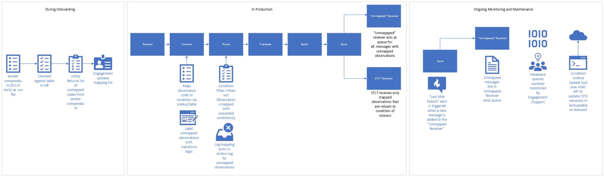

# Proposal for Code-to-Condition Mapping

## Background

Public Health reporting in the United States is not uniform in nature with each public health agency (PHA) setting their
own criteria for what conditions need to be reported to that jurisdiction. In the context of electronic lab reporting (ELR), the onus is typically on the reporting entity (lab, hospital, clinic etc.) to determine which result messages qualify for each PHA the entity reports to.

Since ReportStream takes on the burden of identifying the appropriate destination for sender’s messages, it will be necessary to implement a feature to ensure only messages for the appropriate conditions/diseases are allowed to route to each connected receiver. This feature will be similar to the COVID-19 LIVD table in that it will be a table of LOINC codes and their associated conditions that is used to reference received LOINC/SNOMED codes and return their associated condition.

## Assumptions
1.) The Council of State and Territorial Epidemiologist (CSTE) ValueSets that make up the Reportable Conditions Trigger Codes (RCTC) will be sufficient to capture a majority of codes sent to ReportStream. If this turns out to be false, we can modify the design to include additional data sources.

## Criteria

1.) Must be able to map LOINC and SNOMED codes to condition.<br>
2.) Tables must have the ability to be updated without a PR.<br>
3.) Mapping must account for all 160 conditions available in Report Content Knowledge Management System that relate to ELR (https://www.rckms.org/conditions-available-in-rckms/) <br>
4.) Must be able to add ad-hoc mappings as needed for local codes/LDTs or other non-standard codes

## Out of Scope
The below items are not covered in this proposal.

1.) Mechanism to automate which conditions each state considers reportable.

## Design

Overview Diagram




### Observation Mapping Table

The Observation Mapping table will be made up of CSTE ValueSets and contain the following columns:

| Column Name                   | Description                                   | Example                                                                        |
|-------------------------------|-----------------------------------------------|--------------------------------------------------------------------------------|
| Member OID                    | ValueSet Identifier                           | 2.16.840.1.113762.1.4.1146.239                                                 |
| Name                          | ValueSet Name                                 | Chlamydia trachomatis Infection (Tests for Chlamydia trachomatis Nucleic Acid) |
| Code                          | LOINC or SNOMED coded value                   | 16601-7                                                                        |
| Descriptor                    | LOINC or SNOMED term descriptio               | Chlamydia trachomatis rRNA [Presence] in Urine by Probe                        |
| Code System                   | Indicates whether code is LOINC or SNOMED     | LOINC                                                                          |
| Version                       | LOINC or SNOMED release version               | 2.74                                                                           |
| Status                        | Indicates if code is active or deprecated     | Active                                                                         |
| Condition Name                | Name of associated reportable condition       | Chlamydia trachomatis infection (disorder)                                     |
| Condition Code                | SNOMED value associated with condition        | 240589008                                                                      | 
| Condition Code System         | System used for condition code                | SNOMEDCT                                                                       |
| Condition Code System Version | SNOMED version associated with condition code | 2023-03                                                                        |
| Value Source                  | Source of value (e.g. RCTC vs manual mapping) | RCTC                                                                           |   
| Created At                    | Date that table entry updated                 | 20231020                                                                       |

The column names are taken directly from the [RCTC spreadsheet](https://docs.google.com/spreadsheets/d/1rO_p145xXO1AD76vx8vBqXgoQUnLqfc8/edit#gid=739612351) with the exception of "Value Source" and "Created At" which are additional columns added for administrative purposes that will be used when updating the table. Both LOINC and SNOMED codes are combined in this table and can be identified by column "Code System".
The RCTC does a fairly good job of keeping up to date with LOINC and SNOMED codes and is regularly updated. It is anticipated that despite this there will be a requirement to map codes that are not present in the condition mapping table. These will have to be mapped manually after review by RS personnel in order to ensure that the proper condition code is mapped to the LOINC or SNOMED code. These codes can be submitted to CSTE valueset reviewers to be included in future releases. If a column is not applicable it can be left blank unless it is the "Code", "Condition Name", "Condition Code" or "Source" columns.

### Appending condition information to FHIR Bundle

The condition information will be most useful and easy to work with if it exists in the FHIR bundle itself. Making use of the fact that FHIR allows for metadata about a resource to include tags that include a code and display value we can provide a tag to each observation resource in a FHIR bundle that describes the condition associated with that observation

Example:
```json
        {
            "fullUrl": "Observation/d683b42a-bf50-45e8-9fce-6c0531994f09",
            "resource": {
                "resourceType": "Observation",
                "id": "d683b42a-bf50-45e8-9fce-6c0531994f09",
                "status": "final",
                "code": {
                    "coding": [
                        {
                            "system": "http://loinc.org",
                            "code": "80382-5"
                        }
                    ],
                    "text": "Influenza virus A Ag [Presence] in Upper respiratory specimen by Rapid immunoassay"
                },
                "subject": {
                    "reference": "Patient/9473889b-b2b9-45ac-a8d8-191f27132912"
                },
                "performer": [
                    {
                        "reference": "Organization/1a0139b9-fc23-450b-9b6c-cd081e5cea9d"
                    }
                ],
                "valueCodeableConcept": {
                    "coding": [
                        {
                            "system": "http://snomed.info/sct",
                            "code": "260373001",
                            "display": "Detected"
                        }
                    ]
                },
                "meta": {
                    "tag": [
                          {
                              "code": "541000000000000",
                              "display": "Infection caused by novel Influenza A virus variant (disorder)"
                         }
                    ]
                }
            }
        }
```

In order to account for both HL7 and FHIR input from senders, the lookup should occur after conversion of the incoming HL7 V2 message into a FHIR bundle. Since the sender transforms are used after conversion from HL7 to FHIR, adding the below elements to the default sender transform will add the condition tag to the observation resource.

```yaml
  - name: test-condition
    resource: 'Bundle.entry.resource.ofType(Observation)'
    condition: '%resource.code.coding.exists()'
    bundleProperty: '%resource.meta.tag.code'
    value: ['%resource.code.coding.code']
    valueSet:
      lookupTable:
        tableName: Condition-Mapping
        keyColumn: code
        valueColumn: condition_code
```
This element will check against the RCTC values loaded into the Observation-Mapping tables.

Not all reportable conditions can be identified from order and result LOINC codes. In the case of bacterial cultures the condition is identified by the found organism which is populated in the result field/resource (OBX-5 or Bundle.entry.resource.ofType(Observation).value.valueCodeableConcept). In order to correctly tag these messages, an additional element will need to be added to the transform like below to check the result code.

```yaml
- name: result-condition
  resource: 'Bundle.entry.resource.ofType(Observation)'
  condition: '%resource.code.coding.exists() and %resource.meta.tag.code.not.exists()'
  bundleProperty: '%resource.meta.tag.code'
  value: ['%resource.valueCodeableConcept.coding.code']
  valueSet:
    lookupTable:
      tableName: Condition-Mapping
      keyColumn: code
      valueColumn: condition_code
```
This element should be placed after the above elements as we only want to check the mapping for a result value if we have failed to find a match in the test ordered and test performed locations. 

### Filtering for condition

Due to the presence of the tag on the fhir bundle we can utilize any of the existing filters to manage the list of conditions for each receiver. There are several potential options for filtering.

1.) Jurisdictional filter - This option would remove visibility into which messages qualified for the STLT but were filtered out due to condition it is not recommended to use the jurisdictional filter for this purpose.<br>
2.) Condition filter - This option allows visibility into which messages were filtered out due to condition, and visually separates the condition logic from the other filters. This is the proposed method.

There are multiple ways to write the logic in the condition filter. The first way will remove any observations that do not pass the condition filter.<br>

### Condition filter logic #1 (Recommended)

Example input: [prime-reportstream/prime-router/docs/design/proposals/0023-condition-to-code-mapping/exampleinput.fhir]()

Example condition logic:
```yaml
    - name: TEST-RECEIVER
      externalName: TEST
      organizationName: TEST
      topic: full-elr
      customerStatus: active
      jurisdictionalFilter:
        - "(%performerState.exists() and %performerState = 'TEST') or (%patientState.exists() and %patientState = 'TEST')"
      qualityFilter: []
      conditionFilter:
          - "%resource.where(meta.tag.code in (398102009' |'13906002' |'409498004' |'40610006' |'21061004' |'75702008' |'359761005' |'414015000' |'840539006' |'416925005' |'83436008')).exists()"
      timing:
        operation: MERGE
        numberPerDay: 1440 # Every minute
        initialTime: 00:00
```
Example output: [prime-reportstream/prime-router/docs/design/proposals/0023-condition-to-code-mapping/exampleoutput1.hl7]()

This approach will prune any observations that do not match the listed conditions in the filter during the translation step (FHIRTranslator.kt).

### Condition filter logic #2 

The second way to write the condition logic will pass the entire bundle if a match is found for one observation.

Example input: [prime-reportstream/prime-router/docs/design/proposals/0023-condition-to-code-mapping/exampleinput.fhir]()

```yaml
    - name: TEST-RECEIVER
      externalName: TEST
      organizationName: TEST
      topic: full-elr
      customerStatus: active
      jurisdictionalFilter:
        - "(%performerState.exists() and %performerState = 'TEST') or (%patientState.exists() and %patientState = 'TEST')"
      qualityFilter: []
      conditionFilter:
          - "bundle.entry.ofType(Observation).where(meta.tag.code in (398102009' |'13906002' |'409498004' |'40610006' |'21061004' |'75702008' |'359761005' |'414015000' |'840539006' |'416925005' |'83436008')).exists()"
      timing:
        operation: MERGE
        numberPerDay: 1440 # Every minute
        initialTime: 00:00
```
Example output: [prime-reportstream/prime-router/docs/design/proposals/0023-condition-to-code-mapping/exampleoutput2.hl7]()

This will potentially pass along results for conditions that are not desired by the receiver in the event the message/bundle represents a multiplex test where the receiver only desires some of the test results (e.g. if NY wanted to receive FLU A and FLU B results but not covid results and ReportStream received a messages where all three were represented, all three would be sent). This is likely an edge case that will not be commonly encountered and the risk of missing results by going with option #1 is much higher.

## Monitoring Mapping

A key component for long term success of mapping code-to-condition will be the ability to capture codes that are unmapped and subsequently map them and re-send any affected messages. This will require that processes are in place to review and map any codes that do not have a mapping at time of receipt.
In order to monitor for unmapped codes we need to log in the Action Log when an unmapped value is sent from a sender and have a process to add that mapping to the table. Below are two proposed strategies to add an entry to the Action Log when an unmapped value is encountered. For both strategies it is recommended to add a new ActionLogLevel in ActionLog.kt of "mapping" to differentiate missing mappings from other logged issues. Errors logged in the action log will contain a "tracking Id" and creation time to allow for follow=up on messages containing mapping errors.

Example:
```kotlin
enum class ActionLogLevel {
    info,
    warning,
    error,
    filter,
    mapping
}
```
### Logging Missing Mapping Strategy 

The proposed way of monitoring mapping is to add functionality to LookupTableValueSet.kt to log a mapping error to the Action Log if the LOINC/SNOMED from the targeted observation resource used as the Key does not return a Value.

Example:

For the below resource:

```json
  {
    "resourceType": "Observation",
    "id": "d683b42a-bf50-45e8-9fce-6c0531994f09",
    "status": "final",
    "code": {
      "coding": [
       {
          "system": "http://loinc.org",
          "code": "80382-5"
        }
      ],
      "text": "Flu A"
    }
  }
```
the below element in the default transformation utilizes LookupTableValueSet to use key "80382-5" to search Observation-Mapping table stored in the database to return a value from the condition_code column

```yaml
- name: test-condition
  resource: 'Bundle.entry.resource.ofType(Observation)'
  condition: '%resource.code.coding.exists()'
  bundleProperty: '%resource.meta.tag.code'
  value: ['%resource.code.coding.code']
  valueSet:
    lookupTable:
      tableName: Observation-Mapping
      keyColumn: code
      valueColumn: condition_code
```

In the example table below we can see that there is no match found for code "80382-5"

Example Observation Mapping Table:

| Member OID                     | Name                                                 | Code    | Descriptor                                                                          | Code System | Version | Status | Condition Name                                                 | Condition Code   | Condition Code System | Condition Code System Version | Value Source |
|--------------------------------|------------------------------------------------------|---------|-------------------------------------------------------------------------------------|-------------|---------|--------|----------------------------------------------------------------|------------------|-----------------------|-------------------------------|--------------|
| 2.16.840.1.113762.1.4.1146.798 | Influenza (Tests for influenza A virus Nucleic Acid) | 80588-7 | Influenza virus A M gene [Presence] in Nasopharynx by NAA with probe detection      | LOINC       | 2.74    | Active | Infection caused by novel Influenza A virus variant (disorder) | 541000000000000  | SNOMEDCT              | 2023-03                       | RCTC         |
| 2.16.840.1.113762.1.4.1146.799 | Influenza (Tests for influenza A virus Antigen)      | 88904-8 | Influenza virus A Ag [Presence] in Lower respiratory specimen by Immunofluorescence | LOINC       | 2.74    | Active | Infection caused by novel Influenza A virus variant (disorder) | 541000000000000  | SNOMEDCT              | 2023-03                       | RCTC         |
|                                | Influenza - (ABC TESTING LABS)                       | 123456  | Influenza virus A                                                                   | LOCAL       |         | Active | Infection caused by novel Influenza A virus variant (disorder) | 541000000000000  | SNOMEDCT              | 2023-03                       | LOCAL        |   

Example Action Log Error Message: "Missing mapping for: 123456 for table: Observation-Mapping"

In this instance we would add want to add an entry to the Action Log if a null value or empty string was returned. The content of the error message should include both the keyValue and the tableName in the format: "Missing mapping for: " + keyValue + " for table:" + tableName".
By following this strategy we could also log and monitor missing mappings for any lookupTable which is used in a translation schema, not just condition mappings.

Example Action Log Detail:

```json
 {
    "class": "gov.cdc.prime.router.ReportStreamMapping",
    "scope": "item",
    "message": "Missing mapping for: 123456 for table: Observation-Mapping",
    "filteredTrackingElement": "<tracking id>"
}
```

## Monitoring Logged Errors

Mapping errors logged by the action log can be monitored through metabase queries by the engagement/customer service team. The following is an example query that would be monitored on a regular cadence (dependent on error volume).

Example query
```yaml
select * from action_log
where type = 'mapping'
and created_at >= current date -1
```
## Unmapped receiver queue

Creation of a receiver with the correct filters will allow us to catch all messages with unmapped observations in a queue for Engagement to work. Combined with Action Log monitoring engagement will be able to update all mappings and resend affected messages as needed to STLTs. In order to create this receiver the following settings would be needed:

```yaml
- name: "unmapped-message-queue"
  description: "All messages that contain unmapped observations"
  jurisdiction: "FEDERAL"
  filters: "Bundle.entry.resource.ofType(Observation).resource.meta.tag.code.exists().not()"
  featureFlags: null
  keys: null
  senders: []
  receivers:
      - name: "unmapped-message-queue"
        organizationName: "
      topic: "full-elr"
        customerStatus: "active"
        translation:
            schemaName: "metadata/hl7_mapping/receivers/STLTs/NY/NY-receiver-transform"
            useBatchHeaders: false
            type: "FHIR"
        jurisdictionalFilter: []
        qualityFilter: []
        routingFilter: []
        reverseTheQualityFilter: false
        conditionFilter: []
        deidentify: false
        deidentifiedValue: ""
        timing:
            operation: MERGE
            numberPerDay: 1440 # Every minute
            initialTime: 00:00
        transport:
            type: SFTP
            host: BLANK
            port: BLANK
            filePath: BLANK
            credentialName: BLANK
        externalName: null
        timeZone: null
        dateTimeFormat: "OFFSET"
```
This will gather all unmapped messages into a single queue and also fire a "last mile failure" alert that will automatically ping the engagement slack channel when a message is added to the queue.

## Automated Mapping updates

Since the bulk of the mapping table will be made up of values taken from CSTE codesets that are stored in the Value Set Authority Center (VSAC). We can make use of the VSAC's [FHIR Terminology Service](https://www.nlm.nih.gov/vsac/support/usingvsac/vsacfhirapi.html) to query and update the table. Using the "Member OID" and "Version" columns from the table we can create a utility to query each Member OID for which the "Value Source" column is "RCTC" to see if we have the latest version and if not to update to the latest version. This should be a CLI utility similar to update-livd-table command that can be run on-demand to update the table.

The FHIR Terminology Service for VSAC Resources is a RESTful API service for accessing the VSAC value sets and supported code systems.

Example parameters: </br>
environment - name of table to compare input to </br>
silent - do not generate diff or ask for confirmation
activate - activate the table upon creation
key - apikey to access VSAC FHIR terminology service
OID - OID of valueset to update (default to all OID in table if blank)

Example CLI command for update tool:

./prime condition-mapping-update --activate --silent --environment staging --key <apikey>

## Sender Compendium Comparison Utility

In order to greatly reduce the number of unmapped errors that we will have to deal with. It is recommended that we build a utility where senders can submit their test compendiums during the onboarding process to allow engagement to pre-emptively map. This will be a utility that takes in a csv file prepared by the sender and compares the codes against the observation mapping table. The utility should then return which codes are not found in the table so that the engagment team can map them prior to the sender moving to production.

Example parameters: </br>
env - environment to run command against </br>
tablename - name of table to compare input to </br>
input -file location of input CSV </br>
output -location to output post comparison csv

Example CLI command:

./prime mapping-table-comparison -tablename observation-mapping -input <input-file-location> output <output-file-location> -env staging


Example input compendium CSV:
```csv
test code,test description,coding system
97099-6,Influenza virus A and B and SARS-CoV-2 (COVID-19) Ag panel - Upper respiratory specimen by Rapid immunoassay, LOINC
47457-7,Influenza virus A H8 Ab [Titer] in Serum, LOINC
123456, LDT Flu Test, LOCAL
```
Example output CSV:

```csv
test code,test description,coding system, mapped?
97099-6,Influenza virus A and B and SARS-CoV-2 (COVID-19) Ag panel - Upper respiratory specimen by Rapid immunoassay, LOINC., Y
47457-7,Influenza virus A H8 Ab [Titer] in Serum, LOINC, Y
123456, LDT Flu Test, LOCAL, N
```

| Member OID                     | Name                                                 | Code    | Descriptor                                                                          | Code System | Version | Status | Condition Name                                                 | Condition Code  |
|--------------------------------|------------------------------------------------------|---------|-------------------------------------------------------------------------------------|-------------|---------|--------|----------------------------------------------------------------|-----------------|
| 2.16.840.1.113762.1.4.1146.798 | Influenza (Tests for influenza A virus Nucleic Acid) | 80382-5 | Influenza virus A Ag [Presence] in Upper respiratory specimen by Rapid immunoassay  | LOINC       | 2.74    | Active | Infection caused by novel Influenza A virus variant (disorder) | 541000000000000 | 
| 2.16.840.1.113762.1.4.1146.799 | Influenza (Tests for influenza A virus Antigen)      | 80382-5 | Influenza virus A Ag [Presence] in Upper respiratory specimen by Rapid immunoassay  | LOINC       | 2.74    | Active | Influenza (disorder)                                           | 6142004         |
|                                | Influenza - (ABC TESTING LABS)                       | 123456  | Influenza virus A                                                                   | LOCAL       |         | Active | Infection caused by novel Influenza A virus variant (disorder) | 541000000000000 | 