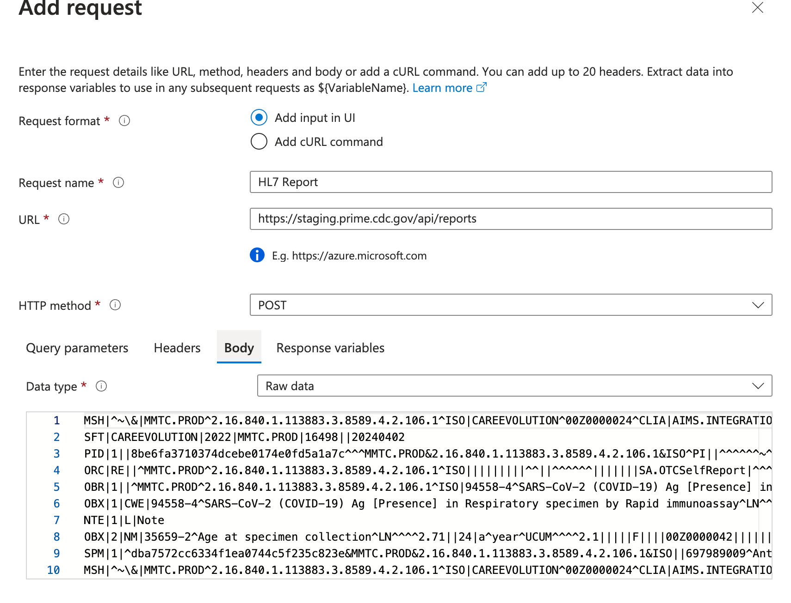
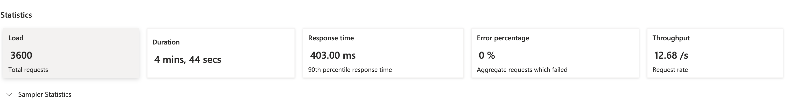
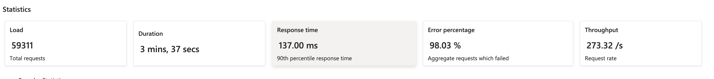
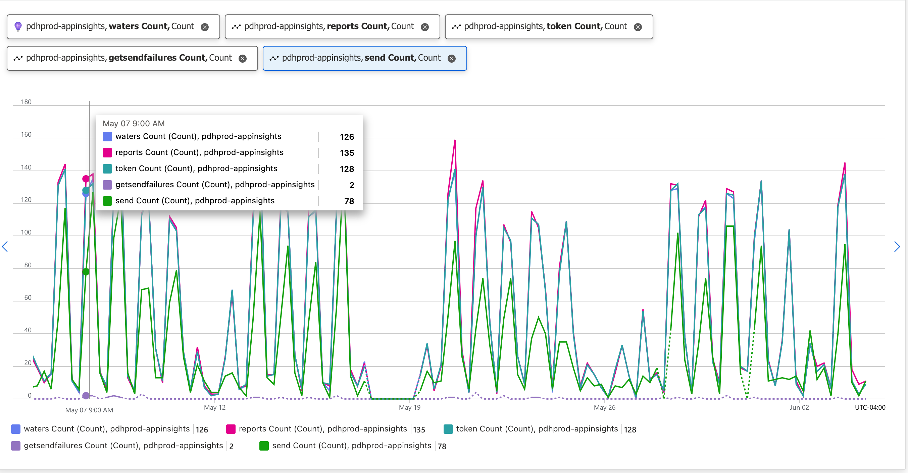

# Load Testing Report Stream

## Goals

- Understand the upper limits for the system in order to be pandemic ready
- Identify performance bottlenecks and potential solutions
- Be able to release with confidence that performance will not be impacted
- Anticipate any long term performance bottlenecks (i.e. increasing database size)

However, the short term goal is to confirm that the Universal pipeline can handle the approximate number of senders that 
we anticipate by summer 2024. The following document is split between detailing how we'll tackle the short term goal, 
but also what the long term solution would look like.

## Tools

### Azure load testing

Out of the box, there are tools baked in to azure for running load tests and specifically azure functions can easily
be [tested](https://learn.microsoft.com/en-us/azure/load-testing/how-to-create-load-test-function-app).

The entry point for the pipeline is just a single endpoint, so the load test should be configurable entirely via the UI;
including the sender configuration and the report payload. The way this would be set up is to add several different
requests with different payloads.

#### JMeter support

Azure load testing also supports JMeter scripts, but this is likely not required since the workflow is so simple;
typically, JMeter would be used to simulate a complex user flow that invokes many different APIs in a defined order. 

Under the hood, azure load tests actually generates a JMeter script when configured via the UI.

### Short term

The UI will be sufficient for setting up requests that just post data to the universal pipeline.

### Long term

Over the long term, the team will likely want to switch to writing the scripts via JMeter as the tool provides 
significantly more functionality including convenient variable capturing, conditionals and more fine-grained controls on
when requests are dispatched.

## Infrastructure

The load test to provide true representation of the system under load will need to be configured to run in an
environment where all the possible transports can be invoked.

**Note: some pre-work would be deprecating and disabling unused transport types**

The work required is to create the relevant mocked infrastructure elements in the load environment; this would include
items such as SFTP server, REST servers and an Azure storage account for blob storage.

### Environment setups

The nature of ReportStream (data that grows infinitely) means that we'll need two different environment configurations
for the following use cases:

- contrasting the performance of two different commits
- tracking the performance of the system over time as the data grows

To enable both of these tests, we'll need to configure the following environments

- an environment is a DB seeded with the same representative, but scaled amount of data at the beginning of each run and
  minimums and maximum instances set to reflect the amount the data was scaled down by
- an environment that gets seeded with the most recent PROD backup of the db and identical settings for the number of
  instances

### Short term

In the short term, we can adopt a much simpler approach and simply reconfigure one of the demo environments to match
the production resources and get a recent clone of the DB data.  The environments are already configured for an SFTP
server which will be sufficient.

### Long term

It will be desired to have multiple environments matching the setup described above as well as having all the expected
transports be available.

## Workloads

Multiple workloads will get designed in order to test a few scenarios that have been evaluated as important to
understand how ReportStream performs.

### Standard load test

This is the workload that will get run regularly as part of CI process. It will align rough usage pattern over a day (
scaled down to an hour or so), where the number of reports submitted per minute scale up, plateau for a period of time
and scale back down. This workload will provide the ongoing baseline for the performance of the system as changes are
made.

Large architectural changes should use this workload to A/B test to see if the change negatively impacts the system.

### Spike test

This workload will be decided to quickly flood the system with a very large number of concurrently submitted reports.
The goal of the workload is to understand how the system performs under an extreme and sudden increase in load and helps
the team evaluate if the concurrent autoscaling mechanisms are sufficient.

This test will want to get scheduled to run at regular intervals and after an infrastructure adjustments.

### Soak test (optional)

This workload will serve as an endurance test where reports submitted per minute will ramp up and then plateau for an
extended period of time, on the scale of several hours. The goal of this workload is to gain confidence that the
system is working as expected under an extended period of load and that system does not develop any unexpected
behaviors.

This test will want to get scheduled to run at regular intervals and after any large architectural or infrastructure
changes.

### Short term

The short term here is mostly informed by the initial POC testing of azure load testing that revealed that the universal
pipeline can handle ~12 reports/sec, but started encountering lots of errors as the load was increased.  See the
following screenshots:

Success:

Failure:

The immediate goal is to target X reports/sec where X reflects the expected number of senders that will be using RS over
the next two quarters with a current rough estimate being ~100. The initial approach will be oriented around creating a
standard load test that we can run regularly as we track our progress towards the report/sec goal.

### Long term

To maintain the health of the system over the long term, the team will want to set up all the workloads described above
and ideally have the tightly integrated into the CI processes; i.e. the standard load test could be triggered for any
pull request and the spike and load tests would be run as part of the deployment processes.

### Test configuration

The overall goal is to understand the performance and scalability of the system based on the actual reported usage in
Production, so the load test configuration will need to include the following:

**This is not an exhaustive list and part of the work of implementing this spec will be collecting this data**

- % of traffic to the Covid Pipeline
- % of traffic to the Universal Pipeline
- % of traffic going to other APIs (i.e. the submission history, ETOR metadata)
- the average number of calls per a given time period
- the % breakdown of HL7 and FHIR reports in the universal pipeline
- the breakdown of the number of items per report
- % of traffic going to each transport type
- # of senders with transforms

Most of this data can currently be retrieved via azure, but some of it will require some additional logging (such as
the breakdown of the transports).

Example from Production Usage (5/4-6/4)

The traffic will then need to be interpreted down as to values relative to each other; the load test configuration needs
the ability to scale up and down the amount of load, but remain the ratios of the production usage.

Long term, the platform team will need to regularly analyze the production metrics above and adjust the load test
configuration.

#### Short term

Configure tests that just send a single HL7 or FHIR message to the universal pipeline.  This is incredibly trivial to 
configure and provides more than enough insight to track down some of the major performance issues.  Since the system 
struggled under the load, adding more requests with a complex breakdown is unlikely to reveal any additional insights. 

#### Long term

We'll want to configure load tests that accurately mimic what is happening in production so that we can anticipate 
upcoming changes to the application, whether that be new functionality, new senders/receivers or simply an increased
load over time.  This will be a living process where a team member will need to look at production traffic and then 
adjust in the scripts how often each piece of functionality is invoked.

## Metrics

There will need to be a series of metrics that will be gathered on each of the performance test that will be used to
measure the performance of the system. The following are an initial list of the metrics that will be reported on:

- Max number of message in the queue at any point
- The number of reports sent through the system
- The number of items sent through the system
- The response times for HTTP endpoints
- ~~Number of items that end up in the poison queue~~ (this does not appear to be something that azure provides)
- Success/failure counts for each of the pipeline steps
- Throughput of the data sent
- APM
    - % memory used on the app
    - % CPU used on the app
    - % memory used on the db
    - % CPU used on the db

## CI Strategy

Ideally, load tests would get performed on every PR before merging, but the CI complexity and infrastructure costs
likely makes that untenable. Instead, the standard load test will get incorporated into the production release process.
The CI job that cuts the production release can be updated to update the load test environment and the run the standard
test there. The deployment process will get updated such that the engineer running the deployment will be responsible
for checking that the results of the test are relatively similar to the previous release.

