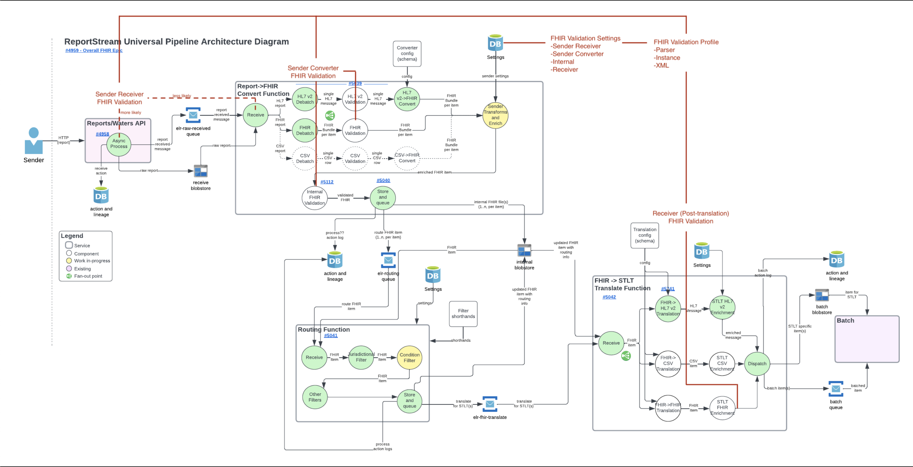
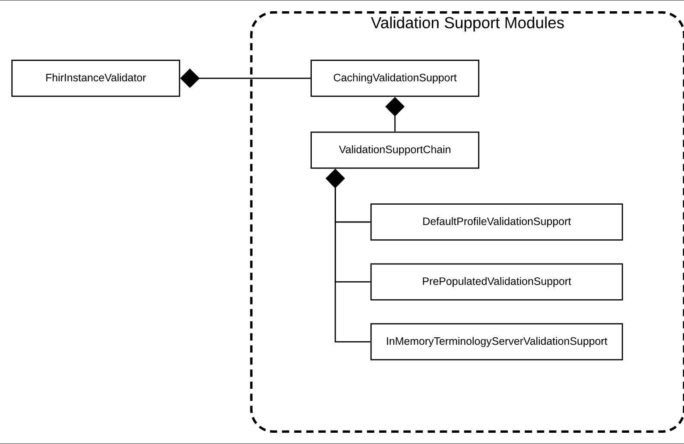
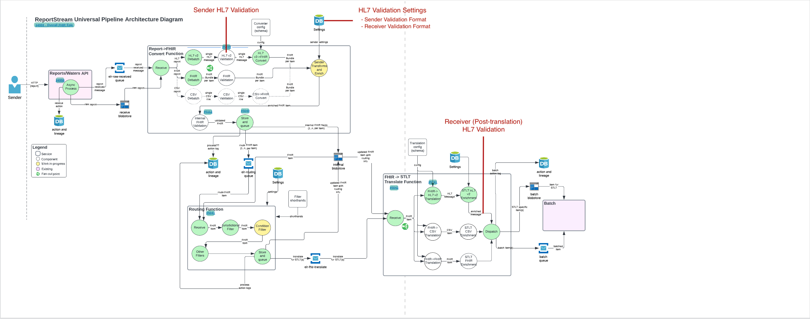

# Problem Statement
As a sender I want submitted data to be validated to ensure data integrity and quality. As a receiver I want received
data to be validated to ensure data integrity and quality. For this to happen, there needs to exist a validation 
setting as well as reusable validation components to perform the sending and receiving validation. 

### Shared Components
To facilitate reuse and extensibility, a new setting type `validationProfile` shall be created representing a type of
validation, the validations to perform, and any applicable configuration parameters. This setting is reusable because
senders and receivers can only be set up to receive one format at a time, so there should not be confusion over which
validationProfile pertains to which format.

When a message fails validation. Validation errors should show up in:
- The submission history API
- The Action Log in the database in such a way that the engagement team can easily query for it
- Notify the sender, if appropriate

Tickets needed for both epics:
- Create the validation profile setting: https://github.com/CDCgov/prime-reportstream/issues/9161 <br/>
- Add validation errors to the submission history API: https://github.com/CDCgov/prime-reportstream/issues/9036 <br/>
- Add validation errors to the action log: https://github.com/CDCgov/prime-reportstream/issues/9221 <br/>

## FHIR Validation
### Proposed Design
The diagram below proposes four validation "checkpoints":
1. Upon receipt of a submission in the SenderReceiver
2. Per bundle after debatch in the convert function
3. After sender transforms and enrichment, also in the convert function
4. After receiver transforms and enrichment in the translate function



A factory/builder shall consume the validationProfile setting and produce reusable, cached validation objects 
(i.e. instance of configured FhirValidator in a wrapper/interface) that can be used to validate FHIR data.

Upon receiving a message (checkpoint 1 above), the IParser validation could likely strike an ideal balance of insurance and leniency

### Background Information / Dev Notes
The HAPI FHIR library represents an implementation guide using:
- [Structure Definitions](http://hl7.org/fhir/structuredefinition.html) - Valid fields, data types, cardinalities, valid values, and further rules.
- [Code Systems](http://hl7.org/fhir/codesystem.html) - Code and vocabulary definitions
- [Value Sets](http://hl7.org/fhir/valueset.html) - Lists of codes (from above) for use in field values

The HAPI FHIR library supports three types of validation:
- [Parser](https://hapifhir.io/hapi-fhir/docs/validation/parser_error_handler.html)
  - Lightweight but not comprehensive
  - An IParser instance can be configured with StrictErrorHandler or LenientErrorHandler resulting in exceptions or log messages upon parsing an invalid FHIR bundle.
- [Instance](https://hapifhir.io/hapi-fhir/docs/validation/instance_validator.html)
  - Heavy and comprehensive
  - Great user-facing error messages
  - Flexible and easy to write/configure
  - Built-in support for core FHIR spec and many derivatives
- [<s>Schema / Schematron</s>](https://hapifhir.io/hapi-fhir/docs/validation/schema_validator.html)
  - Performant and comprehensive
  - User unfriendly error messages
  - Deprecated

<b>Validators can and should be chained and cached</b><br>


#### LOINC validation will require loading an external code system.

#### Example recipe with caching and custom external value sets / code systems
<details>
<summary>Code sample</summary>

```java
FhirContext ctx = FhirContext.forR4();

// Create a chain that will hold our modules
ValidationSupportChain supportChain = new ValidationSupportChain();

// DefaultProfileValidationSupport supplies base FHIR definitions. This is generally required
// even if you are using custom profiles, since those profiles will derive from the base
// definitions.
DefaultProfileValidationSupport defaultSupport = new DefaultProfileValidationSupport(ctx);
supportChain.addValidationSupport(defaultSupport);

// This module supplies several code systems that are commonly used in validation
supportChain.addValidationSupport(new CommonCodeSystemsTerminologyService(ctx));

// This module implements terminology services for in-memory code validation
supportChain.addValidationSupport(new InMemoryTerminologyServerValidationSupport(ctx));

// Create a PrePopulatedValidationSupport which can be used to load custom definitions.
// In this example we're loading two things, but in a real scenario we might
// load many StructureDefinitions, ValueSets, CodeSystems, etc.
PrePopulatedValidationSupport prePopulatedSupport = new PrePopulatedValidationSupport(ctx);
prePopulatedSupport.addStructureDefinition(someStructureDefnition);
prePopulatedSupport.addValueSet(someValueSet);

// Add the custom definitions to the chain
supportChain.addValidationSupport(prePopulatedSupport);

// Wrap the chain in a cache to improve performance
CachingValidationSupport cache = new CachingValidationSupport(supportChain);

// Create a validator using the FhirInstanceValidator module. We can use this
// validator to perform validation
FhirInstanceValidator validatorModule = new FhirInstanceValidator(cache);
FhirValidator validator = ctx.newValidator().registerValidatorModule(validatorModule);
ValidationResult result = validator.validateWithResult(input);
```
</details>

#### Lots more information [here](https://hapifhir.io/hapi-fhir/docs/validation/introduction.html)

## Resulting Tickets

- Implement reusable validation component [#8974](https://github.com/CDCgov/prime-reportstream/issues/8974)
- Research validation configurations: [#8976](https://github.com/CDCgov/prime-reportstream/issues/8976)
- Add FHIR Sender Converter Validation: [#8978](https://github.com/CDCgov/prime-reportstream/issues/8978)
- Add FHIR Internal Validation:  [#8979](https://github.com/CDCgov/prime-reportstream/issues/8979)
- Enable Parser validation and check result: [#8980](https://github.com/CDCgov/prime-reportstream/issues/8980)
- Configure FHIR parser, sender, internal, and receiver validation profiles: [#9034](https://github.com/CDCgov/prime-reportstream/issues/9034)
- Add FHIR Receiver Validation: [#9035](https://github.com/CDCgov/prime-reportstream/issues/9035)
- 

## HL7 Validation
### Proposed Design
The diagram below proposes two validation "checkpoints":
1. Sender validation - will occur during the convert function, after receiving and debatch, and before the convert step.
2. Receiver Validation - will occur in the translate function, after reception, translation, and enrichment but right
   before dispatch.



### Background Information/Dev Notes
#### The HAPI HL7 library
The HAPI library offers 3 "levels" of message validation:
1. Basic Message Validation - very basic validation on message length and some segments, this is built in and will not 
provide enough validation to meet our needs.
2. Custom Message Validation - Extends basic and enabled through the extensibility offered by the message validation 
framework itself. Allows you to override default behaviour.
3. Validation by the use of Conformance Profiles - Unfortunately this boils down to essentially requiring 
MicroSoft Workbench (for download: https://sourceforge.net/projects/mwbench/) which since we use Macs and a Google 
search does not yield any alternatives, it seems like it rules this out as an option. If we can obtain access to a 
Windows machine, it may be worth it. This tool appears to essentially be a plug and play tool that allows you to 
specify a format and then will generate XML that can be used as a means to validate a message. Basically, it looks like 
it provides a GUI to creating the specification.

The HAPI HL7 library provides flexibility regarding the following:
- Whether the message validation should be activated or not (it is turned on by default)
- How to deal with unrecognized message versions, segments, fields, etc. during the parsing process
- Behavior around how the parser should encode segments and fields even if no data content is present

The HAPI HL7 library provides the following classes to validate HL7 messages:
- `ValidationContext` - manages a collection of codified rules for handling messages, fields, and primitive types
- `ValidationRuleBuilder` - what you use to create the validation rules
- `MessageVisitor` - the interface the classes implement when they are in charge of doing the actual comparison
- `ValidationException` - thrown when validation fails
- `ValidationExceptionHandlerFactory` - interface that you can implement in order to control the exception handling

Code Examples: <br/>
A code example for custom message validation: 
https://hapifhir.github.io/hapi-hl7v2/xref/ca/uhn/hl7v2/examples/CustomMessageValidation.html <br/>
If you want to start with something more basic for a POC, here is an example that uses a default validation context
rather than building one from scratch: https://hapifhir.github.io/hapi-hl7v2/xref/ca/uhn/hl7v2/examples/MessageValidation.html <br/>
Here is an example of using the ValidationRuleBuilder: 
https://hapifhir.github.io/hapi-hl7v2/xref/ca/uhn/hl7v2/examples/CustomMessageValidationWithValidatingVisitor.html <br/>
An example for using conformance: 
https://hapifhir.github.io/hapi-hl7v2/xref/ca/uhn/hl7v2/examples/MessageValidationUsingConformanceProfile.html <br/>

#### NIST Validator
This is a web tool that can be used for manual validation. However, as of the writing of this document, it is currently
broken. We reached out to the makers of the tool previously and they said that they were aware of the issue and a fix 
was in the works.

### Resulting Tickets
Epic: https://github.com/CDCgov/prime-reportstream/issues/9160 <br/>
Create a reusable validator: https://github.com/CDCgov/prime-reportstream/issues/9164 <br/>
Create the validation context: https://github.com/CDCgov/prime-reportstream/issues/9159 <br/>
Create the sender validation: https://github.com/CDCgov/prime-reportstream/issues/9162 <br/>
Create the receiver validation: https://github.com/CDCgov/prime-reportstream/issues/9163 <br/>


