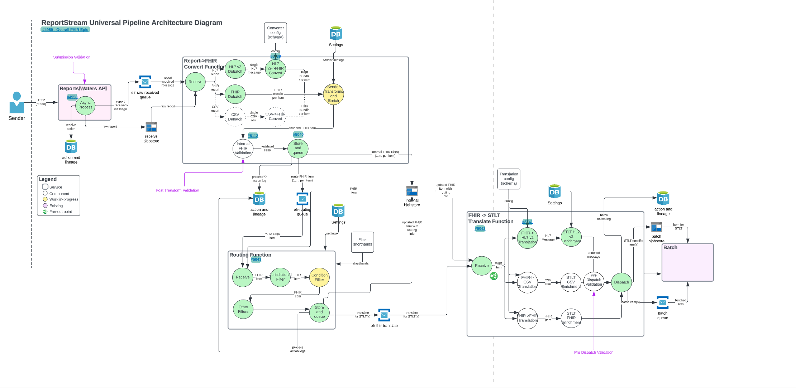

# Problem Statement
As a sender I want submitted data to be validated to ensure data integrity and quality. As a receiver I want received
data to be validated to ensure data integrity and quality. For this to happen, there needs to exist a validation 
setting as well as reusable validation components to perform the sending and receiving validation. 

## HL7 Validation
### Proposed Design
The diagram below proposes two validation "checkpoints":
1. Sender validation
2. Receiver Validation

The sender validation will occur during the convert function, after receiving and debatch, and before the convert step. 
The receiver validation will occur in the translate function, after reception, translation, and enrichment but right
before dispatch. 

This will use the setting proposed in the FHIR validation design doc called `validationProfile`. This is reusable because
senders and receivers can only be set up to receive one format at a time, so there should not be confusion over which 
validationProfile pertains to which format. 

Each validation checkpoint shall run its configured validation and in the event of a failure: 
- actionLog the result and error information
- notify the sender

### Background Information/Dev Notes
#### The HAPI HL7 library
The HAPI library offers 3 "levels" of message validation:
1. Basic Message Validation - very basic validation on message length and some segments, but this will not be enough
2. Custom Message Validation - Extends basic and enabled through the extensibility offered by the message validation 
framework itself. Allows you to override default behaviour.
3. Validation by the use of Conformance Profiles - Unfortunately this boils down to essentially requiring 
MicroSoft Workbench (for download: https://sourceforge.net/projects/mwbench/) which since we use Macs and a Google 
search does not yield any alternatives, seems like it rules this out as an option. If we can obtain access to a Windows
machine, it may be worth it. This tool appears to essentially be a plug and play tool that allows you to specify a 
format and then will generate XML that can be used as a means to validate a message. Basically looks like it gives a 
GUI to creating the specification.

The HAPI HL7 library provides flexibility regarding the following:
- Whether the message validation should be activated or not (it is turned on by default)
- How to deal with unrecognized message versions, segments, fields, etc. during the parsing process
- Behavior around how the parser should encode segments and fields even if no data content is present

The HAPI HL7 library provides the following classes to validate HL7 messages:
- `ValidationContext` - manages a collection of codified rules for handling messages, fields, and primitive types
- `ValidationRuleBuilder` - what you use to create the validation rules
- `MessageVisitor` - the interface the classes implement when they are in charge of doing the actual comparison
- `ValidationException` - thrown when validation fails
- `ValidationExceptionHandlerFactory` - interface that you can implement in order to control the exception handling

Code Examples:  
A code example for custom message validation: 
https://hapifhir.github.io/hapi-hl7v2/xref/ca/uhn/hl7v2/examples/CustomMessageValidation.html  
If you want to start with something more basic for a POC, here is an example that uses a default validation context
rather than building one from scratch: https://hapifhir.github.io/hapi-hl7v2/xref/ca/uhn/hl7v2/examples/MessageValidation.html  
Here is an example of using the ValidationRuleBuilder: 
https://hapifhir.github.io/hapi-hl7v2/xref/ca/uhn/hl7v2/examples/CustomMessageValidationWithValidatingVisitor.html  
An example for using conformance: 
https://hapifhir.github.io/hapi-hl7v2/xref/ca/uhn/hl7v2/examples/MessageValidationUsingConformanceProfile.html  

#### NIST Validator
This is a web tool that can be used for manual validation. However, as of the writing of this document, it is currently
broken. We reached out to the makers of the tool previously and they said that they were aware of the issue and a fix 
was in the works.

### Resulting Tickets
Epic: https://github.com/CDCgov/prime-reportstream/issues/9160  
Create the validation profile setting: https://github.com/CDCgov/prime-reportstream/issues/9161  
Create a reusable validator: https://github.com/CDCgov/prime-reportstream/issues/9164  
Create the validation context: https://github.com/CDCgov/prime-reportstream/issues/9159  
Create the sender validation: https://github.com/CDCgov/prime-reportstream/issues/9162  
Create the receiver validation: https://github.com/CDCgov/prime-reportstream/issues/9163  

