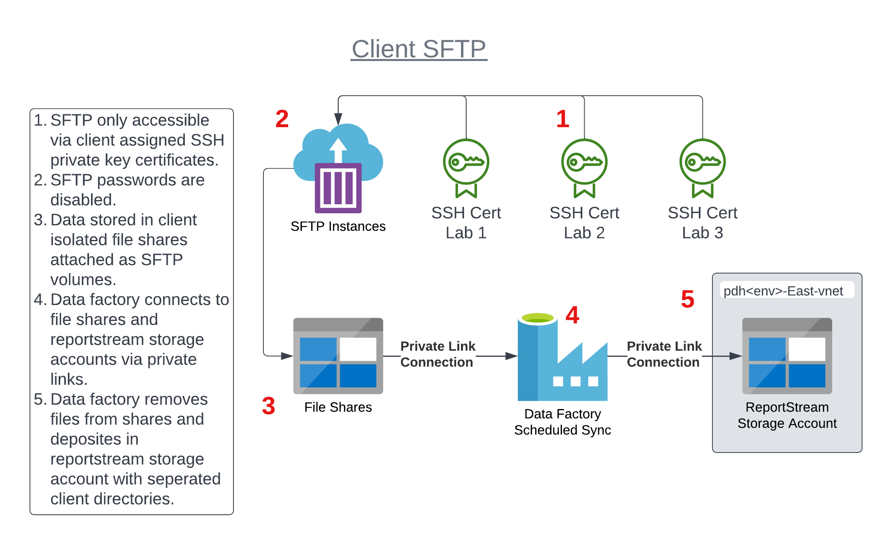

# SFTP

## Client accessible SFTP



* Create an Azure SSH key in the appropriate resource group.
    * Send private key to client.
    * Azure SSH key names determine SFTP instance and users:
      >  * `pdh<env>-sftp01-lab1`
      >    * sftp instance: `pdh<env>-sftp01.eastus.azurecontainer.io`
      >    * sftp user: `lab1`
      >  * `pdh<env>-sftp01-lab2`
      >    * sftp instance: `pdh<env>-sftp01.eastus.azurecontainer.io`
      >    * sftp user: `lab2`
      >  * `pdh<env>-sftp02-lab1`
      >    * sftp instance: `pdh<env>-sftp02.eastus.azurecontainer.io`
      >    * sftp user: `lab1`
   * Seperate file shares exist for each instance/user combination in storage account `pdh<env>sftp`.
* Run Terraform apply to provision the clients SFTP site.

---

## Testing only SFTP

### Creating a Local SFTP Server using Docker
Note that the docker-compose script already starts an SFTP server container.

A simple and quick option is to create a local SFTP server using a Docker container.  With Docker installed and running, run the following commands to create a docker container instance with an SFTP server:
```
docker run -p 22:22 -d atmoz/sftp foo:pass:1001::upload
```
This will create an sftp server running on localhost port 22 with a user/password of foo/pass and will store all of the files in the (container's) /home/foo/upload directory.  If you want to mount the target SFTP folder to your host then add the -v option like in the following command, where the sftp folder in the current folder is used:

```
docker run -p 22:22 -v sftp:/home/foo/upload -d atmoz/sftp foo:pass:::upload
```

### Configuring the Router to use the local SFTP server
1.  Update the organizations.yml file to identify the transport.  Specify the host of localhost for any organizations to use the local SFTP server.  E.g.

    ```
      - name: az-phd
        description: Arizona PHD
        jurisdiction: STATE
        stateCode: AZ
        receivers:
        - name: elr
          organizationName: az-phd
          topic: covid-19
          jurisdictionalFilter: { patient_state: AZ }
          deidentify: false
          translation:
            type: CUSTOM
            schemaName: az/az-covid-19
            format: CSV
          transport:
            type: SFTP
            host: localhost
            port: 2222
            filePath: ./upload
            credentialName: DEFAULT-SFTP
    ```
    the above specifies an SFTP transport for the az-phd organization at localhost:22 writing to the ./upload directory under the account.<br><br> 
    By setting the 'credentialName' field at the 'transport' node, you indicate that the credentials should be retrieved from the CredentialService with that name.<br>
    If the field is not set then the dynamic credentials will be formed on runtime using the receiver full name.<br><br> 

1. Add the SFTP Username and Password to the Organization

    Within the account where you are invoking the `mvn azure-functions:run` or running a Docker container for the router, you'll need to add a secret for each organization you are sending to as follows

    * use the organization name in all caps
    * use the service name afterward (all caps), preceded by a double dash (--), with any underscores (_) replaced by a dash (-)

    For the AZ-PHD organization example above, it would be AZ-PHD--ELR.  To set the password, use the following commands:

    ```
    export $(cat ./.vault/env/.env.local | xargs)
    ./prime create-credential --type=UserPass --persist=AZ-PHD--ELR
    ```

1. Run the functions locally and test as before.  You do not have to restart the router after setting or updating a credential.  Also note that if there isn't a service transport for the organization - SFTP will be skipped and the report will be directly moved to the 'sent' queue

### Setting Credentials in other Environments

The steps are similar - but you'll (for now) need to log into the container itself and set the variables.  We are still working on automatically puting these into the environment when built.

For a local container use `docker exec -it <container name> /bin/bash` to get a bash shell and for the AzureCloud - you can use `az container exec --resource-group <resource-group> --name <container-name> --exec-command "/bin/bash"`