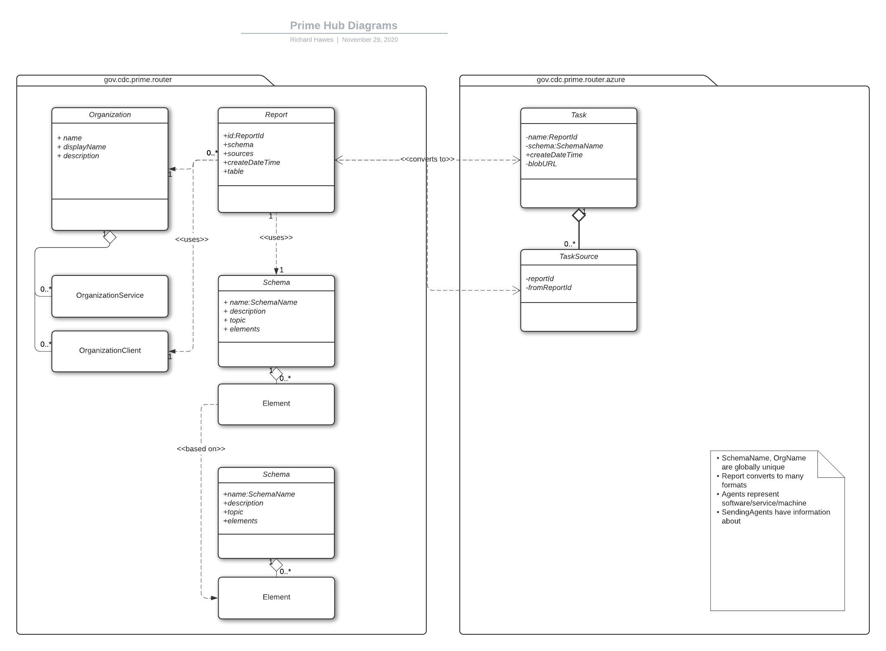
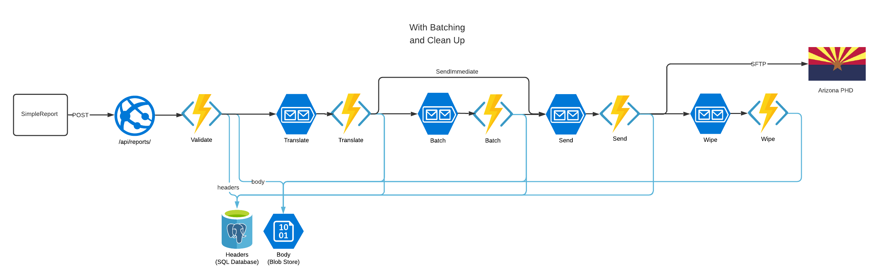

## Class Diagrams

https://lucid.app/lucidchart/invitations/accept/00d26c4c-ce84-4723-86b5-51468c963712

## Data Flow

https://lucid.app/lucidchart/invitations/accept/00d26c4c-ce84-4723-86b5-51468c963712

## Compare Triggers

There are many ways to trigger a function. Here is are those from Microsoft. 

**Technology**|**Local Dev**|**Managed Service**|**Function Trigger**|**Transactional Trigger**|**Delivery Semantics**|**Timed Delivery**|**Topics**|**Filtering**|**Event Batching**|**Typical Use Case**
:-----:|:-----:|:-----:|:-----:|:-----:|:-----:|:-----:|:-----:|:-----:|:-----:|:-----:
Storage Queues|Yes - Azurite|Yes|Yes|Yes|At least once|Yes|No|No|No|Simple queue
Event Grid|No (but ngrok work around)|Yes|Yes|No|At least once|No|Yes|No|Yes (limited)|Resource changes, DevOps Actions
Event Hub|No |Yes|Yes|No|At least once| |Yes|No| |Kafka replacement
Service Bus|No|Yes|Yes|Yes|Choice| | |Yes| |IBM Queue replacement
