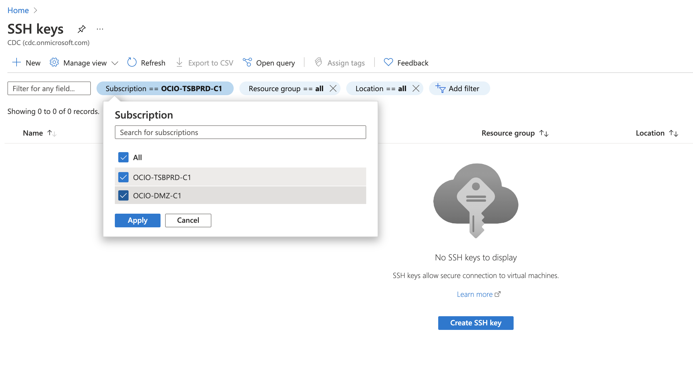
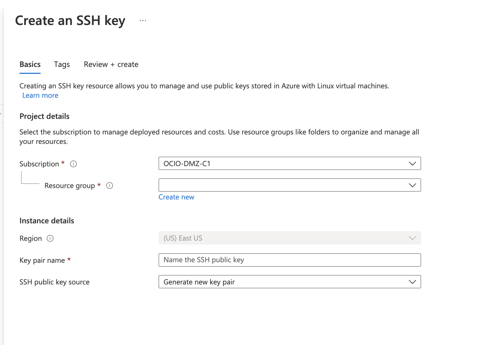
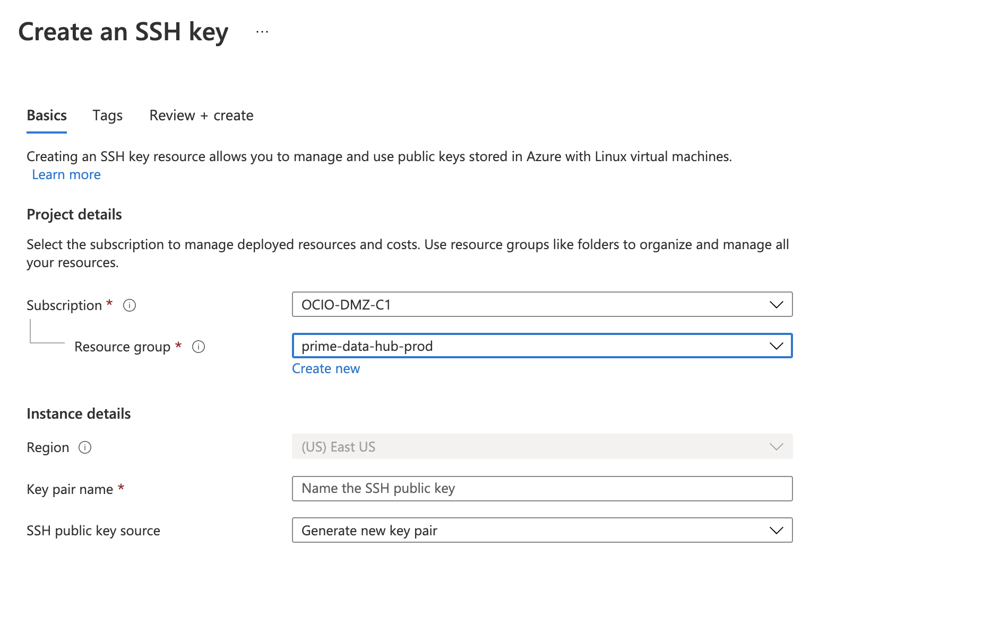
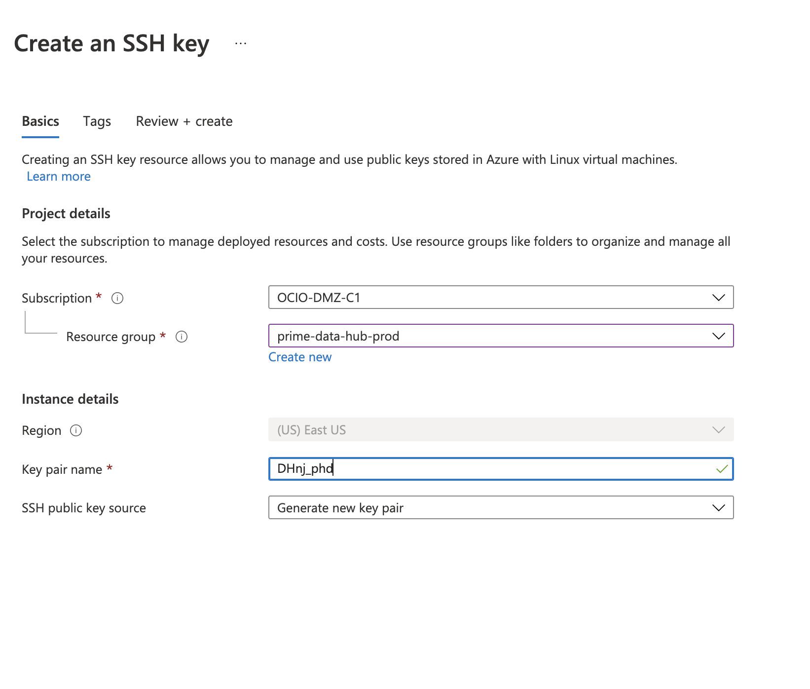
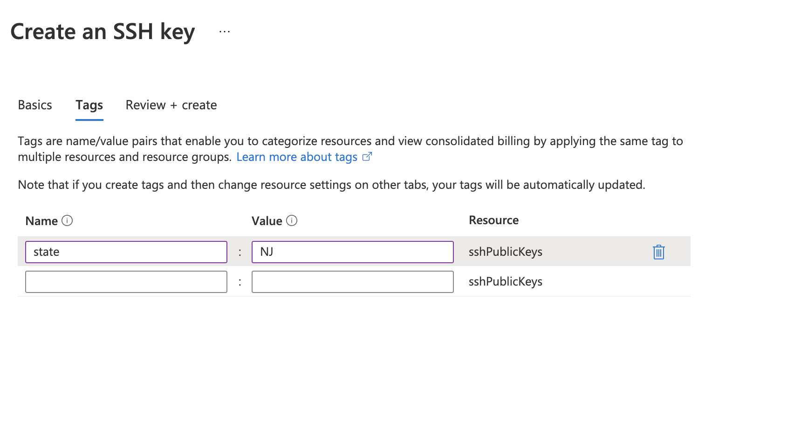
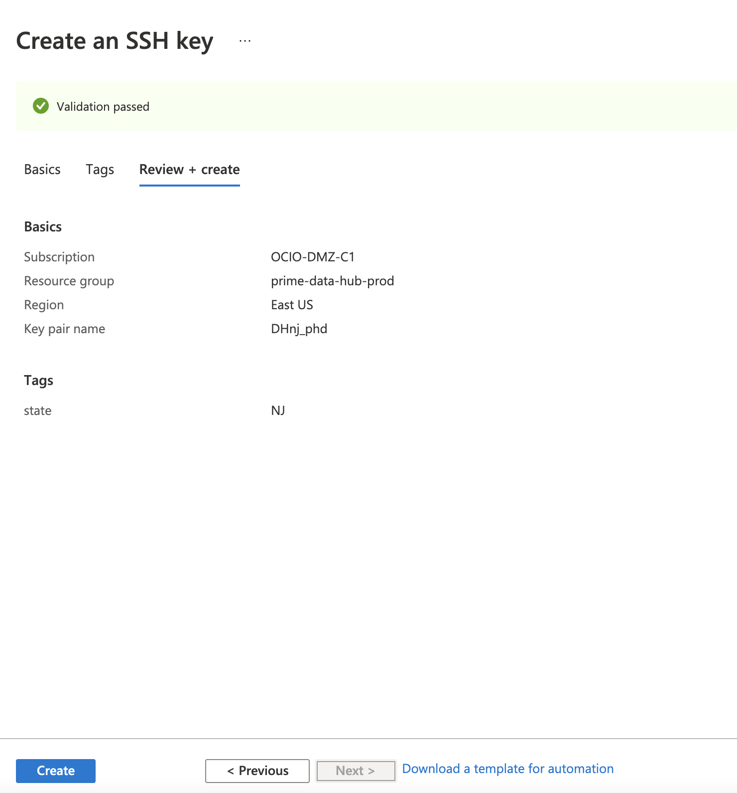
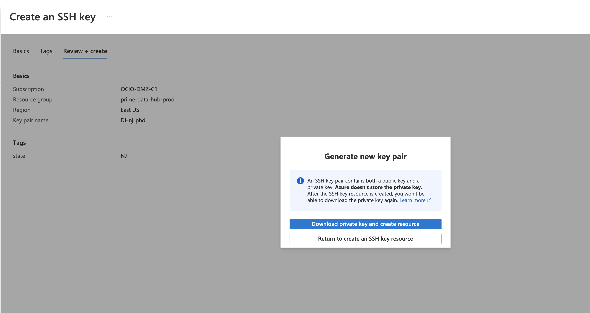
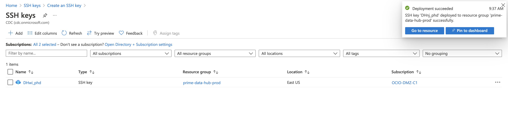

# How to Create and Manage a Key for a Receiver

## Introduction
This is a bare bones introduction on how to create and manage a public/private key pair for a receiver.

## Assumptions
**First and foremost**: This assumes you have credentials with the CDC and have been given access to the Azure portal via VPN. If you do not have credentials, and access to the Azure portal, stop here. ***You cannot go any further.***

This also assumes you have access to KeyBase, and are part of the `prime_dev_ops` team there.  Also, we assume you have KeyBase installed, and have in mounted into `/Volumes/`. If you don't have it mounted as a drive, you can just drag and drop the files into KeyBase. If you feel you should have access to the `prime_dev_ops` team in KeyBase, contact your dev lead, or the dev ops team lead and request access.

Finally, this assumes you are working on a Unix-style system such as Linux or MacOS. You can probably do this on Windows as well provided you have a conformant shell with `putty` and `openssl` installed. The Git Bash shell would probably do, or the Linux Subsystem for Windows would as well, but no promises are made.

## Background
Most of the states that we partner with are using SFTP to send files. Some are using AS2, and some prefer FTPS. In all of these cases, it's possible you will need to generate a public/private key pair in order to send the state files. Managing the keys in FTPS or AS2 is beyond the scope of this document.

In some cases, the state will send you the public/private key pair that will be associated with your account. In that case, you will still need to follow some of the steps below in order to connect with the state SFTP server.

Explaining the SFTP protocol, or how public/private keys work is also beyond the scope of this document, but it is recommended that you spend some time learning at least the basics if you are not already familiar with them.


## Steps

### Generating the files
There are three general steps to generating the keys you need and then assigning them to the receiver, and sharing them with a receiver.
1. Creating the private key in Azure
2. Preparing the key for use.

#### Step One - Generating the Private Key in Azure
In order to complete this step you must have prod VPN access to the Azure portal. We are keeping all keys we generate in Azure portal.

1. Connect your VPN client to the `prime-data-hub-prod` connection.
2. Open your browser and navigate to the Azure Portal at [https://portal.azure.com/#home](https://portal.azure.com/#home)
3. At the top you should see an option for SSH Keys. If you don't, you can also type "SSH" into the search bar at the top to find it.
4. When it loads, you will likely not see any created keys. Make sure that you click the Subscription filter and select all. Once you do that, you will see all the SSH keys that have been created. 
5. In the upper left, click "New". You will be taken to this screen. 
6. On the next screen, select the DMZ subscription, and under "Resource Group" select Prod. 
7. Down below, you're prompted to name the SSH key pair. Our naming convention is DH + the state initials + "_phd". So, for the example below, with NJ, it would be "DHnj_phd". This naming convention follows the same naming rules we use in Okta for the groups we assing state departments of health to. 
8. Leave the last option on "Generate new key pair"
9. Click the "Next: Tags" button
10. On this screen, you can associate tags with the key you're creating. Under "Name" type "state", and under "Value" enter the two letter abbreviation for the state. 
11. Click "Next". At this point Azure will validate your options and then be prepared to create your key for you. 
12. You will be prompted to download the private key and create the resource. ***This is your ONLY chance to download this key. You MUST download it here or you will have to recreate the key again.*** 
13. Once you download the key copy it to the folder where you are going to work with it.

You will be redirected to the screen that lists the SSH keys we have created. You will get a confirmation message in the upper right that the resources has been created, but you will not immediately see the key you created. You can click "Refresh" to see the key you generated.


#### Step Two - Preparing the Key for Use
Below are the steps to prepare the key for use by ReportStream, and by our receivers. You should have a folder somewhere where you are working with the keys. In my case, I've created a local folder called keys, and then a folder in there for each state.

```sh
# make a directory to work in
mkdir -p keys/nj
# move the file into the folder
mv DHnj_phd.pem keys/nj
# enter the directory
cd keys/nj
# change the permissions
chmod 0600 DHnj_phd.pem
# generate a random password for the key
openssl rand -base64 15
# assign the password to the key
# -f specifies the file to interact with
# -p specifies changing the passphrase for the key
# keys downloaded from Azure don't have a passphrase by default
ssh-keygen -p -f DHnj_phd.pem
# extract the public key
# -f specifies the file to read in
# -y specifies to output the public key info to stdout
ssh-keygen -f DHnj_phd.pem -y > DHnj_phd.pub
# generate a ppk in a putty format
puttygen DHnj_phd.pem -o DHnj_phd.ppk
# create a directory in KeyBase
# again, this assumes you have mounted KeyBase into your FS
# as a volume. If you have not, this will not work
mkdir -p /Volumes/Keybase/team/prime_dev_ops/state_info/NJ/
# copy all the files into KeyBase
cp DHnj_phd.* /Volumes/Keybase/team/prime_dev_ops/state_info/NJ/ 
```

### Sending the PUB to the Receiver
Once you've created the `.pub` file, you send it to the receiver so they can create credentials for you, and assign the public key to those credentials so you can log in. There is no danger in sharing the pub file contents with the receiver, and sending it via email. Your public key is just that, public, and anyone can access it without posing a security risk.

### Creating the Connection Info YML File

Once the receiver has created credentials for you, and assigned your public key to it, they will share the credentials with you, and we need to store the credentials in KeyBase so they're available to the whole team.

In KeyBase we have connection info files that have one of two formats, depending on whether the file describes SFTP password authentication, or SFTP key-based authentication. As we're dealing with key-based authentication, we'll focus on that here.

Here is the basic format of the yaml file.

```yaml
---
- state: NJ
  sftp:
    - host: # the host name provided by the receiver
      port: # the port to connect to
      path: # provided by the receiver (the file path we write to)
      userName: # provided by the receiver
      password: # not used
      ppkPassword: # the password generated above
      ppkFileName: # the file name generated above
      ppkFileContents: # the pub key file contents (or the putty file contents)
        
```

```sh
# create a connection info file in yml format and then copy that into keybase
cp ~/development/nj-connection-info.yml /Volumes/Keybase/team/prime_dev_ops/state_info/NJ/ 
```

## Testing Locally
Once you've created the files and have credentials from the receiver, you want to test and make sure that your configuration is successful and the

```sh
# execute sftp using the pem file you created above
sftp -i DHnj_phd.pem -oPort=<PORT> <USERNAME>@<HOST>
```

### Assigning the key to the Receiver in ReportStream
Once you have verified that the credentials work locally, and you are able to connect to the receiver's server via the user name they provide and the private key we've created, you want to associate the user name and private key with the receiver in production.

We have a command line tool we can use that lets us save the credentials for a receiver into the production key vault. Again, in order to accomplish this, you *must* have VPN access to production.

1. Connect your VPN to production
2. Open your terminal in the prime folder and run the following command:
```sh
CREDENTIAL_STORAGE_METHOD=AZURE CREDENTIAL_KEY_VAULT_NAME=pdhprod-clientconfig ./prime create-credential --type UserPass --persist NJ-DOH--ELR --user <USER NAME> --pass <KEY PASS>
```

**NOTE**: The `--persist` option is the name of the receiver in production, but with everything in upper case, and with any `.` replaced with a `--`. So, in this case, the receiver name is `nj-doh.elr`, but for the purposes of the key vault we persist under `NJ-DOH--ELR`

It is not uncommon to see a series of errors as Azure attempts to connect via all the different possible authentication methods, but at the very end you should see a message indicating that you have successfully uploaded the public private key to the key vault.

### More Testing!
Once the public, private key has been uploaded to the server, it is immediately available, so we have one more check to complete. On your terminal, execute the following command:

```
curl -s -H 'x-functions-key:<SECRET FUNCTION KEY>' "https://prime.cdc.gov/api/check?sftpcheck=nj-doh.elr"
```

In the above command you will need to have the secret function key to post commands to Azure. This will attempt to connect to the receiver, execute an `ls` and then report back if it was successful. It will *NOT* show any results from the call to `ls`, only whether or not it was able to connect and execute.

You can also test sending a file to a receiver by appending `&sendfile` to the query string. This will create an empty file to send and remove as a test. You can also use this endpoint with a `POST` to send a file as well (subject to size restrictions).

```
curl -s -H 'x-functions-key:<SECRET FUNCTION KEY>' "https://prime.cdc.gov/api/check?sftpcheck=nj-doh.elr&sendfile"
```
```
curl -s -H 'x-functions-key:<SECRET FUNCTION KEY>' -X POST \
    --data-binary '@./path/to/testfile.csv' \
    "https://prime.cdc.gov/api/check?sftpcheck=nj-doh.elr&sendfile"
```

## Final Thoughts
There could be a time in the future when we will need to follow these same steps to generate public/private key pairs for senders as well, especially as we move into the world of OAuth and using FHIR to communicate.