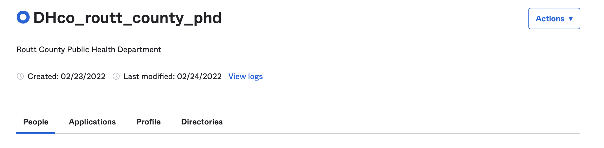
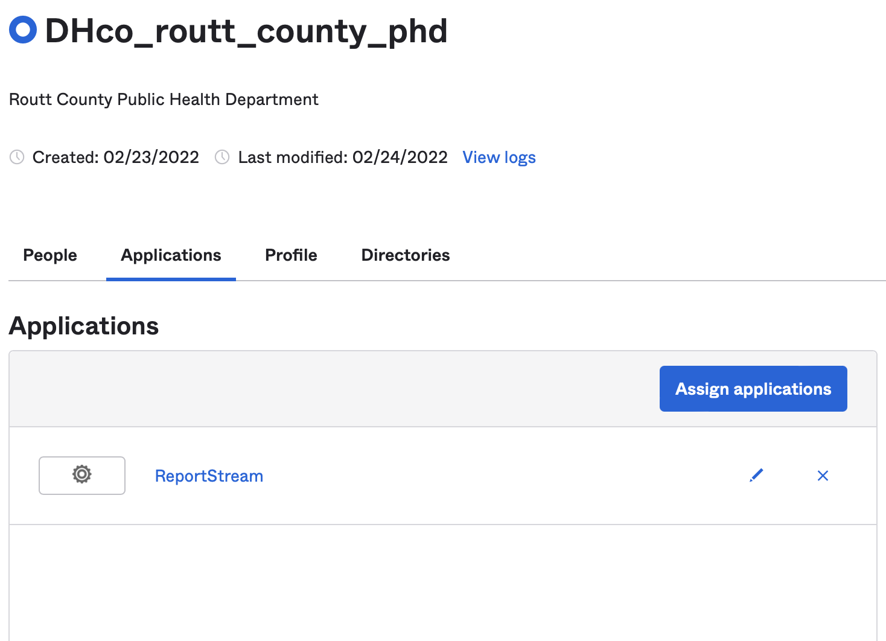
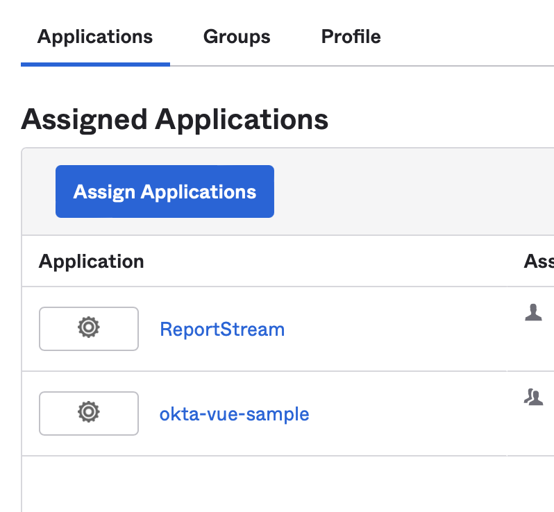

# How to Onboard a County Receiver

## Introduction
Most of the receivers we have added to ReportStream are state public health departments, who typically have more
resources at their disposal, and systems that we send data to directly. Counties differ in a few ways:

1. They will usually want to receive CSV
2. They will want to use the download site instead of receiving the data directly

To that end, I have created a quick and dirty guide to adding a county receiver.

## Steps
1. Collect the names of the people who will be logging into the download site for the county. It may only be one person, or a small handful.
2. Get the county name, or names. In the case of some public health departments, San Juan Basin for example, they serve more than one county.
3. Create the yamlito for the county. They will not have a transport, and they typically will get data via a custom CSV translation. They should also be set to only get data once a day.
4. Save the yamlito to the production settings. Make note of the name you gave the receiver.
5. In Okta, add a new group for the receiver. The format is `DH<NAME OF RECEIVER>`. For example for Routt County, the receiver name is `co-routt-county-phd` and the Okta group name is `DHco_routt_county_phd`. *Note the change from dash to underscore!*

6. Ensure that you add ReportStream to the applications available to the group.

7. Add the users from step 1 one at a time, and assign them to the group you created. You must also give them access to ReportStream under applications.

8. Email them and let them know that they've been added and should receive an activation email from Okta. It is important that they know the email they receive is valid and for their access to ReportStream.

## Samples

Here is the yamlito for Routt County
```yaml
---
- name: co-routt-county-phd
  description: Routt County Public Health Department
  jurisdiction: COUNTY
  stateCode: CO
  countyName: Routt
  receivers:
    - name: elr-download
      organizationName: co-routt-county-phd
      topic: covid-19
      customerStatus: "active"
      jurisdictionalFilter: [ "matches(ordering_facility_state, CO)", "matches(ordering_facility_county, Routt)" ]
      translation:
        type: CUSTOM
        schemaName: direct/direct-covid-19
        format: CSV
      timing:
        operation: MERGE
        numberPerDay: 1
        initialTime: 09:15 # A little after the 12am EASTERN reports from simple report
        timeZone: EASTERN
```

And here is the sample for San Juan Basin PHD which serves two counties in CO:
```yaml
---
- name: "co-san-juan-basin-phd"
  description: "San Juan Basin Public Health Department"
  jurisdiction: "STATE"
  stateCode: "CO"
  countyName: null
  receivers:
    - name: elr-download
      organizationName: co-san-juan-basin-phd
      topic: covid-19
      customerStatus: "active"
      jurisdictionalFilter: [ "matches(ordering_facility_state, CO)", "matches(ordering_facility_county, Archuleta, La Plata)" ]
      translation:
        type: CUSTOM
        schemaName: direct/direct-covid-19
        format: CSV
      timing:
        operation: MERGE
        numberPerDay: 1
        initialTime: 09:15 # A little after the 12am EASTERN reports from simple report
        timeZone: EASTERN
```
*Note: the **matches** mapper allows you to pass in a list of values to match and treats it as an or.*

## Notes
* In the past we have created distinct schemas for each CSV receiver, but in this case I've defaulted to offering them the direct schema instead. 