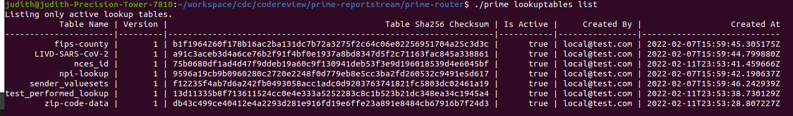

# How To Update The LIVD Table

---
## Introduction

---
HHS maintains a list of all authorized covid test devices as an xlsx. ReportStream
keeps a local csv version copy of that list. This local csv file needs to be updated
once the new LIVD table comes out. 

##  Steps
Download the latest  LIVD-SARS-CoV-2-yyyy-mm-dd.xlsx from  https://www.cdc.gov/csels/dls/sars-cov-2-livd-codes.html

The LIVD table needs to be updated locally, in production, and in staging.

For prod and staging use --env and assign the prod or staging. For local don't include --env option.

1. Run ./prime livd-table-update --activate --env < prod or staging > --input-file <LOCALDIR>/LIVD-SARS-CoV-2-yyyy-mm-dd.xlsx 

### Note:

If you forget to include the --activate option, you will need to activate the table manually, using the following command:

./prime lookuptables activate -n LIVD-SARS-CoV-2 -v <table version >

To get the table version, you need to run this command:

./prime lookuptables list



You can find the livd table version in the second column. Choose the one that is not active.

2. Make sure these tests pass, if not make appropriate changes to the test cases that fail
     - ```gradlew test```
     - ```gradlew testIntegration```
     - ```gradlew testSmoke```