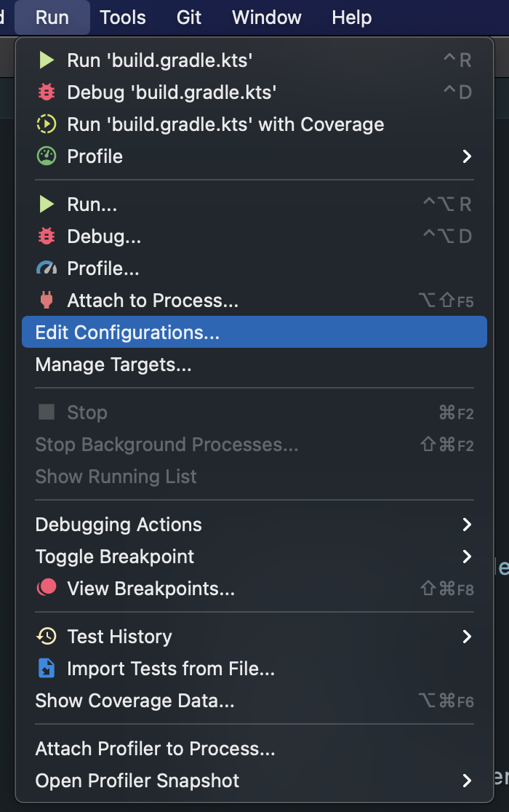
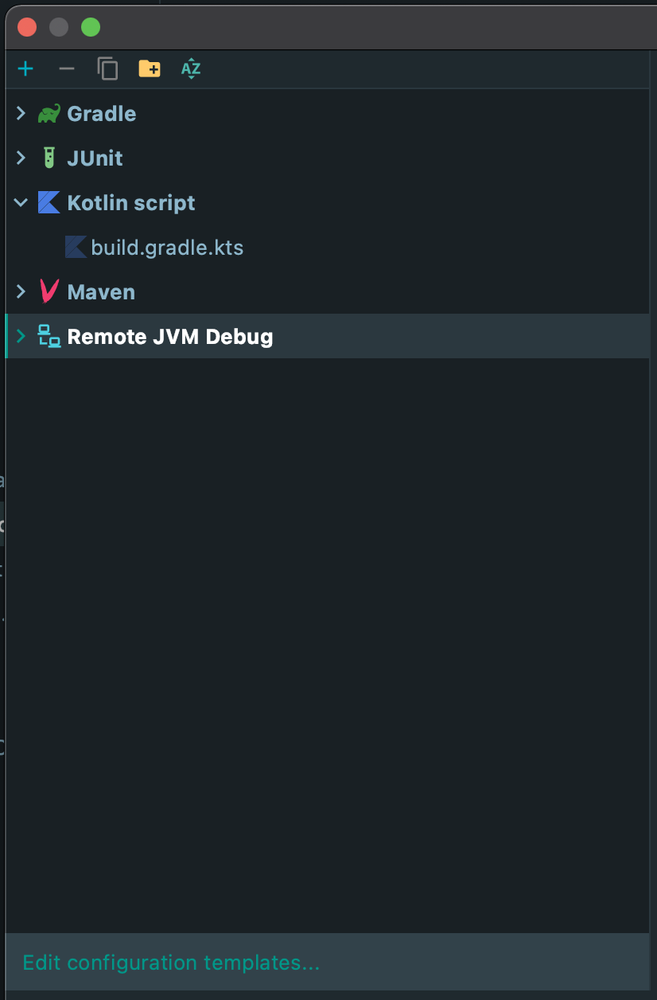
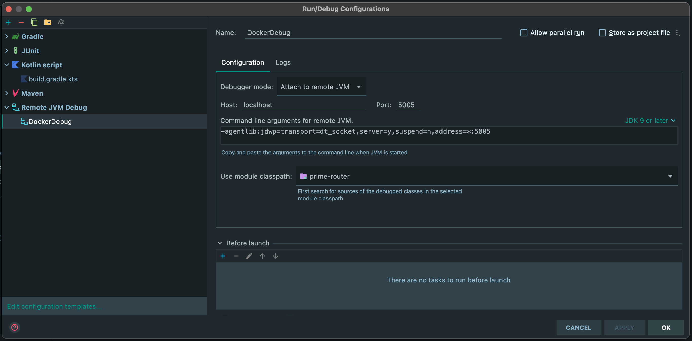
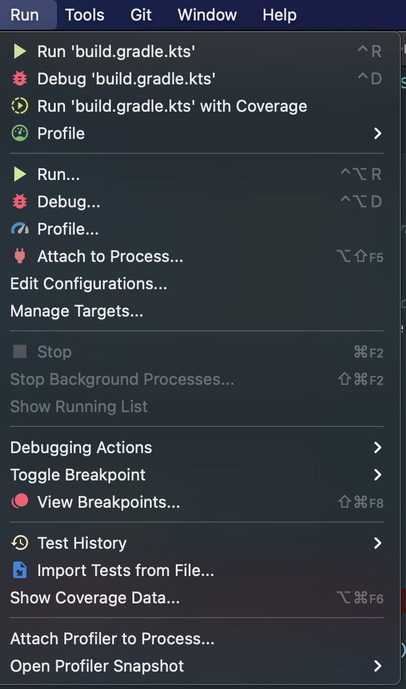
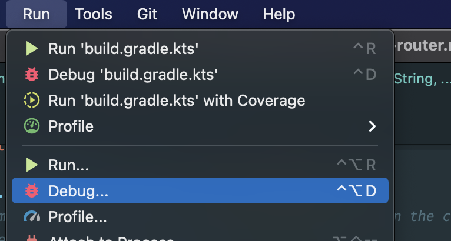
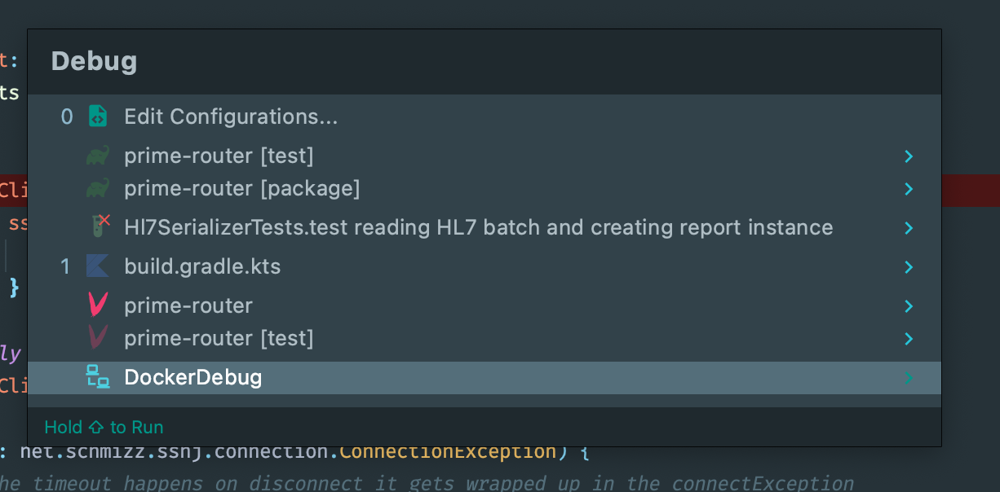
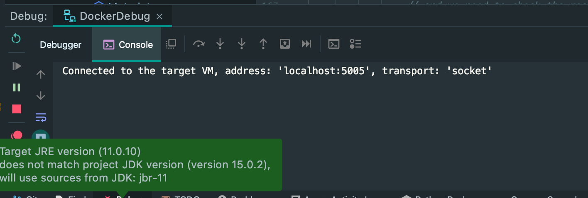

# How To Debug in Your Docker Container

## Intro
This playbook is a quick run down of how to connect and debug in your Docker container when coding in Intellij.

## Steps
1. In Intellij, click on Run, and select Edit Configurations 
2. Create a new Remote JVM Debug 
3. Set up the configuration for the remote JVM debug to look like this. In particular, you want to attach to the remote JVM, and you want to set the module classpath to `prime-router` so the debugger knows where to attach 
4. In your code, set your breakpoint, and then start your docker container with `docker-compose up`
5. Once your docker container is running, in order to attach, select Run again. 
6. Select Debug (not Attach to Process) 
7. Select your Docker Debug that you set up in step 3 
8. A console window will pop up that will show you that it is connected to Docker, and at that point, you can interact with your container and then step through the code at your breakpoints. 

## Conclusion
That's it. Good luck.