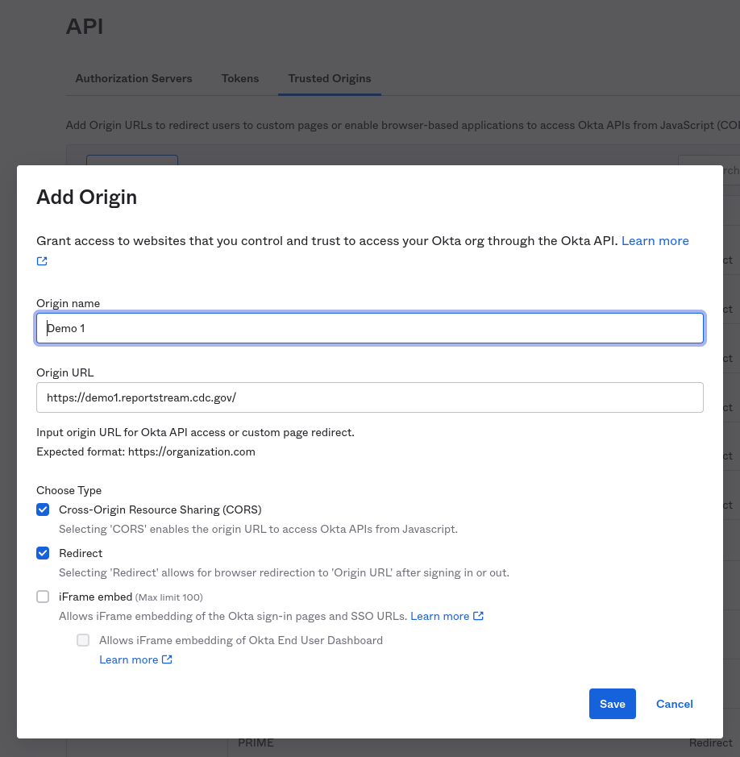
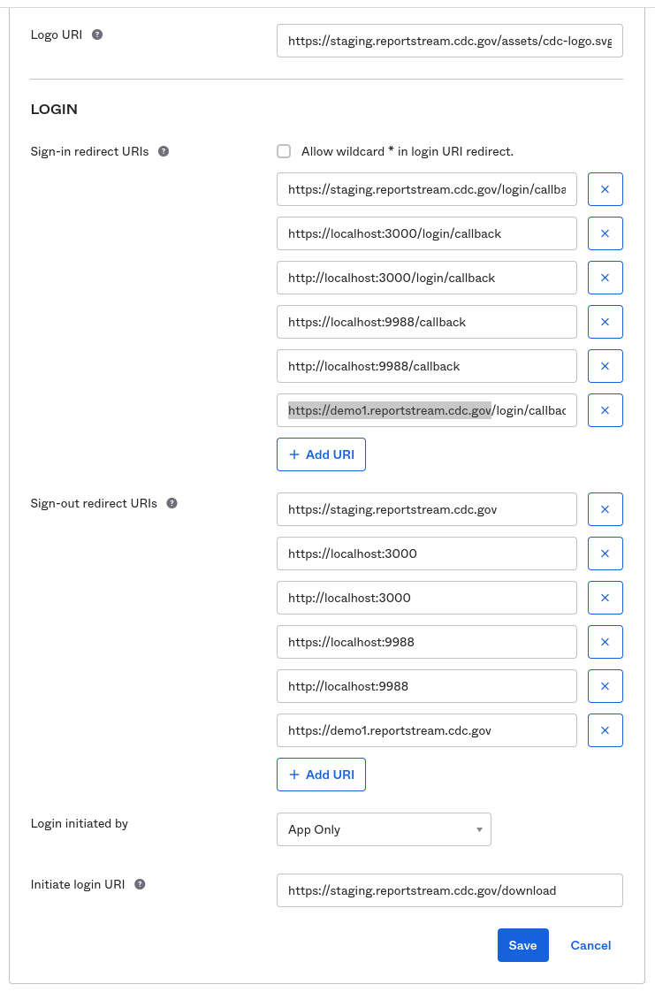

# Environment Provisioning
Any adjustments to the infrastructure provisining process should be noted here so they are documented, and repeatable.

## Azure Prerequisites
We assume the following infrastructure has already been deployed by CMS. 
 - Resource Group for underlying infrastructure
 - Storage Account - Used to store the terraform tf state.
 - You will need to authenticate the az command line application using your SU account:
   ```sh
   az login --use-device-code
   ```

# Demo Environments

## 🚀Auto Create & Destroy

### Create

Push (or merge) code into any of the following branches:
  * `demo1`
  * `demo2`
  * `demo3`

### Destroy

  * Run [Destroy Demo Environment](../../.github/workflows/destroy_demo_environment.yml) workflow
   * Cli example (feature branch)
      ```bash
      gh workflow run "Destroy Demo Environment" -f env_name=demo1
      gh run list --workflow="Destroy Demo Environment"
      ```

> 🚧 Below is for debugging only 🚧

## 🔧Manual Create

### Summary
> 1. Navigate to `demo` Terraform directory using one of the following methods:
>    * `terraform -chdir=operations/app/terraform/vars/demo`
>    * `operations/app/terraform/vars/demo terraform`
> 
> 2. Specify `-var-file` and `-backend-config` from the desired demo directory (demo1, demo2, or demo3)
>    * `-var-file=demo1/env.tfvars.json`
>    * `-backend-config=demo1/env.tfbackend`
> 
> 3. Target the `init` Terraform module to `apply` base resources (vnets, key vaults, etc.)
>    * `-target=module.init`
> 
> 4. After base resources are created, run `apply` without a target

### Specify environment & Terraform path
```bash
env=demo2
path='operations/app/terraform/vars/demo'
```

### Run init, apply init module, and full apply
> If `init` module key vault access policies already exist, you may need to remove/re-apply via `-target`.

> Add SSL certificates for the front door to key vault:
> * `<env>.prime.cdc.gov`
> * `<env>.reportstream.cdc.gov`

```bash
terraform -chdir=$path init \
-reconfigure \
-var-file=$env/env.tfvars.json \
-backend-config=$env/env.tfbackend

for i in {1..3}; do \
terraform -chdir=$path apply \
-target=module.init \
-var-file=$env/env.tfvars.json \
-auto-approve; \
sleep 60; \
done

echo "init complete"

# Import access polices that are shared with init and key_vault modules
terraform -chdir=$path import -var-file=$env/env.tfvars.json \
module.key_vault.azurerm_key_vault_access_policy.terraform_app_config_access_policy[0] \
"/subscriptions/7d1e3999-6577-4cd5-b296-f518e5c8e677/resourceGroups/prime-data-hub-$env/providers/Microsoft.KeyVault/vaults/pdh$env-appconfigmt8/objectId/4d81288c-27a3-4df8-b776-c9da8e688bc7"

terraform -chdir=$path import -var-file=$env/env.tfvars.json \
 module.key_vault.azurerm_key_vault_access_policy.terraform_access_policy[0] \
"/subscriptions/7d1e3999-6577-4cd5-b296-f518e5c8e677/resourceGroups/prime-data-hub-$env/providers/Microsoft.KeyVault/vaults/pdh$env-keyvaultmt8/objectId/4d81288c-27a3-4df8-b776-c9da8e688bc7"

for i in {1..3}; do \
terraform -chdir=$path apply \
-var-file=$env/env.tfvars.json \
-auto-approve; \
sleep 120; \
done

echo "apply complete"

# Restore database from `test` environment:
gh workflow run "Restore databases" \
-f backup_from=test \
-f restore_to=$env \
-f backup_age_limit_mins=1440 \
-f restore_ignore_backup_age=false \
-f databases='[\"prime_data_hub\",\"prime_data_hub_candidate\"]'

# Storage account should contain a "dbbackups" file share.
```

> API endpoint should return `{"error": "Authentication Failed"}`:
> * `curl -X GET https://<env>.prime.cdc.gov/api/settings/organizations`

### One-time config after first creation (initialization):
 1. Download VPN client file:
    * Azure VPN Settings > Point-to-site configuration > Download VPN client > OpenVPN directory
 2. Copy `remote`, `verify-x509-name`, and `<tls-auth>` to `.github/vpn/<env>.ovpn`
 3. Update key vaults in `operations/dnsmasq/config/<env>/hosts.local` with random id in name.
 4. Add `<env>-prime-cdc-gov` & `<env>-reportstream-cdc-gov` SSL certificates to `pdh<env>-keyvault`
 5. In [Okta](https://hhs-prime-admin.oktapreview.com/) under "Security > API", add the server DNS to the "Trusted Origins" with CORS and Redirect access:
      
 6. In Okta:
    * click on "Applications" in the left-hand navigation
    * choose "ReportStream"
    * click the "General Settings" "Edit" button
    * add the new url to the "Sign-in redirect URI" section: `https://<dns>/login/callback`
    * add the new url to the "Sign-out redirect URIs" section: `https://<dns>`
    * 
 7. User will need to be assigned to the application in Okta
    * Applications > ReportStream > Assignments

## 💥Manual Destroy

### Specify environment & Terraform path
```bash
env=demo2
path='operations/app/terraform/vars/demo'
```

### VPN and networking resources will remain
```bash
for i in {1..3}; do \
terraform -chdir=$path destroy \
-var-file=$env/env.tfvars.json \
-target=module.app_service_plan \
-target=module.application_insights \
-target=module.container_registry \
-target=module.database \
-target=module.function_app \
-target=module.log_analytics_workspace \
-target=module.sftp_container \
-target=module.storage \
-refresh=false \
-auto-approve; 2>&1 || true; \
sleep 60; \
done

```

## Tips
 1. If errors occur during destroy and you need to manually delete and remove from state:
    * `terraform -chdir=operations/app/terraform/vars/demo state rm module.init`
 2. Push branch directly to demo environment without a PR:
    *  `git push origin mybranch:demo1 -f`
 3. If the demo environment has been fully deleted and you cannot re-create resources like key vaults due to "name already used" restrictions, remove `random_id.init` from the state file and re-apply to generate new unique names:
    * `terraform -chdir=$path state rm random_id.init`
    * `terraform -chdir=$path apply -target=random_id.init -var-file=$env/env.tfvars.json`
