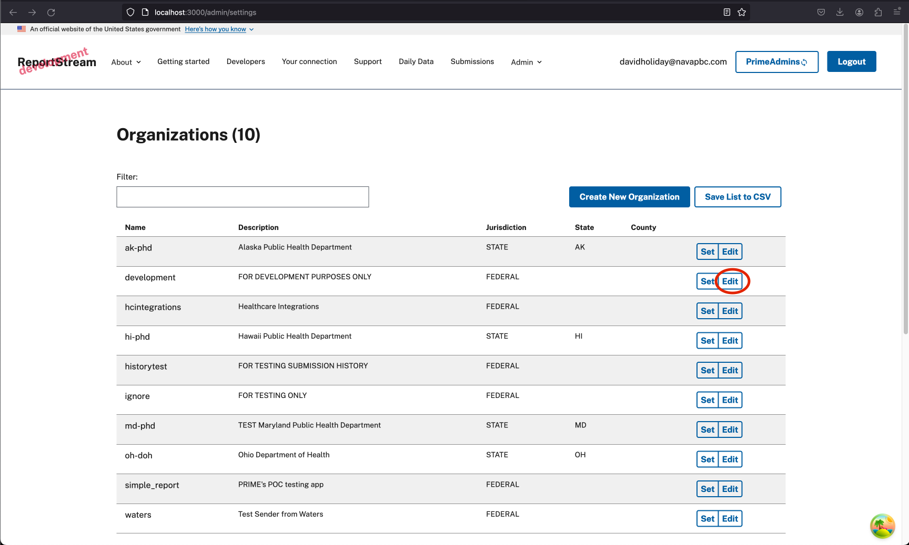
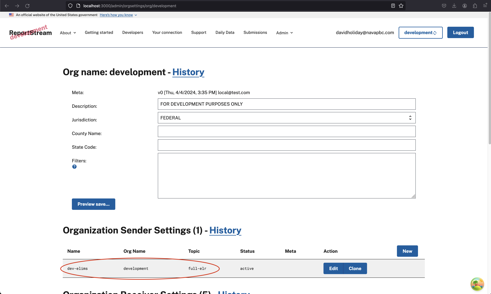
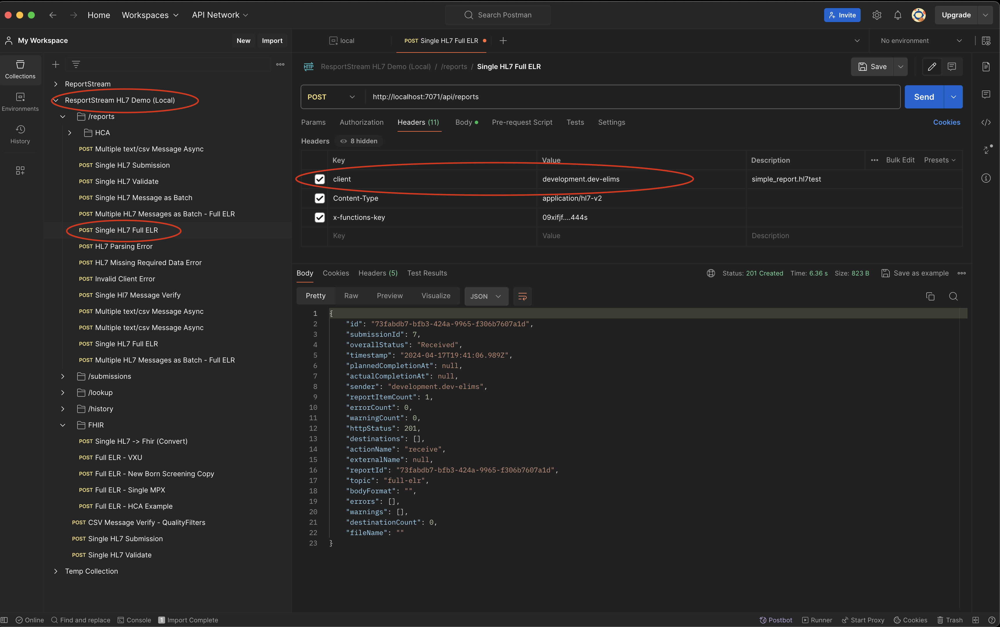

# Getting Started as a ReportStream Developer

## Overview

> These pages are a work in progress, please see the [old pages](../docs-deprecated/getting-started/getting-started.md) if something is
> missing

## Table of contents

- [Table of contents](#table-of-contents)
- [Locally installed software prerequisites](#locally-installed-software-prerequisites)
- [Bulding the baseline](#bulding-the-baseline)
    * [First build](#first-build)
    * [Seed the Postgres db and vault](#seed-the-postgres-db-and-vault)
- [Running ReportStream backend](#running-reportstream-backend)
- [Debugging](#debugging)
- [Running the frontend](#running-the-frontend)
- [Running the static site](#running-the-static-site)
- [Submit a sample message through the app](#submit-a-sample-message-through-the-app)
- [Troubleshooting](#troubleshooting)
- [Next steps](#next-steps)

## Locally installed software prerequisites

You will need to have at least the following pieces of software installed _locally_ in order to be able to build and/or
debug this project:

* [git](./install-git.md) including git-bash if you're on Windows
* [Docker or Docker Desktop](https://docs.docker.com/get-docker/)
* [OpenJDK](./install-openjdk.md) (currently targetting 17)
    * See the linked docs for important instructions on setting `JAVA_HOME`
* [Azure Storage Explorer](https://docs.microsoft.com/en-us/azure/vs-azure-tools-storage-manage-with-storage-explorer)
* An IDE. IntelliJ is recommended for Kotlin/debugging support.

To reduce the build-debug cycle time you can install these tools to run the code directly. These tools are required if
you are using an Apple Silicon computer, otherwise they are optional.

* [Azure Functions Core Tools](../docs-deprecated/getting-started/install-afct.md) (currently targetting 4)
* [AzureCLI](../docs-deprecated/getting-started/install-azurecli.md)
* [Gradle](../docs-deprecated/getting-started/install-gradle.md)
* One or more [PostgreSQL Clients](../docs-deprecated/getting-started/psql-clients.md)

> [!Warning]
> If you are using an Apple Silicon computer you will need to use Gradle as Microsoft's Azure Function Docker image is
> only `amd64` compatible. There are
> also [known issues](https://docs.docker.com/desktop/mac/apple-silicon/#known-issues)
> running Intel Docker images on Apple Silicon. Both approaches to running the project are documented here.
> Many of our local developer tools are set up to run in Docker containers. Looking at our `docker-compose.yml` file,
> the `prime_dev` service does not work on Apple Silicon. Likewise, the `builder` service in
> our `docker-compose.build.yml` does not work.

## Bulding the baseline

### First build

The `cleanslate.sh` script does the base work needed to start developing for ReportStream. It only needs to be run once.
This script runs on Apple processors, but it skips a few steps. We will need to do these missing steps by hand.

1. [Clone the prime-reportstream repository](https://docs.github.com/en/github/creating-cloning-and-archiving-repositories/cloning-a-repository-from-github/cloning-a-repository)
   to your workstation using git.

1. Initialize your environment and run an initial build by running the following command using a Linux shell.
   Note you can run `cleanslate.sh` script to reset your environment as well (run `./cleanslate.sh --help` for more
   information). The `cleanslate.sh` script not only cleans, but also performs a first build and setup of all artifacts
   needed for the build

```bash
cd ./prime-router
./cleanslate.sh
```

<details>
  <summary>Docker Desktop</summary>
* If you are using Docker Desktop, verify that it is running prior to building or running ReportStream locally.
</details>

<details>
  <summary>Gradle/Apple Silicon</summary>

#### Run cleanslate.sh

```bash
# build the project
./cleanslate.sh --verbose
# ...

# Check that a Postgres instance is running
docker ps
# CONTAINER ID   IMAGE         COMMAND                  CREATED          STATUS          PORTS                    NAMES
# 2962fb214203   postgres:11   "docker-entrypoint.s…"   57 minutes ago   Up 57 minutes   0.0.0.0:5432->5432/tcp   prime-router_postgresql_1
```

#### Run support services

ReportStream depends on set of services to be up before running the main Azure service. The `cleanslate.sh` script
starts a Postgres database but skips starting a few more that are otherwise started by default when `cleanslate.sh`
start is run on a non-Apple processor:

- Azurite - a simulator of Azure storage
- Vault - a secret store
- SFTP - an SFTP server
- soap-webservice - SOAP web service emulator

```bash
docker compose -f docker-compose.build.yml up --detach
```

Additionally, to ensure that Vault is running and the credentials are stored correctly, run the following (which is
normally covered by `cleanslate.sh` on non-Apple processors):

```bash
docker compose up --detach vault 1>/dev/null 2>/dev/null
```

You can take down these services by running `./gradlew composeDown` or `docker compose down` command.
For now, leave these services running and open up a new terminal session.
</details>

### Seed the Postgres db and vault

To run tests, the Postgres DB and the credential vault need to be seeded with values.
We will need to have ReportStream running for these steps to work (see previous steps).
Again, we will use a Gradle task to do these steps.

> [!Warning]
> If you are getting a connection error during the `reloadTables` step, you're probably on a mac with the custom Apple
> CPU. Use command `gradlew run` to get the app up and running and try again.

```bash
./gradlew primeCLI --args "create-credential --type=UserPass --persist=DEFAULT-SFTP --user foo --pass pass"
./gradlew reloadTables
./gradlew reloadSettings
```

## Running ReportStream backend

Verify that your docker engine is running prior to building or running ReportStream locally (either Docker Desktop or
through the command line).

Building and running ReportStream requires a locally accessible PostgreSQL database instance that is initially setup and
run by the `cleanslate.sh` script. This database instance runs as a Docker container defined by
the `docker-compose.build.yml` file. You will need to start this database instance upon a workstation reboot by using
the following command:

```bash
cd ./prime-router
docker compose --file "docker-compose.build.yml" up --detach
```

<details>
  <summary>Gradle/Apple Silicon</summary>
Use Gradle to launch ReportStream, as it will set up the environment variables that ReportStream needs. If you are on a Mac with the custom Apple CPU and are following this guide step by step you've already done this step when you seeded Postgres db and vault. 

```bash
./gradlew run
```

ReportStream should continue to run after launching. A successful build will appear like so:

```
<===========--> 90% EXECUTING [46s]
> :azureFunctionsRun
```

A `ctrl-c` will escape the running ReportStream instance.
</details>

> [!TIP]
> The recommended way to rapidly develop on the ReportStream backend is to use `./gradlew quickRun`.
> This command skips some long-running tasks, so use with caution as it will not build the FatJar, run database related
> tasks, or run the tests.

## Debugging

`./gradlew quickRun` or `./gradlew run` will open a debug port on your locally running ReportStream instance.
Connect your debugger remotely to port 5005.
For profiling use the JMX port 9090.

If using IntelliJ, this can be easily configured by first opening the `primer-router` folder as its own project. Create
a Remote JVM Debug Configuration with the port set to `5005`.

## Running the frontend

See the [frontend React docs](../../../frontend-react/README.md) for more information. Once you've done that and want to
log in, __you need to use the same okta credentials you use when logging into the staging or production instances of the
app__.

## Submit a sample message through the app

1. If you haven't already, [download Postman](https://www.postman.com/downloads/) and install it.
   Import [the collections in the postman folder](./postman) into postman.

2. If you haven't already, ensure the app is up and running.

3. Log into the LOCAL instance of the front end app. Use your STAGING CDC okta credentials.

4. In order to send a message, you are going to need to add the "sender id" to the POST header. Click on "edit" on the "
   development" row.



5. The data you seek is under "Organization Sender Settings". The client header is the sender. Concat the org name and
   the sender name should get you a valid value like so `client: development.dev-elims`



6. In postman, open collection `ReportStream HL7 Demo (Local)` and select `POST Single HL7 Full ELR`. Then,
   under `headers` change the client value to `development.dev-elims` and press __Send__. If all went well you'll get an
   HTTP/201 response as shown below.



## Running the static site

## Troubleshooting

## Next Steps

- [Contributing](./contributing.md)
    - _IMPORTANT! You need to do this step before you push any code to the project!_
- [Running ReportStream tests](./running-tests.md)
- [About the azure environment](./azure.md)
- [Working with Docker](./docker.md)
- [Common database commands](./postgres-database.md)
- [PrimeCLI](../prime-cli/README.md)
- [FHIR Functions](./fhir-functions.md)
- [Gradle](./gradle.md)
- [Metabase](./metabase.md)
- [VPN](./vpn.md)
- [Pipeline Configuration](./universal-pipeline-configuration.md)
- [Swagger](./swagger.md)
- [Kotlin](./kotlin.md)
