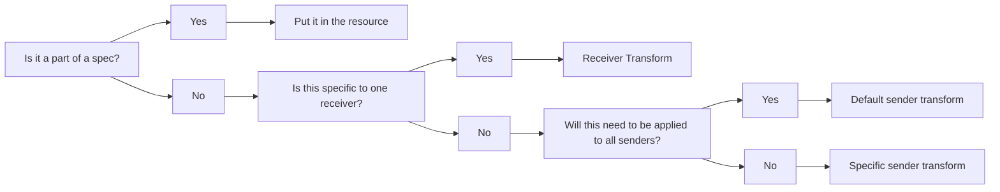

# Changing/Updating Sender/Receiver Transforms

The purpose of this document is to explain where to make a change when you 
need to update a transform. If you need more information please read 
[Convert](../../universal-pipeline/convert.md) for sender transforms and
[Translate](../../universal-pipeline/translate.md) for receiver transforms.

## Choosing the location for a transform

Use the following decision tree when determining where a transform should be performed: 



In short, use a sender transform when data needs to be uniformly adjusted regardless of receiver.
Use a receiver transform if data adjustments are needed for a specific receiver.

## How to configure a transform schema

Transform schemas are have three main sections:
* `extends`: A schema which the current schema extends. All values from the specified schema are loaded before the
  elements in the current schema. If there are common elements, the values in the current schema are used.
* `constants`: A list of constants that are resolved by FHIRPath expressions that are common to all elements in the
  schema.
* `elements`: A collection of individual elements that specify which data is selected for transforms and what transforms
  are performed.

Here's an example of a transform schema (specifically, a sender transform):

```
extends: ../default-sender-transform
constants:
    patientPath: "Bundle.entry.resource.ofType(Patient)"
elements:
    - name: patient-country
      constants:
          elementConstant: '"USA"'
      resource: ‘%patientPath’
      condition: ‘%resource.address.country.exists().not()’
      bundleProperty: ‘%resource.address.country’
      value: [‘%elementConstant’]
      valueSet:
          values:
              Canada: CAN
              United States: USA
    - name: patient-name
      resource: ‘Bundle.entry.resource.ofType(Patient)’
      resourceIndex: patientIndex
      schema: patient-name-schema
```

This example specifies an additional schema, `patient-name-schema.yml`. This additional schema might contain:

```
elements:
    - name: patient-name
      resource: ‘%resource’
      bundleProperty: ‘%resource.name.text’
      value: [‘"First name, last name"’]
```

Each element contains the following properties, listed in order of execution:

- `name` - the name of an element.
- `constants` - constants passed in to FHIR Path evaluations. They are resolved at the time
  an element uses it. These can be specified at the schema level or at the element level. Elements will inherit
  constants defined at their schema level and will overwrite any that have the same name.
- `resource` - the FHIR resource used as focus on all other FHIR Path expressions. Must
  be used with child schema to set the collection to iterate with.
- `condition` - FHIR Path boolean expression that must evaluate to true for the element to
  be evaluated. Conditions can be used to check the value of a bundle property that
  another element may have populated, so it could be used to check the result of a
  previous element (elements must be kept in the correct order for this to work).
- `bundleProperty` - a FHIR Path expression that denotes where to store the value. If the property does not yet exist,
  ReportStream will attempt to create it, though there are restrictions around which types of resources/properties can
  be dynamically created.
- `value` - a list of FHIR Path expressions that evaluates to the proper FHIR Type to be
  assigned to the property specified in the `bundleProperty` element property. The first expression to
  have a value wins. This allows you to set defaults at the end of the list. Cannot be used with `schema`.
- `valueSet` - a list of key value pairs used to convert the value generated by the value property (the key)
  to another value that matches the key. If a `valueSet` is defined and a match is not found, the element in
  `bundleProperty` will not be transformed. Can only be used with `value`. The property name within `valueSet`
  determines the data source; an interface is provided to be able to define additional classes that return the key
  value pairs programmatically. Only one data source can be specified per element.
  The following data sources are available within the Universal Pipeline:
    - `values` - Key value pairs are listed directly in a configuration schema.
    - `lookupTable` - provide `tableName`, `keyColumn`, `valueColumn` to retrieve key value pairs from a lookup table.
- `schema` - the name of a child schema to process. This points to another sender transform schema which will be used
  with this schema's resource as the focus resource. Cannot be used with `bundleProperty`, `value`, or `valueSet`.
- `resourceIndex` - the name of a constant with the index of a resource collection. Useful to
  iterate over multiple resources. Can only be used with `schema`.

## Example


Transforms can be used to standardize data. See this example where a patient `gender` resource is standardized
to a letter code:

```
  - name: patient-sex
    value: [ '%resource.gender' ]
    hl7Spec: [ '%{hl7PIDField}-8' ]
    valueSet:
      values:
        unknown: U
        female: F
        male: M
        other: O
```