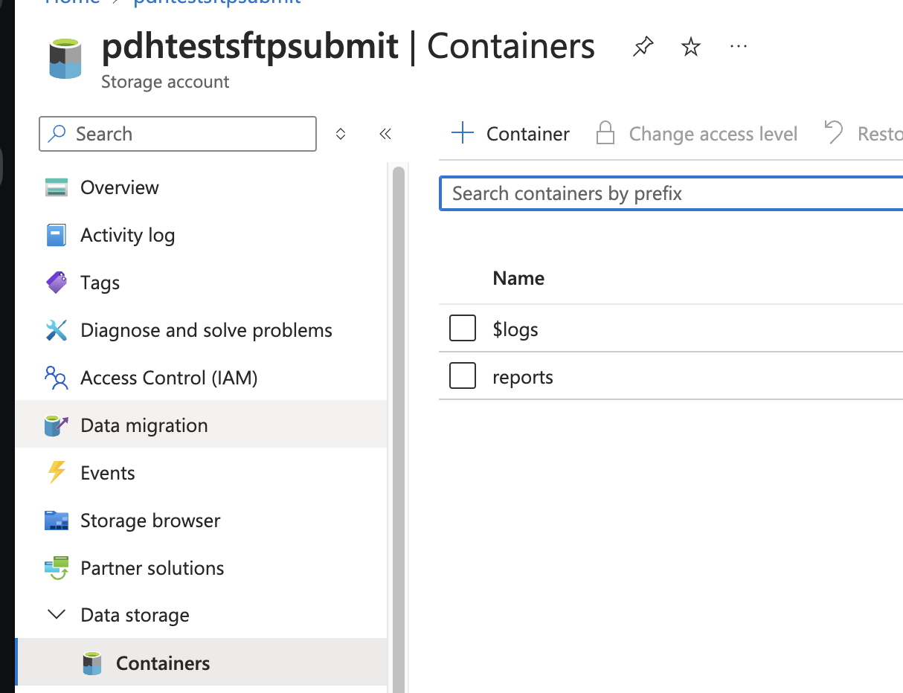
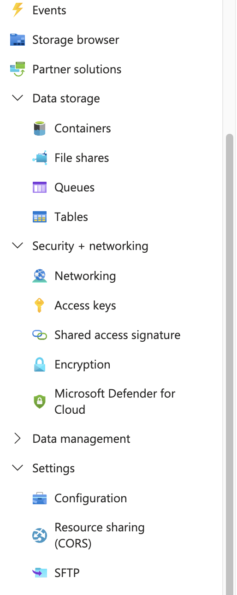
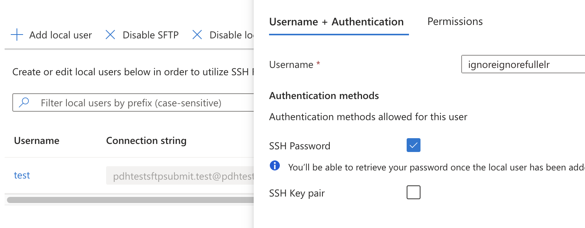
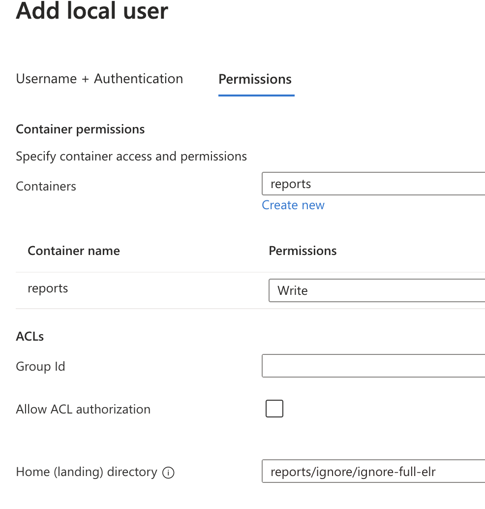

# SFTP Ingestion

Reports can be sent into via ReportStream via SFTP in addition to the REST endpoint.
This functionality is enabled by configuring an Azure storage account with SFTP enabled and an azure function 
(submitSFTP) with a BlobTrigger that consumes reports as they are added.  The sender is then parsed from the filepath.

## Setting up a sender

These steps apply to an already existing azure storage container with SFTP enabled.

1. Create the sender in the settings.
1. Go to the storage container -> containers and create the directory for the sender in the `reports` container
    - The directory structure needs to align with the organization and sender name.  For example, for the `ignore.ignore-full-elr`
   the directory structure should be `reports/ignore/ignore-full-elr`
    - **Note: because this is a directory make sure that the organization and sender name only contains valid characters for a directory**

1. Go to the storage container -> SFTP

1. Create the user for the sender. The username can only contain lower case letters so the recommendation is to combine
the organization and sender. For example: ignoreignorefullelr.  Then check password
1. Check password

1. Go to permissions and grant access to the reports container with the `write` permission and then specify the home 
directory to the one created above

1. Finally, click add and record the generated password that can be shared with the sender.

### Setting up a storage account

In order to set up a user, a storage account needs to be correctly setup for SFTP.  This requires:

- a storage account with StorageV2
- Hierarchical namespace enabled
- SFTP enabled
- Allow access from the public

## External SFTP bucket

This solution can be further leveraged to support senders who are already adding files to an existing SFTP server
and cannot support also adding files to an additional one.  A tool like [MoveIt](https://www.progress.com/moveit/moveit-transfer)
can be configured to move files from the senders bucket to one in the ReportStream's storage account.  This solution
would be simply configuration and not require any additional code.

## Troubleshooting

### Dropped messages

Azure documentation indicates that under very heavy load there is a chance that not all added blobs will trigger a 
submission as the simple implementation relies on log scanning. A more robust implementation is planned with an upgrade
to using Azure Event Grid.

**Note: this is not expected to occur for the usage rates for the initial MVP customer as azure indicates that problems start occuring ~100 blobs/sec**
