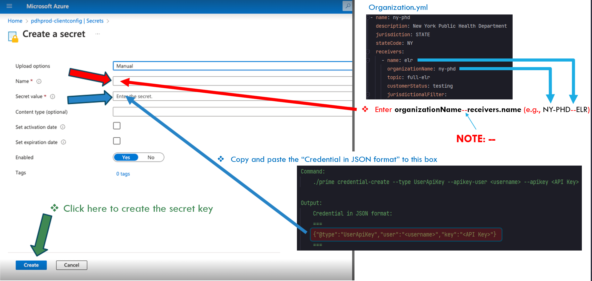

# REST Transport
## Introduction
ReportStream supports four popular transport protocols:  Resource State Transfer (REST), [Simple Object Access Protocol (SOAP)](https://github.com/CDCgov/prime-reportstream/blob/main/prime-router/docs/onboarding-users/transport/soap.md), [Secure File Transfer Protocol (SFTP)](https://github.com/CDCgov/prime-reportstream/blob/main/prime-router/docs/onboarding-users/transport/sftp.md), and [Azure Blob](https://github.com/CDCgov/prime-reportstream/blob/main/prime-router/docs/onboarding-users/transport/blob.md). The goal of this document is to explain how to configure REST Transport for STLTs (a/k/a receivers). As well as provide guidance on how: 
1) ReportStream REST Transport works 
2) Prepare a key for authentication
3) Configure receiver's REST transport
4) Test/check that a connection is successful
#### Assumptions
* First and foremost: This assumes you have credentials with the CDC and have been given access to the Azure portal. If you do not have credentials, and access to the Azure portal, stop here. You cannot go any further.
* This also assumes you have access to KeyBase, and are part of the prime_dev_ops team there.
* Also, we assume you have KeyBase installed, and have in mounted into /Volumes/. If you don't have it mounted as a drive, you can just drag and drop the files into KeyBase. If you feel you should have access to the prime_dev_ops team in KeyBase, contact your dev lead, or the dev ops team lead and request access.
* Finally, this assumes you are working on a Unix-style system such as Linux or MacOS. You can probably do this on Windows as well provided you have a conformant shell with putty and openssl installed. The Git Bash shell would probably do, or the Linux Subsystem for Windows would as well, but no promises are made.
* Have an active Okta admin account.
## 1.) How ReportStream REST transport works
When a STLT message is ready to be sent, ReportStream uploads the message to the STLT's ready queue folder found in Azure Blobstorage (e.g., la-phd.elr, ca-doh.elr, etc.) and then triggers the send queue to start the SendFunction.
<ol type="a">
    <li>Using receiver.TransportType, the SendFunction calls to specific transport service accordingly. In our case, the SendFunction calls to the RESTTransport service.</li>
    <li>Read credential from Azure Vault, RESTTransport uses its Type to determine the authentication type (i.e., UserPass or UserApiKey).  Next, it uses the obtained key to authenticate with the STLT and sends the message payload.</li>
</ol>

## 2.) How to prepare a key for authentication
For authentication, you need to do both step a and step b.
<ol type="a">
<li>Generate the "Credential in JSON format" for authentication</li>

Currently, RESTTransport uses the one of the following options:

      i) UserPass, 
     ii) UserApiKey with JKS
    iii) UserApiKey with two-legged credential type to authenticate and obtain Bearer token from STLT. 
     iv) UserJks
User can use the **primeCLI** command with credential-create option to generate the "Credential in JSON format" as given below.

- With STLT's credential username and password given to us by the STLT, user needs to run the following command to generate the UserPass credential type object:

        Command:
            ./prime credential-create --type UserPass --user <username> --pass <password>
        
        Output: 
            Credential in JSON format: 
            ===
            {"@type":"UserPass","user":"<username>","pass":"<password>"}
            ===

- With STLT's credential username and API Key given to us by STLT, user needs to run the following command to generate the UserApiKey credential type object:
	
          Command:
              ./prime credential-create --type UserApiKey --apikey-user <username> --apikey <API Key>
        
          Output: 
              Credential in JSON format: 
              ===
              {"@type":"UserApiKey","user":"<username>","key":"<API Key>"}
              ===

- With STLT's credential jks-Username, jks-File-Password, and jks-key-file given to us by STLT, user needs to run the following command to generate the UserJks credential type object:
	
        Command:
            ./prime credential-create --type UserJks --jks-use <JKS Username> --jks-file-pass <JKS File Password> --jks-file <PATH to JKS File>
            
        Output: 
            Credential in JSON format: 
            ===
            {"@type":"UserJks","user":"<JKS Username>", "jks":"<JKS Key>"}
            ===

<li>Create Azure Key Vault Secret for STLT</li>

With CDC SU password, login into the **Microsoft Azure** and navigate to the **pdhprod-clientconfig** and select **Secrets** from the menu on the left.  You should see the following screenshot.

Next refer to the above image, click on the  [+ Generate/Import] as the red arrow is pointing to.  You should see the following screenshot. Please follow the instruction given in the image. Note, the naming convention is OrganizationName--Receiver.name (e.g., NY-PHD--ELR).

</ol>

## 3.) How to configure the receiver's REST transport
The receiver's RESTTransport includes the following fields:

    - reportUrl:      The URL to post to. e.g. https://api2.health.ny.gov/services/uphn/V1.0/ECLRSPRE.
    - authTokenUrl:   The URL to get the OAuth token. e.g. https://api2.health.ny.gov/services/uphn/V1.0/auth.
    - authType:       Authentication type i.e two-legged.  It is default to null (API shared key)
    - jwtParams:      The map of parameters for two-legged authentication, consists of "issuer" and "audience" to customize the JWT 
    - tlsKeystore:    The name for the credential manager to get the JKS used in TLS/SSL
    - parameters:     The map of parameters to be sent in the message (use with two-legged OAuth.  See ETOR RESTTransport)
    - headers:        The map of headers to be sent in the message
    - type:           "REST"

    a) See UserPass RESTTransport setting Example below:
        
        OK-PHD--ELR uses UserPass authentication type:
        ==============================================
            transport: !<REST>
              reportUrl: "https://sample.health.ok.gov/api/document/hl7"
              authTokenUrl: "https://sample.health.ok.gov/api/auth/token"
              authType: null
              tlsKeystore: null
              parameters: {}
              headers:
                senderLabName: "CDC PRIME REPORTSTREAM"
                RecordId: "header.reportFile.reportId"
                sourceLabName: "CDC PRIME REPORTSTREAM"
              type: "REST"

    b) See UserApiKey+JKS TLS/SSL RESTTransport setting Example below:

        NY-PHD--ELR uses UserApiKey + JKS TLS/SSL authentication type:
        ==============================================================
            transport: !<REST>
              reportUrl: "https://samplehealth.ny.gov/services/uphn/openapi/V1.0/ECLRSPOST"
              authTokenUrl: "https://samplehealth.ny.gov/token"
              authType: null
              tlsKeystore: "NY-PHD--ELR--JKS"
              parameters: {}
              headers:
                UPHN-INFOMAP: "{\"properties\":\"labClia=10DRPTSTRM,target=NYS,content=L,format=HL7\"\
                  }"
              type: "REST"

    c) See UserApiKey+Two-legged RESTTransport setting Example below:

        FLEXION--ETOR-SERVICE-RECEIVER uses UserApiKey + Two-legged authentication type:
        ================================================================================
            transport: !<REST>
              reportUrl: "https://sample.net/v1/etor/orders"
              authTokenUrl: "https://sample.net/v1/auth/token"
              authType: "two-legged"
              jwtParams:
                iss: "fake-issuer-123"
                aud: "https://giveme.a/oauth2/token"
              tlsKeystore: null
              parameters:
                scope: "report-stream"
                client_assertion: "client_secret"
              headers:
                senderLabName: "CDC PRIME REPORTSTREAM"
                RecordId: "header.reportFile.reportId"
                sourceLabName: "CDC PRIME REPORTSTREAM"
              type: "REST"

    d) See UserApiKey without OAuth RESTTransport setting Example below:

        FLEXION--ETOR-SERVICE-RECEIVER uses UserApiKey
        ================================================================================
            transport: !<REST>
              reportUrl: "https://sample.net/v1/etor/orders"
              authType: "apiKey"
              tlsKeystore: null
              headers:
                Content-Type: "elims/json"
              type: "REST"

    e) See JKS without OAuth RESTTransport setting Example below:

        CA-DPH--FULL-ELR-REST-JKS uses UserJKS
        ================================================================================
            transport: !<REST>
              reportUrl: "https://sample.net/v1/etor/orders"
              authType: "jks"
              tlsKeystore: "jks"
              tlsKeystore: "CA-DPH--FULL-ELR-REST-JKS"
              headers:
                Content-Type: "text/plain"
              type: "REST"

## 4. Final Step is to test/check the receiver's REST transport is connected successfully
Now that you have completed/created REST Transport setting please do the following:
- Create PR - which includes the receiver's setting code
- PR gets approved
- Create the setting for staging environment

Login staging OKTA account

    ./prime login --env staging

Create a setting in staging environment by running the primeCLI command below:
(e.g., Assumming you are creating the setting for OK-PHD.ELR with setting file name ok-phd-setting.yml)

    ./prime multiple-settings set --env staging --input ./settings/staging/ok-phd-setting.yml

Head to https://staging.reportstream.cdc.gov/, login, and select the Organization setting from Admin dropdown menu as show below:

Search for the organization as show below:

Click on check as show below:

Click on start and you should see screenshot below:

		