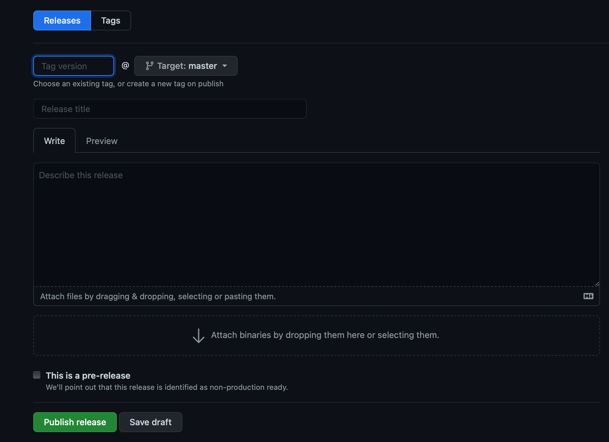

# Background

To date, the PRIME Data Hub has used the following flow for code undergoing development, testing, and production:

> `feature_branch(es)` --> `master` --> `production`

While this flow has served its purpose for the testing and validation of software changes before deployment to production, a simpler workflow that allows for the versioning of the platform is a necessary next step in its maturation.

# Goals

The goal of this proposal is to 1) simplify the flow of code from development to production and 2) to employ versioning for a clear lineage and changelog throughout the platform's lifecycle.

# Proposal

## Versioning

Versioning of the PRIME Data Hub platform can be discerned in two ways - this proposal will focus on the first point:
  - The overall version of the platform
  - The version of the platform's constituent components

The overall platform should be versioned in a temporally distinct way, yet allowing for multiple production releases within a single calendar day.  The proposed format is as follows:

> YYYY.0M.0D_MICRO

|YYYY|0M|0D|MICRO
|---|---|---|---|
|Full year|Zero-padded month|Zero-padded day|Release number|
|2019, 2020, ...|01, 10, ...|01, 30, ...|0, 1, 2, ...

The proposed versioning scheme is based off of `Calendar Versioning`1.  A separate proposal may leverage `Semantic Versioning`2 to add granularity to the individual components within the PRIME Data Hub platform.

## Git Flow

To simplify the flow of code from development to the test and production environments, the proposed flow will be:

> `feature_branch(es)` --> `master`

The `master` branch will remain protected in that:
  - It cannot be pushed to directly
  - A pull request must be submitted from the feature branch
  - The pull request must be approved by ≥ 1 reviewer prior to being merged into the `master` branch

Upon the creation of a pull request, the `staging_build` workflow will be triggered to build and test the changes that would result from the pull request being merged.

Upon merge, the GitHub actions `staging_release` workflow will be triggered to deploy to the `prime-data-hub-staging` resource group within Azure.  The merged changes should then be thoroughly tested within the cloud environment.

This proposed flow is based off of the `GitHub Flow`3.

## Production Release

When a collection of features is deemed ready for production deployment, a release should be published.  Upon publish, the `prod_release` workflow will be triggered to deploy to the `prime-data-hub-prod` resource group within Azure.

To create a release, navigate to the `Create a new release` link on the right-hand side of the main GitHub repository page.  Enter the appropriate version, title, and description and click `Save draft`.  The title should be a succinct overview of the theme(s) surrounding each release.  The description should contain a detailed change log describing the changes that were made to the platform.  A second person should then review the release for clarity and completeness before the release is published.

# References

1. [Calendar Versioning](https://calver.org)

2. [Semantic Versioning](https://semver.org)

3. [GitHub Flow](https://guides.github.com/introduction/flow/)
