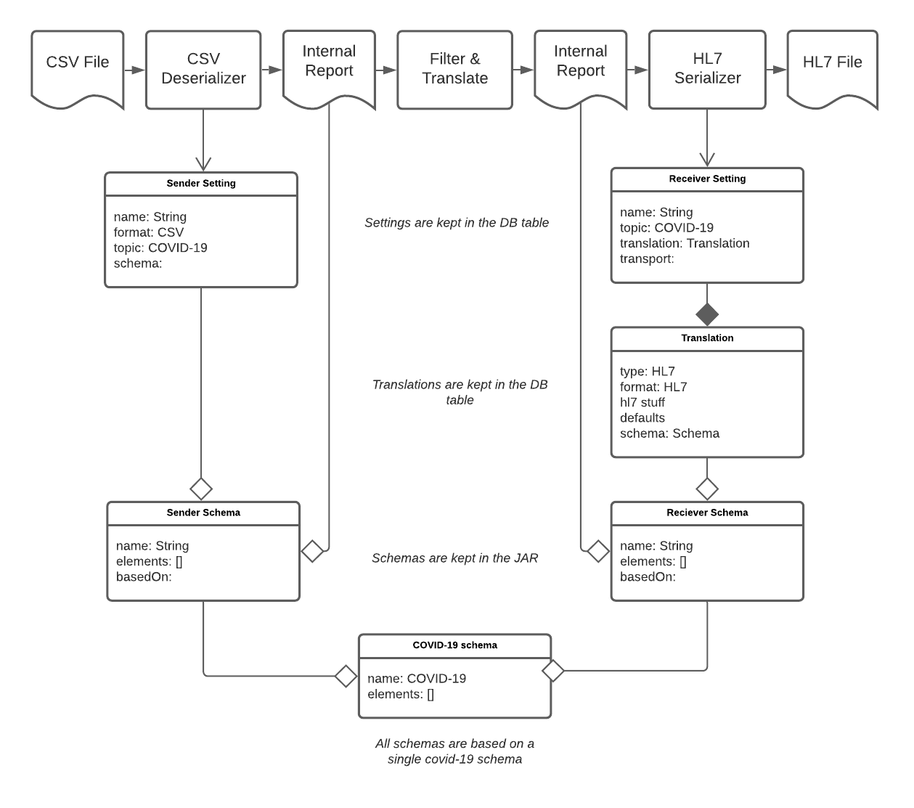
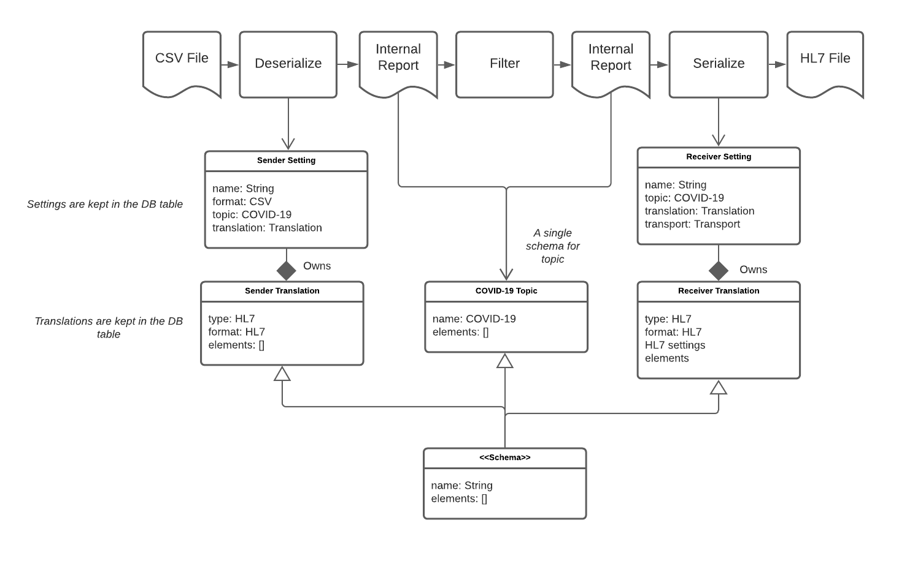

# A Translations does Everything a Schema can do

## Goals

As the ReportStream project expands from COVID-19 reporting to general ELR reporting and other data flows, there is an opportunity to simplify the engineering and operation of the pipeline. In particular, this proposal aims to:
1. To reduce on-boarding costs by supporting more sender and receiver on-boarding without code changes.
2. To minimize test and development cost, remove some generalizations that have not been proven useful.
3. To improve maintainability, use fewer but more consistently applied concepts.

## Today
The diagram below lists the three significant steps involved in the ReportStream pipeline: deserialization to read in a file with a specific format, translation of a report to a new schema, serialization of the report to a file with a specific format.

Different entities control each step as drawn below. All three stages use one or more schema objects. The translation, a format-specific set of configurations, was the latest addition to the entity list.

## Criticism
After about six months of experience with the current pipeline, the team has discussed many issues. The subset that this proposal deals with are:

1. Schema modification is complex logistically, requiring a production rollout. Settings and Translations are the current solutions to this logistic problem, but they are less expressive than Schemas. Often both settings and schema modifications are needed to onboard a state or sender.
2. There isn't the equivalent of the Translation concept for senders.
3. Because any schema can translate theoretically to any other schema, there is an n-squared testing matrix and verification problem. The current tests execute some combinations, but not all.
4. In a similar vein, each schema can be for serialization and deserialization. In practice, schemas are either used for input or output, but not both. It can be difficult to design a schema that work in both directions. 

## Solution
The proposed concept is diagrammed below.  

1. Resolve the schema vs. translation tension by making translations more powerful, allowing translations to define and extend elements for a particular receiver.
2. Schema becomes an interface that is implemented by translations. 
3. Accordingly, add sender translation types for the same purpose.
4. There no longer needs to be sender or receiver schemas; just a master list of elements per topic.
5. Define a `.topic` file type. There no longer is a need for a `.schema` file. 
6. Likewise, eliminate the need to check in and generate schema docs.
7. Eliminate the based-on concept. Every translation must have all the elements of the topic's schema.
8. Avoid the n^2 testing problem by defining translations as either sender or receiver translations and guaranteeing that each translation works to the common elements.
9. Add a least one test file per translation.

The work would be staged in several PRs, roughly based on the steps of the solutions.

### Details

The solution outlined creates a new set of `Translation` classes, one for each serializer and deserializer class.
The current `HL7Translation` and `RedoxTranslation` would not change. 
However, the `CustomTranslation` would be removed or replaced by a new `CSVTranslation`. 
Much like the current `HL7Translation`, this new `CSVTranslation` could have settings like empty values and date formats that affect the whole conversion. 

In addition, it makes sense to move the format specific information in `Element` class, the `csvFields` and the `hl7Fields`, to their respective translation objects. This move will simplify the schema.

A new set of input translations would be created as well. It is anticipated that each new CSV sender will create a new `CSVInputTranslation` object with a list of their current fields. HL7 senders should not need

## Alternatives Considered
A smaller scope proposal for on-boarding new senders is possible. However, tackling both the deficiency in translations and the testing matrix problem together proved to be synergistic.

## Further Work
This proposal does not touch the Schema Element class, but one could make a similar proposal for this class and its associated structures. Likewise, filtering and routing improvements are not addressed. 