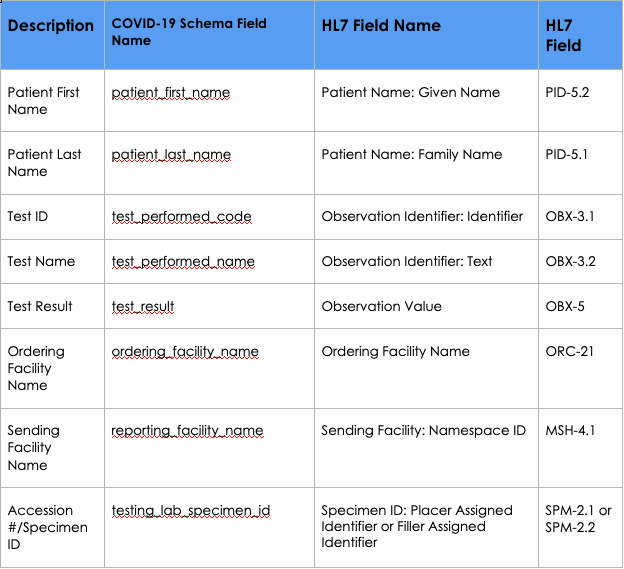
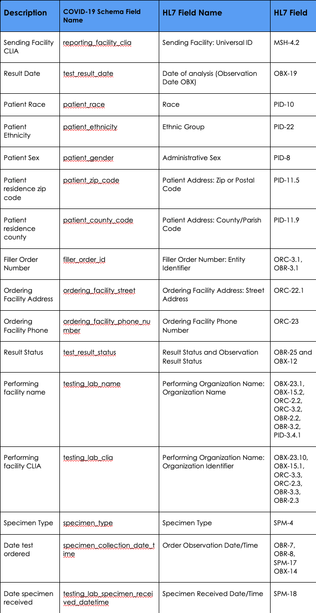
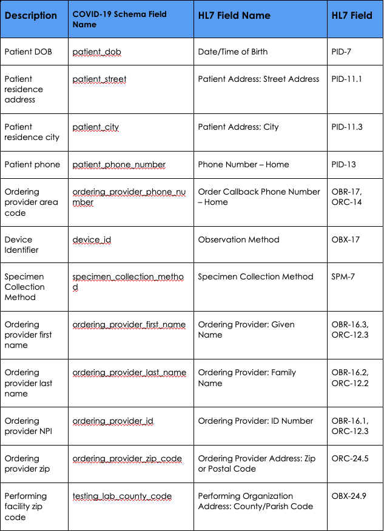
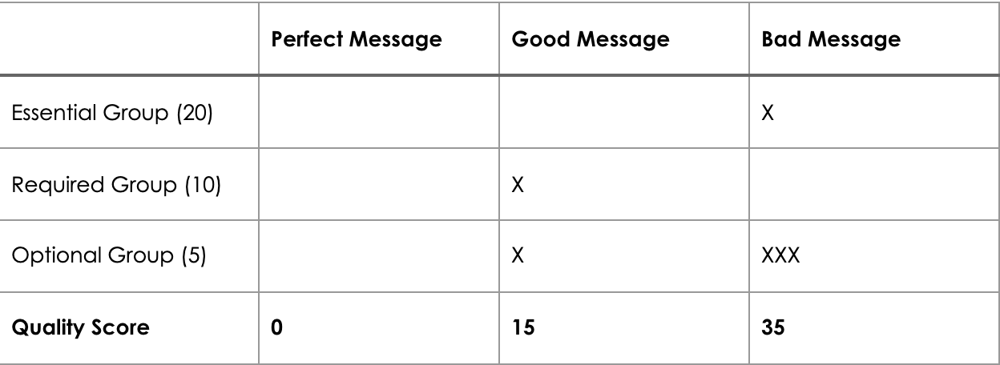

# Data Quality Scoring

## Introduction
The base goal of an ELR message is to transfer information describing a testing event. 
The impact of that information depends entirely on the data quality. In this context data 
quality represents how closely aligned the content of the message is to what is expected 
by public health jurisdictions for test reporting requirements. While those expectations 
can vary between jurisdictions, there are commonalities across jurisdictions to be 
examined.

## Use Cases
1. Measure quality of incoming data from senders to compare senders and monitor quality overtime
2. Measure quality of outgoing data then compare incoming quality to outgoing quality to gauge
the value-added by ReportStream data formatting and cleansing features

## Analysis
In public health, data quality can be delineated by methodology: on-site assessment and
remote review. This proposal only aims to remote review through automated means using
the ReportStream application. The quality scoring feature will be built into ReportStream
to review quality of data reported from all sources.

This document describes the areas that will be used to gauge data quality and determine a Quality 
Score. For data quality purposes, message fields can be grouped into three categories: 
Essential, Required, Optional. Additionally, reporting latency and usefulness are important ELR metrics.

### Essential Fields
All fields are useful in some capacity, but some are essential such that when absent the message 
can no longer be used for public health purposes. These fields include:



### Required Fields
Required fields include fields identified by the HL7 2.5.1 R2 standard for public health ELR as 
required as well as the CARES Act Section 18115. While essential fields fall into this category 
as well, this document separates those fields above due to their unique importance. The required, 
but non-essential, fields include:



### Optional Fields
Optional fields include fields identified by the HL7 2.5.1 R2 standard for public health ELR as optional.



### Scoring Metrics
#### Completeness
A simple test for on or off. Is there a values present in the expected field or is the field blank.

#### Accuracy
Some required fields are use should only include values present in a reference table (ex. LOINC and SNOMED). 
Accuracy in those fields will test if the values reported are in the expected format. Fields where the accuracy
test can be applied:

- Essential Fields
  - Observation Identifier (Test Type)
    - Valid LOINC Code
    - Valid LOINC Description
  - Observation Value (Test Result) if Observation type is CE or CWE
    - Valid SNOMED Code
    - Valid SNOMED Description

- Required Fields
   - Sending Facility CLIA
     - Valid CLIA
   - Test Result date
     - Valid non-future date
   - Patient residence zip code
     - Valid Zip Code
   - Patient residence county
     - Valid County 
   - Ordering Facility Phone
     - Number of digits is correct
   - Performing facility CLIA number
     - Valid CLIA
   - Specimen Source
     - Use appropriate LOINC, SNOMED-CT, or SPM-4 codes, or equivalently detailed alternative codes
   - Date test ordered
     - Valid non-future date
   - Date specimen collected
     - Valid non-future date
   - Date specimen received
     - Valid non-future date
   - Patient age
     - Positive number
    
- Optional Fields
  - Patient DOB
    - Valid non-future date 
  - Patient phone
    -  Correct number of digits
  - Ordering provider phone
    - Correct number of digits
  - Observation Method (Device ID OBX-17)
    - Value in LIVD table
  - Equipment Instance Identifier (OBX-18)
    - Value in LIVD table
  - Date of analysis (Observation Date OBX)
    - Valid non-future date
  - Ordering provider NPI (as applicable)
    - Valid NPI number
  - Ordering provider zip
    - Valid zip code
  - Performing facility zip code
    - Valid zip code

## Proposal

Being that ReportStream is an ETL tool the data will be transformed by processes in the system and 
thus the quality may differ between input and output. I propose first that we measure quality in the 
COVID-19 schema. 

### Scoring System

The scoring system will be based on points with a threshold value. The threshold value will 
have a standard default, or it can be set for each organization. Each group listed above 
(Essential, Required, Optional) are assigned a point value. To start we will analyze the data using 
the completeness and accuracy metrics. Starting with a total value of zero, when that field fails a 
test the point value for its group is added to the total value. The sum total value creates the quality 
score. The quality score is then compared to the threshold value. A high score is bad! If the quality 
score is above or equal to the threshold then the message should be considered below quality.

#### Example


* Each X represents a failure of a completeness or accuracy test

* Default Threshold = 20

The perfect message had zero missing or inaccurate fields and thus a perfect score of zero! The good message was 
missing one field in the required group and one in the optional group. That resulted in a quality score 
of 15 with is below the threshold so it passes the quality scoring! The bad message was missing a field 
in the essential group and three in the optional group resulting in a scored of 35. You can see that if 
a message arrives with any essential field missing the value then the Default threshold(20) would be met.

### Implementation

To begin data quality should be measured against the COVID-19 schema. To do so, a new element(dataQuality)
should be created that can be added to the various fields listed above. That element would allow for fields
to be identified as the appropriate priority category(Essential, Required, Optional) and include the appropriate 
completness or accuracy tests. Example:

```
- name: patient_zip_code
  type: POSTAL_CODE
  pii: false
  cardinality: ZERO_OR_ONE
  natFlatFileField: Patient_zip_code
  hhsGuidanceField: Patient residence zip code
  hl7Field: PID-11-5
  documentation: The patient's zip code
  dataQuality:
    - priority(essential)
    - notNull()
    - isZipCode()
```

The dataQuality element would need to take in the priority level for the field. Next different tests could be 
made available. These tests would include:

| test | Description |
| ----------------- | ----------------- |
| isNull() | is there a value in the field |
| isZipCode() | is this a valid zip code |
| isValidDate() | is this date valid and in the past |
| isCLIA() | does this CLIA exist |
| isSNOMED() | does this SNOMED exist |
| isSNOMEDDescription() | does SNOMED description align with SNOMED code |
| isLOINC() | does this LOINC exist |
| isLOINCDescription() | oes LOINC description align with LOINC code |
| isPhone() | properly formatted phone number |
| inLIVD() | value in LIVD table |
| isNPI() | value is valid NPI |

Each test would contribute to towards the total data quality score. A new function would calculate the score and 
a new field would be needed in the COVID Result Metadata table to hold the total score. At that point the score
could be used in further analysis over time.

### Implementation Risks

If the scoring logic changes at any point after the initial production launch, all prior scores would need to
be accounted for. Since a few of the fields (Patient name, dob, phone) are PII and cannot be retained long term, the 
score cannot be recalculated following the logic changes. So if a change is required, then all past scores should be 
voided. A potential solution is to replace the score with a general value such as a grade (A, B, C, etc). 

## Future Consideration

Data analysis is not a new concept and is important to all data systems. As such, there are data analysis 
frameworks and libraries that could be investigated and implemented to build a richer data-analytics environment.
If we begin with the implementation described above I think the users may quickly see the potential. Do we need
to re-invent the wheel? Or is there an opportunity to use existing tools?