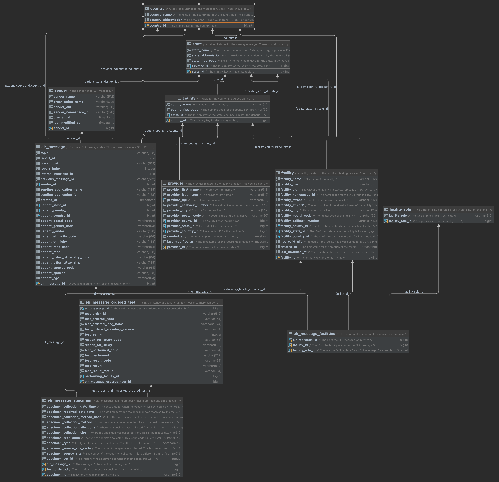

# Metadata Table Reorganization
2022 November 03

## Background
At the beginning of the PRIME ReportStream project we endeavored to create a website that STLTs could use to review some basic metadata about their feed that included an aggregation of sending facilities, their CLIAs, and counts of test events per file. The original implementation of this involved reading the actual content of the report files and extracting that data in real-time. This was not sustainable.

The original `CovidResultMetadata` table was an attempt to capture that data, as well as additional other non-PII demographic data from the test results we were receiving to not only provide the aggregated test information to STLTs, but also to see rough trends by state or by county, or to aggregate data by patient demographics. This was a big leap forward for those needs, but the table quickly revealed a second use: customer support.

Very soon after we started collecting test event information we realized that the table was beneficial for conducting investigations into customer support questions. Because the data in the table was created on the ingestion of the data (as opposed to batching or delivery), we were able to use this to collection information for STLTs. Common support inquiries included things like:

- How many facilities are reporting to me?
- What are all of the CLIAs of facilities reporting to me?
- How many messages were sent on a specific day?
- What kinds of tests are being used?

The `CovidResultMetadata` table proved useful to diagnosing issues with decoding sender test names via the LIVD table, and monitoring the overall health of the application.

Unfortunately, as the volume in ReportStream has grown, the deliberately denormalized structure of the data has proven to be unwieldy. Attempts to do clean-up and put some rigor around the data have only temporarily alleviated the issues we are experiencing. It is difficult to query the table at this juncture, and slow, and no amount of indexing will correct that. This has been known for a while, but we have not been able to remediate these issues. We are now overdue, and as we face the coming release of the Universal Pipeline which can handle all manner of ELR messages, we need to prioritize this work.

## Requirements

- The new table structure must be able to capture incoming ELR messages of any type, not just SARS-CoV-2 or hMPXv
- It must be flexible enough to accept incomplete data because we receive data that is
    - Deidentified
    - Low or very low quality, for example OTC records
    - Non-standardized, for example, not all jurisdictions or senders will use correct or standardized values for CE and CWE segments
    - From non-US jurisdictions
    - Non-human data (potential future use case)
- Minimize the amount of duplication to the barest minimum
- Maximize our ability to use indexing, foreign keys, etc
- Not impact the existing codebase or Metabase in any way
- Have zero disruption when deployed

## Proposed Solution

Please refer to the below diagram which shows a proposed reorganization of the data that currently exists in the CovidResultMetadata and ElrResultMetadata tables.

## Examples

## Further Work