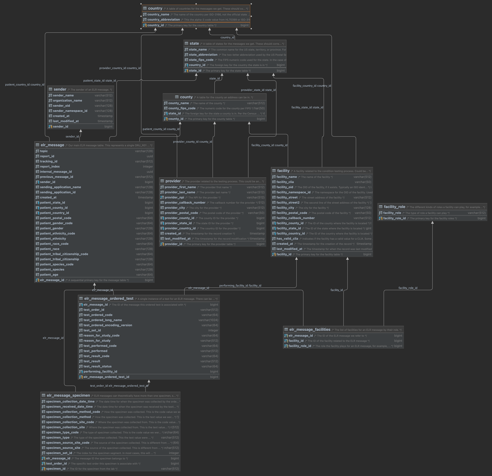

# Metadata Table Reorganization
2022 November 03

## Background
At the beginning of the PRIME ReportStream project we endeavored to create a website that STLTs could use to review some basic metadata about their feed that included an aggregation of sending facilities, their CLIAs, and counts of test events per file. The original implementation of this involved reading the actual content of the report files and extracting that data in real-time. This was not sustainable.

The original `covid_result_metadata` table was an attempt to capture that data, as well as additional other non-PII demographic data from the test results we were receiving to not only provide the aggregated test information to STLTs, but also to see rough trends by state or by county, or to aggregate data by patient demographics. This was a big leap forward for those needs, but the table quickly revealed a second use: customer support.

Very soon after we started collecting test event information we realized that the table was beneficial for conducting investigations into customer support questions. Because the data in the table was created on the ingestion of the data (as opposed to batching or delivery), we were able to use this to collection information for STLTs. Common support inquiries included things like:

- How many facilities are reporting to me?
- What are all of the CLIAs of facilities reporting to me?
- How many messages were sent on a specific day?
- What kinds of tests are being used?

The `covid_result_metadata` table proved useful to diagnosing issues with decoding sender test names via the LIVD table, and monitoring the overall health of the application.

Unfortunately, as the volume in ReportStream has grown, the deliberately denormalized structure of the data has proven to be unwieldy. Attempts to do clean-up and put some rigor around the data have only temporarily alleviated the issues we are experiencing. It is difficult to query the table at this juncture, and slow, and no amount of indexing will correct that. This has been known for a while, but we have not been able to remediate these issues. We are now overdue, and as we face the coming release of the Universal Pipeline which can handle all manner of ELR messages, we need to prioritize this work.

Furthermore, we have duplicated many of the same bad decisions present in the `covid_result_metadata` table in the `elr_result_metadata` table, which was intended to be a more generic table that accepted and tracked more data. It currently contains a much lower volume of data, so while it is currently performant, long-term it also would not be usable.

## Requirements

- The new table structure must be able to capture incoming ELR messages of any type, not just SARS-CoV-2 or hMPXv
- It must be flexible enough to accept incomplete data because we receive data that is
    - Deidentified
    - Low or very low quality, for example OTC records
    - Non-standardized, for example, not all jurisdictions or senders will use correct or standardized values for CE and CWE segments
    - From non-US jurisdictions
    - Non-human data (potential future use case)
- Minimize the amount of duplication to the barest minimum
- Maximize our ability to use indexing, foreign keys, etc
- Represent the hierarchical structure of HL7 and FHIR ELR messages
- Not impact the existing codebase or Metabase in any way
- Have near-zero disruption when deployed

## Proposed Solution

Please refer to the below diagram which shows a proposed reorganization of the data that currently exists in the CovidResultMetadata and ElrResultMetadata tables.



There are a few pieces to this work that I will briefly outline here and then go into deeper detail. There are two stages to this work, one set that is immediate, and then a second stage that will come later. They are identified as `Phase 1` and `Phase 2`.

### Solution Outline

#### Phase 1
This work will happen almost immediately in an effort to prepare for the Universal Pipeline

1. Create the agreed upon table structure that will meet the requirements above
2. Create a stored procedure that takes the data it is given, and then handles the separation and normalization of the data as needed
    - This stored procedure will in the short term do the insert into the existing tables as well, so there's no disruption to existing the existing process. 
    - Create a flag in the database as a configuration setting that controls whether to insert into the legacy table or not 
3. Create a script that will migrate existing legacy data from the `covid_result_metadata` and `elr_result_metadata` tables into the new table structure
4. Create two materialized views, one named `covid_result_metadata` and one named `elr_result_metadata` that will exactly replicate the layout of the current tables in order to prevent breakage of any dashboards in Metabase or existing queries
    - As part of this, the two existing tables will be renamed but preserved for some period of time until we can be sure we have not lost any data

#### Phase 2
This work will happen as a second step, hopefully in Q1 2023, and reflect a move towards more independent microservices. On ingestion, ReportStream will invoke a separate Azure function that will queue up messages to process, which will then be saved into our metadata tables. The goal is to separate the concerns of processing from the goal of tracking metadata from the messages we receive.

1. Create a new independent queue in distinct namespace that will hold the raw messages to be processed
2. Create a separate Azure function that will accept the message and process the contents of the queue

### Discussion
By implementing these changes, repeated information like facility details, provider information, as well as geographic information can be cleaned up and more easily indexed. In addition, we are able to collect more complex information in this structure, for example a message having multiple AOE questions, or multiple specimens, or multiple ordered tests. We also can begin to build in more advanced data verification, such as checking CLIAs or NPIs. We also have the option to extend out features like our address enrichment by adding things like census tract details and ZIP+4.  

### Link to the proposed changes
You can review the currently proposed SQL changes here, or at the bottom in Appendix 1:


## Further Work
Once feedback has been provided about the structure of the tables and the plan above, any proposed changes will go through an acceptance/rejection process, and then the actual changes will be put into a PR for a final review. This document has been created on 3 November 2022, and will be reviewed at the developer sync on Monday, 7 November 2022 with a targeted proposal acceptance date of 14 November 2022. At that point the work will begin on Phase 1 with an expected completion date of 21 November 2022. Start and completion date for Phase 2 TBD.

It should also be noted that this work is not to make a system of record for the CDC or for our STLT partners. We are still only acting as a hub for the transferring of data. That said, having the ability to provide usage and demographic data to our senders and receivers means we provide a richer and better experience for our users, and it empowers our support staff.

## Appendix 1

```postgresql
/**
    Changes to the metadata tables, unifying them to a single normalized view
    Part of proposal 0017-metadata-table-cleanup
    Maurice Reeves - qva8@cdc.gov
    3 November 2022
*/

-- create a country table
create table country
(
    country_id                  bigserial not null primary key
    , country_name              varchar(512) not null
    , country_abbreviation      varchar(50) not null
);

comment on table country is
    'A table of countries for the messages we get. These should correspond to the ISO-3166 list';
comment on column country.country_id is
    'The primary key for the country table';
comment on column country.country_name is
    'The name of the country per ISO-3166, not the official state name value';
comment on column country.country_abbreviation is
    'This the alpha-3 code value from HL70399 or ISO-3166, for example USA not US';


-- a table with state values
create table state
(
    state_id                    bigserial not null primary key
    , state_name                varchar(512) not null
    , state_abbreviation        varchar(50) not null
    , state_fips_code           varchar(50) null
    , country_id                bigint not null references country(country_id)
);

comment on table state is
    'A table of states for the messages we get. These should correspond to the USPS values for States, when dealing with US states.';
comment on column state.state_id is
    'The primary key for the state table';
comment on column state.state_name
    is 'The common name for the US state, territory, or province. For example, use Pennsylvania instead of The Commonwealth of Pennsylvania';
comment on column state.state_abbreviation is
    'The two-letter abbreviation used by the US Postal Service, or the correct abbreviation for Canadian addresses';
comment on column state.state_fips_code is
    'The FIPS numeric code used for the state. In the case of Canadian provinces, this would be null.';
comment on column state.country_id is
    'The foreign key for the country the state is in';


-- a county table
create table county
(
    county_id                   bigserial not null primary key
    , county_name               varchar(512) not null
    , county_fips_code          varchar(50) null
    , state_id                  bigint not null references state(state_id)
);

comment on table county is
    'A table for the county an address can be in.';
comment on column county.county_id is
    'The primary key for the county table';
comment on column county.county_name is
    'The name of the county';
comment on column county.county_fips_code is
    'The numeric code for the county per FIPS';
comment on column county.state_id is
    'The foreign key for the state a county is in. Per the Census Bureau no county can cross state lines';


-- a facility could exist in multiple roles: ordering facility, testing facility,
-- but in the future it could also be a servicing facility for vaccines or patient care
-- at a hospital
create table facility_role
(
    facility_role_id                    bigserial not null primary key
    , facility_role                     varchar(512) not null
);

comment on table facility_role is
    'The different kinds of roles a facility can play, for example an ordering facility, a reporting facility, etc';
comment on column facility_role.facility_role_id is
    'The primary key for the facility roles';
comment on column facility_role.facility_role is
    'The type of role a facility can play';

-- insert the first few rows
insert into facility_role (facility_role) values ('ordering');
insert into facility_role (facility_role) values ('testing');
insert into facility_role (facility_role) values ('reporting');


-- a unified list of facilities
-- TODO: should we separate out the address from the facility? can a facility have more than one address?
create table facility
(
    facility_id                         bigserial not null primary key
    , facility_name                     varchar(512) not null
    , facility_clia                     varchar(50) null
    , facility_oid                      varchar(512) null
    , facility_namespace_id             varchar(512) null
    , facility_street                   varchar(512) null
    , facility_street2                  varchar(512) null
    , facility_city                     varchar(128) null
    , facility_postal_code              varchar(50) null
    , facility_callback_number          varchar(512) null
    , facility_county_id                bigint null references county(county_id)
    , facility_state_id                 bigint null references state(state_id)
    , facility_country_id               bigint null references country(country_id)
    , has_valid_clia                    boolean not null default true
    , created_at                        timestamp default current_timestamp
    , last_modified_at                  timestamp default current_timestamp
);

comment on table facility is
    'A facility related to the condition testing process. Could be a lab, or a non-traditional testing site';
comment on column facility.facility_id is
    'The primary key for the facility table';
comment on column facility.facility_name is
    'The name of the facility';
comment on column facility.facility_street is 'The street address of the facility';
comment on column facility.facility_street2 is 'The second line of the street address of the facility';
comment on column facility.facility_city is 'The city for the facility';
comment on column facility.facility_postal_code is 'The postal code of the facility';
comment on column facility.facility_county_id is 'The ID of the county where the facility is located';
comment on column facility.facility_state_id is 'The ID of the state where the facility is located';
comment on column facility.facility_country_id is 'The ID of the country where the facility is located';
comment on column facility.has_valid_clia is
    'Indicates if the facility has a valid value for a CLIA. Some facilities will have a CLIA assigned by a PHA but is not actually valid';
comment on column facility.facility_oid is
    'The OID of the facility, if it exists. Typically an ISO identifier.';
comment on column facility.facility_namespace_id is
    'The namespace for the OID of the facility. Used in HD designators';
comment on column facility.created_at is 'The timestamp for the creation of the record';
comment on column facility.last_modified_at is 'The timestamp for when the record was last modified';


-- our providers
create table provider
(
    provider_id                         bigserial not null primary key
    , provider_first_name               varchar(512) not null
    , provider_last_name                varchar(512) not null
    , provider_npi                      varchar(512) not null unique
    , provider_callback_number          varchar(512) null
    , provider_city                     varchar(512) null
    , provider_postal_code              varchar(50) null
    , provider_county_id                bigint null references county(county_id)
    , provider_state_id                 bigint null references state(state_id)
    , provider_country_id               bigint null references country(country_id)
    , created_at                        timestamp default current_timestamp
    , last_modified_at                   timestamp default current_timestamp
);

comment on table provider is
    'The provider related to the testing process. This could be an actual medical provider, but could also be a business or a non-traditional testing site.';
comment on column provider.provider_id is
    'The primary key for the provider table';
comment on column provider.provider_first_name is
    'The provider first name';
comment on column provider.provider_last_name is
    'The provider last name';
comment on column provider.provider_npi is
    'The NPI for the provider';
comment on column provider.provider_callback_number is
    'The callback number for the provider';
comment on column provider.provider_city is
    'The city for the provider';
comment on column provider.provider_postal_code is
    'The postal code of the provider';
comment on column provider.provider_county_id is
    'The county ID for the provider';
comment on column provider.provider_state_id is
    'The state ID for the provider';
comment on column provider.provider_country_id is
    'The country ID for the provider';
comment on column provider.created_at is 'The timestamp for the record creation';
comment on column provider.last_modified_at is 'The timestamp for the record modification';


-- the sender of the message
create table sender
(
    sender_id                           bigserial not null primary key
    , sender_name                       varchar(512) not null
    , organization_name                 varchar(512) not null
    , sender_oid                        varchar(128) null
    , sender_namespace_id               varchar(128) null
    , created_at                        timestamp default current_timestamp
    , last_modified_at                  timestamp default current_timestamp
);

comment on table sender is
    'The sender of an ELR message.';

-- our core ELR message table.
create table elr_message
(
    elr_message_id                      bigserial not null primary key
    , topic                             varchar(128) not null
    , report_id                         uuid not null
    , tracking_id                       varchar(512)
    , report_index                      integer not null
    , internal_message_id               uuid null
    , previous_message_id               varchar(512) not null
    , sender_id                         bigint not null references sender(sender_id)
    , sending_application_name          varchar(128) null
    , sending_application_id            varchar(128) null
    , created_at                        timestamp not null default current_timestamp
    -- patient info
    , patient_state_id                  bigint null references state(state_id)
    , patient_county_id                 bigint null references county(county_id)
    , patient_country_id                bigint null references country(country_id)
    , patient_postal_code               varchar(64) null
    , patient_gender_code               varchar(64) null
    , patient_gender                    varchar(128) null
    , patient_ethnicity_code            varchar(64) null
    , patient_ethnicity                 varchar(128) null
    , patient_race_code                 varchar(64) null
    , patient_race                      varchar(128) null
    , patient_tribal_citizenship_code   varchar(64) null
    , patient_tribal_citizenship        varchar(128) null
    , patient_species_code              varchar(64) null
    , patient_species                   varchar(128) null
    , patient_age                       varchar(64) null
);

comment on table elr_message is
    'Our main ELR message table. This represents a single ORU_R01 message, though the data does not need to necessarily come from HL7.';
comment on column elr_message.elr_message_id is
    'A sequential primary key for the message table';


-- there can be many AOE questions for a test. let's catch them here
create table elr_message_aoe_question
(
    elr_message_id                      bigint not null
    , aoe_set_id                        bigint not null default 1
    , aoe_question_id                   varchar(64) not null
    , aoe_question_text                 varchar(512) not null
    , aoe_result_code                   varchar(64) not null
    , aoe_result                        varchar(512) not null
);

-- add a composite key
alter table elr_message_aoe_question
    add constraint elr_message_aoe_question_pk
        primary key (elr_message_id, aoe_set_id, aoe_question_id)
;


-- our collection of requested tests. there can be multiple tests per ELR message
create table elr_message_ordered_test
(
    elr_message_ordered_test_id         bigserial primary key
    , elr_message_id                    bigint not null references elr_message(elr_message_id)
    , test_order_id                     varchar(512) not null
    , test_ordered_code                 varchar(64) not null
    , test_ordered_long_name            varchar(1024) not null
    , test_ordered_encoding_version     varchar(64) null
    , test_set_id                       int not null default 1
    , reason_for_study_code             varchar(64) null
    , reason_for_study                  varchar(512) null
    -- TODO: should we split out the test results to a distinct table? can a test have more than one result?
    , test_performed_code               varchar(64) not null
    , test_performed                    varchar(512) not null
    , test_result_code                  varchar(64) not null
    , test_result                       varchar(512) not null
    , test_result_status                varchar(64) not null

    -- track the performing facility here
    , performing_facility_id            bigint not null references facility(facility_id)
);

comment on table elr_message_ordered_test is
    'A single instance of a test for an ELR message. There can be many tests in a single ELR message';
comment on column elr_message_ordered_test.elr_message_id is
    'The ID of the message this ordered test is associated with';


-- ELR messages could theoretically have more than one specimen, so we are
-- going to make a one-to-many relationship here. for quick reporting purposes
-- we are going to just select the first specimen set for the message, but we
-- can track all of them
create table elr_message_specimen
(
    elr_message_id                      bigint not null references elr_message(elr_message_id)
    , test_order_id                     bigint not null references elr_message_ordered_test(elr_message_ordered_test_id)
    , specimen_id                       varchar(512) not null
    , specimen_collection_date_time     timestamp not null
    , specimen_received_date_time       timestamp not null
    , specimen_collection_method_code   varchar(64) null
    , specimen_collection_method        varchar(512) null
    , specimen_collection_site_code     varchar(64) null
    , specimen_collection_site          varchar(512) null
    , specimen_type_code                varchar(64) null
    , specimen_type                     varchar(512) null
    , specimen_source_site_code         varchar(64) null
    , specimen_source_site              varchar(512) null
    , specimen_set_id                   int not null default 1
);

comment on table elr_message_specimen is
    'ELR messages can theoretically have more than one specimen, so we capture them all here';
comment on column elr_message_specimen.elr_message_id is
    'The message ID the specimen belongs to';
comment on column elr_message_specimen.test_order_id is
    'The specific test order this specimen is associate with';
comment on column elr_message_specimen.specimen_id is
    'The ID for the specimen from the lab';
comment on column elr_message_specimen.specimen_collection_date_time is
    'The date time for when the specimen was collected by the ordering facility.';
comment on column elr_message_specimen.specimen_received_date_time is
    'The date time for when the specimen was received by the testing facility. For non-traditional sites, this could be the same as the collection date time.';
comment on column elr_message_specimen.specimen_collection_method_code is
    'How the specimen was collected. This is the code value we were sent, for example SNOMED, LOINC, etc';
comment on column elr_message_specimen.specimen_collection_method is
    'How the specimen was collected. This is the text value we were sent';
comment on column elr_message_specimen.specimen_collection_site_code is
    'Where the specimen was collected from. This is the code value we were sent, for example SNOMED, LOINC, etc';
comment on column elr_message_specimen.specimen_collection_site is
    'Where the specimen was collected from. This is the text value we were sent.';
comment on column elr_message_specimen.specimen_type_code is
    'The type of specimen collected. This is the code value we were sent, for example SNOMED, LOINC, etc';
comment on column elr_message_specimen.specimen_type is
    'The type of the specimen collected. This the text value were sent.';
comment on column elr_message_specimen.specimen_source_site_code is
    'The source of the specimen collected. This is different from the collection site in that this is where the actual specimen was drawn from, vs the anatomical location. This is the code value we were sent, for example SNOMED, LOINC, etc';
comment on column elr_message_specimen.specimen_source_site is
    'The source of the specimen collected. This is different from the collection site in that this is where the actual specimen was drawn from, vs the anatomical location.';
comment on column elr_message_specimen.specimen_set_id is
    'The index for the specimen segment. In most cases, this will just be one, but we may get multiple specimens in a message';

-- add our primary key
alter table elr_message_specimen
    add constraint elr_message_specimen_pk
        primary key (elr_message_id, test_order_id, specimen_id)
;


-- the facilities for an elr message
create table elr_message_facilities
(
    elr_message_id                      bigint not null references elr_message(elr_message_id)
    , facility_id                       bigint not null references facility(facility_id)
    , facility_role_id                  bigint not null references facility_role(facility_role_id)
);

comment on table elr_message_facilities is
    'The list of facilities for an ELR message by their role.';
comment on column elr_message_facilities.elr_message_id is
    'The ID of the ELR message we refer to';
comment on column elr_message_facilities.facility_id is
    'The ID of the facility related to the ELR message';
comment on column elr_message_facilities.facility_role_id is
    'The role the facility plays for an ELR message, for example, reporting facility, ordering facility, etc';

-- add a primary key to the table
alter table elr_message_facilities
    add constraint elr_message_facilities_pk
        primary key (elr_message_id, facility_id, facility_role_id)
;
```