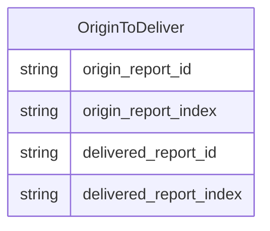
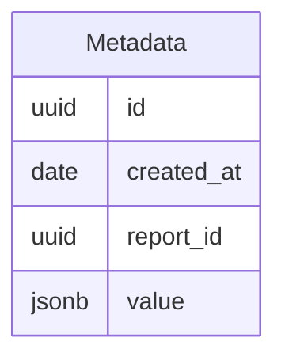

# Proposal for Universal Metadata Search

## Goals

- Enable the existing search needs for a variety of users
  - Receivers
  - Admins
  - Senders
- These users need to perform queries against report and metadata across different dimensions including
  - date ranges
  - aggregates

See the initial [requirements](./0018-universal-search.md).

The search question in that document breakdown into a few broad categories:

- information about one or more report(s) that is queryable by dates, sender and receiver
- information about one or more item(s) that is queryable by metadata fields
- aggregates around one or more item(s) 

## Problems to solve for

- Report and item lineages are tough to query
- Querying and aggregating metadata from different result types as the system is enhanced

## Potential Solutions

### Enhancing the ability to query reports and items

The first problem to solve for is how to efficiently query how items flow from a report from a sender to a receiver.
This is currently captured via the report and item lineages; this is a graph structure where each item and report 
has a link to its parent.  Some example questions that a solution would need to solve for is:
 
> As a sender, what are the list of reports I sent out grouped by receiver?

> As a receiver, what are the reports were sent to me in a date range? 

#### Store the origin details on each child item and create a new table that links an origin report to all delivered items

There is a current solution where each child item contains a link to the origin report 
(`origin_report_id`/`origin_report_index`) that enables quickly starting at the bottom of a lineage graph and jumping 
back up to the original source.  A similar method could be done for going from an original report to it's delivered items
by creating a new table that maps the origin report and index to a delivered report and index.



Pros:

-

Cons

-

#### Use recursive queries in JOOQ to walk the lineages

Postgres has robust support for recursive queries that can walk up or down the lineage 
(see [this](https://github.com/CDCgov/prime-reportstream/blob/1a66f0476ce455dab6bdf70502065c5dc89dd19e/prime-router/src/main/resources/db/migration/V19__add_report_facilities_function.sql#L30) procedure).
This functionality is also supported in JOOQ, so it would be feasible to move the linked procedure into the code base
and create some generic functions that would return the lineages; this generic function would then be the base that could
be used for fetching information about the items and reports as they went through the system.

This is an example of what a recursive query would typically look like.
```sql
WITH RECURSIVE lineage AS (
    SELECT parent_report_id, parent_index
    FROM item_lineage
    WHERE child_report_id in %report_ids%
    UNION ALL
    SELECT il.parent_report_id, il.parent_index
    FROM item_lineage il JOIN lineage ON (
                lineage.parent_report_id = il.child_report_id
            AND lineage.parent_index = il.child_index
        )
)
SELECT * from lineage;
```

and would map to kotlin like so:
```kotlin
var cte: CommonTableExpression<*> = name("t").fields(
    "parent_report_id",
    "parent_index"
).`as`(
    select(
        ItemLineage.ITEM_LINEAGE.PARENT_REPORT_ID,
        ItemLineage.ITEM_LINEAGE.PARENT_INDEX,
    )
        .from(ItemLineage.ITEM_LINEAGE)
        .where(ItemLineage.ITEM_LINEAGE.CHILD_REPORT_ID.`in`(reportIds))
        .unionAll(
            select(
                ItemLineage.ITEM_LINEAGE.PARENT_REPORT_ID,
                ItemLineage.ITEM_LINEAGE.PARENT_INDEX,
            )
                .from(table(name("t")))
                .join(ItemLineage.ITEM_LINEAGE)
                .on(
                    field(name("t", "parent_report_id"), UUID)
                        .eq(ItemLineage.ITEM_LINEAGE.PARENT_REPORT_ID),
                    field(name("t", "parent_index"), INTEGER)
                        .eq(ItemLineage.ITEM_LINEAGE.PARENT_INDEX)
                )
        )
)

val lineageQuery = create.withRecursive(cte).selectFrom(cte)
val lineageWithinFiveDays = lineageQuery.where(
    ItemLineage.ITEM_LINEAGE.CREATED_AT.between(
        OffsetDateTime.now().minusDays(5),
        OffsetDateTime.now()
    )
)
```


Pros:

-

Cons

-

#### Move the item and report data into a single document in a document store

This solution would deprecate the use of the report and item lineage tables in favor of moving them to a document
store where they could be co-located and then also store the metadata in that same document store.

Possible structure for the report store (this will likely need further fields as its iterated on)

```json
{
    "id": "28dfdc88-113c-4fe1-8955-886f60eff0ab",
    "sending_org": "ignore",
    "sender": "ignore-hl7",
    "created_at": "2023-04-26 13:49:36.338 -0400",
    "items": [
        {
            "metadata_id": "28dfdc88-113c-4fe1-8955-886f60eff0ab"
        },
        {
            "metadata_id": "9a0519d1-9706-4f5f-9aca-9f6dd9ec350b"
        }
    ],
    "errored_reports": [],
    "warning_reports": [],
    "delivered_reports": [
        {
            "id": "36220d76-bdec-4645-9832-f1d9ed63ae72",
            "receiving_org": "ignore",
            "receiver": "HL7_BATCH",
            "created_at": "2023-04-26 13:49:36.338 -0400",
            "items": [
                {
                    "metadata_id": "28dfdc88-113c-4fe1-8955-886f60eff0ab"
                }
            ]
        },
        {
            "id": "36220d76-bdec-4645-9832-f1d9ed63ae72",
            "receiving_org": "ignore",
            "receiver": "HL7_BATCH_PEM",
            "created_at": "2023-04-26 13:49:36.338 -0400",
            "items": [
                {
                    "metadata_id": "9a0519d1-9706-4f5f-9aca-9f6dd9ec350b"
                }
            ]
        }
    ]
}
```

Pros:

-

Cons

-

### Storing metadata in a queryable and extensible fashion

The metadata provided for different result types might differ and a relational table is not a great fit thus the need
for both the `CovidResultMetadata` and `ElrResultMetadata` tables; adding a new table for each result type will not scale
as new ones are piped through.

Example of a question that needs answering:

> As a receiver, what was the last time a particular performing facility sent data?

A solution will involve storing most of the metadata (potentially the entirety of the FHIR bundle) in an unstructured 
form.

#### A metadata table with a JSONB column

This table could likely be enhanced further by extracting out more columns that would exist for every piece of metadata

where `value` could be either the raw FHIR bundle or a normalized version with fields of interest

Pros:

-

Cons

-

#### Mongodb

The FHIR bundle could be inserted directly into a mongo collection and then indices would be added to support the various
use cases.

Pros:

-

Cons

-

#### Elasticsearch

An excellent option from a search perspective as it handles indexing unstructured date extremely effificently, but has 
the issue of not being able to represent different data types along the same path i.e. `entry.resource.name` must be the
same data type.

This means that the FHIR data cannot be inserted wholesale into one index, so we would need to be creative with how it
gets inserted

##### Index per resource type

For this option, an index per resource type would get created and then each entry in the FHIR bundle would get inserted 
into it's respective index and get linked by an `_id` that would match the id of the FHIR bundle.

##### Namespace the resource

Use a single metadata index, but modify the FHIR bundle such that each resource property has the resource type prepended
to it so that the data type at each path is always the same.

For example:
```json
{
      "fullUrl": "Device/1673379983594604000.ad2a7b01-1e55-48c0-90bc-e9634e73261a",
      "Device_resource": {
        "resourceType": "Device",
        "id": "1673379983594604000.ad2a7b01-1e55-48c0-90bc-e9634e73261a",
        "meta": {
          "extension": [
            {
              "url": "http://ibm.com/fhir/cdm/StructureDefinition/source-data-model-version",
              "valueString": "2.5.1"
            }
          ],
          "tag": [
            {
              "system": "http://terminology.hl7.org/CodeSystem/v2-0103",
              "code": "P"
            }
          ]
        },
        "identifier": [
          { "value": "DCEED.ELR" },
          {
            "type": {
              "coding": [
                {
                  "system": "http://terminology.hl7.org/CodeSystem/v2-0301",
                  "code": "ISO"
                }
              ]
            },
            "value": "urn:oid:2.16.840.1.114222.4.1.144.2.5"
          }
        ]
      }
    }
```

Pros:

-

Cons

-

#### Azure cognitive search

- Can't test locally
- Likely a no go with local development

Pros:

- 

Cons

- 

## Open Questions

- Can an item lineage be part of more than one report lineage?
- Does old data need to be back filled?
  - The answer is likely no
- What does an "undelivered" report mean?
- Do we care about the reports in between sending and receiving?
  - Maybe only in the case of error or warnings?
- Why does the submissions page not actually show metadata?
- Where is the expired at time stored?