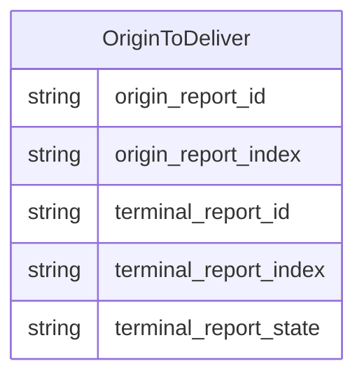
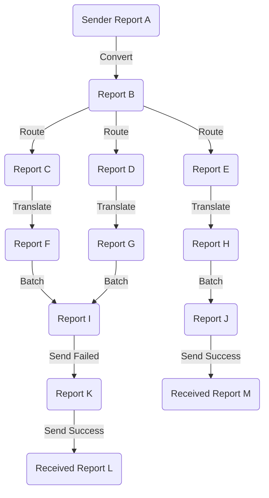
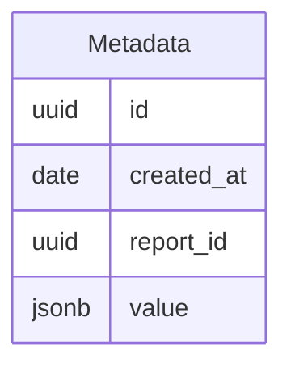
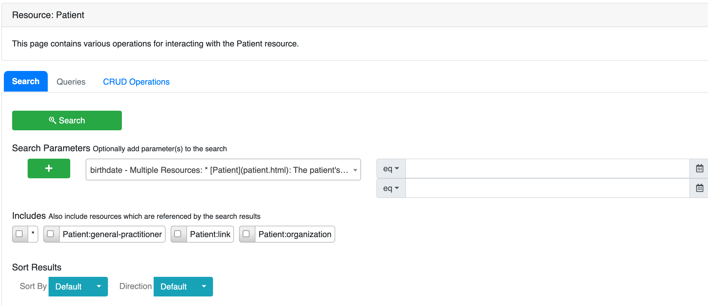
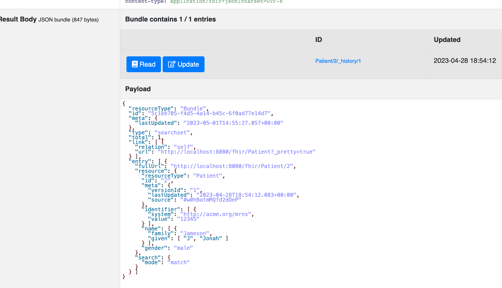
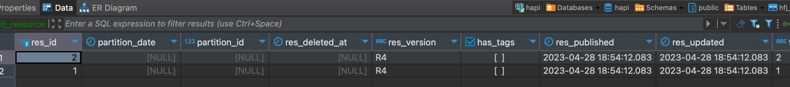

# Proposal for Universal Metadata Search

## Goals

- Enable the existing search needs for a variety of users
  - Receivers
  - Admins
  - Senders
- These users need to perform queries against report and metadata across different dimensions including
  - date ranges
  - aggregates

See the initial [requirements](https://docs.google.com/spreadsheets/d/1Np4svZSuMbyr7Qtt05hmx2BZYwkXIRdpqXC3LQHz0F4/edit#gid=0).

The search question in that document break down into a few broad categories:

- information about one or more report(s) that is queryable by dates, sender, receiver and status
- information about one or more item(s) that is queryable by metadata fields
- aggregates around one or more item(s) 

## Problems to solve for

- Report and item lineages are tough to query
- Querying and aggregating metadata from different result types as the system is enhanced

## Potential Solutions

### Enhancing the ability to query reports and items

The first problem to solve for is how to efficiently query how items flow from a sender to a receiver.
This is currently captured via the report and item lineages; this is a graph structure where each item and report 
has a link to its parent.  Some example questions that a solution would need to solve for:
 
> As a sender, what are the list of reports I sent out grouped by receiver?

> As a receiver, what are the reports that were sent to me in a date range? 

#### Store the origin details on each child item and create a new table that links an origin report to all delivered items

There is a current solution where each child item contains a link to the origin report 
(`origin_report_id`/`origin_report_index`) that enables quickly starting at the bottom of a lineage graph and jumping 
back up to the original source.  A similar method could be done for going from an original report to its terminal items
by creating a new table that maps the origin report and index to a delivered report and index.



Pros:

- Follows an existing pattern already implemented
- Easy to understand and query against
- Does not involve introducing any new concepts
- Consumers do not need to know that there is an underlying graph that is created as intermediates
- Does not limit future use cases that do need to know about the lineage

Cons

- Limited to just mapping an original item to a delivered item
- Table will be quite large and hard to break up later
- A new solution will need to be implemented if the intermediate reports need to be queried

#### Use recursive queries in JOOQ to walk the lineages

Postgres has robust support for recursive queries that can walk up or down the lineage 
(see [this](https://github.com/CDCgov/prime-reportstream/blob/1a66f0476ce455dab6bdf70502065c5dc89dd19e/prime-router/src/main/resources/db/migration/V19__add_report_facilities_function.sql#L30) procedure).
This functionality is also supported in JOOQ, so it would be feasible to move the linked procedure into the code base
and create some generic functions that would return the lineages; this generic function would then be the base that could
be used for fetching information about the items and reports as they went through the system.

Example of that the report graph looks like:


Postgres can handle this structure starting at any point in the graph with a recursive query that either goes up or down
the graph.

This is an example of what a recursive query would typically look like; this one walks up from a child back to the origin.
```sql
WITH RECURSIVE lineage AS (
    SELECT parent_report_id, parent_index
    FROM item_lineage
    WHERE child_report_id in %report_ids%
    UNION ALL
    SELECT il.parent_report_id, il.parent_index
    FROM item_lineage il JOIN lineage ON (
                lineage.parent_report_id = il.child_report_id
            AND lineage.parent_index = il.child_index
        )
)
SELECT * from lineage;
```

and would map to kotlin like so:
```kotlin
var cte: CommonTableExpression<*> = name("t").fields(
    "parent_report_id",
    "parent_index"
).`as`(
    select(
        ItemLineage.ITEM_LINEAGE.PARENT_REPORT_ID,
        ItemLineage.ITEM_LINEAGE.PARENT_INDEX,
    )
        .from(ItemLineage.ITEM_LINEAGE)
        .where(ItemLineage.ITEM_LINEAGE.CHILD_REPORT_ID.`in`(reportIds))
        .unionAll(
            select(
                ItemLineage.ITEM_LINEAGE.PARENT_REPORT_ID,
                ItemLineage.ITEM_LINEAGE.PARENT_INDEX,
            )
                .from(table(name("t")))
                .join(ItemLineage.ITEM_LINEAGE)
                .on(
                    field(name("t", "parent_report_id"), UUID)
                        .eq(ItemLineage.ITEM_LINEAGE.PARENT_REPORT_ID),
                    field(name("t", "parent_index"), INTEGER)
                        .eq(ItemLineage.ITEM_LINEAGE.PARENT_INDEX)
                )
        )
)

val lineageQuery = create.withRecursive(cte).selectFrom(cte)
val lineageWithinFiveDays = lineageQuery.where(
    ItemLineage.ITEM_LINEAGE.CREATED_AT.between(
        OffsetDateTime.now().minusDays(5),
        OffsetDateTime.now()
    )
)
```


Pros:

- Allows writing queries against any part of the lineage hierarchy
- Doesn't require capturing any new data or adjusting how report stream works
- Is a very flexible solution for future needs

Cons:

- Developers need to understand how recursive queries work
- Recursive queries tend to be hard to tune and can suffer from performance suddenly degrading if the query optimizer
chooses the wrong index
- Queries to join back to the metadata and report tables will be complicated

#### Move the item and report data into a single document in a document store

This solution would deprecate the use of the report and item lineage tables in favor of moving them to a document
store where they could be co-located and then also store the metadata in that same document store.

Possible structure for the report store (this will likely need further fields as it's iterated on).  This approach is
flexible; the example below only includes the terminal reports, but could be updated to store the entire lineage graph.

```json
{
    "id": "28dfdc88-113c-4fe1-8955-886f60eff0ab",
    "sending_org": "ignore",
    "sender": "ignore-hl7",
    "created_at": "2023-04-26 13:49:36.338 -0400",
    "items": [
        {
            "metadata_id": "28dfdc88-113c-4fe1-8955-886f60eff0ab"
        },
        {
            "metadata_id": "9a0519d1-9706-4f5f-9aca-9f6dd9ec350b"
        }
    ],
    "errored_reports": [],
    "warning_reports": [],
    "delivered_reports": [
        {
            "id": "36220d76-bdec-4645-9832-f1d9ed63ae72",
            "receiving_org": "ignore",
            "receiver": "HL7_BATCH",
            "created_at": "2023-04-26 13:49:36.338 -0400",
            "items": [
                {
                    "metadata_id": "28dfdc88-113c-4fe1-8955-886f60eff0ab"
                }
            ]
        },
        {
            "id": "36220d76-bdec-4645-9832-f1d9ed63ae72",
            "receiving_org": "ignore",
            "receiver": "HL7_BATCH_PEM",
            "created_at": "2023-04-26 13:49:36.338 -0400",
            "items": [
                {
                    "metadata_id": "9a0519d1-9706-4f5f-9aca-9f6dd9ec350b"
                }
            ]
        }
    ]
}
```

In the above, the metadata values could be stored in a separate collection or fully or partially (subset pattern) inlined
depending on the search requirements.

Pros:

- Most flexible option as the initial schema can be custom suited to the search requirements
- The schema can easily evolve over time as new requirements are added
- MongoDB has an excellent support for multiple nodes which would allow the data to be sharded and scaled
- MongoDB has excellent support for aggregates that will make writing queries from complicated questions easier

Cons:

- Requires spinning up a new data store
- Indices will need to be added to be performant which might not scale over time
- Large documents will require a large amount of memory for the MongoDB servers
- "Ad-hoc" searches might not perform well if an index cannot be used


### Storing metadata in a queryable and extensible fashion

The metadata provided for different result types might differ and a relational table is not a great fit thus the need
for both the `CovidResultMetadata` and `ElrResultMetadata` tables; adding a new table for each result type will not scale
as new ones are piped through.

Example of a question that needs answering:

> As a receiver, what was the last time a particular performing facility sent data?

A solution will involve storing most of the metadata (potentially the entirety of the FHIR bundle) in an unstructured 
form so that the entirety of the FHIR bundle is searchable

#### A metadata table with a JSONB column

This table could likely be enhanced further by extracting out more columns that would exist for every piece of metadata


where `value` would be the FHIR bundle. 

As requirements around search functionality is determined, [indices](https://www.postgresql.org/docs/current/datatype-json.html#JSON-INDEXING) 
could be added to the `value` column to keep queries fast.

Pros:

- Can use the existing datastore
- Indices can be written for the JSONB data to support fast queries
- JOOQ supports JSONB operators out of the box
- Joining back to the report, item and lineage data is easy

Cons:

- Engineers will need to have a good understanding of the postgres JSONB type
- Does not scale to arbitrary searching of the metadata
- Individual searches will need to be tuned to make sure an effective index is chosen
- Inserts will get progressively more expensive as more and more indices are added 

#### Mongodb

The FHIR bundle could be inserted directly into a mongo collection and then indices would be added to support the various
use cases.

Pros:

- Easily supports new FHIR resource types without any changes
- Allows splitting the data across multiple nodes easily
- Has good support for writing aggregate queries

Cons:

- Requires an infrastructure change
- If the lineage data is still stored in postgres, requires selecting IDs and then doing a large `in` query
- Developers might not necessarily be familiar with MongoDB
- Concurrent updates will be complicated; i.e. the send function fanning out and making multiple updates to the same
original report

#### Elasticsearch

An excellent option from a search perspective as it handles indexing unstructured data extremely efficiently, but has 
the issue of not being able to represent different data types along the same path i.e. `entry.resource.name` must be the
same data type.

This means that the FHIR data cannot be inserted wholesale into one index, so we would need to be creative with how it
gets inserted

##### Index per resource type

For this option, an index per resource type would get created and then each entry in the FHIR bundle would get inserted 
into it's respective index and get linked by an `_id` that would match the id of the FHIR bundle.

##### Namespace the resource

Use a single metadata index, but modify the FHIR bundle such that each resource property has the resource type prepended
to it so that the data type at each path is always the same.

For example:
```json
{
      "fullUrl": "Device/1673379983594604000.ad2a7b01-1e55-48c0-90bc-e9634e73261a",
      "Device_resource": {
        "resourceType": "Device",
        "id": "1673379983594604000.ad2a7b01-1e55-48c0-90bc-e9634e73261a",
        "meta": {
          "extension": [
            {
              "url": "http://ibm.com/fhir/cdm/StructureDefinition/source-data-model-version",
              "valueString": "2.5.1"
            }
          ],
          "tag": [
            {
              "system": "http://terminology.hl7.org/CodeSystem/v2-0103",
              "code": "P"
            }
          ]
        },
        "identifier": [
          { "value": "DCEED.ELR" },
          {
            "type": {
              "coding": [
                {
                  "system": "http://terminology.hl7.org/CodeSystem/v2-0301",
                  "code": "ISO"
                }
              ]
            },
            "value": "urn:oid:2.16.840.1.114222.4.1.144.2.5"
          }
        ]
      }
    }
```

Pros:

- Exposes a REST API so developers don't need to learn a new syntax
- Has excellent support for fuzzy searches
- Automatically indexes the data
- Azure has a fully hosted version

Cons:

- Does not work with FHIR out of the box
- Linking back to the lineage data in postgres will be complicated, expensive and would not potentially scale to all use cases
  - The specific issue is that we would use the elastic search to fetch all metadata IDs that match a search parameter
    (i.e a certain facility), but in order to filter that down to a specific receiver we would then need to use those
    as an input to a SQL query that applies the where clause.  That list of metadata IDs could be extremely large and this
    approach would likely run into issues over the long term
- Does not fully support inserting nested objects
- Can be expensive

#### Store the data in a normalized form

While we could roll our own version of this (see [this](https://github.com/CDCgov/prime-reportstream/pull/7228) proposal),
there is an existing solution in the open source [HAPI FHIR server](https://hapifhir.io/hapi-fhir/docs/server_jpa/introduction.html) (I tested the JPA server, but the plain one could be an option as well depending on the requirements) that could be
leveraged to accomplish the same goal.  This solution supports normalizing any FHIR resource type and is a more extensible
solution than something that is custom.

This is an open source server that accepts FHIR data and then provides various mechanisms for searching that data and
could serve as the tool used for querying against the items that flow through ReportStream.





This approach would entail spinning up a HAPI FHIR server and then accessing the data via the defined API endpoints

Pros:

- Is relatively easy to get started
- Out of the box search functionality is robust
- Provides fantastic support for arbitrary searches

Cons:

- Out of the box, `type: "message"` was not accepted by the server; we would likely need to fork or at least figure out how to
get it accepted
- Exposing functionality not necessarily part of HAPI FHIR server is more difficult
- At least locally, searches were pretty slow
- Increases the deployment complexity as another system and infrastructure needs to be maintained
- Linking back to the lineage data will be complicated/inefficient


#### Azure cognitive search

Microsoft has its own custom search indexing offering that could be a potential solution.

Pros:

- Supposedly has neat features "powered" by AI
- Exposes a REST interface

Cons:

- Cannot be run locally and would require a dev instance
- Locks ReportStream into azure
- Linking back to the lineage data will be complicated/inefficient (see the second con for Elasticsearch)

## Recommendation

Overall, the exact requirements around search are still fuzzy; there are a few things that receivers and senders are
definitely interested in knowing around how data is getting routed (this is also what someone debugging the system is
interested in), but items such as what is valuable to search in the metadata is still an unknown.

Due to the ambiguity, the recommended approach is:

- Take advantage of the graphical nature of the report/item data and use recursive queries to walk the graph from either
the origin or terminal nodes; this provides the most flexibility moving forward and queries have proven to perform
  - `report_file` will need to get updated so that there are indices added to `parent_report_id` and `child_report_id`  
  - In order to support the undelivered use case, the graph will need to be updated slightly so that each undelivered 
  report is tracked in the report lineage
- Create a new metadata table with a JSONB column for storing the metadata
  - After creating the internal FHIR bundle that the UP will operate on, insert that into the metadata table with 
  origin report and index

This is the simplest approach and requires no new infrastructure or concepts while still maintaining flexibility moving
forward as requirements evolve.  The largest cons of this solution are mostly ones of scale and monitoring could be
configured such that the team would have an early warning that one of the other more involved solutions spelled out 
here need to be adopted

### Some initial performance research

The recursive queries perform well _up to a point_.

This query runs in ~3ms in PROD, but if limit is adjusted any higher (as of writing this), the performance falls off 
the cliff.

```sql
explain analyse
with recursive delivered_report_ids as (
    select report_id
    from report_file
    where created_at > '2023-01-01'
    order by created_at desc
    limit 176
),
lineage as (
    select parent_report_id, parent_index
    from item_lineage childrens
    where child_report_id in (select * from delivered_report_ids)
    union all
    select parents.parent_report_id, parents.parent_index
    from item_lineage parents
    join lineage on lineage.parent_report_id = parents.child_report_id and lineage.parent_index = parents.child_index
    
)
select * from lineage;
```

Here is the explain for the query:
```
QUERY PLAN
CTE Scan on lineage  (cost=77261350.70..77857636.50 rows=29814290 width=20) (actual time=0.199..2.724 rows=342 loops=1)
  CTE d_r_ids
    ->  Limit  (cost=0.56..63.75 rows=176 width=24) (actual time=0.025..0.100 rows=176 loops=1)
          ->  Index Scan Backward using idx_r_file_created_at_btree on r_file  (cost=0.56..1258548.13 rows=3505836 width=24) (actual time=0.022..0.089 rows=176 loops=1)
                Index Cond: (created_at > '2023-01-01 00:00:00-05'::timestamp with time zone)
  CTE lineage
    ->  Recursive Union  (cost=4.53..77261286.95 rows=29814290 width=20) (actual time=0.199..2.635 rows=342 loops=1)
          ->  Nested Loop  (cost=4.53..568851.65 rows=550130 width=20) (actual time=0.197..1.404 rows=141 loops=1)
                ->  HashAggregate  (cost=3.96..5.72 rows=176 width=16) (actual time=0.176..0.196 rows=176 loops=1)
                      Group Key: d_r_ids.r_id
                      ->  CTE Scan on d_r_ids  (cost=0.00..3.52 rows=176 width=16) (actual time=0.027..0.142 rows=176 loops=1)
                ->  Index Scan using item_lineage_child_idx on item_lineage childrens  (cost=0.57..3200.82 rows=3126 width=36) (actual time=0.007..0.007 rows=1 loops=176)
                      Index Cond: (child_r_id = d_r_ids.r_id)
          ->  Nested Loop  (cost=0.57..7609614.95 rows=2926416 width=20) (actual time=0.051..0.294 rows=50 loops=4)
                ->  WorkTable Scan on lineage lineage_1  (cost=0.00..110026.00 rows=5501300 width=20) (actual time=0.000..0.004 rows=86 loops=4)
                ->  Index Scan using item_lineage_child_idx on item_lineage parents  (cost=0.57..1.35 rows=1 width=40) (actual time=0.003..0.003 rows=1 loops=342)
                      Index Cond: ((child_r_id = lineage_1.parent_r_id) AND (child_index = lineage_1.parent_index))
Planning Time: 10.921 ms
Execution Time: 2.938 ms
```

The analyze times out, but the explain for the query when the limit is set to 177 shows that the query planner switches
to suboptimal plan where it switches to doing a merge join rather than a nested loop for the recursive portion.

```
QUERY PLAN
CTE Scan on lineage  (cost=76822893.16..77425975.78 rows=30154131 width=20)
  CTE delivered_report_ids
    ->  Limit  (cost=0.56..64.46 rows=178 width=24)
          ->  Index Scan Backward using idx_report_file_created_at_btree on report_file  (cost=0.56..1258555.63 rows=3505857 width=24)
                Index Cond: (created_at > '2023-01-01 00:00:00-05'::timestamp with time zone)
  CTE lineage
    ->  Recursive Union  (cost=4.57..76822828.70 rows=30154131 width=20)
          ->  Nested Loop  (cost=4.57..574720.51 rows=556391 width=20)
                ->  HashAggregate  (cost=4.00..5.79 rows=178 width=16)
                      Group Key: delivered_report_ids.report_id
                      ->  CTE Scan on delivered_report_ids  (cost=0.00..3.56 rows=178 width=16)
                ->  Index Scan using item_lineage_child_idx on item_lineage childrens  (cost=0.57..3197.47 rows=3126 width=36)
                      Index Cond: (child_report_id = delivered_report_ids.report_id)
          ->  Merge Join  (cost=734650.00..7564502.56 rows=2959774 width=20)
                Merge Cond: ((parents.child_report_id = lineage_1.parent_report_id) AND (parents.child_index = lineage_1.parent_index))
                ->  Index Scan using item_lineage_child_idx on item_lineage parents  (cost=0.57..6122051.96 rows=127294821 width=40)
                ->  Sort  (cost=734649.43..748559.21 rows=5563910 width=20)
"                      Sort Key: lineage_1.parent_report_id, lineage_1.parent_index"
                      ->  WorkTable Scan on lineage lineage_1  (cost=0.00..111278.20 rows=5563910 width=20)
```

This can likely be tuned to get the query planner to choose the optimal plan, but does present a risk.  Postgres 
supports turning on different query optimizers at the session level, so the solution might be as simple as running
`SET enable_mergejoin = off;` before the query is run to force the query planner to choose a nested loop.

The query on just walking the report lineage suffers similarly just at a different point and would have the same solution. 

## Searches to be split into other tickets

- Returning a list of reports sorted by when they will expire
  - Currently, expired maps to the `created_at` + 60 days 
- Returning a list of items that were filtered from a delivered report 

## Open Questions

- Can an item lineage be part of more than one report lineage?
  - No
- Does old data need to be back filled?
  - The answer is likely no
- What does an "undelivered" or "delivered" report mean?
  - One that does not have a successful send?
  - Action with send_error?
  - This can get deferred to future work
- Do we care about the reports in between sending and receiving?
  - Maybe only in the case of error or warnings?
  - From a search perspective only the terminal reports are relevant
- Where is the expired at time stored?
  - Reports are available for 60 days? so expiration is just 60 days from the created_at?
  - Likely a hardcoded value with azure storage
  - The value we show in the API might not be correct