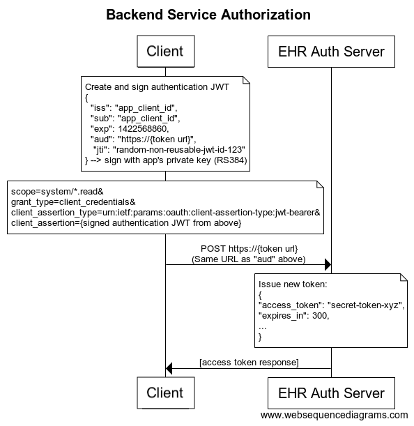

## Background
The PRIME Data Hub[1] aims to work with multiple senders or third-parties clients that send reports to the Data-Hub. Each of these clients will need to authenticate with the Data-Hub API. This paper outlines a proposal on how these clients should provide credentials to the Data-Hub.

Today, in healthcare and public health, the most common form of authentication between two computers, also known as service to service authentication, is either a shared secret or a form of TLS mutual authentication. An SFTP service authenticated by username and password is an example of the shared secret method. The API secret key is another form of a shared secret. PHIN MS is an example of an authentication mechanism built on TLS mutual authentication.

The sharing of usernames and passwords or secret keys is problematic from a security standpoint. Passwords are frequently compromised because the act of sharing a secret makes them vulnerable. A good security practice is to put a short time limit on the validity of a secret. This fix leads to operational problems as someone has to be involved when a secret expires and when a new secret is shared.

At first glance, mutual TLS may be a more secure alternative to a shared secret form of authentication. However, mutual TLS still suffers from the same operational issues as a shared secret. Since a private key may still leak, a good security practice is to rotate certificates yearly. Like refreshing a shared secret, this certificate rolling process requires coordination between both parties. If not done correctly, it can lead to service outages. The certificate change process is cumbersome when planned, but if it has to be done on a rapid basis (for example, to mitigate leaks of the private key), it is hard to avoid service disruption.

## Goals

Fortunately, the problems that I just outlined are well known. There are available computer authentication standards that address these issues. As we think about the Data-Hub and its possible place in the public health infrastructure, the hub could try to join those trying to advance how public health authorities communicate. My goals are:
- Align with developing standards in healthcare interoperability
- No sharing of secrets and keys between organizations
- Ability to roll keys without service disruption and coordination
- Support multiple clients per organization
- The ability to scale to 100s of third parties.

##Proposal

The basic proposal has two parts. First, use JSON Web Tokens (JWT) with a private key signature (aka Private Key JWT) [2] for the Data-Hub authentication token. This standard avoids the shared secrets problems of usernames and passwords or secret keys by using public-key cryptography mechanisms. Second, provide the client's public keys in a JSON Web Key Set (JWKS) that the client's website hosts. The Data-Hub would store the URL to the client's JWKS. Hosting the JWKS on the client's website allows the client to change their public and private keys without coordination with the data-hub.

The inspiration to use the combination of Private Key JWT and hosted JWKS came from the FHIR Bulk Data Access standard. The guide explains the details of how to combine these two web standards. Although the FHIR authorization standard lists two options for public key exchange, the Data-Hub will strongly encourage registering a JWKS URL because that will lead to lower maintenance costs. Here's a sequence diagram from the FHIR guide that illustrates the authentication sequence.

In this proposal, I'm encouraging that we adopt JWKS URLs because it has lower operational costs in the long term. Healthcare interoperability will work better if it adopts this standard. In the short-term, it involves more setup work. I realize that it may be something better suited as an option.

## References
[1] Prime Data Hub https://github.com/cdcgov/prime-data-hub

[2] FHIR Bulk Data Access http://hl7.org/fhir/uv/bulkdata/authorization/index.html