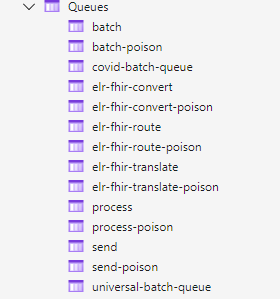
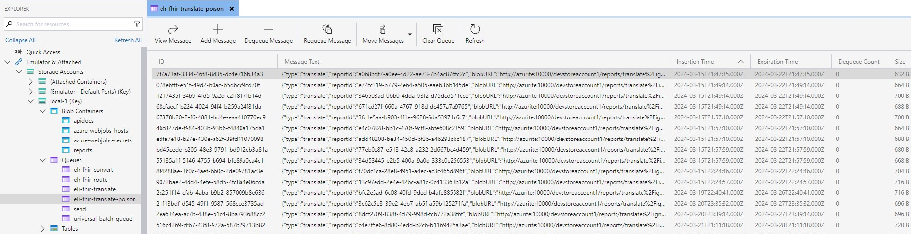
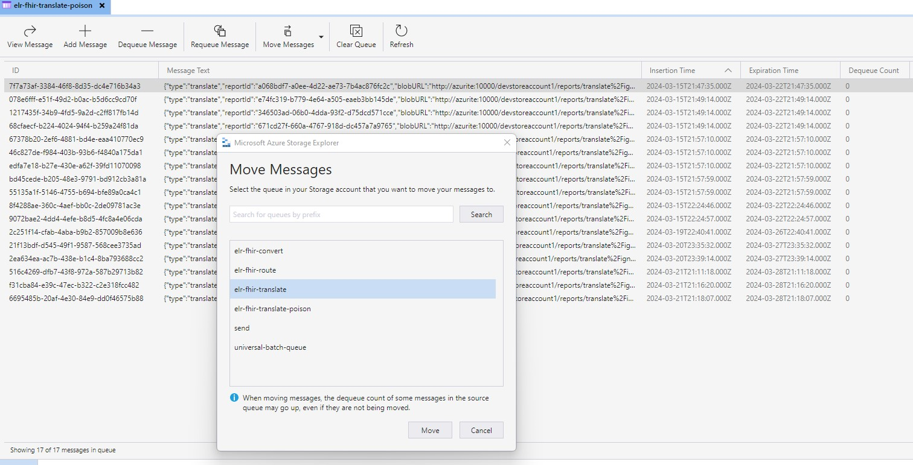

## Context

Each step in both the Universal Pipeline has built in logic that retries the function five times before moving the failing message to a poison queue. The exceptions to this rule are the "Receive" step which has no retry logic and the "Send" step which has custom retry logic. More information on retry logic for the send step can be found in the Universal Pipeline [send step documentation](https://github.com/CDCgov/prime-reportstream/blob/main/prime-router/docs/universal-pipeline/send.md)

## Poison Queues

## Resolving Messages in the Poison Queue

When a message ends up in a poison queue it will remain there for seven days before being deleted. Within this seven day period the underlying issue needs to be resolved
and the message resent or else the items the report will have to be resent manually through the pipeline (If within the 60 day retention window). If the underlying issue has been
fixed and merged, or the issue was transient and does not require a code change the messages in the poison queue can be resent through Azure Storage Explorer.

## Resending from Azure Storage Explorer
Login in to Azure Storage Explorer with an account with elevated privilages ("SU" account). Within Azure storage explorer, navigate to the relevant queue by finding the storage container for the appropriate environment (prod or staging) in the navigation window on the left hand side of Azure Storage explorer. Navigate to queues and then double click on the queue name you need to resolve messages from.
This will bring up the queue and allow you to view all messages waiting in the queue for resolution.

Select one or more messages and click the "Move Messages" option at the top of the window. This brings up a list of all queue that the messages can be moved to.
Be sure to select the queue that matches the pipeline step that the messages failed in (ex: messages in elr-fhir-translate-poison should be moved to elr-fhir-translate, messages from elr-fhir-convert-poison should be moved to elr-fhir-convert etc.)

## Resending messages that are no longer in the poison queue or that cannot be remediated within the 7 day window.

At this time the only remediation option available is to manually re-send the original received message through the pipeline either locally or through the desired environment. The issue causing the message to fail must have been remediated or a new message created/obtained with the issue resolved (i.e. if the issue was a problem with the message format received from the sender, it may be necessary to inform the sender of the issue and have them re-send the data in the correct format.)

### Common poison queue issues needing manual remediation

1.) Large file size causing fhir-convert timeout  
    This issue occurs when a received FHIR message is so large that the amount of time needed to complete the fhir-convert step is greater than the 30 min timeout on the Azure function. These messages must be manually split into multiple smaller messages and then resent through the pipeline.