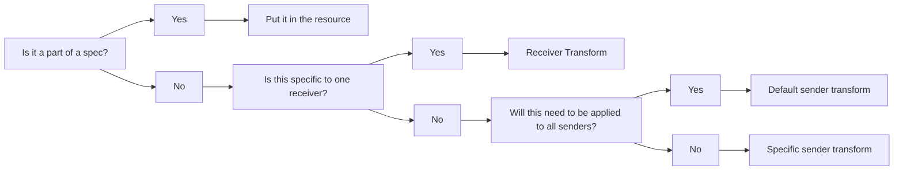

# Managing Transforms in ReportStream

This document describes guidelines to follow when working through adding transforms to senders and receivers.

### Background

Currently, there are a few places where transforms can happen in the universal Pipeline.

* FHIR - FHIR sender transforms
* FHIR - FHIR receiver transforms
* FHIR - HL7 receiver transforms

# Changing/Updating Sender/Receiver Transforms

The purpose of this document is to explain where to make a change when you
need to update a transform. If you need more information please read
[Convert](../../universal-pipeline/convert.md) for sender transforms and
[Translate](../../universal-pipeline/translate.md) for receiver transforms.

> WARNING: The Universal Pipeline is in active development and some features may not be functioning as intended.
> Please consult [the FHIR to HL7 converter tests](/prime-router/src/test/kotlin/fhirengine/translation/hl7/FhirToHl7ConverterTests.kt) for known issues.

## Choosing the location for a transform

Use the following decision tree when determining where a transform should be performed:



In short, use a sender transform when data needs to be uniformly adjusted regardless of receiver.
Use a receiver transform if the receiver has specific HL7 mapping requirements or data adjustment needs.

### Sender Transform Guidelines

In general Sender Transforms should be used when we need to:
* Add ReportStream Metadata. 
  * An example is the [original-pipeline-sender-transforms.yml](../../src/main/resources/metadata/fhir_transforms/senders/original-pipeline-transforms.yml)
  * The original-pipeline-sender-transform.yml contains transforms that were supported by our legacy covid pipeline
* Sender is missing data to generate HL7 v2 complaint messages
  * An examples is the [simple-report-sender-transform.yml](../../src/main/resources/metadata/fhir_transforms/senders/SimpleReport/simple-report-sender-transform.yml)
    * This file mostly contains FHIR extensions that are needed so that RS can generate an HL7 v2 message

Whenever adding sender transforms keep in mind that every receiver getting data from this sender will be affected.

### Receiver Transforms

Receiver transforms should be used to meet specific receiver needs and follow their Implementation Guides

Transforms that are very common to receivers are:
* Suppressing fields
* Converting AOE Observations into Notes
  * Most STLTs can't process AOE questions as observations and require them to be suppressed or turned into NTE segments
* Supporting Receiver specific value sets for Race and Ethnicity

Examples for receiver transforms can be found here * An example of this can be found inside the [NV-receiver-transform.yml](../../src/main/resources/metadata/hl7_mapping/receivers/STLTs/NV/NV-receiver-transform.yml)

When adding receiver transforms keep in mind that the all messages being routed to this receiver will be affected regardless of who the sender is.

## How to configure a transform schema

Transform schemas are `.yml` files that define the transforms and all configuration data needed to perform
them. Refer to [Pipeline Configuration](../../getting-started/universal-pipeline-configuration.md) for details on how transform schemas
are defined in an organization's settings.

Transform schemas are have three main sections:
* `extends`: A schema which the current schema extends. All values from the specified schema are loaded before the
  elements in the current schema. If there are common elements, the values in the current schema are used.
* `constants`: A list of constants that are resolved by FHIRPath expressions that are common to all elements in the
  schema. Refer to constants within elements by prefacing their name with a `%` symbol.
* `elements`: A collection of individual configurations that specify which data is selected for transforms and what
  transforms are performed. Each element is an individual, self-contained action taken on the data.

Transform elements either specify the value to be transformed, or link to another transform schema to be processed.
Here's an example of a transform schema (specifically, a sender transform):

```
extends: ../original-pipeline-transforms
constants:
    patientPath: "Bundle.entry.resource.ofType(Patient)"
elements:
    - name: patient-country
      constants:
          elementConstant: '"USA"'
      resource: ‘%patientPath’
      condition: ‘%resource.address.country.exists().not()’
      bundleProperty: ‘%resource.address.country’
      value: [‘%elementConstant’]
      valueSet:
          values:
              Canada: CAN
              United States: USA
              
    - name: patient-name
      resource: ‘Bundle.entry.resource.ofType(Patient)’
      resourceIndex: patientIndex
      schema: patient-name-schema
```

This example contains the complete layout of a transform schema, with two transform elements. The first is a value
transform that adds country to a patient's address if it does not exist. The second specifies an additional schema,
`patient-name-schema.yml`. This additional schema might contain:

```
elements:
    - name: patient-name
      resource: ‘%resource’
      condition: true
      bundleProperty: ‘%resource.name.text’
      value: [‘"First name, last name"’]
```

In which all patient resources are processed using the above schema.

### Translate element definition

Each element contains the following properties, listed in order of execution:

#### Common

- `name` - the name of an element. If an element of the same name already exists,
  the one loaded last will take precendence.
- `constants` - constants passed in to FHIR Path evaluations. They are resolved at the time
  an element uses it. These can be specified at the schema level or at the element level. Elements will inherit
  constants defined at their schema level and will overwrite any that have the same name.
    - A reserved constant, `%resource`, is automatically provided, which maps to the focus resource
      (generally, the `resource` property).
    - A reserved constant `%context` is provided and maps to the previous `%resource` value
- `resource` - the FHIR resource used as focus on all other FHIR Path expressions. Must
  be used with child schema to set the collection to iterate with.
- `condition` - FHIR Path boolean expression that must evaluate to true for the element to
  be evaluated. Conditions can be used to check the value of a bundle property that
  another element may have populated, so it could be used to check the result of a
  previous element (elements must be kept in the correct order for this to work).
  To set a transform to always take place, simply set to `true`.

#### For value transforms

- `bundleProperty` - a FHIR Path expression that denotes where to store the value. If the property does not yet exist,
  ReportStream will attempt to create it, though there are restrictions around which types of resources/properties can
  be dynamically created.
- `value` - a list of FHIR Path expressions that evaluates to the proper FHIR Type to be
  assigned to the property specified in the `bundleProperty` element property. The first expression to
  have a value wins. This allows you to set defaults at the end of the list. Cannot be used with `schema`.
- `valueSet` - a list of key value pairs used to convert the value generated by the value property (the key)
  to another value that matches the key. If a `valueSet` is defined and a match is not found, the element in
  `bundleProperty` will not be transformed. Can only be used with `value`. The property name within `valueSet`
  determines the data source; an interface is provided to be able to define additional classes that return the key
  value pairs programmatically. Only one data source can be specified per element.
  The following data sources are available within the Universal Pipeline:
    - `values` - Key value pairs are listed directly in a configuration schema.
    - `lookupTable` - provide `tableName`, `keyColumn`, `valueColumn` to retrieve key value pairs from a lookup table.
- `hl7Spec` (only for HL7 receivers) - a list of HL7 fields the transform data maps to. This mapping is performed even
  if `condition` is not defined.

#### For schema transforms

- `schema` - the name of a child schema to process. This points to another sender transform schema which will be used
  with this schema's resource as the focus resource. Cannot be used with `bundleProperty`, `value`, or `valueSet`.
- `resourceIndex` - the name of a constant with the index of a resource collection. Useful to
  iterate over multiple resources. Can only be used with `schema`.

## Example


Transforms can be used to standardize data. See this example element where a patient `gender` resource is standardized
to a letter code:

```
  - name: patient-sex
    value: [ '%resource.gender' ]
    hl7Spec: [ 'PID-8' ]
    valueSet:
      values:
        unknown: U
        female: F
        male: M
        other: O
```

See this example of a sender transform element making use of the `npi-lookup` table to replace any instance of the first name
with the matching last name from the table:

```
  - name: test-transform
    resource: 'Bundle.entry.resource.ofType(Patient).name'
    condition: 'Bundle.entry.resource.ofType(Patient).exists()'
    bundleProperty: '%resource.family'
    value: [ '%resource.family' ]
    valueSet:
      lookupTable:
        tableName: npi-lookup
        keyColumn: first_name
        valueColumn: last_name
```
