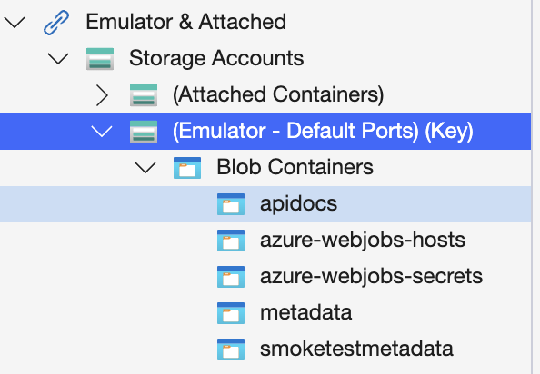
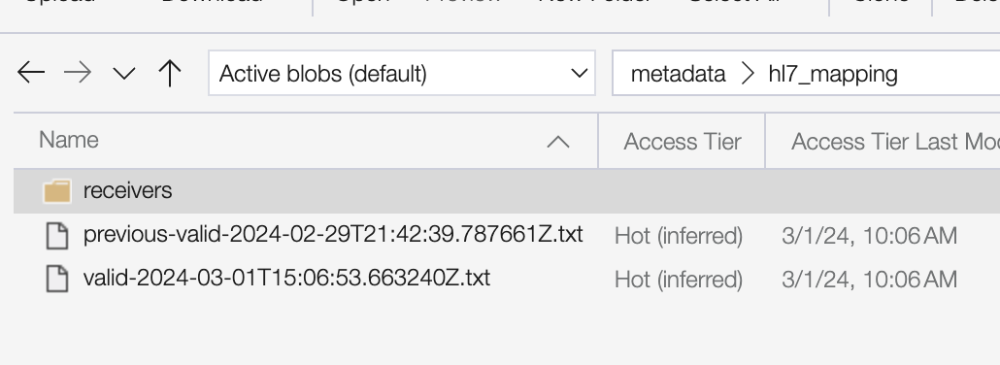
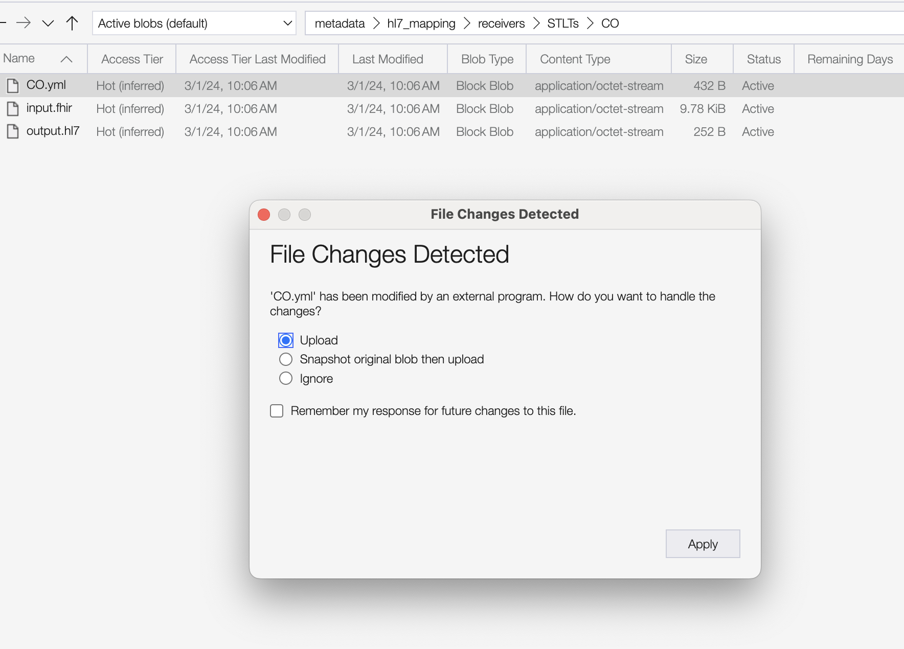
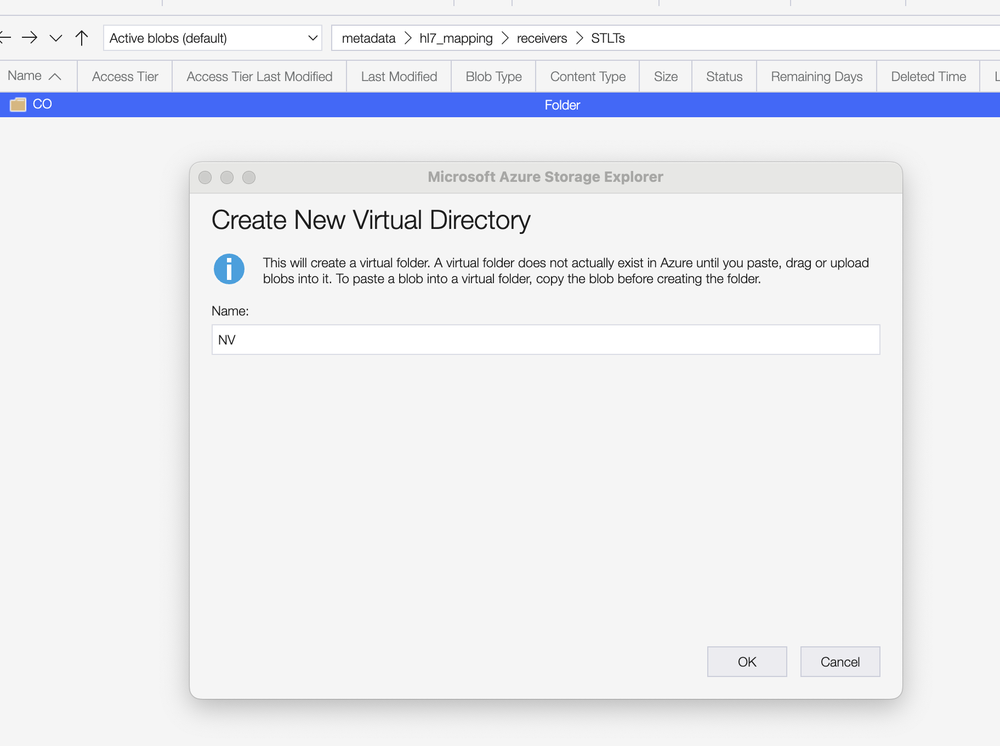
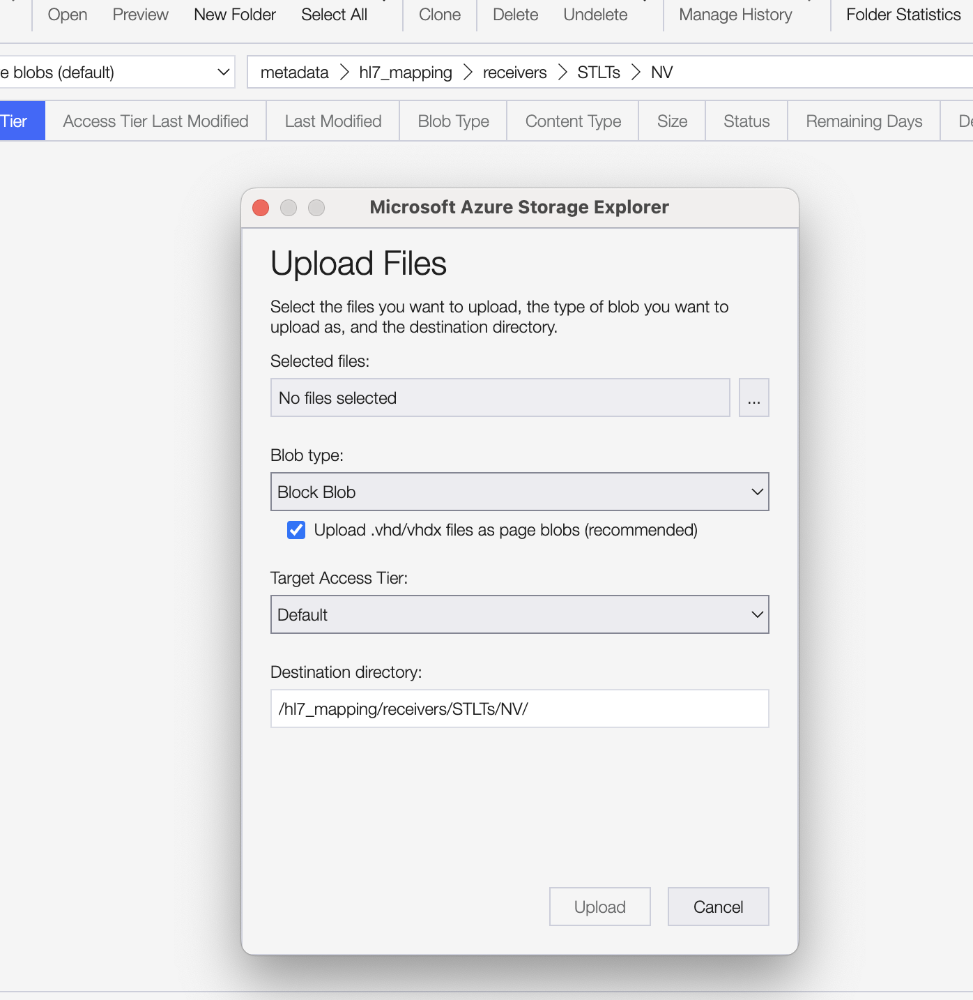

# Managing Translation Schemas in Azure

This document describes the standard operating procedure for how to make changes to sender and receiver transforms that
are stored in an azure container.

[Design Note](../design/features/0005-managing-translation-schemas.md)

### Setup

- Verify that your local azurite containers are running. This should happen automatically when you spin ReportStream up,
  and you can verify this by running `docker compose ps` and checking for both azurite containers
- Make sure ReportStream is running locally
- Download [azure storage browser](https://azure.microsoft.com/en-us/products/storage/storage-explorer)
- Connect to the VPN

### Setting up Azure Storage Browser

Out of the box, azure storage browser will automatically be configured to connect to the default azurite container (the
one used by ReportStream locally).


It is sometimes useful to have a second storage account (primarily for testing/debugging). This can be added by
right-clicking "Storage Accounts" and selecting "Connect to Azure Storage". You can then use the following connection
string:
`DefaultEndpointsProtocol=http;AccountName=devstoreaccount1;AccountKey=Eby8vdM02xNOcqFlqUwJPLlmEtlCDXJ1OUzFT50uSRZ6IFsuFq2UVErCz4I6tq/K1SZFPTOtr/KBHBeksoGMGw==;BlobEndpoint=http://localhost:11000/devstoreaccount1;`

## Procedure

Before making changes, sync the schema type you're working on from staging to your local instance, by running the following command

```shell
./prime syncSchemas --schema-type="<HL7|FHIR>" -sb="<STAGING_AZURE_CONNECTION_STRING>" -sc="metadata" -db="DefaultEndpointsProtocol=http;AccountName=devstoreaccount1;AccountKey=Eby8vdM02xNOcqFlqUwJPLlmEtlCDXJ1OUzFT50uSRZ6IFsuFq2UVErCz4I6tq/K1SZFPTOtr/KBHBeksoGMGw==;BlobEndpoint=http://localhost:10000/devstoreaccount1;" -dc="metadata"'
```

this will copy the current schemas from staging into your local azurite instance and trigger validation. You can confirm
that this was successful by checking in storage browser and confirming the `valid-{TIMESTAMP}.txt` was just created.



### Editing an existing schema

1. Navigate to the directory that contains the schema to edit
2. Double-click the schema; this will trigger it to be downloaded, and you'll be prompted to open it with an
   application.
3. Make the edits to the schema.
4. Save the file. Azure storage browser will show a popup asking if you want to upload the file.
   
5. Repeat the process with the output file, reflecting the edits you made to the schema.
6. Validate your changes.

```shell
./prime validateSchemas --schema-type="<HL7|FHIR>" --blob-store-connect="DefaultEndpointsProtocol=http;AccountName=devstoreaccount1;AccountKey=Eby8vdM02xNOcqFlqUwJPLlmEtlCDXJ1OUzFT50uSRZ6IFsuFq2UVErCz4I6tq/K1SZFPTOtr/KBHBeksoGMGw==;BlobEndpoint=http://localhost:11000/devstoreaccount1;" --blob-store-container="metadata"'
```

7. Sync the changes you made back to staging

```shell
./prime syncSchemas --schema-type="<HL7|FHIR>" -db="<STAGING_AZURE_CONNECTION_STRING>" -dc="metadata" -sb="DefaultEndpointsProtocol=http;AccountName=devstoreaccount1;AccountKey=Eby8vdM02xNOcqFlqUwJPLlmEtlCDXJ1OUzFT50uSRZ6IFsuFq2UVErCz4I6tq/K1SZFPTOtr/KBHBeksoGMGw==;BlobEndpoint=http://localhost:10000/devstoreaccount1;" -sc="metadata"'
```

8. Confirm that the updated schemas were successfully validated in staging by:
    - Looking for a log entry `"Successfully validated schema changes."` or alternatively
      seeing `"Schemas did not pass validation and changes were rolled back."` in the logs
    - Checking in the azure storage for an updated `valid-{TIMESTAMP}.txt`

9. Once the changes have been successfully pushed to STAGE, they can be pushed to PROD in two ways:
    - **Preferred** Using the Github Action "Sync Translation Schemas"
    - Using the same command from step 7

### Creating a new schema

Creating a new schema should follow most of the same steps with the primary difference being you will need to create the
file locally first, create the directory in azure storage browser and then upload the file.





The rest of the steps for syncing will then be the same.

## Troubleshooting/FAQ

### Breaking down custom transforms into smaller files

The process of validating requires that the directory containing the schema referenced in the sender/receiver settings
be only `.yml` file present. For maintainability, it is still possible to break up the schemas into smaller files simply
by creating a subdirectory. That would look like this:

```shell
/hl7_mapping
  /receivers
    /STLTs
      /CA
        CA.yml
        input.fhir
        output.hl7
        datatypes/
          NTE.yml
```

in the above example, `NTE.yml` can be referenced in `CA.yml` using the `azure:/` scheme.

### Validation failure when syncing locally

The root cause is likely that you are out of sync with `main` branch and there are schema changes in the source code
that you'll need to pull.

### Validation failure when syncing to an environment

The root cause is likely that the schema updates being push references schema updates in the source code that are not
present in the higher environment. For example, if a new FHIR->HL7 schema is added to source code, it can only be
referenced once the source code has been deployed to the environment.
