# Reprocess missing mapping messages

## Introduction
To address semantic interoperability and data quality for receivers, ReportStream (RS) can filter out messages that contain the non-Reportable Condition Trigger Code (RCTC) condition code (e.g., LOINC or SNOMED CT).  During the conversion of the incoming message to the internal FHIR format, RS compares LOINC or SNOMED codes from both OBX-3-1/Observation.code.coding.code (LOINC) and OBX-5-1/Observation.ValueCodeableConcept.coding.code (SNOMED) as values in "code" column of the Observation Mapping table stored as JSON in the "data" column of the  "lookup_table_row" table in the Database.  and return value(s) from the "condition code" column.
Values from "Condition Code" and "Member OID" columns must be appended to the internal FHIR bundle as an element that can be used in FHIRpath condition filter logic. For more details on the conversion process, please view the [condition code mapping](../design/proposals/0023-condition-to-code-mapping/0023-condition-to-code-mapping.md).
## Assumptions
* You have credentials with the CDC and have been given access to the Azure portal. If you do not have credentials and access to the Azure portal, stop here. You cannot go any further.
* You have an OKTA account and have access to the production Metabase for ReportStream.  If you do not have credentials for OKTA or access to Metabase, please report to ReportStream’s admin.
* You know how to work on a Unix-style system such as Linux or MacOS. You can probably do this on Windows as well, provided you have a conformant shell with Putty and OpenSSL installed. The Git Bash shell would probably do, or the Linux Subsystem for Windows would as well.
* You know how bring up ReportStream and know how to send a message to ReportStream using Postman.
* You know how to work with DBeaver to connect to ReportStream Postgresql.
## Checking for missing mapping messages in Metabase
The ReportStream maintainer should check daily for the missing mapping message. To check it, the user needs to follow the following steps:
1.	Log in to your Metabase production account, and after logging in, the user should see the following screenshot and needs to click on the [+ New ] button as shown below:

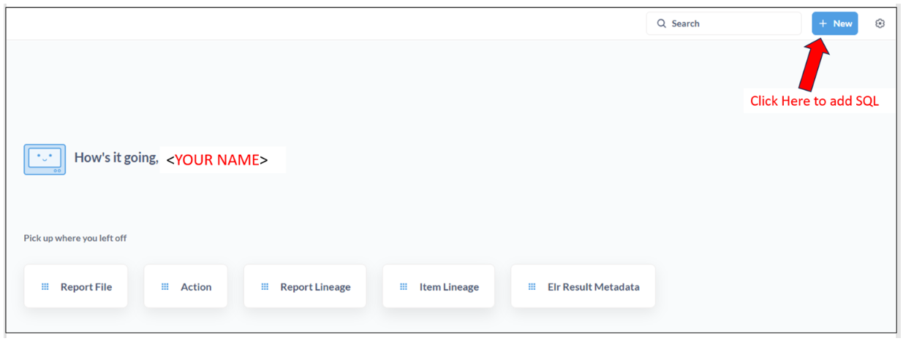

2. The user should see the following screenshot. The user needs to click on the SQL query option as shown below:

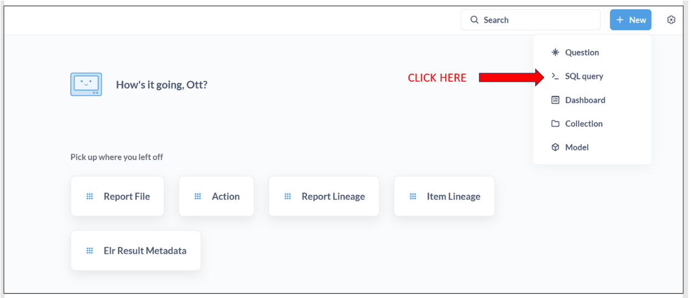

3. The user should see the following screenshot and needs to copy the following SQL to Metabase input area as shown below:
    ```SQL
        SELECT action_log.created_at,
               detail ->> 'message'      as message,
               detail ->> 'fieldMapping' as field,
               action_log.report_id,
               report_file.body_url
        FROM action_log
                 INNER JOIN report_file ON report_file.report_id = action_log.report_id
        WHERE action_log.detail ->> 'errorCode' = 'INVALID_MSG_CONDITION_MAPPING' and action_log.detail ->> 'message' LIKE 'Missing mapping for code(s):%'
        ORDER BY action_log.created_at DESC
        LIMIT 100;
    ```
    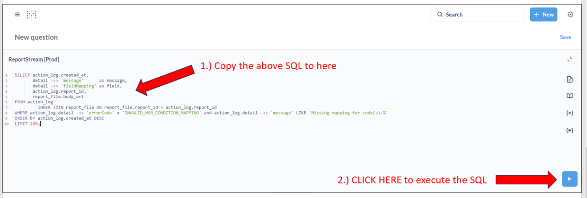
4.	The user should see the following screenshot.  In the message column, the user should see the LOINC or SNOMED code.  And in the body_url column, the user should see a link to the incoming message containing the code as shown below.
    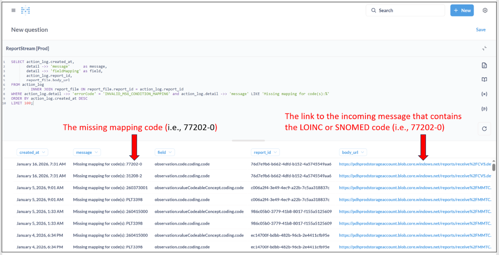
5. Investigate the code by examining the input file in the link. To examine the file, the user needs to use Microsoft Azure Storage Explorer and copy the file from the link to the Filter, as shown below.<br>

* Copy the file name (i.e., 76d7e9b6-b662-4dfd-b152-4a5745549aa6.hl7) from Metabase.

   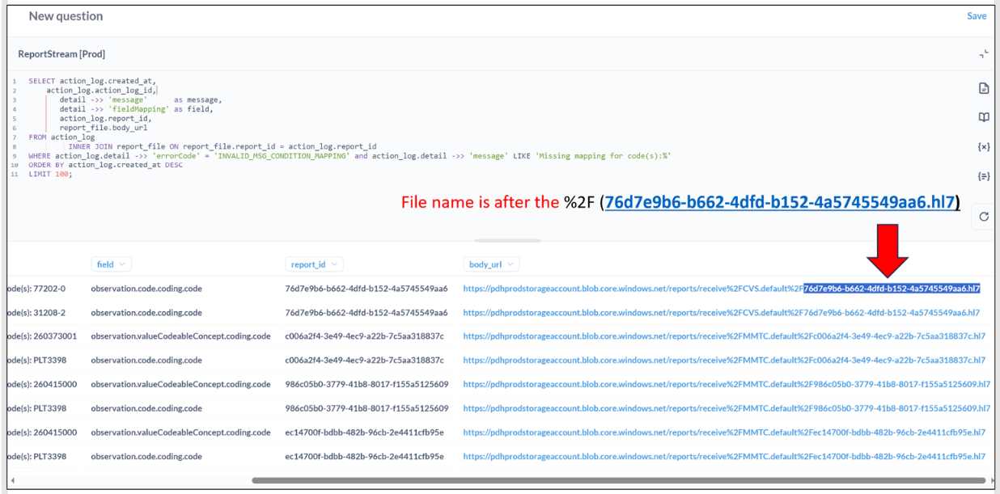

* Following is a screenshot of Microsoft Azure Storage Explorer.  The user needs to follow steps 1-4 as shown in the screenshot.

   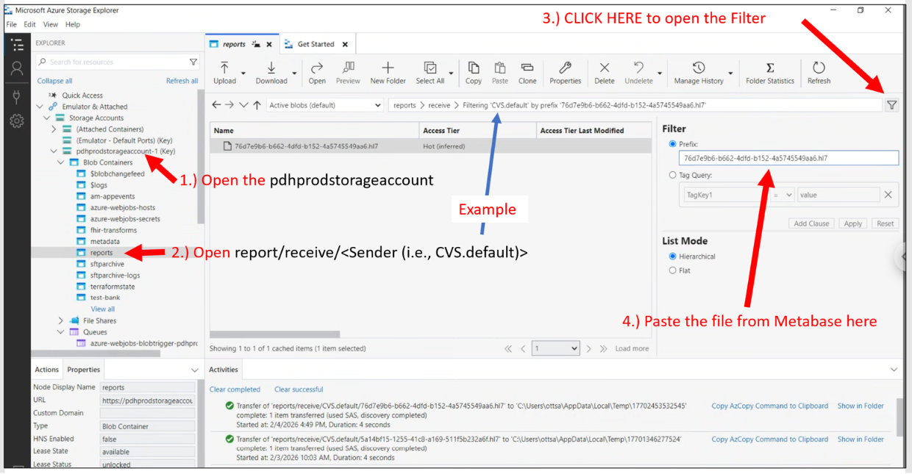 

6. Open the file with the editor

   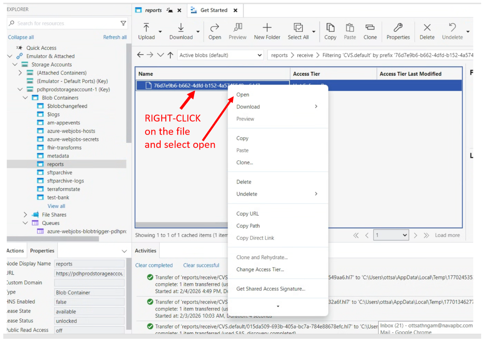 

## Update the missing code in the local system
1.	The user should see the screenshot below (I.e., Microsoft Visual Studio Code).


2. Check the LOINC code (i.e., 77202-0) is in the observation-mapping.csv file.   With Visual Studio Code, the user opens the <br> “metadata\tables\local\observation-mapping.csv” file, types Control + F, and pastes 77202-0 into the search box as shown below:

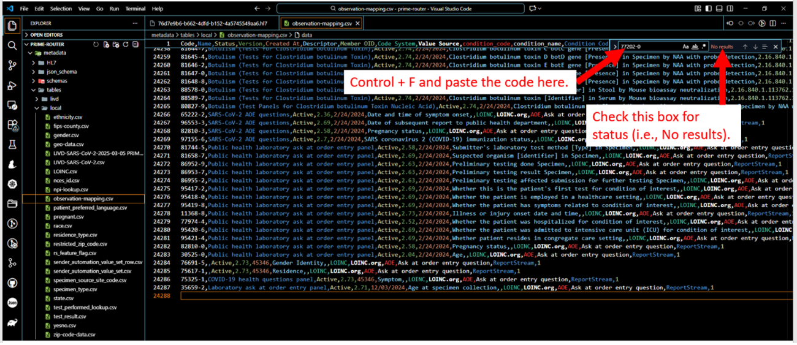

3. If there are no results in the search status box, and since the code is not an RCTC condition code, the user can add an entry for the code to the observation-mapping.csv file, as shown below.

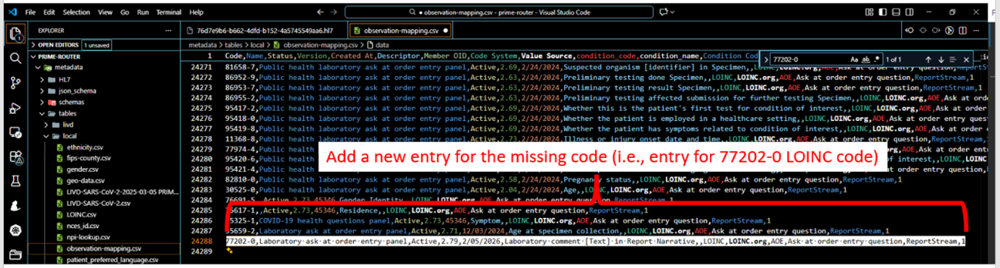

4. Start the ReportStream locally.
5. Upload the updated file to the local system for testing using the following command:<br>
```COMMAND
./prime lookuptables create -i "./metadata/tables/local/observation-mapping.csv" -s -a -n observation-mapping -e "local"
Assuming the user is in the prime-resportstream/prime-router directory.
```
6.	Restart ReportStream by restarting Docker to allow the new observation-mapping table to reload into the database. 
```COMMAND
docker compose down; docker compose up
```
7.	Using Postman, the user can send the message that contains the missing code to the ReportStream as shown in the screenshot below.

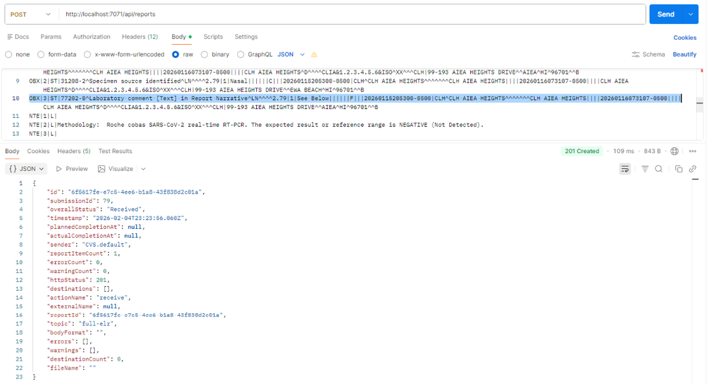

8.	Now, the user needs to start DBeaver and connect to ReportStream (i.e., prime_data_hub) and paste the SQL below into the SQL script as shown below.
``` SQL script
    SELECT action_log.created_at,
           action_log.action_log_id,
           detail ->> 'message'      as message,
           detail ->> 'fieldMapping' as field,
           action_log.report_id,
           report_file.body_url
    FROM action_log
             INNER JOIN report_file ON report_file.report_id = action_log.report_id
    WHERE action_log.detail ->> 'errorCode' = 'INVALID_MSG_CONDITION_MAPPING' 
        and action_log.detail ->> 'message' LIKE 'Missing mapping for code(s):%'
    ORDER BY action_log.created_at DESC
    LIMIT 100;
```
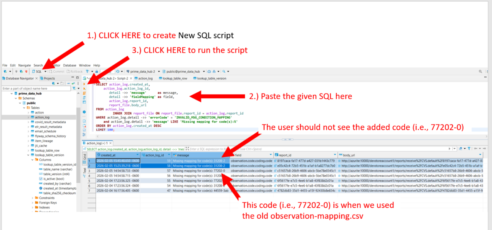

## Update the observation mapping table
If the LOINC or SNOMED code in the missing mapping error table represents a valid condition, the user needs to check and update the new observation-mapping.csv file on the eRSD website (https://ersd.aimsplatform.org/#/home). For more details on updating the observation mapping table, please refer to the [update-observation-mapping-table page](../standard-operating-procedures/update-observation-mapping-table.md). 
## Update the observation mapping table into production
1.	After the user updates the observation-mapping.csv, the user needs to create a PR to commit the change to be merged into the main branch and deploy to the production environment.
2.	After the PR is approved, the user needs to update the observation-mapping table in the production environment as follows:<br>
* Login into the production environment with your production OKTA account.
```COMMAND
    ./prime login –env prod 
```
* Update the observation-mapping table in the production environment
```COMMAND
    ./prime lookuptables create -i "./metadata/tables/local/observation-mapping.csv" -s -a -n observation-mapping -e "prod"
```
## Resend the message that failed the missing mapping
To resubmit a message to the receiver using Postman, the user needs the production API key.
1.	If the user doesn’t have the production API-KEY, please obtain it from the ReportStream admin.
2.	Using the Microsoft Azure Storage Explorer to open the message from the Azure Blob Storage ‘phdprodstorageaccount’ as shown above (i.e., open with Microsoft Visual Studio code).
3.	Copy the message from the editor.

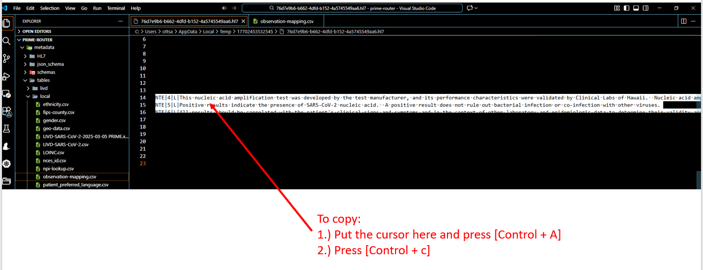

4.	Start Postman and set the header as below:
``` Text
    a.	Post to https://prime.cdc.gov/api/reports endpoint
    b.	Headers
        i.	client: <sender organization>		i.e., CSV.default or simple_report.fullelr
        ii.	Content-Type: <message format>       i.e., application/hl7-v2 or application/fhir+ndjson
        iii.    X-functions-key: <prod API-KEY>
```
5. See the Postman setting below:

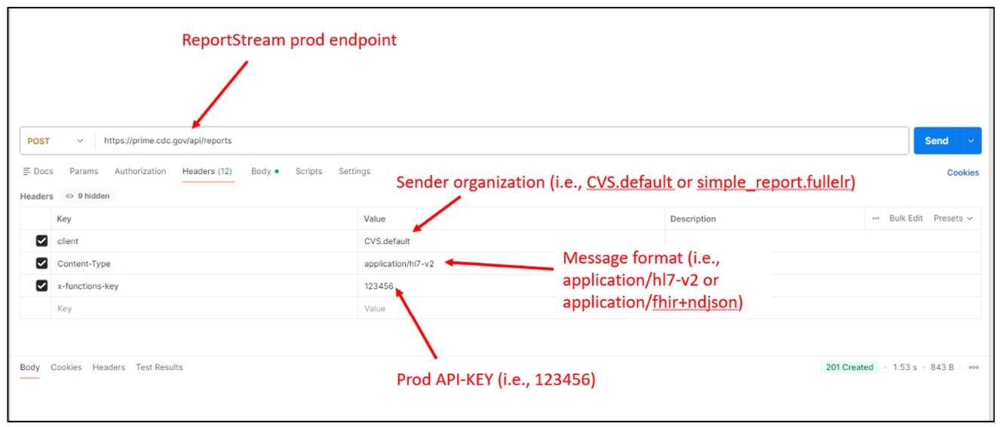

6. Paste the message into the Postman body to resend the message as shown in the screenshot.

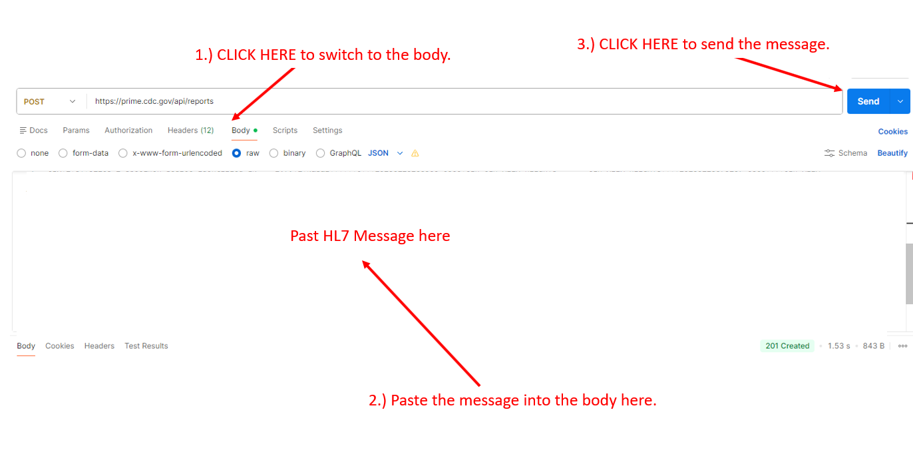

7. The user should see the following response and status code 201 Created when sending success.

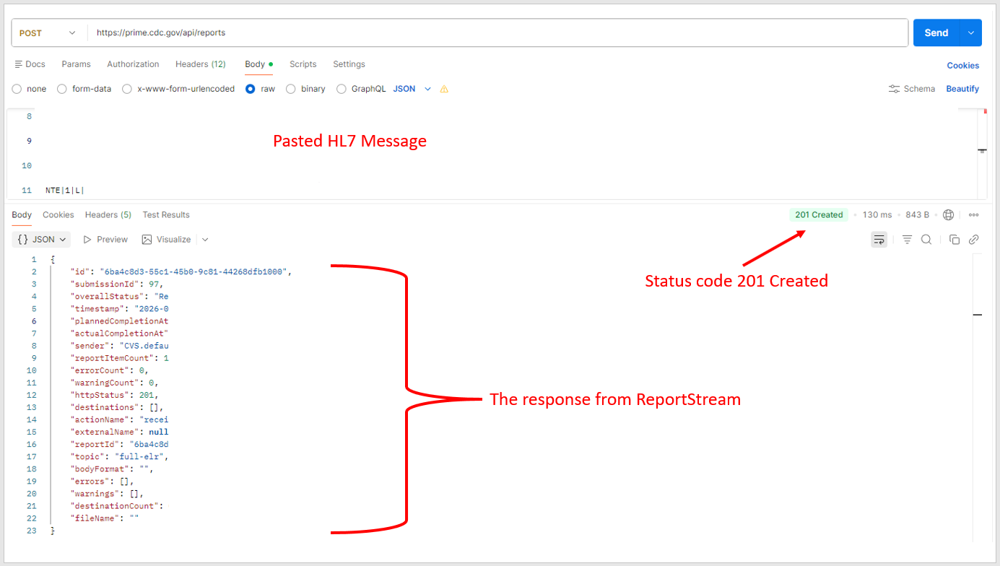


