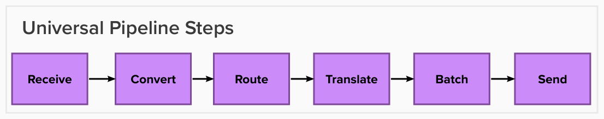

# Overview

## Data Pipeline through ReportStream
([useful reference](https://docs.google.com/document/d/1srnzARL_OZDm_-Rm9GyJjVVXmtPdOWscSgcBGep3dnQ/edit))
- Include graphic of the pipeline phases (Receive, Convert, Route, Translate, Batch, Send) as well as the full architecture diagram
- Metadata Store
- Blob Store - include a sub-section for each folder, especially the receive and ready folders.
- Receiver’s server
- Lineage Tracking
  - Report lineage
  - Item lineage
- Asynchronous Pipeline (explain how this affects the history query)

## Data Retention Policy

## Pipeline steps

- [Receive](./receive.md)
- [Convert/Translate](./convert-translate.md)
- [Route](./route.md)
- [Batch](./batch.md)
- [Send](./send.md)