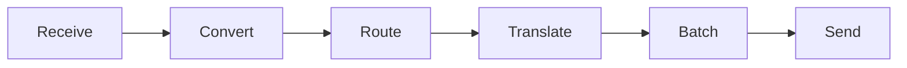
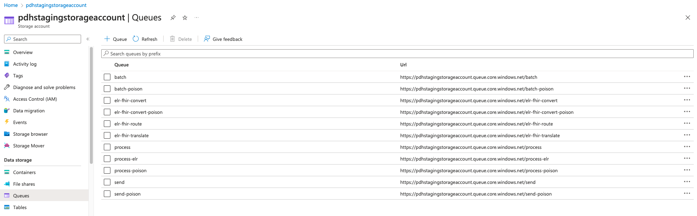
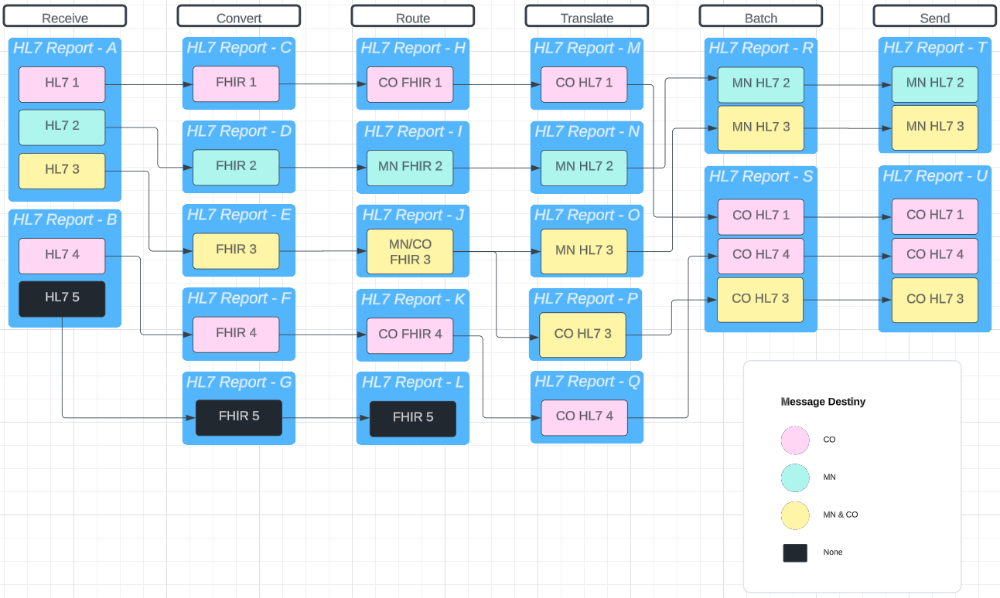

# Overview

The Universal Pipeline is the core of what ReportStream is, and the two terms are sometimes used interchangeably. The Universal Pipeline is responsible for receiving public health data from a sender and sending it to one or more receivers. The pipeline was designed to be agnostic of:
- **data formats** - At present, the pipeline can receive and send *HL7v2.5.1* and *FHIR* formats
- **data types** - While presently only handling the routing of ELR (Laboratory Data), The pipeline was designed to be able to process the [six core data sources](https://www.cdc.gov/ophdst/public-health-data-strategy/phds-core-data-sources.html) as identified by PHDS:
    - Case data
    - Laboratory data
    - Emergency department data
    - Vital statistics data
    - Immunization data
    - Healthcare capacity and utilization data

The rest of this document aims to explore the high level architecture of the Universal Pipeline and how exactly it can meet the promises outlined above!

## Data Pipeline
In order to handle different data **formats** and **types** in a scalable and maintainable way, the pipeline has been broken up into the following independent "steps":


The sections listed below will aim to describe each step of the pipeline in technical detail. Each step will refer to its part of the detailed architecture diagram found [here](https://lucid.app/lucidchart/invitations/accept/inv_daa20a3a-7979-4463-8932-26033c55abb3). See [Pipeline Steps Overview](#pipeline-steps-overview) for a high level overview of how the different steps combine to form the core functionality of the Universal Pipeline.

- [Receive](./receive.md)
- [Convert/Translate](./convert-translate.md)
- [Route](./route.md)
- [Batch](./batch.md)
- [Send](./send.md)

### Pipeline Scalability and Architecture
Each pipeline step runs as its own *Azure Function* (equivalent to lambdas in AWS) in ReportStream's Microsoft Azure Account. This means ReportStream and its Universal Pipeline are architected for, and deployed to, the cloud. The Universal Pipeline is horizontally and vertically scalable. Azure manages the life cycle of each function and dynamically decides how many of each function to instantiate based on load - ensuring ReportStream can handle even peak COVID reporting numbers!

### `Report` and `Item`

The data that is submitted and flows through ReportStream is referred to as a `Report`. A ReportStream Report can contain one or more ReportStream Items. An `Item` is a single HL7v2 message or FHIR bundle representing some real world data, like a laboratory test result (ELR data).

### FHIR

The Universal Pipeline is often referred to as the "FHIR" pipeline due to the [Convert](./convert-translate.md) step translating received messages into the [FHIR](https://www.hl7.org/fhir/summary.html) format. This allows most logic in the pipeline to run on only one data format instead of having to have separate logic for each format. FHIR was chosen to be the internal format of the Universal Pipeline due to it being the future format of healthcare data exchange and because of its modularity, flexibility, and mature libraries. 

### Pipeline Steps Overview

Each step in the pipeline is its own step precisely because it is in charge of a unique and specific task. For example, the [Translate](./convert-translate.md) step will translate the report from its current format to the format the particular receiver the report is destined to has requested via their settings. The [Convert](./convert-translate.md) step, on the other hand, will convert the report that was received from a sender to the Universal Pipeline's internal format of FHIR so that subsequent steps can perform their function on a normalized format. While the pipeline steps perform different tasks, they generally all:

1. Download the report outputted by the previous step from the step's specific folder in [ReportStream's internal Azure Storage Container](#internal-azure-storage-container)
2. Modify the downloaded report or perform some other action. In the case of the [Receive](./receive.md) step, it will just upload what it received from the client POST request
3. Upload the modified report to the next step's associated folder in ReportStream's internal Azure Storage Container
4. Schedule the next step in the pipeline to run by placing a message on the [AQS](https://learn.microsoft.com/en-us/azure/storage/queues/storage-queues-introduction) queue. This is how most steps are scheduled to be run. See [Universal Pipeline AQS Usage](#aqs-usage) for more information on how AQS is used in the Universal Pipeline.
5. Update the ReportStream database with [metadata](#universal-pipeline-metadata-and-report-and-item-lineage) concerning the report and its item(s) the step processed. This metadata is used by the [history endpoint](#history-endpoint) to communicate the progress and status of data as it flows through the pipeline

There are a few exceptions to the rules outlined above:
1. The [Receive](./receive.md) step, since it is the first step in the pipeline, is not executed via AQS but by a HTTP POST request to `/api/reports` or `/api/waters`. It also does not modify the report at all, rather just places the report it received on the queue
2. The [Batch](./batch.md) step runs on its own timer and looks for reports that have passed the [Translate](./convert-translate.md) step successfully
3. The [Send](./send.md) step, since it is the last step in the pipeline, will not place anything on the AQS queue

#### Internal Azure Storage Container
The folder structure where reports are stored as they flow through the pipelines is shown below (screenshot from the Azure portal)

TODO: Insert a picture of the folders for each step here

Each step in the Universal Pipeline, aside from Send, will upload the modified version of the report it received to the folder associated with the next step in the pipeline. This is done using the `BlobAccess` object. For example, the Convert step uploads its output, the converted FHIR bundle, like so:

```Kotlin
// upload to blobstore  
val bodyBytes = FhirTranscoder.encode(bundle).toByteArray()  
val blobInfo = BlobAccess.uploadBody(  
    Report.Format.FHIR,  
    bodyBytes,  
    report.name,  
    message.blobSubFolderName,  
    routeEvent.eventAction  
)
```

The resulting `blobInfo.blobUrl` is returned as part of the `uploadBody` response object and gets passed to the object that is sent to the AQS queue, allowing the next step in the pipeline to download the output of the previous step! See [Universal Pipeline AQS Usage](#aqs-usage) for more information.

#### AQS Usage

Each pipeline step defined in `FHIRFunctions.kt`, besides [Receive](./receive.md), that is specific to the Universal Pipeline ([Batch](./batch.md) and [Send](./send.md) are old steps shared with the legacy pipeline), use the `QueueTrigger` decorator to allow them to be executed via the AQS mechanism in Azure. For example, the Convert step's decorator looks like so:

`@QueueTrigger(name = "message", queueName = elrConvertQueueName)`

`elrConvertQueueName` is set to *elr-fhir-convert*, which can be found in the azure portal amongst other queues:



When a function has completed successfully, is will use the `QueueAccess` object to send a message to AQS for the next step to run. For example, the Convert step will schedule the Route step for each new Report it created from the original received Report:

```Kotlin
messagesToSend.forEach { 
	this.queue.sendMessage(elrRoutingQueueName, it.serialize()) 
}
```

In the Convert case above, `messagesToSend` is a list of `RawSubmission` objects which contain the id of the report and some other information that will get sent to the next step in the pipeline. This allows the next step in the pipeline to know which report to work on (`report.id`) and how to get it (`blobInfo.blobUrl`). In the case of [Convert](./convert-translate.md), this code looks like so:
```Kotlin
messagesToSend.add(  
    RawSubmission(  
        report.id,  
        blobInfo.blobUrl,  
        BlobAccess.digestToString(blobInfo.digest),  
        message.blobSubFolderName,  
        message.topic  
    )  
)
```

The three queues specific to the Universal Pipeline are:
- elr-fhir-convert
- elr-fhir-route
- elr-fhir-translate

The two queues shared with Legacy Pipeline are:
- batch
- send

##### Handling Expected Errors

Each step is responsible for validating its own actions. For example, if the [Convert](convert-translate.md) step runs into a problem translating the received report into the Universal Pipeline's internal FHIR format, it is responsible for updating the metadata in the database, specifically the `action_log` table, with what error occurred. The `action_log` table is one of the sources of information for the [history endpoint](#history-endpoint), which means it is user facing.

##### Handling Unexpected Errors

While uncommon, a pipeline step may encounter an unexpected failure at some point. If this happens, the AQS message that initiated the step shall remain on the queue and the AQS message will run again at some point in the future.

In addition to the built-in AQS retry mechanism, the unexpected failure will also get logged to the Azure logs where it can be troubleshooted.

#### Universal Pipeline Metadata and Report and Item Lineage

> Before continuing with this section, make sure you understand the concept of a [Report and Item](#report-and-item) in ReportStream!

Generally, each step takes in one Report, performs some operation, and outputs a different Report, referred to as a `Child Report`. In some steps, like the [Convert](convert-translate.md) step, the received Report may be split up into multiple child reports! For the Convert step specifically, this is the case when a Report contains multiple items. The Convert step will split the report into multiple, so that each Report contains only one item - this is done to prepare for the [Route](route.md) and [Translate](convert-translate.md) steps.



Because each step, in general, creates a new Report, it becomes necessary to track the descendants and ancestors of a particular Report to answer important questions such as:

- Where did the submitted Report get sent?
- Did the submitted Report get delivered?

In order to answer the questions above, each step will record information regarding the actions it took, commonly referred to in ReportStream as `metadata`. The [metadata](../design/metadata.md) is stored in ReportStream's internal [Postgres database](../design/metadata.md) and powers API endpoints like `/history` to help ReportStream clients (senders) answer questions related to the processing of a particular report.

### Report Status and Metadata

The Universal Pipeline does NOT support the registering of callbacks and does NOT implement any type of ACK/NACK system, instead it answers the question of "What happened to my report" via the REST history endpoint (HTTP GET) located at `/api/waters/report/{report-id}/history`. The information provided by the history endpoint is captured as the report(s) flow through the pipeline and is referred to as [metadata](../design/metadata.md)

> The client (sender in our case) is responsible for polling the history endpoint to ensure either success or failure of their message. ReportStream will not automatically alert senders of changes to their Report's status.

#### History Endpoint

As a Report flows through the Universal Pipeline, metadata such as the following is captured and stored in the internal Postgres database:
- The name of the sender
- The name of the receiver(s)
- Whether the report was successfully sent
- Any errors or warnings associated with a report
- Was a report split up at any point in the pipeline? If so, what are the new reports?

When the history endpoint is called, it will return a JSON object representing the aforementioned metadata stored in the database. This is the same object that is returned by the reports or waters endpoints when submitting a report, only it may contain more information that is not known at the time a report is submitted, like the name of the receiver(s). To better understand the history endpoint, see the [example below](#history-endpoint-example).

> Make sure to check out the [Swagger documentation](../design/swagger.md) to learn how to execute the various endpoints provided by ReportStream and view their documentation, including the history endpoint!

##### History Endpoint Example

Step 1: User submits a report via the reports API and gets the following object back in the response. There are two very important things to note here:
1. The `overallStatus` is `Received`, meaning RS accepted the file and it is awaiting further processing
2. The `id` is a generated UUID that uniquely identifies the *submitted* report. This ID is used in the history query

```JSON
{
	"id": "5036f90b-edd5-4a93-9edd-a71d1fa8fba1",
	"submissionId": 980,
	"overallStatus": "Received",
	"timestamp": "2023-07-25T16:42:26.566Z",
	"plannedCompletionAt": null,
	"actualCompletionAt": null,
	"sender": "CDC-ELIMS-HL7.CDC-ELIMS-SENDER",
	"reportItemCount": 1,
	"errorCount": 0,
	"warningCount": 0,
	"httpStatus": 201,
	"destinations": [],
	"actionName": "receive",
	"externalName": null,
	"reportId": "5036f90b-edd5-4a93-9edd-a71d1fa8fba1",
	"topic": "full-elr",
	"errors": [],
	"warnings": [],
	"destinationCount": 0
}
```

Step 2: Some time later, could be right away or could be days from the original submission, the user calls the history endpoint with the id returned from the submission query (`5036f90b-edd5-4a93-9edd-a71d1fa8fba1`) and gets the following object back in the response. The important things to note here are:
- `overallStatus` changed from `Received` to `Waiting to Deliver`. This indicates the report made it all the way from the [Receive](receive.md) step in the pipeline to the [Translate](convert-translate.md) step and is now waiting on the [Batch](batch.md) function to run. Once the Batch and [Send](send.md) steps run, the `overallStatus` will be set to `Delivered`.
- `destinations` was populated with three receiver objects, indicating the [Route](route.md) step determined the report contained items that matched the initial topic and jurisdiction filters of those receivers. The filters for the *CDC-ELIMS-HL7.CDC-ELIMS-RECEIVER* organization allowed the item in the report through (`itemCount` matches `itemCountBeforeQualityFiltering`) but the filters for *flexion.simulated-lab-2* and *flexion.simulated-lab* filtered out the item (`itemCount` is 0), and the `filteredReportRows` element indicates why. In this case, it was the processing mode filter that determined the item should not go through.
- `destinationCount` is set to `1`, meaning the item in the submitted report passed all the filters for one receiver, in this case *CDC-ELIMS-HL7.CDC-ELIMS-RECEIVER*.
```JSON
{
	"id": "5036f90b-edd5-4a93-9edd-a71d1fa8fba1",
	"submissionId": 980,
	"overallStatus": "Waiting to Deliver",
	"timestamp": "2023-07-25T16:42:26.566Z",
	"plannedCompletionAt": null,
	"actualCompletionAt": null,
	"sender": "CDC-ELIMS-HL7.CDC-ELIMS-SENDER",
	"reportItemCount": 1,
	"errorCount": 0,
	"warningCount": 0,
	"httpStatus": 201,
	"destinations": [
	{
		"organization": "Centers for Disease Control ELIMS System",
		"organization_id": "CDC-ELIMS-HL7",
		"service": "CDC-ELIMS-RECEIVER",
		"itemCount": 1,
		"itemCountBeforeQualityFiltering": 1,
		"filteredReportRows": [],
		"filteredReportItems": [],
		"sentReports": [],
		"downloadedReports": []
	},
	{
		"organization": "Flexion, Inc.",
		"organization_id": "flexion",
		"service": "simulated-lab-2",
		"itemCount": 0,
		"itemCountBeforeQualityFiltering": 1,
		"filteredReportRows": [
			"For flexion.simulated-lab-2, filter (default filter) [%processingId.exists() and %processingId = 'P'][] filtered out item 3003786103_4988249_33033"
		],
		"filteredReportItems": [
		{
			"filterType": "PROCESSING_MODE_FILTER",
			"filterName": "(default filter) [%processingId.exists() and %processingId = 'P']",
			"filteredTrackingElement": "3003786103_4988249_33033",
			"filterArgs": [],
			"message": "For flexion.simulated-lab-2, filter (default filter) [%processingId.exists() and %processingId = 'P'][] filtered out item 3003786103_4988249_33033"
		}],
		"sentReports": [],
		"downloadedReports": []
	},
	{
		"organization": "Flexion, Inc.",
		"organization_id": "flexion",
		"service": "simulated-lab",
		"itemCount": 0,
		"itemCountBeforeQualityFiltering": 1,
		"filteredReportRows": [
			"For flexion.simulated-lab, filter (default filter) [%processingId.exists() and %processingId = 'P'][] filtered out item 3003786103_4988249_33033"
		],
		"filteredReportItems": [
		{
			"filterType": "PROCESSING_MODE_FILTER",
			"filterName": "(default filter) [%processingId.exists() and %processingId = 'P']",
			"filteredTrackingElement": "3003786103_4988249_33033",
			"filterArgs": [],
			"message": "For flexion.simulated-lab, filter (default filter) [%processingId.exists() and %processingId = 'P'][] filtered out item 3003786103_4988249_33033"
		}],
		"sentReports": [],
		"downloadedReports": []
	}],
	"actionName": "receive",
	"externalName": null,
	"reportId": "5036f90b-edd5-4a93-9edd-a71d1fa8fba1",
	"topic": "full-elr",
	"errors": [],
	"warnings": [],
	"destinationCount": 1
}
```