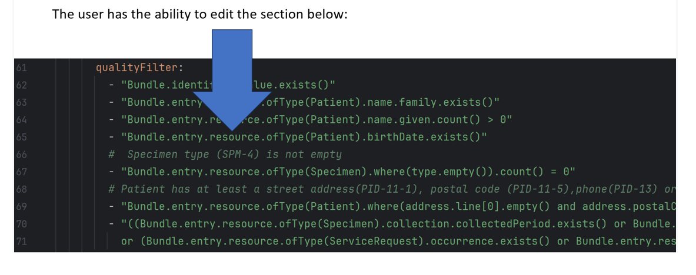
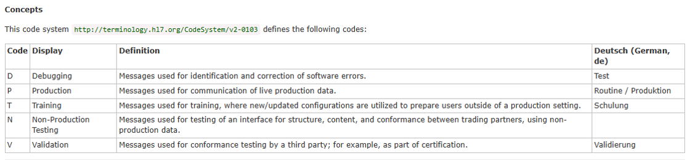
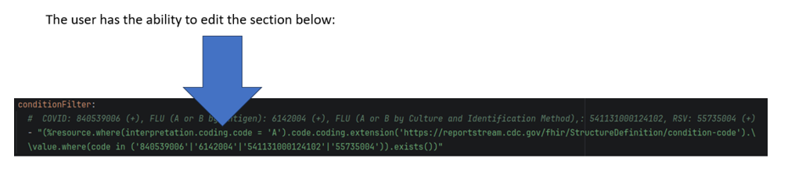
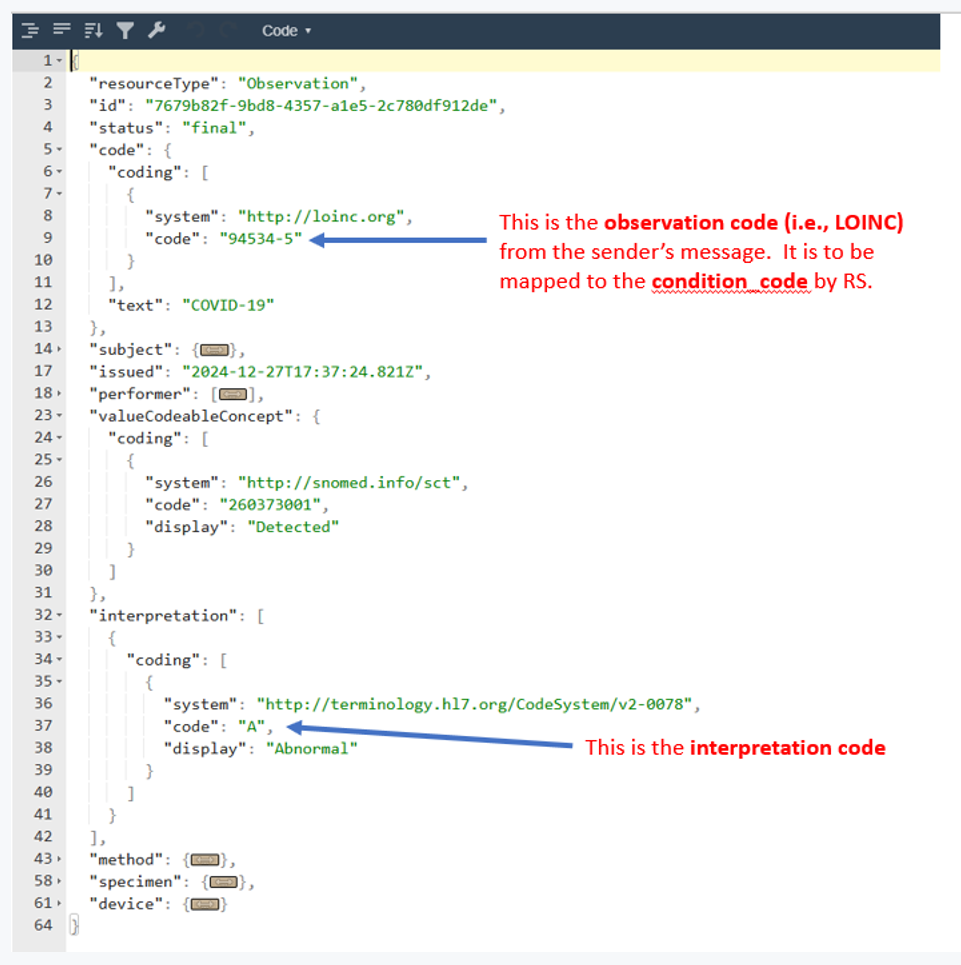
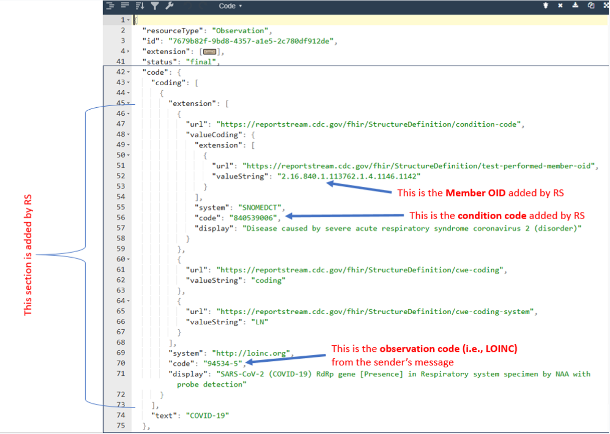
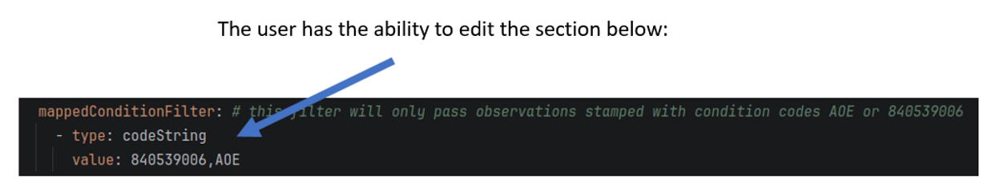
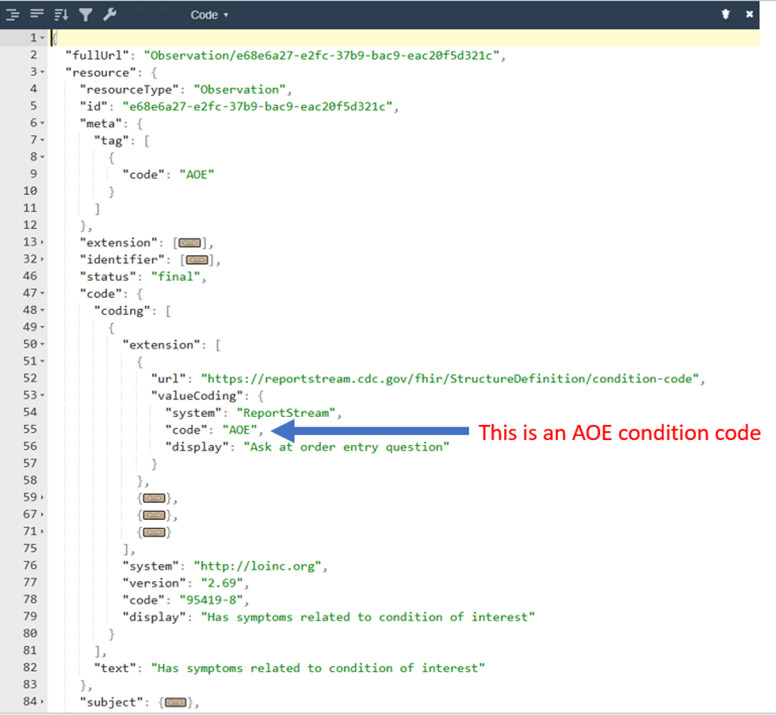

# Universal Pipeline Receiver Filter Step

## Context

The Destination Filter function evaluates a receiver's filters on a bundle and determines whether it should be sent. This may include pruning observations from the bundle. Each receiver connected to ReportStream has unique interests in the data that flows through the pipeline. This step is designed to identify the data that meets those interests.

The function follows the [Receiver Enrichment](receiver-enrichment.md) function. These messages are passed to the FHIR Receiver Filter, which first decodes a FHIR Bundle. Then, quality, processing, routing, and condition filters are evaluated to determine whether the bundle should be sent and whether it should be pruned of unnecessary data. If the message passes, it is sent to the [Translate](translate.md) function, where receiver-specific work is performed to prepare for batching and sending.

### Pruning

During evaluation of the condition filters in the `Receiver Filter Function`, bundle observations that are not of interest to the receiver are pruned or removed. If there are no observations of interest to the receiver, the bundle is not sent.

### FHIRPath for Routing

FHIRPath is used to build filter expressions. See FHIRPath documentation
in [fhir-functions.md](https://github.com/CDCgov/prime-reportstream/blob/d43ab6297a44a4ef2a0fef8d467e79cfcc154f33/prime-router/docs/getting-started/fhir-functions.md)

The table below demonstrates a few filter functions and their FHIRPath equivalent.


<table>
  <tr>
   <td><strong>Legacy Pipeline: filter functions</strong>
   </td>
   <td><strong>Universal Pipeline: FHIRPath Expressions</strong>
   </td>
  </tr>
  <tr>
   <td><code>hasValidDataFor(message_id)</code>
   </td>
   <td><code>Bundle.entry.resource.ofType(MessageHeader).id.exists().not()</code>
   </td>
  </tr>
  <tr>
   <td><code>hasValidDataFor(patient_last_name, patient_first_name)</code>
   </td>
   <td><code>%patientLastname.exists() and %patientFistname.exists()</code>
   </td>
  </tr>
  <tr>
   <td><code>hasAtLeastOneOf(patient_street,patient_zip_code,patient_phone_number,patient_email)</code>
   </td>
   <td><code>%patientStreet.exists() or %patientZipcode.exists() or %patientPhoneNumber.exists() or %patientEmail.exists()</code>
   </td>
  </tr>
  <tr>
   <td><code>isValidCLIA(testing_lab_clia,reporting_facility_clia)</code>
   </td>
   <td><code>%testingLabId.getIdType() = "CLIA" or %reportingFacilityId.getIdType() = 'CLIA'</code>
   </td>
  </tr>
  <tr>
   <td><code>allowAll()</code>
   </td>
   <td><code>true</code>
   </td>
  </tr>
  <tr>
   <td><code>allowNone()</code>
   </td>
   <td><code>false</code>
   </td>
  </tr>
  <tr>
   <td><code>orEquals(ordering_facility_state, CO, patient_state, CO)</code>
   </td>
   <td><code>%orderingFacilityState = "CO" or \
Bundle.entry.resource.ofType(Patient).address.state = "CO"</code>
   </td>
  </tr>
</table>

## Filtering

### Purpose

Filter configuration is a part of the settings for a specific organization and/or receiver. There are five main filter
groups*: Jurisdictional, Quality, Routing, Processing Mode Code, and Condition. The Quality, Routing, Processing Mode
Code, and Condition groups are evaluated during the `Receiver Filter Function`. These filter groups are used to organize
the filters and make it easier to report the filter results to a user, but the functionality is the same for all the
filters. All filters take an array of expressions where all must evaluate to true for the group to be true.

_*Filter groups may have been referred to as filter types in the past._

### Configuring Filters

Filters are configured in the ReportStream’s settings, which are stored in the database. See the relevant [document](../standard-operating-procedures/configuring-filters.md) for more info.

### Quality Filter

Filter out any data that does not meet the specified minimum requirements (e.g., must have patient last name)


<table>
  <tr>
   <td><strong>Topic</strong>
   </td>
   <td>Applies to following topics: <em>full-elr, etor-ti, elr-elims</em>
   </td>
  </tr>
  <tr>
   <td><strong>Operation</strong>
   </td>
   <td>Expressions are evaluated with the AND operation
   </td>
  </tr>
  <tr>
   <td><strong>Default</strong>
   </td>
   <td>See code block below
   </td>
  </tr>
</table>

```kotlin
/**
 * Default Rules:
 *   Must have message ID, patient last name, patient first name, DOB, specimen type
 *   At least one of patient street, patient zip code, patient phone number, patient email
 *   At least one of order test date, specimen collection date/time, test result date
 */
val qualityFilterDefault: ReportStreamFilter = listOf(
        "Bundle.entry.resource.ofType(MessageHeader).id.exists()",
        "Bundle.entry.resource.ofType(Patient).name.family.exists()",
        "Bundle.entry.resource.ofType(Patient).name.given.count() > 0",
        "Bundle.entry.resource.ofType(Patient).birthDate.exists()",
        "Bundle.entry.resource.ofType(Specimen).type.exists()",
        "(Bundle.entry.resource.ofType(Patient).address.line.exists() or " +
            "Bundle.entry.resource.ofType(Patient).address.postalCode.exists() or " +
            "Bundle.entry.resource.ofType(Patient).telecom.exists())",
        "(" +
            "(Bundle.entry.resource.ofType(Specimen).collection.collectedPeriod.exists() or " +
            "Bundle.entry.resource.ofType(Specimen).collection.collected.exists()" +
            ") or " +
            "Bundle.entry.resource.ofType(ServiceRequest).occurrence.exists() or " +
            "Bundle.entry.resource.ofType(Observation).effective.exists())"
    )
```
To modify the organization’s quality filter, the user needs to edit the organizations.yml file or an individual organization’s settings in the jurisdiction located at prime-router/settings/STLTs/<state>. For example, if the user wants to modify the AL jurisdiction setting, the user can edit the ./settings/STLTs/AL/al-phd.yml file and add the fhirpath expression to the qualityFilter section.



### Routing Filter

Generic filtering that does not concern data quality or condition (e.g., test result is positive).  The original use case was for filters that remove messages the receiver does not want, based on who sent them.  However, it's available for any general-purpose use

<table>
  <tr>
   <td><strong>Topic</strong>
   </td>
   <td>Applies to following topics: <em>full-elr, etor-ti, elr-elims</em>
   </td>
  </tr>
  <tr>
   <td><strong>Operation</strong>
   </td>
   <td>Expressions are evaluated with the AND operation
   </td>
  </tr>
  <tr>
   <td><strong>Default</strong>
   </td>
   <td><strong>Allow All: </strong>The door is open. No filter is in place
   </td>
  </tr>
</table>

    routingFilter:
    - "allowAll()"

The following is from one of the organizations in organizations.yml that contains ReportStream’s settings.  For example, the setting below allows only messages with a result status of F – Final result, C – Record coming over is a correction and replaces a final result, or P – Preliminary result (for more detail see: https://hl7-definition.caristix.com/v2/HL7v2.5.1/Tables/0085):

    routingFilter:
    - "matches(test_result_status, F, C, P)"


### Processing Mode Code Filter

The processing mode of the message indicates the sender’s intended context. Options for this field are defined in the [CodeSystem: processingId](https://terminology.hl7.org/5.2.0/CodeSystem-v2-0103.html) (see the concepts table below). The intention is to ensure that the sender and receiver share the same message content context. Test messages should be accepted only by test receivers. Production messages should be accepted only by production receivers.



<table>
  <tr>
   <td><strong>Topic</strong>
   </td>
   <td>Applies to following topics: <em>full-elr, etor-ti</em>
   </td>
  </tr>
  <tr>
   <td><strong>Operation</strong>
   </td>
   <td>Expressions are evaluated with the AND operation
   </td>
  </tr>
  <tr>
   <td><strong>Default</strong>
   </td>
   <td>Allow All: The door is open. No filter is in place
   </td>
  </tr>
</table>

    processingModeFilter:
    - "allowAll()"

The following is from one of the organizations in organizations.yml that contains ReportStream’s settings. For example, the setting below allows only production messages with code set to ‘P’ to be sent to receivers.

    processingModeFilter:
    - "Bundle.entry.resource.ofType(MessageHeader).meta.tag.where(system = 'http://terminology.hl7.org/CodeSystem/v2-0103').code.exists() and Bundle.entry.resource.ofType(MessageHeader).meta.tag.where(system = 'http://terminology.hl7.org/CodeSystem/v2-0103').code = 'P'"
    


### Condition Filter

Filter data based on the test identifiers using FHIR expressions. A receiver expecting flu results should only accept
tests for flu. If the message contains multiple observations, some that pass the condition filter and others that do
not, the condition filter will pass if any bundle observations are of interest to the receiver.

Filter messages based on Observation resources using FHIR expressions. When the receiver expects flu results, only flu results should be routed to them. If a message contains multiple observations, some of which pass the condition filter and others that do not, the condition filter will pass if any observations in the bundle are of interest to the receiver. For more detailed information on the condition-to-code mapping, please see the [Proposal for Code to Condition Mapping](https://github.com/CDCgov/prime-reportstream/blob/main/prime-router/docs/design/proposals/0023-condition-to-code-mapping/0023-condition-to-code-mapping.md)

<table>
  <tr>
   <td><strong>Topic</strong>
   </td>
   <td>Applies to following topics: <em>full-elr, etor-ti, elr-elims</em>
   </td>
  </tr>
  <tr>
   <td><strong>Operation</strong>
   </td>
   <td>Expressions are evaluated with OR operation
   </td>
  </tr>
  <tr>
   <td><strong>Default</strong>
   </td>
   <td><strong>Allow All:</strong> The door is open. No filter is in place
   </td>
  </tr>
</table>

    conditionFilter:
    - "allowAll()"

The following is from one of the organizations in organizations.yml that contains ReportStream’s settings. For example, the setting below allows only positive COVID-19, FLU A or B By Antigen, FLU A or B By Culture and Indentification Method, and RSV to be sent to receivers.



Where %resource is set to Bundle.entry.resource.ofType(Observation). If the user examines the Observation resource in the incoming FHIR message bundle, they will see the observation LOINC code (i.e., 94534-5) and the interpretation code (i.e., “A”) as shown below.



Next, RS will add the mapped condition code when it converts the message into the internal FHIR message, with an extension containing the Member OID and the condition code, as shown below. It is then ready to be examined by conditionFilter using the condition code.



### Mapped Condition Filter

Filter data based on the condition stamp added by ReportStream. A receiver expecting flu results should only accept tests for flu. If the message contains multiple observations, some of which pass and others do not, the mapped condition filter will pass if the bundle contains any mapped conditions of interest to the receiver.

<table>
  <tr>
   <td><strong>Topic</strong>
   </td>
   <td>Applies to following topics: <em>full-elr, etor-ti, elr-elims</em>
   </td>
  </tr>
  <tr>
   <td><strong>Operation</strong>
   </td>
   <td>Expressions are evaluated with the OR operation
   </td>
  </tr>
  <tr>
   <td><strong>Default</strong>
   </td>
   <td><strong>Allow All:</strong> The door is open. No filter is in place
   </td>
  </tr>
</table>

    mappedConditionFilter:
    - “allowAll()”
The following is from one of the organizations in organizations.yml that contains ReportStream’s settings.  For example, the setting below allows only messages with Observations stamped with condition codes AOE or 840539006.



If the user examines the FHIR message bundle, they can find the AOE condition code in the Observation resource as shown below.



## Storage

The `Receiver Filter Function` retrieves messages from the `pdhprodstorageaccount` Azure Storage Account. Within that
storage account there is a blob container named `reports` containing folders for use by the Universal Pipeline. The
`Destination Filter Function` places all messages into the `receiver-filter` folder for retrieval by the
`Receiver Filter Function`. Those messages that match a receiver's filtering will then be placed in the `translate`
folder for future retrieval by the `Translate Function`. Messages within the `receiver-filter` folder are saved to
sub-folders the name after the sender (i.e. simple_report.full-elr for SimpleReport sender).

## Logging

### Action Logs

This filter will log actions when:
- Filtering observations due to any filter (incl: filter text, filter type, org details, index)

### Console Logging

This filter will log messages to the console when:
- First initialized
- Downloading the bundle (includes duration)
- Observations have been filtered from a bundle
- Receiver filters passed and a pruned bundle is ready
- Receiver filters failed and lineage will be terminated 

## Events

This step emits one of the below events _per receiver_ each time it runs.

| Event                                                                                   | Trigger                                                    |
|-----------------------------------------------------------------------------------------|------------------------------------------------------------|
| ITEM_FILTER_FAILED | When a report fails receiver filters                       |

## Retries

There is no custom retry strategy for this step. If an error occurs during this step, the message is re-queued up to
five times before being placed in the poison queue.

## Test Receiver Filter
The following information is for testing the receiver filter using localhost. For more information on running ReportStream on localhost, please see [getting-stared](https://github.com/CDCgov/prime-reportstream/tree/main/prime-router/docs/getting-started).

After ReportStream is up and running on localhost, the user needs to download `TestRcvFilterMessages.tz.txt` from the repository, move it to the `prime-resportstream/prime-router/junk` directory, and untar it.  Next, the user needs to configure the receiver settings as described above and fill out all the receiver’s filters (or modify the `ms-doh-sample.yml` file) to be tested, including `jurisdictionFilter, qualityFilter, routingFilter, processingModeFilter, conditionFilter`, and `mappedConditionFilter`.  For testing, the user needs to configure the receiver’s transport to use local SFTP on localhost, as shown in the example below (Please see `ms-doh-sample.yml` for details). The example below is the organization settings for MS-DOH (Mississippi Department of Health).

```YML
 - name: "ms-doh"
   description: "Mississippi Department of Health."
   jurisdiction: "STATE"
         ---
         --- This section is omitted - Please see ms-doh-sample.yml for details of this section ---
         ---
   receivers:
     - name: "full-elr"
       organizationName: "ms-doh"
       topic: "full-elr"
       customerStatus: "active"
       translation: !<HL7>
          ---
          --- This section is omitted - Please see ms-doh-sample.yml for details of this section ---
          ---
       jurisdictionalFilter:
         #
         # Jurisdiction filter is set to “MS” (Mississippi)
         #
         - "(Bundle.entry.resource.ofType(ServiceRequest)[0].requester.resolve().organization.resolve().address.state = 'MS') or (Bundle.entry.resource.ofType(Patient).address.state = 'MS')"
       qualityFilter:
         #
         # quality filter is set as below
         #
         - "((Bundle.entry.resource.ofType(Specimen).collection.collectedPeriod.exists() or Bundle.entry.resource.ofType(Specimen).collection.collected.exists()) or Bundle.entry.resource.ofType(serviceRequest).occurrence.exists() or Bundle.entry.resource.ofType(Observation).effective.exists())"
         - "(Bundle.entry.resource.ofType(Patient).address.line.exists() or Bundle.entry.resource.ofType(Patient).address.postalCode.exists() or Bundle.entry.resource.ofType(Patient).telecom.exists())"
         - "Bundle.entry.resource.ofType(MessageHeader).id.exists()"
         - "Bundle.entry.resource.ofType(Patient).birthDate.exists()"
         - "Bundle.entry.resource.ofType(Patient).name.family.exists()"
         - "Bundle.entry.resource.ofType(Patient).name.given.count() > 0"
         - "Bundle.entry.resource.ofType(Specimen).type.exists()"
       routingFilter: []
         #
         # Routing filter is set to default (allowAll)
         #
       processingModeFilter: []
         #
         # Processing Mode filter is set to default (allowAll)
         #
       reverseTheQualityFilter: false
       conditionFilter:
         #
         # The following is the condition code (see metadata/tables/local/observation-mapping.csv for the list) receiver requires
         # RSV: 55735004 (+), COVID: 840539006 (+), FLU (A or B by Antigen): 6142004 (+), FLU (A or B by Culture and Identification Method): 541131000124102 (+)
         #
         - "%resource.where(interpretation.coding.code = 'A').code.coding.extension('https://reportstream.cdc.gov/fhir/StructureDefinition/condition-code').value.where(code in ('55735004'|'840539006'|'6142004'|'541131000124102')).exists()"
       mappedConditionFilter: []
         #
         # Mapped Condition filter is set to default (allowAll)
         #
       deidentify: false
       deidentifiedValue: ""
       timing:
         ---
         --- This section is omitted - Please see ms-doh-sample.yml for details of this section ---
         ---
       description: ""
       transport: !<SFTP>
         #
         # Transport is set to local SFTP
         #
         host: "sftp"
         port: "22"
         filePath: "./upload"
         credentialName: DEFAULT-SFTP
         type: "SFTP"
       externalName: null
       enrichmentSchemaNames: []
       timeZone: null
       dateTimeFormat: "OFFSET"
```
## Testing the Receiver’s Settings, please follow the steps below
1. Download the [TestRcvFilterMessages.tz](./TestRcvFilters/TestRcvMessages.tz) file from the repository and creat a junk directory.
```Text
   mkdir <HOME>/prime-reportstream/prime-router/junk
```
3. Move it to <HOME>/prime-reportstream/prime-router/junk.
   Where `<HOME>/prime-reportstream` is the directory that you cloned source code from the [ReportStream repository](https://github.com/CDCgov/prime-reportstream).
```Text
   mv TestRcvFilterMessages.tz <HOME>/prime-reportstream/prime-router/junk
```
3. Go to the junk directory and untar the `TestRcvFilterMessages.tz` file, and go back to the prim-router directory
```Text
   cd <HOME>/prime-reportstream/prime-router/junk;
   tar xvfz TestRcvFilterMessages.tz .;
   cd ..
```
4. Edit receiver’s filters in the `ms-doh-sample.yml` settings using the VI editor or any editor of your choice.
```Text
   vi ./junk/TestRcvFilterMessages/ms-doh-sample.yml
```
5. After completing the setting, the user needs to upload it to the ReportStream local database by using the following command:
```Text
   ./prime multiple-settings set -i ./junk/TestRcvFilterMessages/ms-doh-sample.yml
```
### Now, test the receiver’s settings using the ./primeCLI (./prime fhirdata) commands below:
#### The following command will FAIL the conditionFilter
```Text
   ./prime fhirdata --input-file "./junk/TestRcvMessages/Test-Condition-covid-neg.fhir"  --sender-schema  classpath:/metadata/fhir_transforms/senders/SimpleReport/simple-report-sender-transform.yml --output-file "./junk/TestRcvMessages/Output/Test-Condition-covid-neg.hl7" --receiver-name=full-elr --org=ms-doh
```
```Text
      Output Message:
         CONDITION_FILTER - Filter failed :
           %resource.where(interpretation.coding.code = 'A').code.coding.extension('https://reportstream.cdc.gov/fhir/StructureDefinition/condition-code').value.where(code in ('55735004'|'840539006'|'6142004'|'541131000124102')).exists()
```  
   #### The following command will pass:
```text
   ./prime fhirdata --input-file "./junk/TestRcvMessages/Test-Condition-covid-positive.fhir"  --sender-schema  classpath:/metadata/fhir_transforms/senders/SimpleReport/simple-report-sender-transform.yml --output-file "./junk/TestRcvMessages/Output/Test-Condition-covid-positive.hl7" --receiver-name=full-elr --org=ms-doh
```
```Text   
      Output Message:
         Wrote output to <HOME>/prime-reportstream/prime-router/./junk/TestRcvMessages/Output/Test-Condition-covid-positive.hl7
      
      The user needs to examine whether the output file is correct.
```
   #### The following command will PASS:
```text
   ./prime fhirdata --input-file "./junk/TestRcvMessages/Test-Condition-FLU-A-positive.fhir"  --sender-schema  classpath:/metadata/fhir_transforms/senders/SimpleReport/simple-report-sender-transform.yml --output-file "./junk/TestRcvMessages/Output/Test-Condition-FLU-A-positive.hl7" --receiver-name=full-elr --org=ms-doh
```
```Text
      Output Message:
         Wrote output to <HOME>/prime-reportstream/prime-router/./junk/TestRcvMessages/Output/Test-Condition-FLU-A-positive.hl7
         
      The user needs to examine whether the output file is correct.
```
   #### The following command will FAIL the conditionFilter:
```text
   ./prime fhirdata --input-file "./junk/TestRcvMessages/Test-Condition-FLU-B-negative.fhir"  --sender-schema  classpath:/metadata/fhir_transforms/senders/SimpleReport/simple-report-sender-transform.yml --output-file "./junk/TestRcvMessages/Output/Test-Condition-FLU-B-negative.hl7" --receiver-name=full-elr --org=ms-doh
```
```Text
      Output Message:
         CONDITION_FILTER - Filter failed :
         %resource.where(interpretation.coding.code = 'A').code.coding.extension('https://reportstream.cdc.gov/fhir/StructureDefinition/condition-code').value.where(code in ('55735004'|'840539006'|'6142004'|'541131000124102')).exists()
``` 
   ### The following command will PASS:
```Text
   ./prime fhirdata --input-file "./junk/TestRcvMessages/Test-Condition-FLU-B-positive.fhir"  --sender-schema  classpath:/metadata/fhir_transforms/senders/SimpleReport/simple-report-sender-transform.yml --output-file "./junk/TestRcvMessages/Output/Test-Condition-FLU-B-positive.hl7" --receiver-name=full-elr --org=ms-doh
```
```Text   
   Output Message:
      Wrote output to <HOME>/prime-reportstream/prime-router/./junk/TestRcvMessages/Output/Test-Condition-FLU-B-positive.hl7
      
   The user needs to examine whether the output file is correct.
```
   #### The following command will FAIL the conditionFilter:
```Text   
   ./prime fhirdata --input-file "./junk/TestRcvMessages/Test-Condition-HIV.fhir"  --sender-schema  classpath:/metadata/fhir_transforms/senders/SimpleReport/simple-report-sender-transform.yml --output-file "./junk/TestRcvMessages/Output/Test-Condition-HIV.hl7" --receiver-name=full-elr --org=ms-doh
```
```Text    
      Output Message:
         CONDITION_FILTER - Filter failed :
         %resource.where(interpretation.coding.code = 'A').code.coding.extension('https://reportstream.cdc.gov/fhir/StructureDefinition/condition-code').value.where(code in ('55735004'|'840539006'|'6142004'|'541131000124102')).exists()
```   
   #### The following command will PASS:
```text   
   ./prime fhirdata --input-file "./junk/TestRcvMessages/Test-Condition-RSV-positive.fhir"  --sender-schema  classpath:/metadata/fhir_transforms/senders/SimpleReport/simple-report-sender-transform.yml --output-file "./junk/TestRcvMessages/Output/Test-Condition-RSV-positive.hl7" --receiver-name=full-elr --org=ms-doh
```
```Text    
      Output Message:
         Wrote output to <HOME>/prime-reportstream/prime-router/./junk/TestRcvMessages/Output/Test-Condition-RSV-positive.hl7
      
      The user needs to examine whether the output file is correct.
```
#### The following command will FAIL due to the wrong organization:
```text   
   ./prime fhirdata --input-file "./junk/TestRcvMessages/Test-Condition-RSV-positive.fhir"  --sender-schema  classpath:/metadata/fhir_transforms/senders/SimpleReport/simple-report-sender-transform.yml --output-file "./junk/TestRcvMessages/Output/Test-Condition-RSV-positive.hl7" --receiver-name=full-elr --org=WRONG-ORG
```
```Text    
      Output Message:
         File extension fhir is not supported.
      
      Note, the org=WRONG-ORG was given to test facility failure. 
```