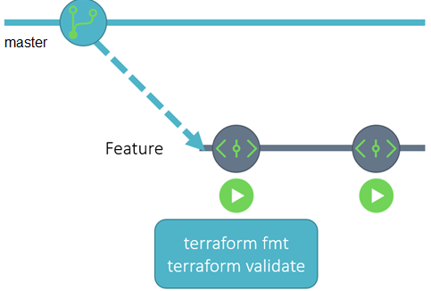
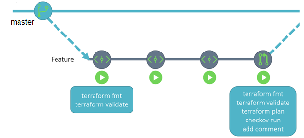
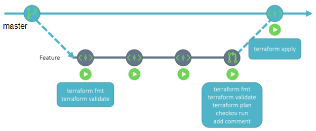

**Workflow actions for Terraform**
Validate_terraform.yml
Deploy_terraform.yml

When an engineer wants to update the Terraform code, they will create a new branch from the default branch and update the code. Then they will commit the change and push it up to GitHub. The commit to a non-main branch will trigger a GitHub action workflow that runs both terraform fmt and terraform validate against the code. If either of these tasks fails, then the code needs to be revised before a pull request can be created.
 

Once the changes are complete and the code has been properly formatted and validated, the next step is to create a pull request to merge the feature branch to the default branch. This triggers a task in GitHub actions which runs terraform plan and Checkov. The results of both are added as a comment to the pull request. The person reviewing the pull request can see what Terraform will change in the target environment by looking at the plan output, and verify that the code is following best practices by looking at the Checkov results. If the results are not satisfactory, they can ping the original engineer to make updates to their code to bring it into spec.

 
If the results look good, the pull request reviewer can merge the pull request, which effectively creates a commit on the default branch. This will trigger a task in GitHub Actions to run a terraform apply with the merged code. That should make the desired changes seen in the plan output in the target environment.
 
