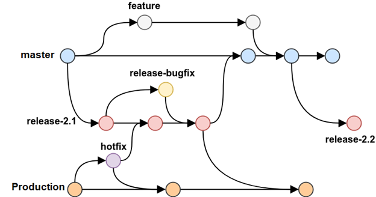

**GitFlow**

 

**Production** - this branch contains production code. All development code is merged into production before deployment.
**master** - this branch contains pre-production code. When the features are finished then they are merged into master.
During the development cycle, a variety of supporting branches are used:
**feature** - feature branches are used to develop new features for the upcoming releases. May branch off from develop and must merge into develop.
**release** - release branches support preparation of a new production release. They allow many minor bug to be fixed and preparation of meta-data for a release. May branch off from develop and must merge into master and develop. Tag master when merged from a release.
**hotfix/bugfix** - hotfix branches are necessary to act immediately upon an undesired status of master. May branch off from master and must merge into master and develop.
When a serious issue is discovered in production and you urgently need a quick fix, you branch off of production, implement the fix, and merge directly back into production and roll out. You also merge the hotfix branch into your current release branch if one is in process. If a release branch is not in development, then you merge it into develop instead. If you merged into release instead of develop, the code for the hotfix will make it back into develop when you merge the release branch. If you have got your flow working well with the release branch and the testing, then you really shouldn't need these hotfix branches. If you find that you are having to create a lot of hotfix branches, something is wrong with your setup.

**Branch Naming Convention:**
•	production
•	master
•	features/[pbi#]-[feature-name]
•	features/[feature-name]
•	bugfixes/[pbi#]-[description]
•	bugfixes/[description]
•	releases/rel-[version-number]
•	releases/rel-[version-number]-bugfix

**Key Points**
•	Developers primarily work in feature branches created from the master branch
•	Pull requests are required to merge a feature branch into the master branch
•	Upon completion of the pull request, the master branch is compiled and deployed to the development environment.
•	There is only one build pipeline, but it builds for both feature branches and release branches (and all others potentially).
•	Cherry picking should be avoided - either all code in a DevOps release is deployed or none; deployment will need to be postponed or code rolled back

